# 020：物理信息机器学习 🧠

在本节课中，我们将要学习物理信息机器学习的基本概念。这是一种将已知的物理定律和原理融入机器学习模型构建过程的方法，旨在提升模型的泛化能力、可解释性和安全性。

---

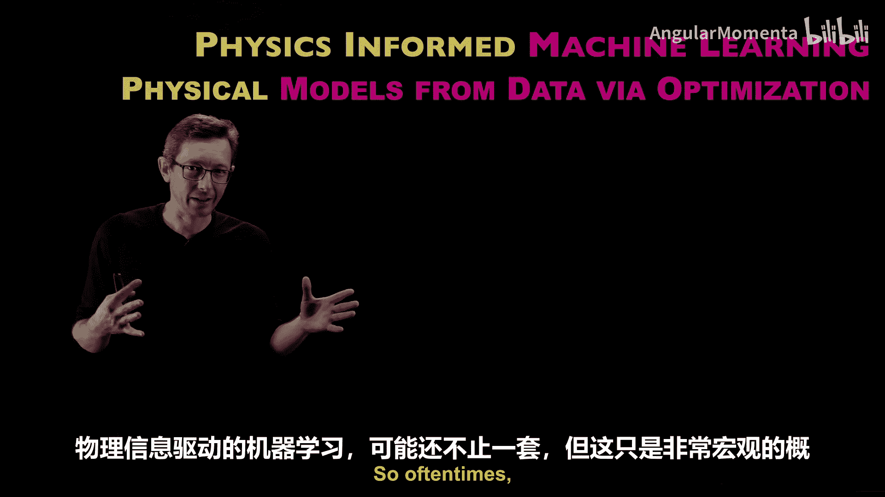

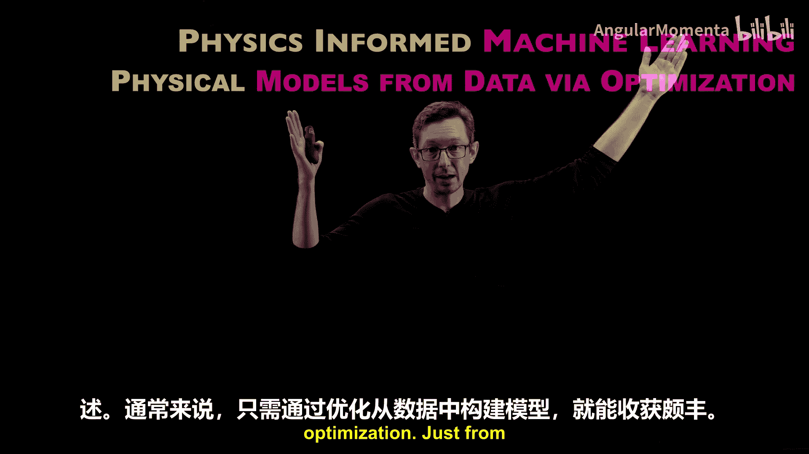

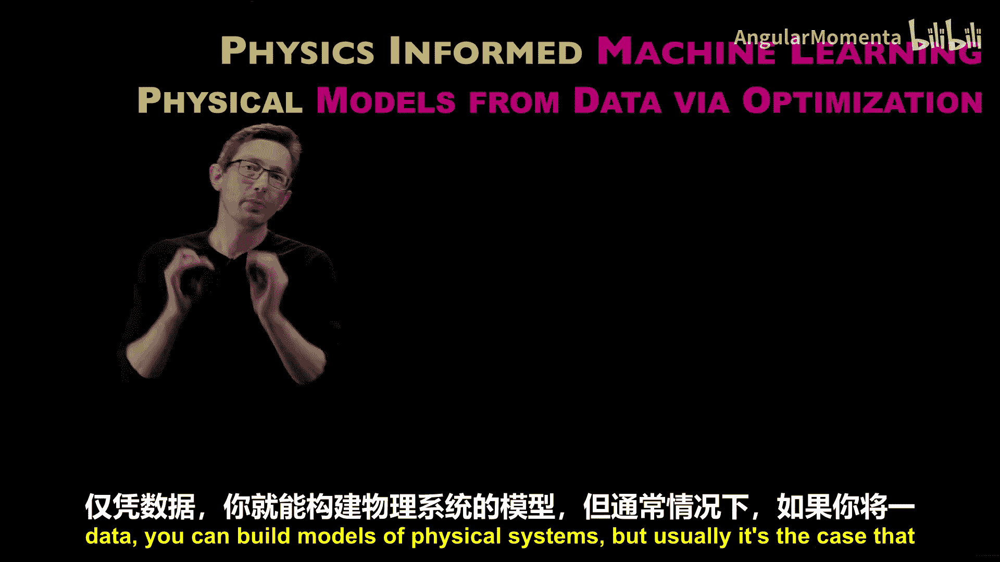

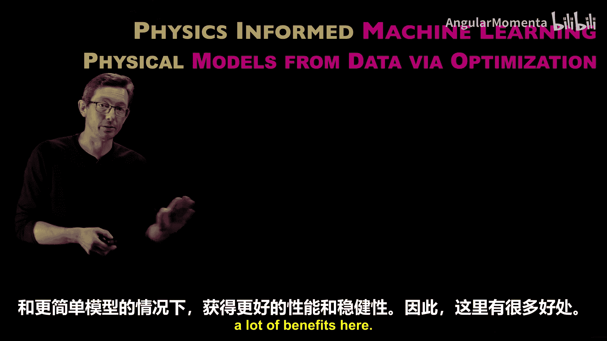

## 概述

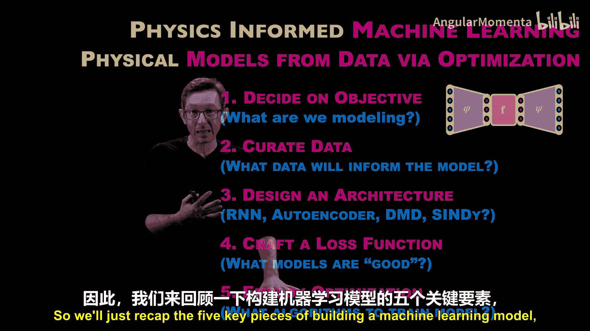

在过去的几年中，机器学习取得了巨大进展。我们现在理解，机器学习本质上是通过优化从数据中构建模型的过程。今天，我们将探讨如何将物理和工程知识融入机器学习，即如何通过优化从数据中构建具有物理意义的模型。这对于希望模型在训练数据之外更具泛化性、对人类更可解释、在自动驾驶、飞机设计等安全关键系统中更可能被认证和安全使用至关重要。

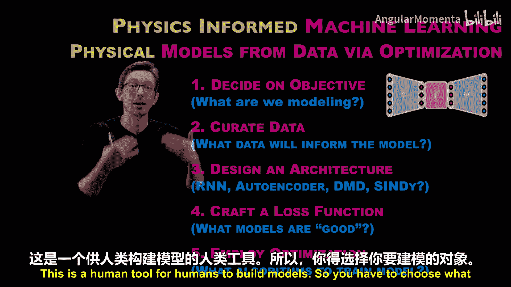

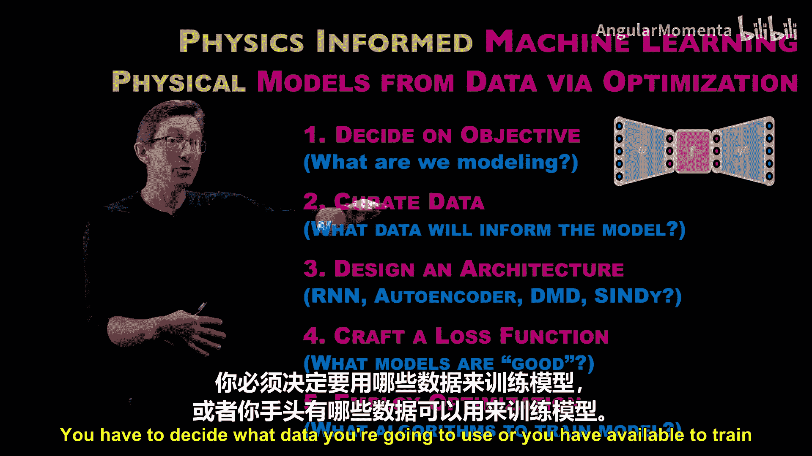

## 什么是物理信息机器学习？

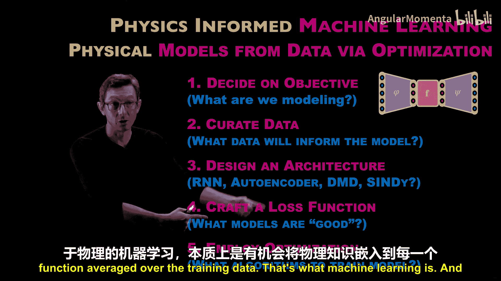

物理信息机器学习是指在构建机器学习模型的各个环节中，嵌入物理先验知识。通常，当我们将一些先验物理知识融入机器学习算法时，我们通常能用更少的训练数据和更简单的模型获得更好的性能和鲁棒性。

## 构建机器学习模型的五个关键环节

构建一个机器学习模型包含五个关键的人类决策环节，机器学习并非一个全自动的“交钥匙”过程。

以下是构建模型的核心步骤：

1.  **选择建模对象**：决定你要对什么进行建模。
2.  **选择训练数据**：决定使用或可用的数据来训练模型。
3.  **选择模型架构**：例如选择一个你认为能很好模拟目标输入输出函数的特定神经网络。
4.  **设计损失函数**：写下优化问题，即一个用于判断模型好坏、需要最小化或最大化的函数。
5.  **应用优化算法**：训练架构中的自由参数，以最小化在训练数据上平均的损失函数。

这就是机器学习的核心过程。

## 如何将物理知识融入各个环节

物理信息机器学习的关键在于，在上述每一个步骤中都有机会嵌入物理知识。下面我们通过一些例子来了解这具体意味着什么。

首先，我们需要明确“物理”的含义。在这里，物理可以指：
*   **守恒定律**：如质量、动量或能量守恒。
*   **对称性**：根据诺特定理，每一个基本对称性都对应一个守恒量。物理系统通常由其保持的对称性来定义（如经典力学中的旋转和平移不变性）。
*   **简洁性/简约性**：大多数物理定律（如牛顿第二定律 **F=ma** 或爱因斯坦质能方程 **E=mc²**）都是描述观测现象所需的最简单表达式。这种简约性倾向使模型更具泛化性和可解释性。

接下来，我们看看如何在各个环节嵌入这些物理概念。

### 1. 选择建模对象（问题设定）

这是嵌入物理知识最简单的方式之一。例如，决定对一个物理系统（如炮弹轨迹）进行建模，或者对微分方程 **Ẋ = f(X)** 进行建模，这本身就包含了物理性。

### 2. 选择与处理数据

这是将物理知识融入数据的途径，可以理解为一种“大数据”方法。例如，在图像分类任务中，如果知道模型应对图像的旋转和平移具有不变性，可以通过数据增强，生成大量旋转和平移后的训练数据。这种方法有效但需要大量数据。

### 3. 设计模型架构

通过精心设计模型架构，可以直接将物理属性“构建”进去。例如：
*   **自编码器**：其信息瓶颈结构能促进生成自由度更少的简单模型。
*   **卷积神经网络**：其结构天然具有平移不变性。
*   **等变神经网络**：这是一类专门设计为在特定对称变换下具有不变性的强大架构。

更高级的用法是，可以约束自编码器的中间层，使其具有拉格朗日方程或哈密顿方程的结构，从而强制系统在潜在变量中保持能量守恒等物理特性。

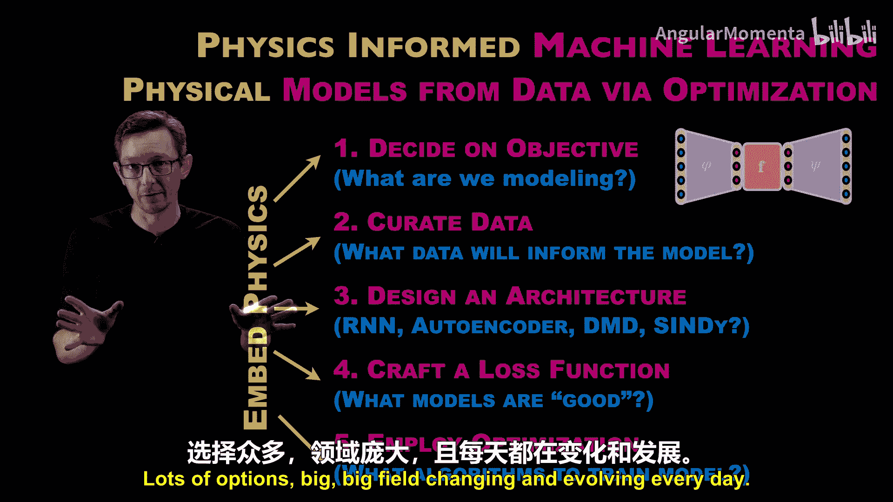

### 4. 设计损失函数

在损失函数中添加物理约束项是一个常用且有效的方法。例如，在估计不可压缩流体的流场时，可以增加一个项来惩罚流场散度不为零的情况：`Loss += λ * ||∇·u||²`。这就是物理信息神经网络（PINN）架构的基础。这种方法为模型提供了“变得物理”的引导，但它是与其他损失项（如拟合误差）权衡的结果，因此得到的是近似满足物理约束的折衷解。

### 5. 设计优化算法

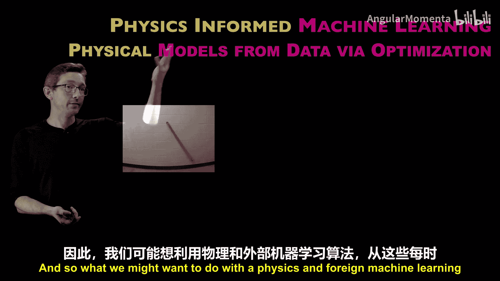

有时可以直接设计优化算法来强制执行物理约束。如果你知道架构中有一部分参数必须满足某些对称性或守恒律，可以使用约束优化方法，强制这些参数在优化过程中始终满足条件。这种方法能施加更严格的物理约束，但实现起来更具挑战性。

## 前沿与挑战

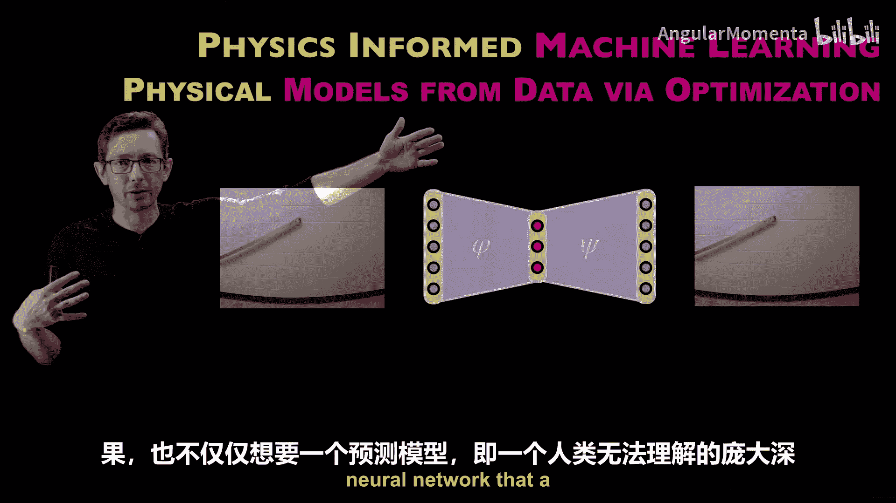

物理信息机器学习是一个令人兴奋但尚处于早期阶段的领域。目前，我们通过添加物理损失函数和约束等方式，确实可以改进机器学习模型。然而，真正从数据中“学习”我们称之为“物理”的规律，仍处于起步阶段。

例如，对于一个摆锤运动的视频，前沿的研究旨在：
1.  将百万像素的图像数据压缩到一个低维潜在空间（如摆角θ和角速度`θ̇`）。
2.  不仅学习一个用于预测的复杂神经网络，更希望学习一个**简洁、可解释的微分方程**来描述这些潜在变量如何随时间演化。

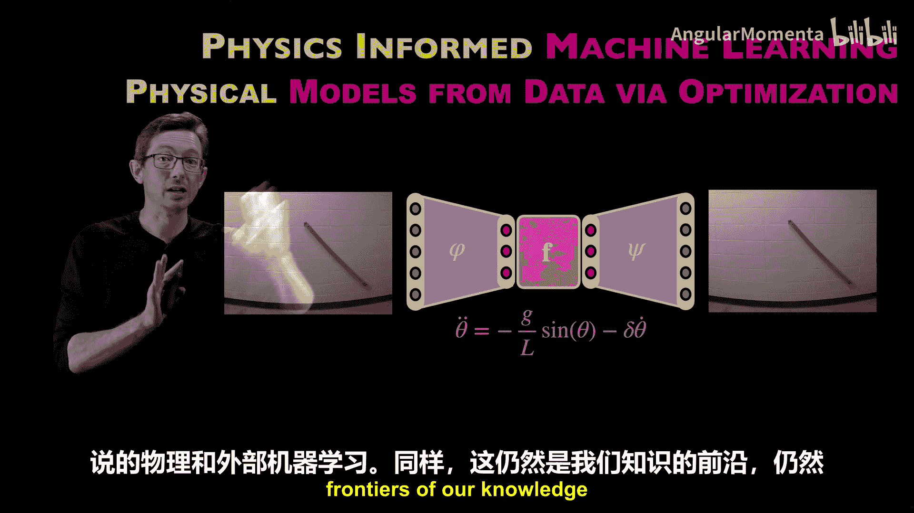

目前，这只对相对简单的系统可行。研究的前沿正致力于将此方法推向更复杂的未知物理系统，如活性物质、非牛顿流体、群体行为、大脑数据等，目标是学习人类可理解并能泛化到新情况（如新的初始条件）的潜在表示和微分方程。

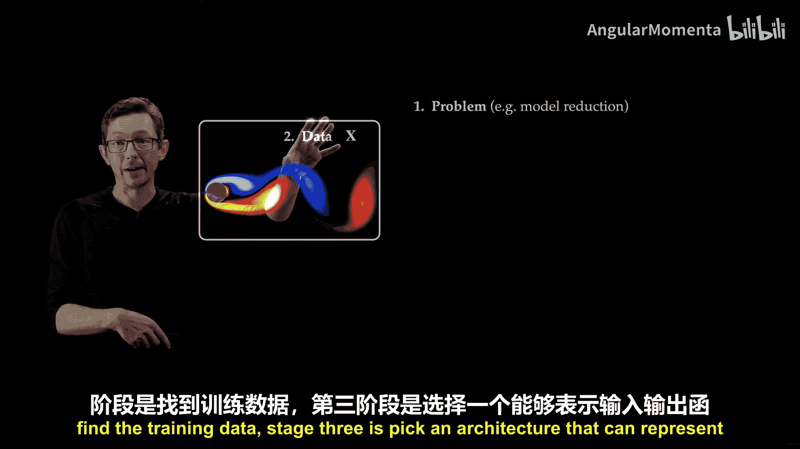

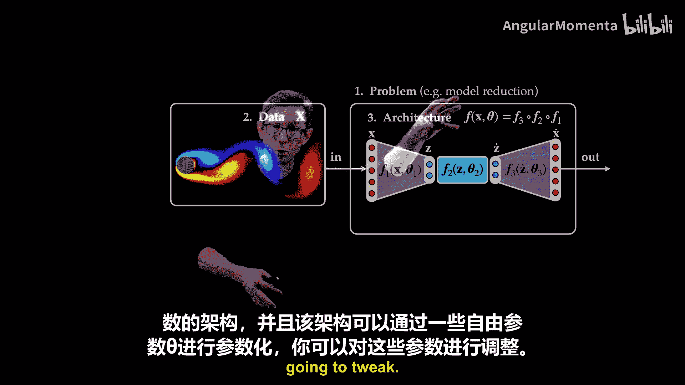

## 总结

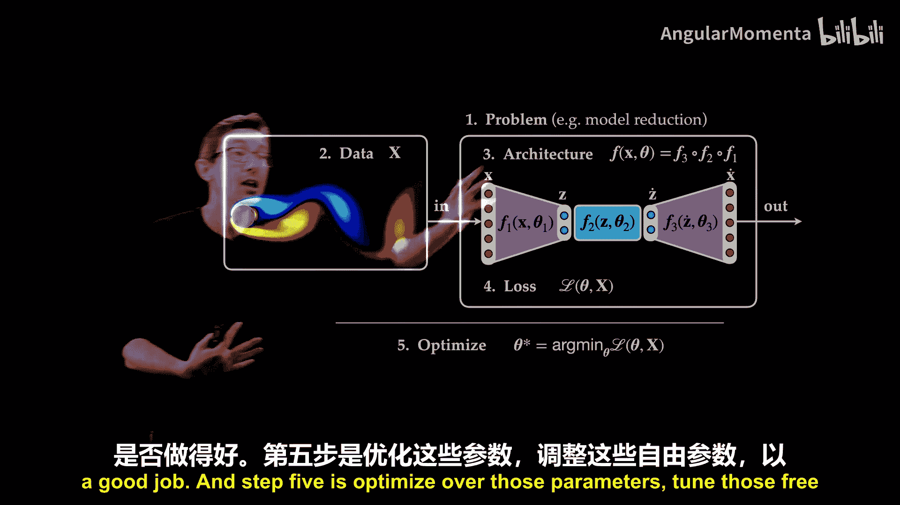

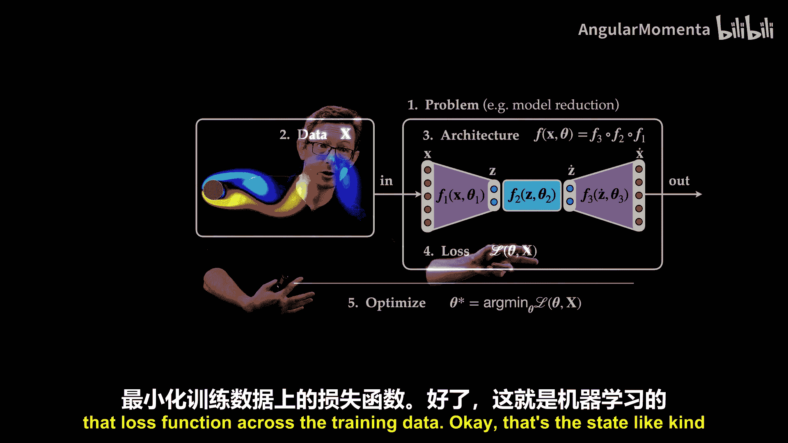

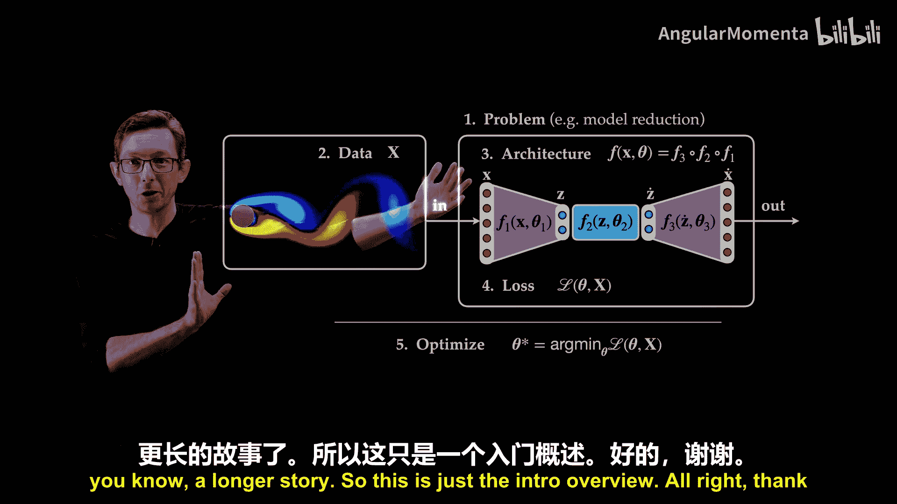

本节课我们一起学习了物理信息机器学习的基本框架。我们回顾了构建机器学习模型的五个关键环节：**问题设定、数据、架构、损失函数和优化**。重要的是，在每一个环节中，我们都有机会通过融入**守恒律、对称性和简约性**等物理先验知识，来构建更具泛化性、可解释性和鲁棒性的模型。虽然这是一个快速发展的前沿领域，但将物理洞察与数据驱动方法相结合，无疑是构建下一代可靠智能系统的强大途径。