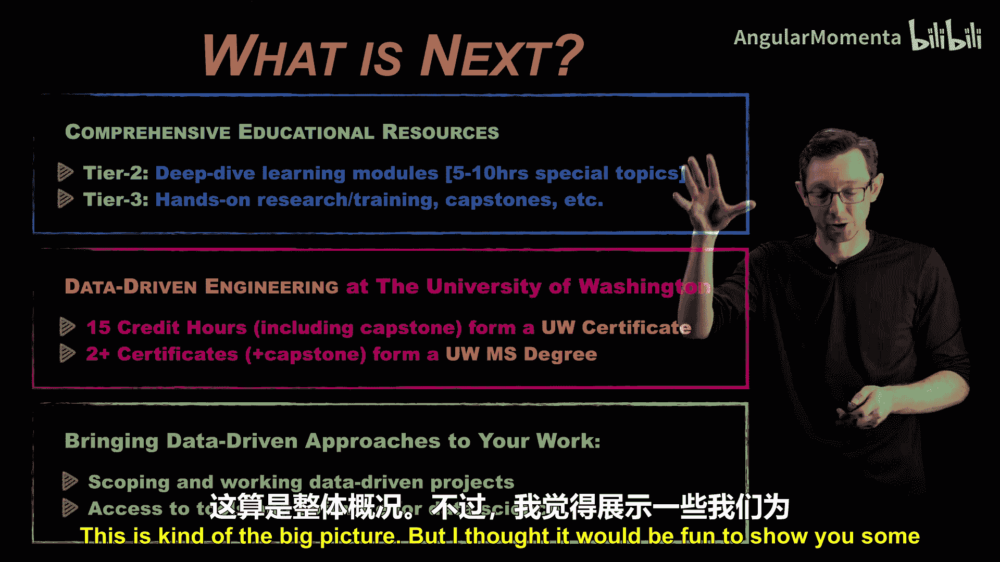
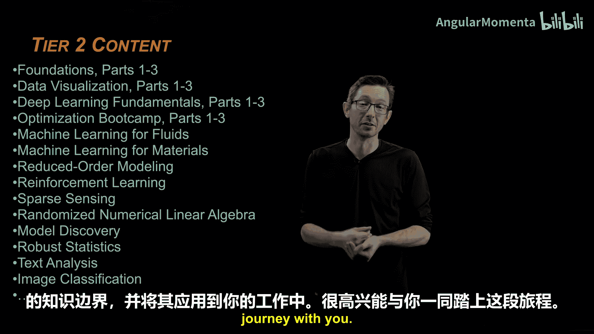

# 021：二级“深度潜水”教育模块预告 🚀

在本节课中，我们将了解数据密集型工程系列课程后续的“深度潜水”模块规划。我们将探讨这些进阶课程的设计目标、涵盖的核心主题，以及它们如何帮助你将数据科学工具融入工程实践。

欢迎回来。我们一直在讨论数据密集型工程、机器学习与数据可视化，探讨如何利用可获取的海量数据在航空航天工程领域取得进展。现在，我想简要谈谈接下来的安排。

我们已经对此有所涉及。这门短期课程旨在快速介绍该主题，提供高层次的动机阐述、相关语言和关键概念，帮助你理解机器学习中哪些是可行的、哪些是不可行的，以及如何将这些技术应用于航空航天工程。

## 后续教育资源的规划

接下来，如果你对这些主题中的任何一个感兴趣，还有更多教育资源可供选择。

以下是即将推出的“深度潜水”二级模块规划。这些是聚焦于特定领域的专题课程，每门课程时长约五到十小时，预计将吸引众多学习者。

*   **机器学习在流体力学中的应用**
*   **数据驱动的优化方法**
*   **深度学习基础**
*   **优化方法训练营**（分初级、中级和高级）
*   **强化学习**（机器学习在控制理论中的应用）
*   **稳健统计学**
*   **文本分析与自然语言处理**
*   **数据可视化深入课程**

希望你能从这些短期课程中获得启发，并在日常研究和生活中以实践的方式应用这些知识。我之前提到过，如果你非常喜欢这些内容并希望获得认证，可以将这些深度潜水模块组合成证书或硕士学位课程。

## 课程的最终目标与实践工具

最终目标是真正将这些知识融入你的日常生活，改进你进行数据密集型工程的方式，与专家团队一起界定并解决数据驱动的问题。

为了将其融入日常生活，你需要掌握哪些具体的工具和软件？这是整体的规划蓝图。

## 课程开发与合作

我认为向大家展示我们为这些二级深度潜水模块构思的一些想法会很有趣。这些课程将主要在华盛顿大学与各合作伙伴协作开发。

我们利用这个机会加入了一些我们认为你应该了解的重要主题。例如，基础部分涵盖了线性代数、微分方程等，这些是精通机器学习及当今最先进工具所必需的基础知识。

数据可视化的重要性再怎么强调都不为过。它关乎如何用数据讲述一个有效的故事，以及如何判断他人是否试图用数据误导你。因此，我们将深入探讨数据可视化的基础。

优化方法是推动机器学习及这场机器学习革命的关键工具。我们将设置专门的焦点领域，探讨机器学习在流体力学或材料科学等领域的机会。

强化学习本质上探讨的是机器学习在控制理论领域的应用机会。此外还有很多，例如我们将讨论预测性垫片示例背后的数学原理、稳健统计学、文本分析等。我们正在构建一个非常庞大且全面的课程体系。

## 课程特色与寄语

该课程体系专门为工程师量身定制，旨在帮助他们掌握推动领域发展所需的数据科学、机器学习和数据可视化工具，从而充分利用这场激动人心的变革浪潮。

我非常高兴能有你一同参与。我希望你能对这些主题产生兴趣，深入钻研，真正拓展你的知识边界，并将所学应用到你的工作中。我很期待与你共同踏上这段旅程。非常感谢。

在本节课中，我们一起预览了数据密集型工程后续的“深度潜水”教育模块。我们了解了这些进阶课程的目标是帮助你将理论知识转化为实践技能，涵盖了从数学基础到各工程领域专项应用（如流体力学、优化控制）的广泛主题，并最终旨在通过系统学习获得认证，将数据驱动的方法深度融入日常工程实践与团队协作中。