# 001：生成式人工智能集成与部署导论 🚀

在本节课中，我们将要学习生成式人工智能的基本概念、工作原理、关键特性以及其广泛的应用领域。我们将探讨这项技术如何重塑创意与产业格局，并了解其面临的挑战。

我们正处在一场创意革命的风口浪尖，创造力的边界不再局限于人脑。机器正在掌握生成艺术、音乐、文本甚至代码的能力。这就是生成式人工智能的领域。

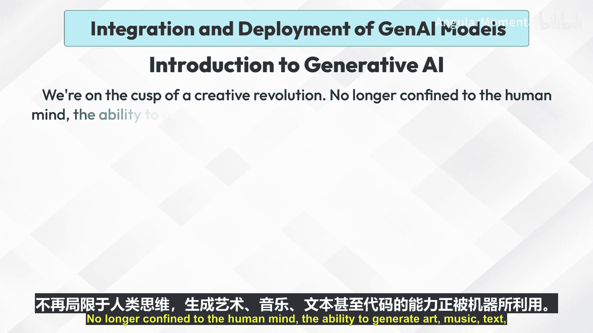

这项尖端技术正从海量数据集中学习，以创造出完全原创的内容，模糊了人类智慧与人工智能之间的界限。

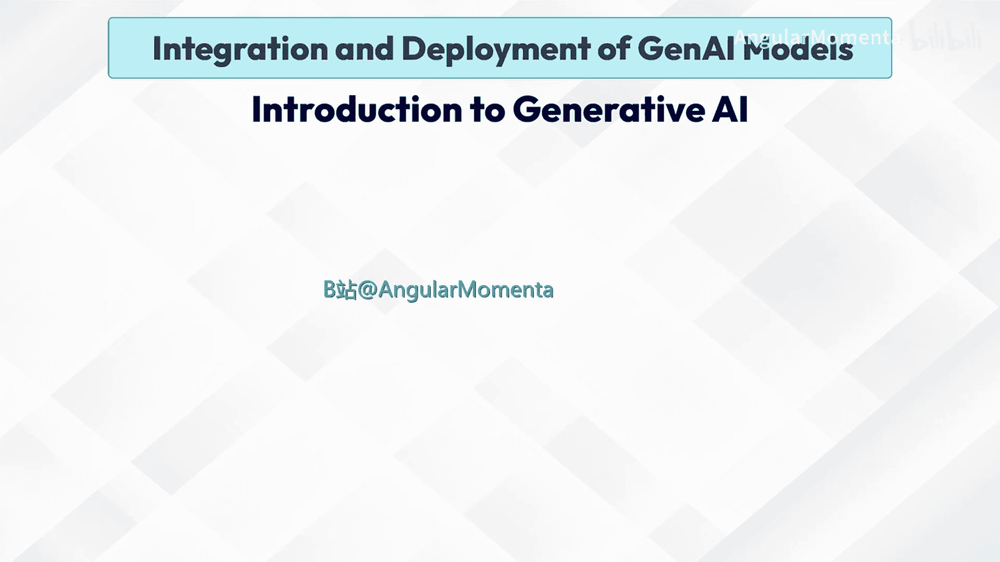

从创作逼真的图像到谱写交响乐，生成式人工智能正在重塑各行各业，并引发了关于创造力未来的讨论。

让我们深入这个迷人的世界，探索它如何重新定义我们的创意版图。

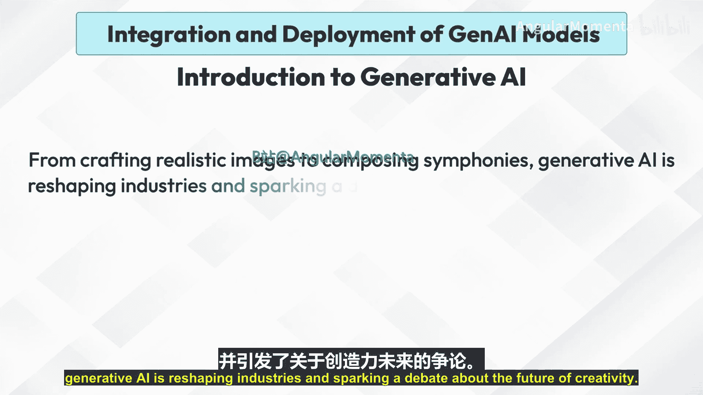

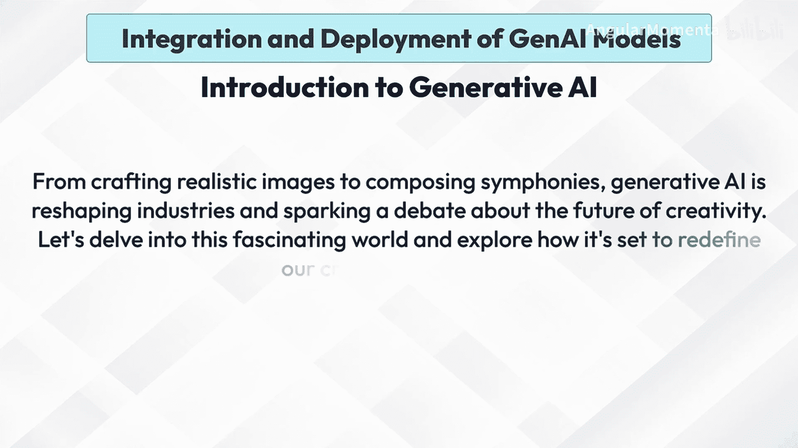

## 工作原理

上一节我们介绍了生成式AI的广阔前景，本节中我们来看看它的核心工作原理。

生成式人工智能模型在大量现有内容的数据集上进行训练。它们学习数据中的底层模式、结构和关系。一旦训练完成，模型可以通过从学习到的概率分布中采样来生成新内容。

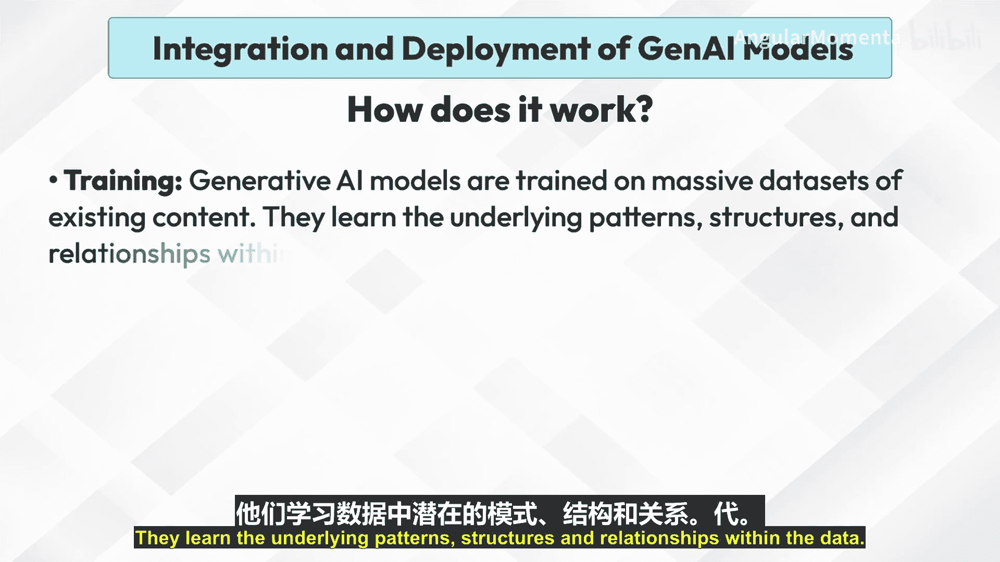

这意味着它创造的输出与训练数据相似，但又是全新的、原创的。

## 关键特性

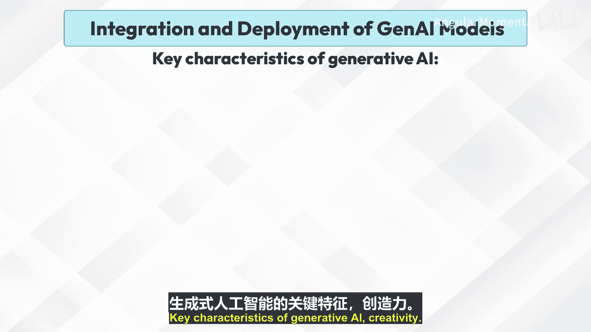

了解了工作原理后，我们来看看生成式AI具备哪些关键特性。

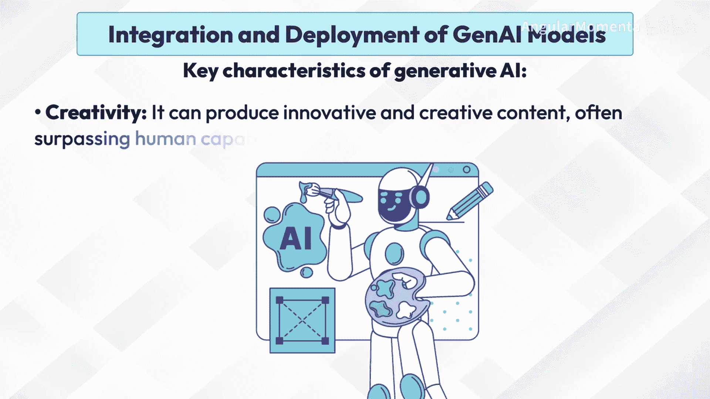

以下是生成式人工智能的几个核心特征：

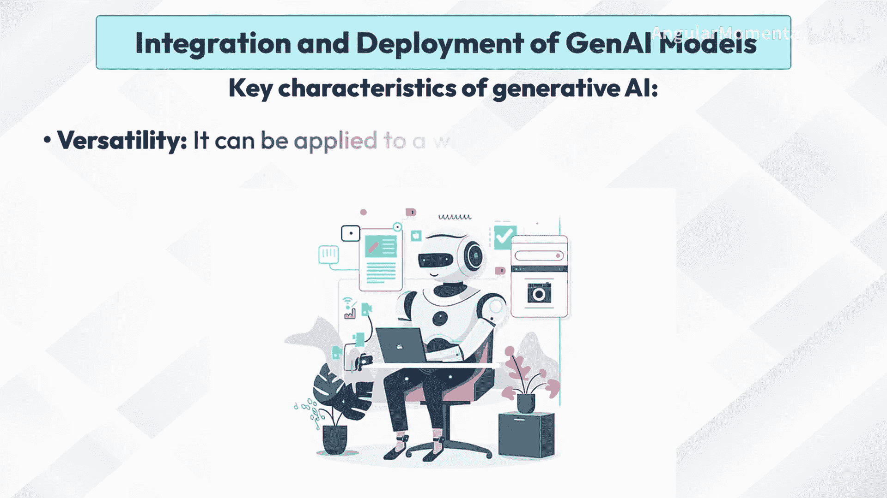

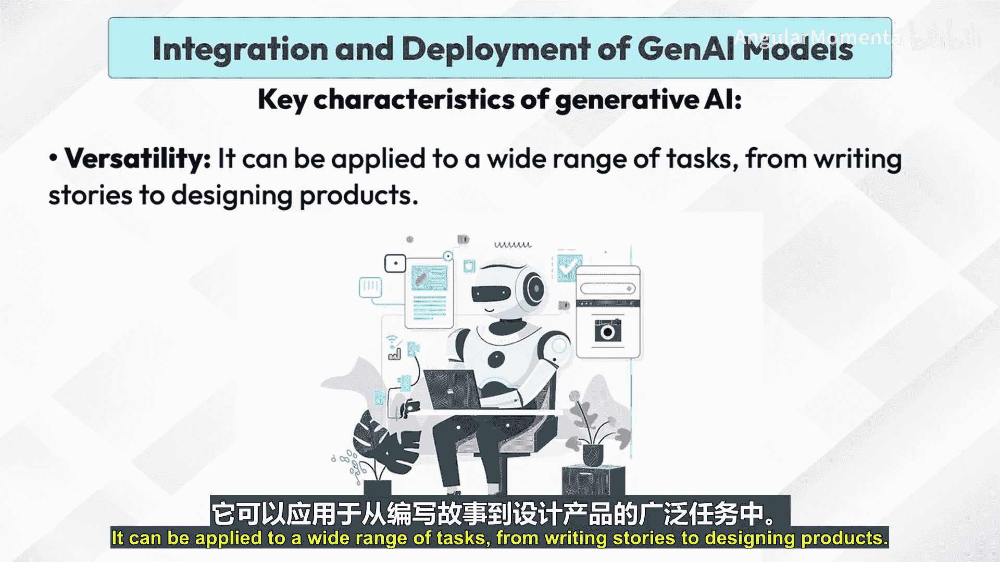

*   **创造力**：能够产生创新和创造性的内容，在某些领域甚至超越人类的能力。
*   **多功能性**：可应用于广泛的任务，从写故事到设计产品。
*   **高效性**：生成内容的速度远快于人类，从而提高了生产力。
*   **可定制性**：可以根据特定的风格、偏好或需求进行定制。

## 应用示例

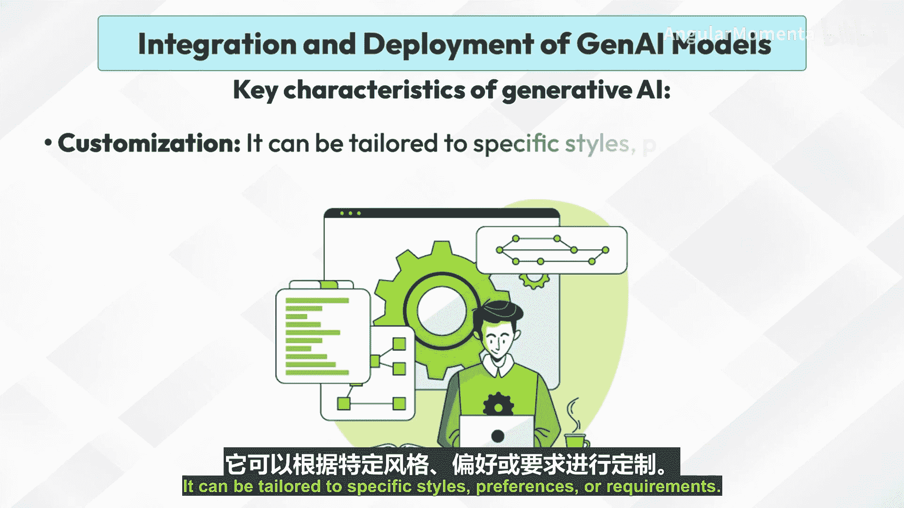

生成式AI的特性使其在众多领域大放异彩。以下是它的一些具体应用示例：

*   **文本生成**：创建文章、诗歌、剧本、代码等。
*   **图像生成**：生成逼真的图像、艺术作品和设计。
*   **音乐生成**：创作各种流派的音乐作品。
*   **视频生成**：创建视频、动画和特效。
*   **药物发现**：设计用于潜在候选药物的新分子。

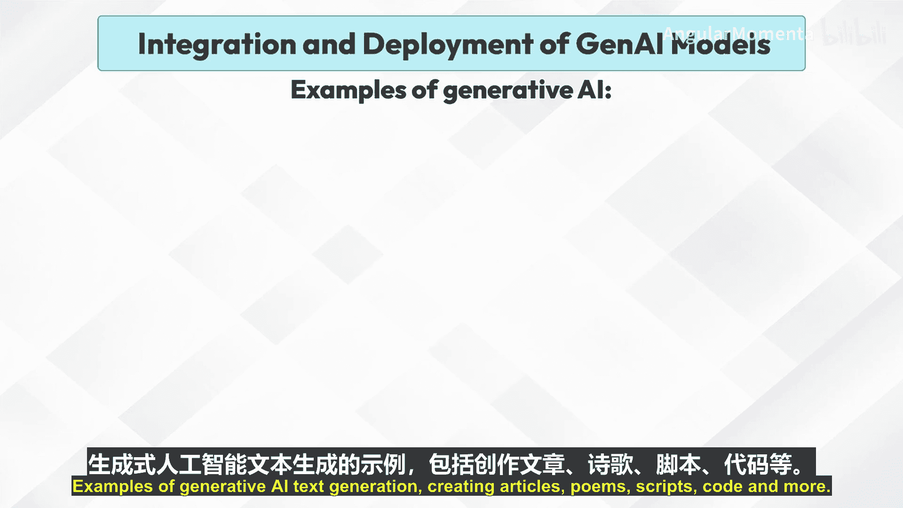

## 潜在应用领域

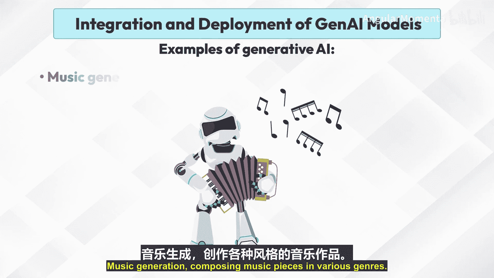

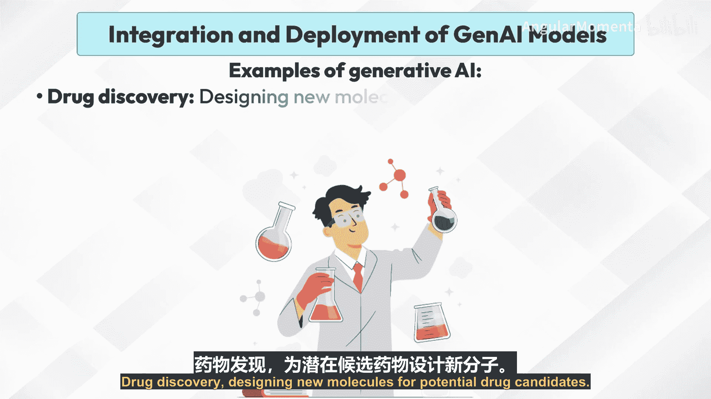

基于上述示例，生成式AI的潜力正在多个行业中被发掘。以下是其主要的潜在应用领域：

*   **内容创作**：市场营销、广告、娱乐。
*   **设计**：产品设计、建筑设计、时尚设计。
*   **教育**：个性化学习、内容生成。
*   **医疗保健**：药物发现、医学影像分析。
*   **娱乐**：游戏开发、电子游戏角色创建。

## 挑战与考量

尽管前景广阔，生成式AI的集成与部署也面临诸多挑战。在拥抱其潜力的同时，我们必须正视以下问题：

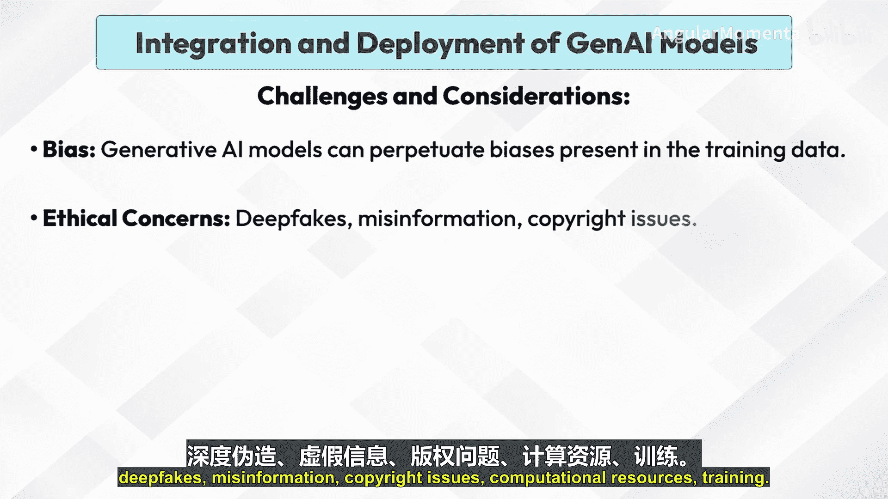

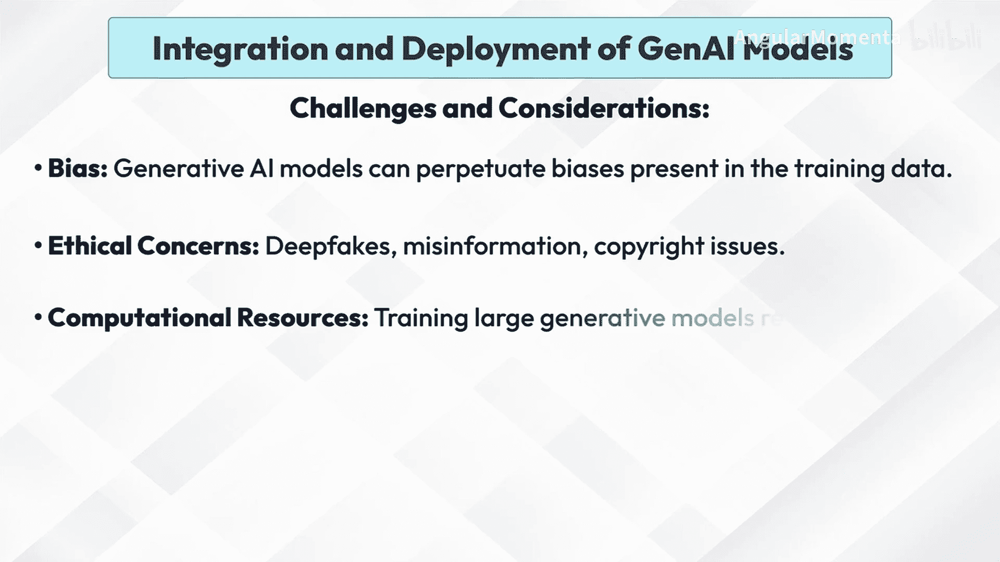

*   **偏见**：生成式人工智能模型可能会延续训练数据中存在的偏见。
*   **伦理问题**：深度伪造、虚假信息、版权问题。
*   **计算资源**：训练大型生成模型需要巨大的计算能力。

生成式人工智能是一个快速发展的领域，拥有巨大的潜力。随着技术的进步，我们有望在未来几年看到更多突破性的应用和创新。

本节课中我们一起学习了生成式人工智能的定义、核心工作原理、关键特性、多样化的应用实例以及部署时需要考虑的挑战。理解这些基础知识是后续深入探讨集成与部署策略的重要前提。