# 002：理解部署格局 🗺️

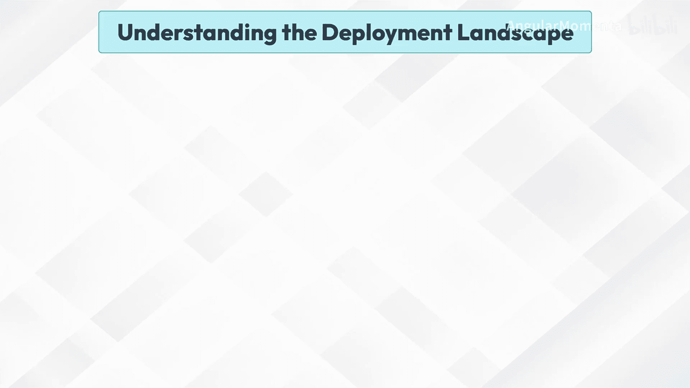

在本节课中，我们将要学习生成式人工智能的部署格局。理解不同的部署选项是成功将AI模型投入实际应用的关键第一步。

## 理解部署格局

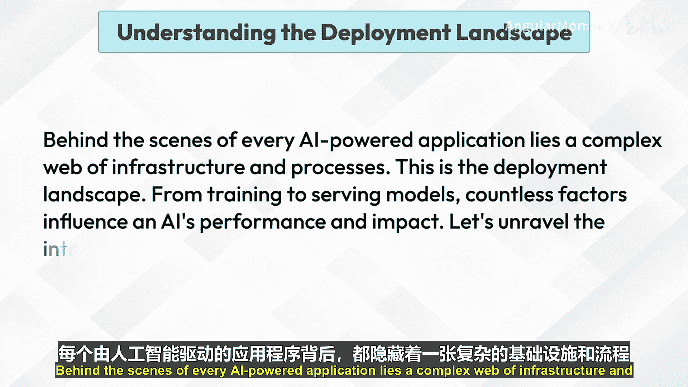

每一个AI驱动应用的背后，都隐藏着一个由基础设施和流程构成的复杂网络，这就是部署格局。从模型训练到模型服务，无数因素影响着AI的性能和最终影响。让我们来解析将AI带入现实世界的复杂过程。

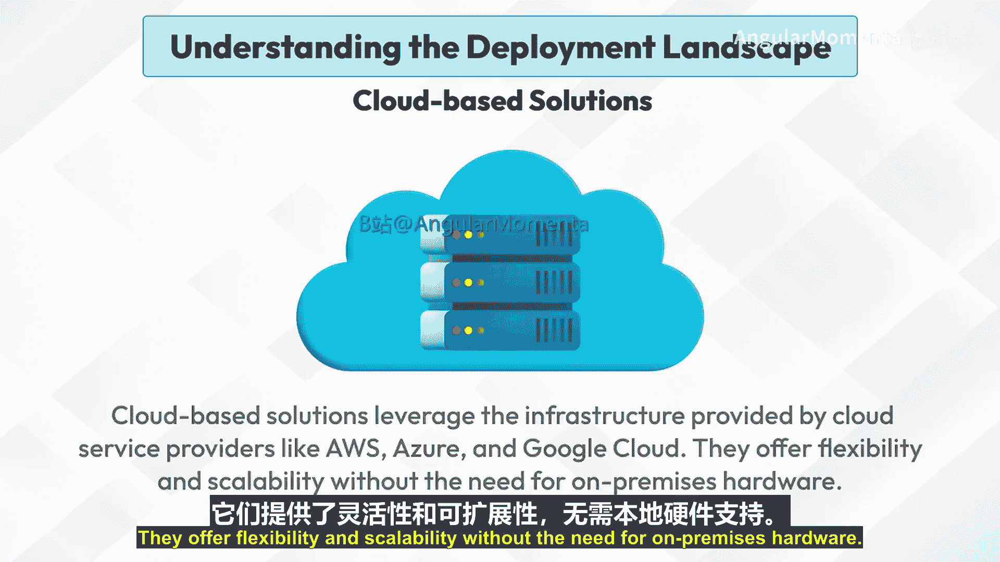

## 云解决方案 ☁️

云解决方案利用云服务提供商（如AWS、Azure和Google Cloud）提供的基础设施。它们提供了灵活性、可扩展性，且无需本地硬件。

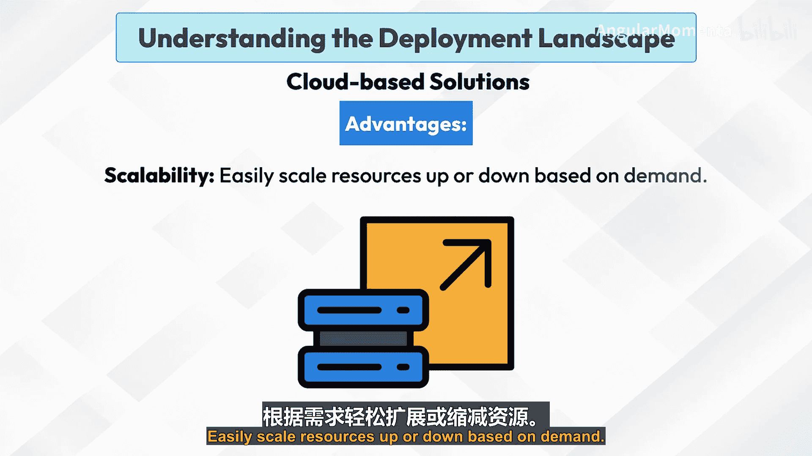

以下是云解决方案的主要优势：

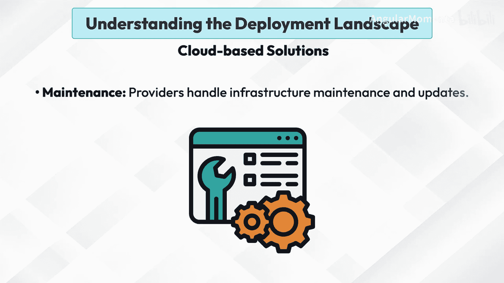

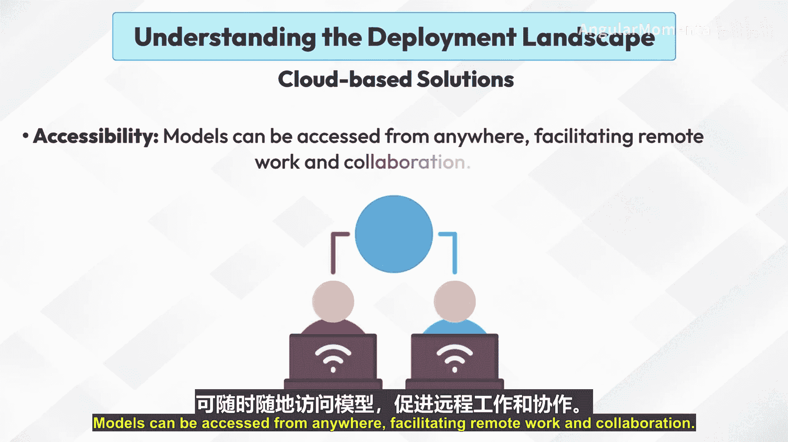

*   **可扩展性**：可根据需求轻松扩展或缩减资源。
*   **维护**：提供商负责基础设施的维护和更新。
*   **可访问性**：模型可以从任何地方访问，便于远程工作和协作。

云解决方案适用于需要强大计算能力或处理大型数据集的应用场景，例如实时语言处理或大规模图像生成。常见的例子包括 **AWS SageMaker**、**Google AI Platform** 和 **Azure Machine Learning**。

## 本地解决方案 🏢

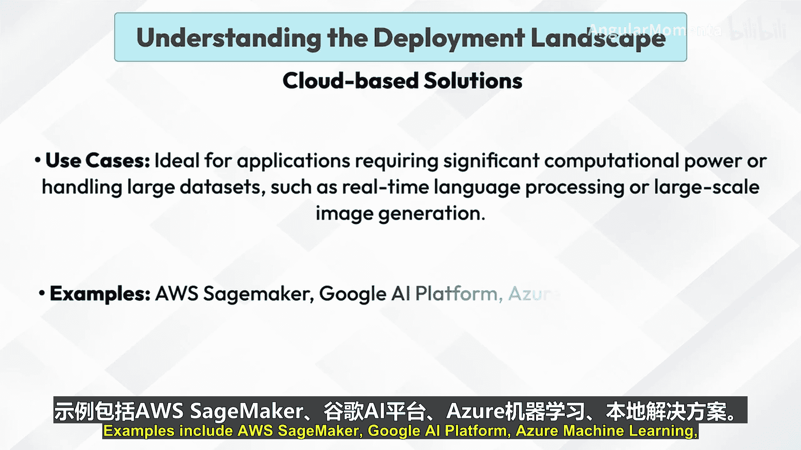

上一节我们介绍了云解决方案，本节中我们来看看本地解决方案。本地解决方案涉及将生成式AI模型部署在组织自有数据中心内的本地服务器上。

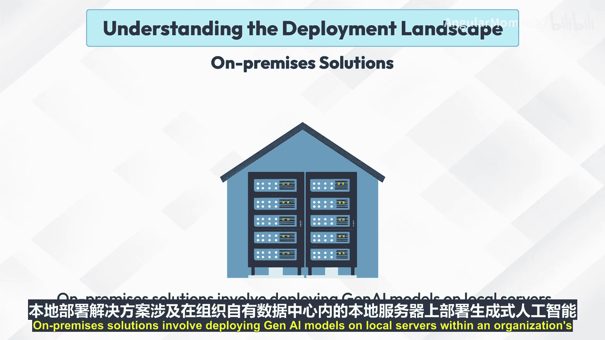

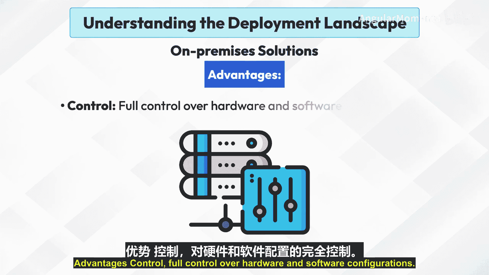

以下是本地解决方案的主要优势：

*   **控制权**：对硬件和软件配置拥有完全控制权。
*   **数据隐私**：为敏感数据提供增强的安全性和隐私性，因为所有数据都保留在组织的基础设施内。
*   **定制化**：可根据特定需求和条件定制环境。

本地解决方案适用于数据隐私至关重要或对低延迟性能要求苛刻的场景，例如金融交易或敏感的医疗数据处理。常见的例子包括定制服务器、以及像 **NVIDIA DGX Systems** 这样的专用AI硬件。

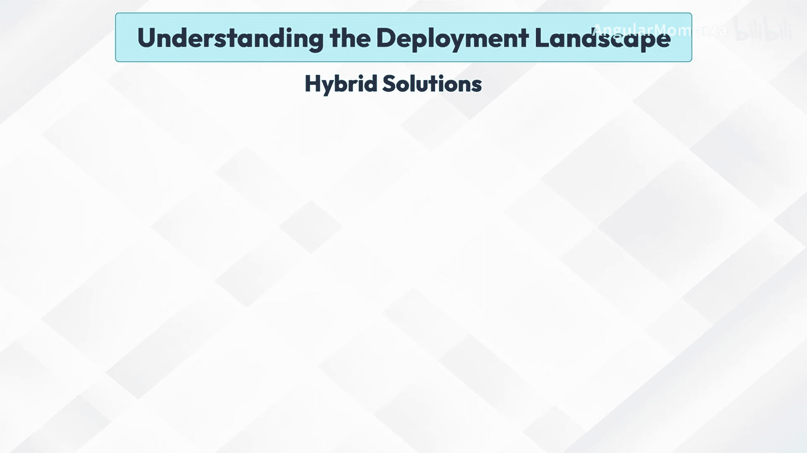

## 混合解决方案 ⚖️

混合解决方案结合了云部署和本地部署的元素。它们允许灵活的资源管理，并可根据特定需求进行定制。

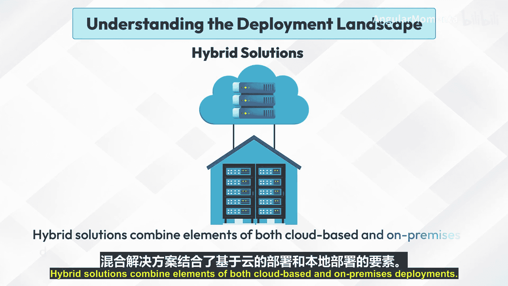

以下是混合解决方案的主要优势：

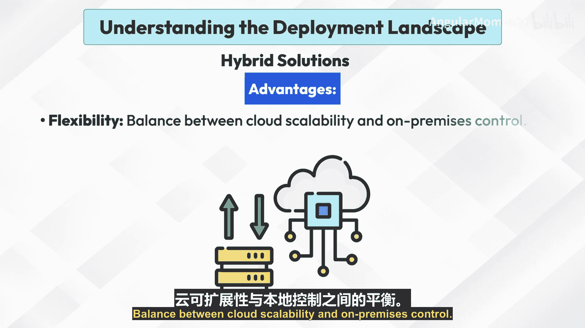

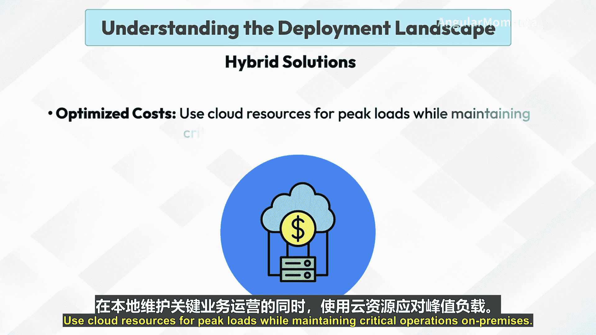

*   **灵活性**：在云的可扩展性和本地控制权之间取得平衡。
*   **成本优化**：利用云资源应对峰值负载，同时将关键业务保留在本地运行。
*   **灾难恢复**：云可以作为本地系统的备份或故障转移选项。

混合解决方案对需要管理大规模工作负载，同时又要将关键数据保留在本地企业非常有益，例如处理高交易量和敏感客户数据的零售业。常见的例子包括 **Azure Stack** 和 **AWS Outposts**。

## 总结

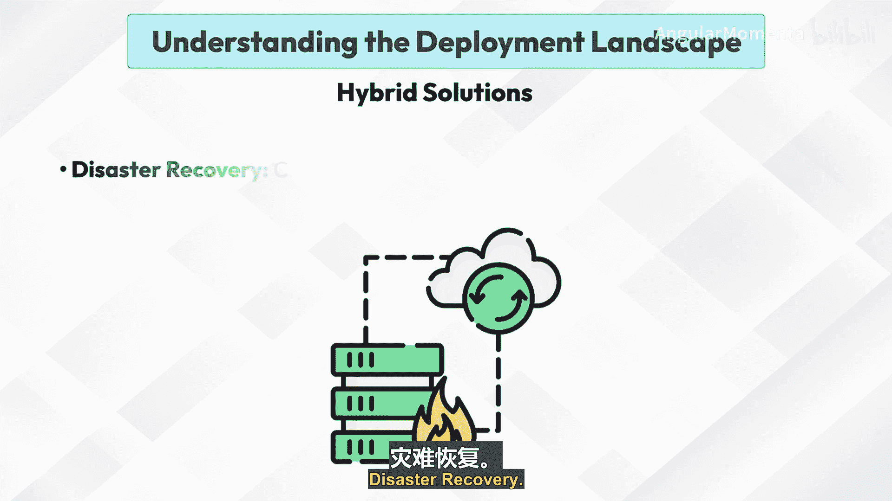

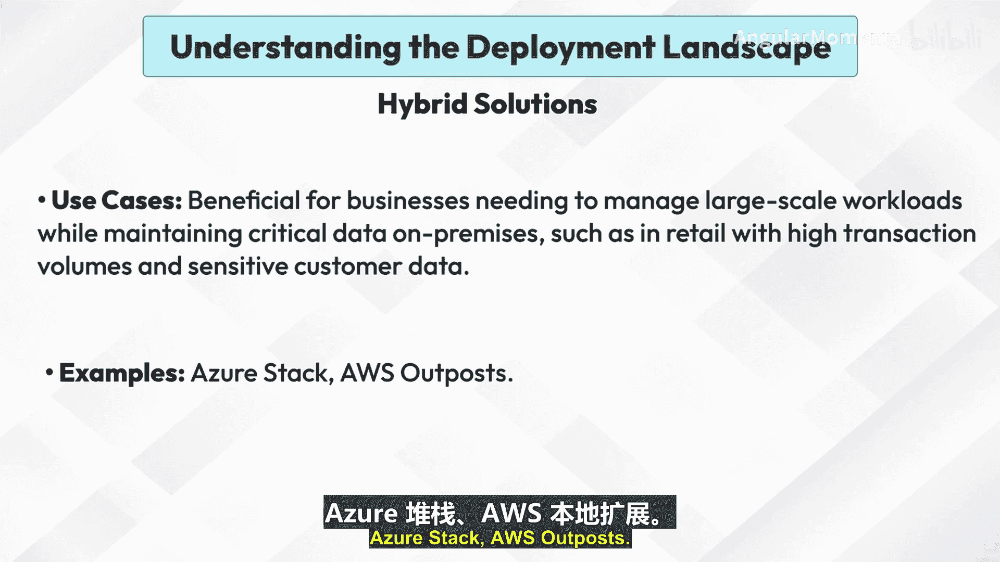

本节课中我们一起学习了生成式AI的三种主要部署格局：**云解决方案**、**本地解决方案**和**混合解决方案**。每种方案都有其独特的优势、适用场景和代表产品。理解这些选项是制定有效AI部署策略的基础，可以帮助您根据业务需求、数据敏感性、成本和控制权等因素，选择最合适的部署路径。