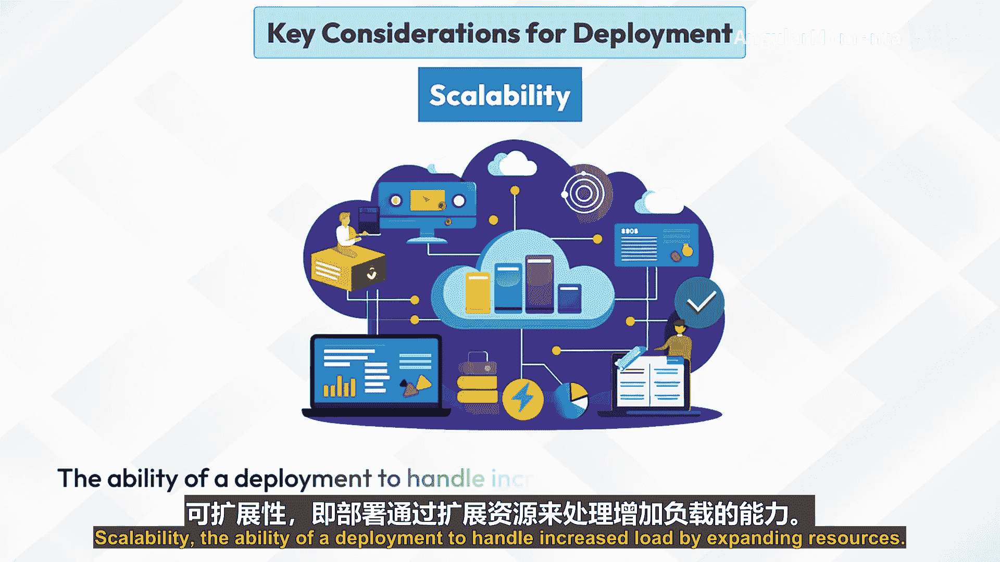
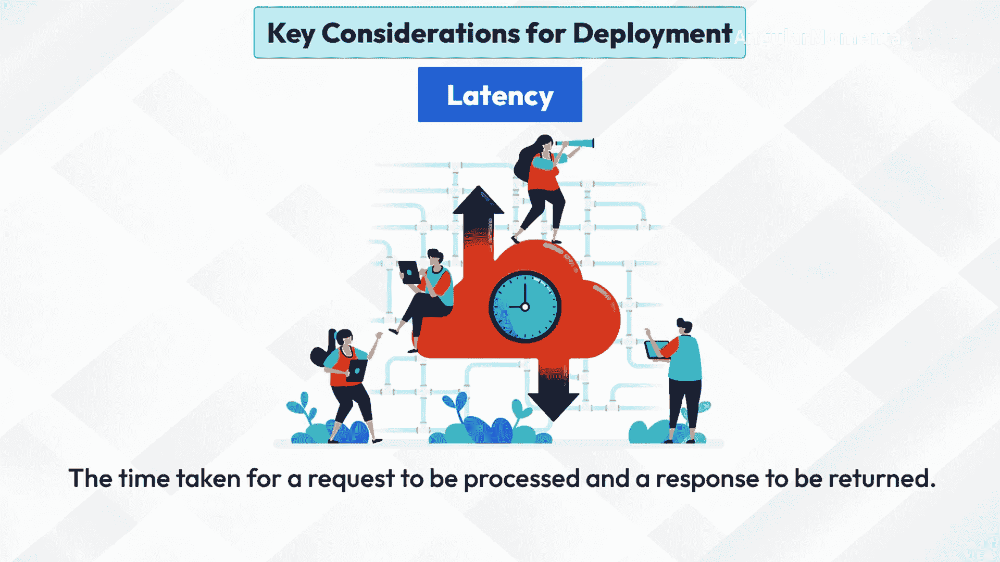
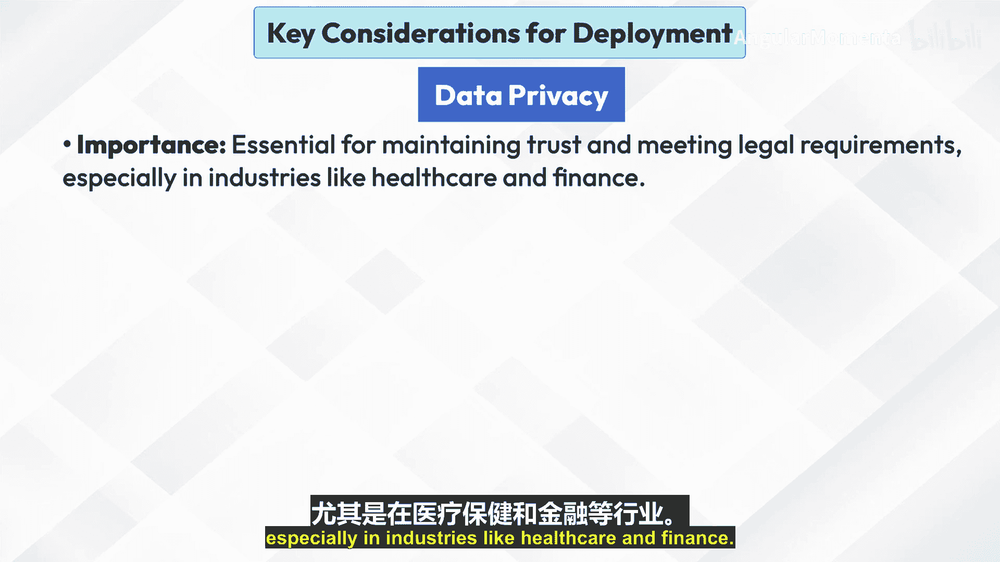
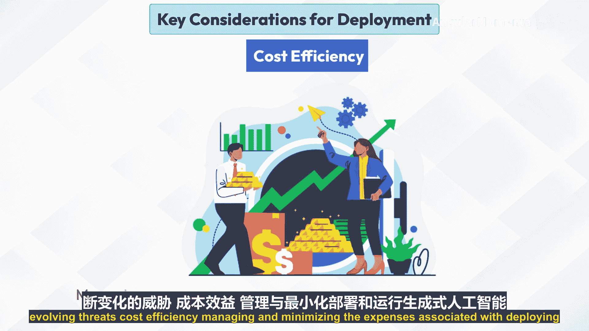
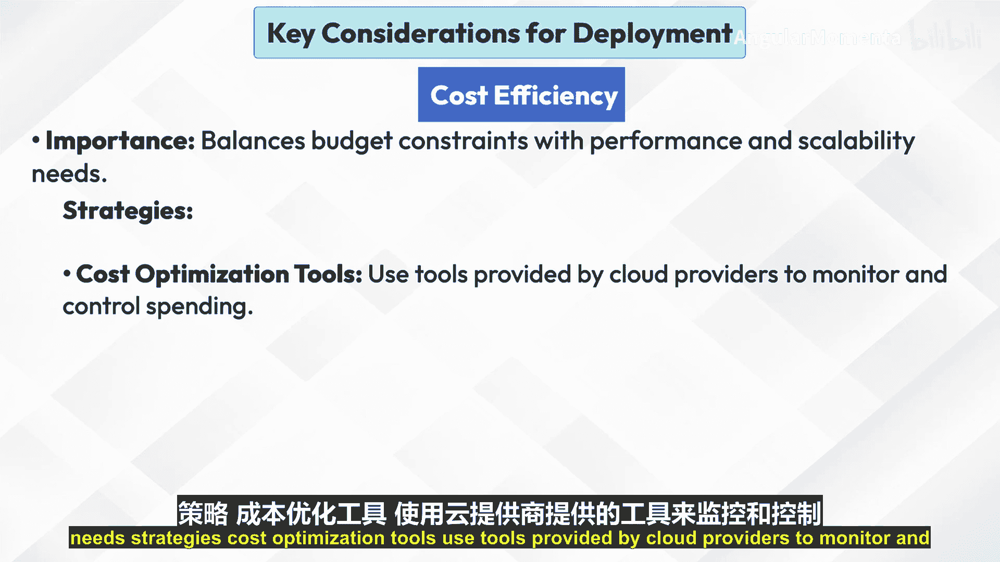

# 003：部署的关键考量因素 🎯

在本节课中，我们将学习部署生成式人工智能模型时需要考虑的几个关键因素。这些因素决定了模型在生产环境中的性能、可靠性、安全性和经济性。我们将逐一探讨可扩展性、延迟、数据隐私和成本效益这四个核心方面。

---

## 可扩展性 📈

上一节我们介绍了部署的总体概念，本节中我们来看看第一个关键考量因素：可扩展性。**可扩展性**指的是部署方案通过扩展资源来处理负载增长的能力。它确保生成式AI模型能够处理不同规模的数据和用户请求，而不会导致性能下降。

以下是实现可扩展性的主要策略与最佳实践：

*   **水平扩展**：通过增加更多实例来处理增长的负载。例如，增加额外的云服务器。
*   **垂直扩展**：通过升级现有实例的能力来处理增长。例如，使用更强大的硬件。

最佳实践包括：监控性能指标以预测和响应扩展需求，并在可用时使用自动扩展功能。

---

## 延迟 ⚡

理解了如何应对负载增长后，我们来看看直接影响用户体验的指标：延迟。**延迟**指的是从发送请求到收到响应所需的时间。

对于需要实时响应的应用（如聊天机器人或交互式AI系统），低延迟至关重要。

以下是降低延迟的主要策略与最佳实践：

*   **边缘计算**：将模型部署在更靠近终端用户的位置，以减少数据传输时间。
*   **负载均衡**：将请求有效地分配到多个服务器上，以管理响应时间。

最佳实践包括：优化模型以实现更快的推理速度，并使用缓存机制来加速重复的请求。

---

## 数据隐私 🔒

在确保应用响应迅速的同时，我们必须高度重视数据的安全与合规性，这就是数据隐私。**数据隐私**涉及保护敏感信息免受未经授权的访问，并确保符合相关法规。

这对于维护用户信任和满足法律要求至关重要，尤其是在医疗和金融等行业。

以下是保障数据隐私的主要策略与最佳实践：

*   **加密**：对传输中和静态存储的数据进行加密保护。
*   **访问控制**：将数据和模型输出的访问权限严格限制在授权人员范围内。
*   **合规性**：确保遵守如GDPR、HIPAA等相关法规。

最佳实践包括：定期审查和更新隐私政策及安全措施，以应对不断演变的威胁。

---

## 成本效益 💰

最后，任何部署策略都需要在性能与预算之间取得平衡，因此我们需要关注成本效益。**成本效益**指的是管理与部署和运行生成式AI模型相关的费用，在预算限制与性能和可扩展性需求之间取得平衡。

以下是实现成本效益的主要策略与最佳实践：

*   **成本优化工具**：使用云服务提供商提供的工具来监控和控制支出。
*   **资源管理**：合理调整实例规模，并在适用的情况下使用预留实例或竞价实例。
*   **高效编码**：优化算法和模型以减少资源消耗。

最佳实践包括：定期审查成本报告，并调整策略以避免意外开支。

---

本节课中，我们一起学习了部署生成式AI模型的四个关键考量因素：**可扩展性**、**延迟**、**数据隐私**和**成本效益**。理解并妥善处理这些因素，是确保您的AI应用能够稳定、高效、安全且经济地服务于用户的基础。