# 004：评估部署方法与供应商 🧐

在本节课中，我们将要学习如何评估生成式AI模型的部署方法与供应商。每一个AI驱动的应用背后，都隐藏着复杂的基础设施与流程网络。从训练模型到提供预测，这就是部署的全景图。从研究到产生实际影响的旅程充满了挑战与机遇。让我们揭示使AI模型真正运作起来的复杂细节。

## AWS SageMaker 概述 🚀

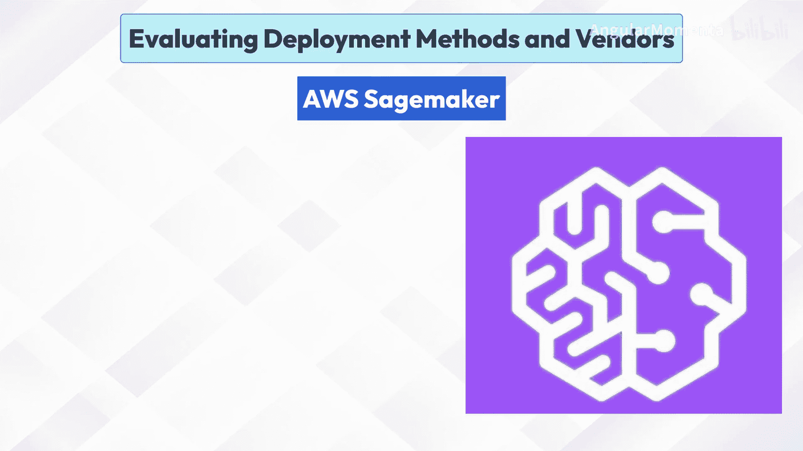

AWS SageMaker 是亚马逊网络服务提供的一项全托管服务，旨在简化大规模构建、训练和部署机器学习模型的过程。它为数据科学家和开发者提供了一个全面的环境，用于管理机器学习项目的整个生命周期。

其功能可以分为以下几个关键领域：

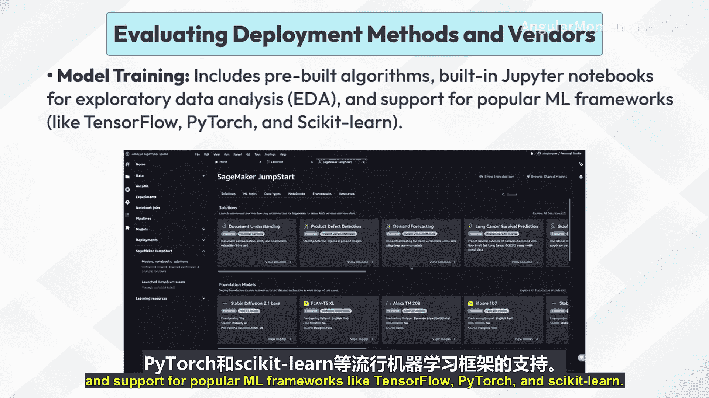

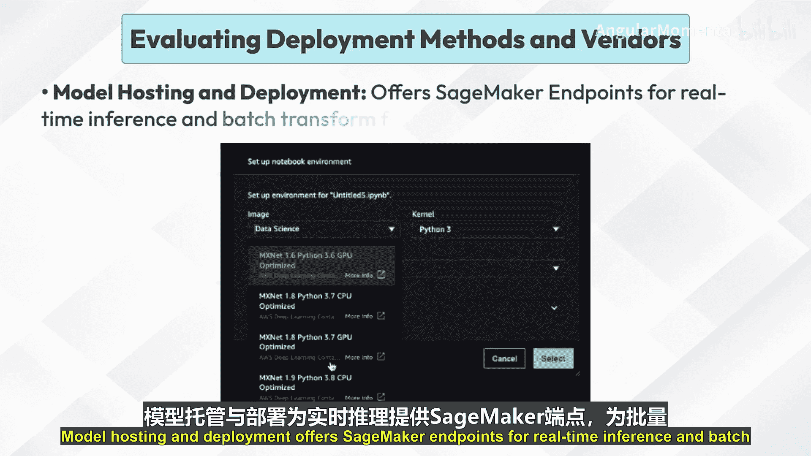

*   **数据准备**：提供数据标注、清洗和转换的工具，包括 SageMaker Data Wrangler，用于轻松地从各种来源准备数据。
*   **模型训练**：包含预构建算法、用于探索性数据分析的内置 Jupyter Notebook，以及对 TensorFlow、PyTorch 等流行 ML 框架的支持。
*   **模型托管与部署**：提供用于实时推理的 SageMaker 端点，以及用于批量推理的 Batch Transform。
*   **自动模型调优**：提供超参数调优功能，以最少的干预优化模型性能。
*   **内置 Jupyter Notebook**：使数据科学家能够交互式地开发和优化模型。

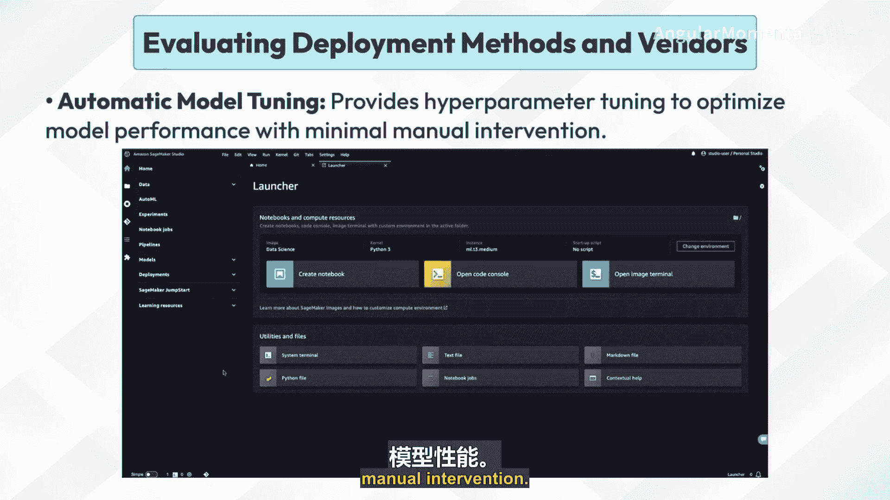

AWS SageMaker 旨在提高生产力和可扩展性，同时简化云环境中机器学习的运维方面。

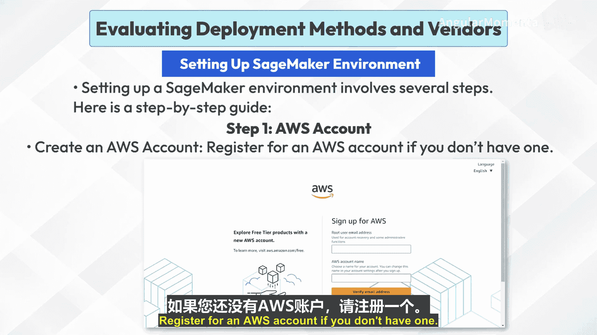

## 设置 SageMaker 环境 ⚙️

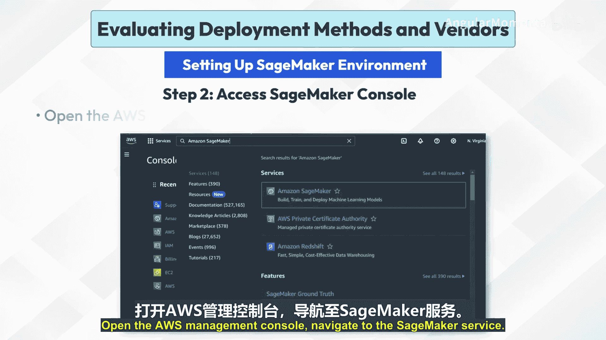

上一节我们介绍了 AWS SageMaker 的核心功能，本节中我们来看看如何设置一个 SageMaker 环境。设置 SageMaker 环境涉及几个步骤，以下是一个分步指南。

以下是设置步骤：

1.  **AWS 账户**：创建一个 AWS 账户。如果你还没有，请注册一个 AWS 账户。
2.  **访问 SageMaker 控制台**：打开 AWS 管理控制台，导航到 SageMaker 服务。
3.  **创建 Notebook 实例**：在 SageMaker 控制台中，选择“Notebook 实例”并创建一个新实例。根据预期的资源使用情况选择实例类型。创建或选择一个具有适当权限的 IAM 角色，该角色允许 SageMaker 访问你的 S3 存储桶和其他 AWS 服务。
4.  **配置网络与安全**：如有必要，配置 VPC 设置以满足你的安全性和可用性需求。
5.  **访问 Notebook 实例**：启动实例，并使用 Jupyter Notebook 来编写和执行代码。连接到 S3 以进行数据存储和检索。
6.  **安装额外库**：如果使用自定义库，请确保它们在 Notebook 环境中已安装。

## 在 SageMaker 上部署生成式 AI 模型 🚢

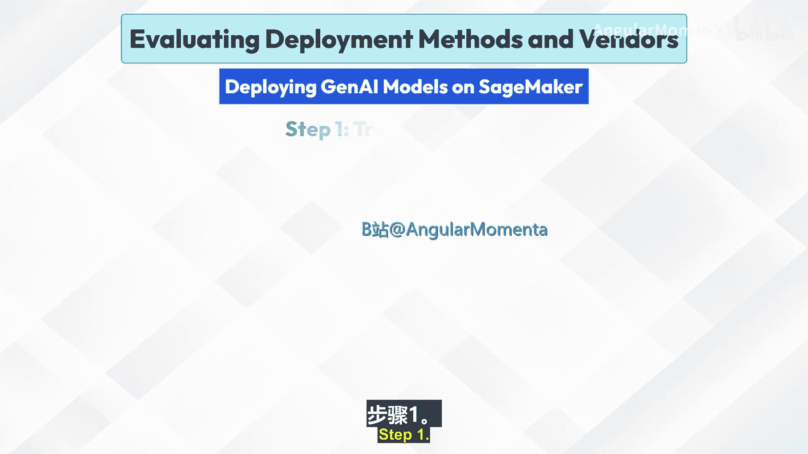

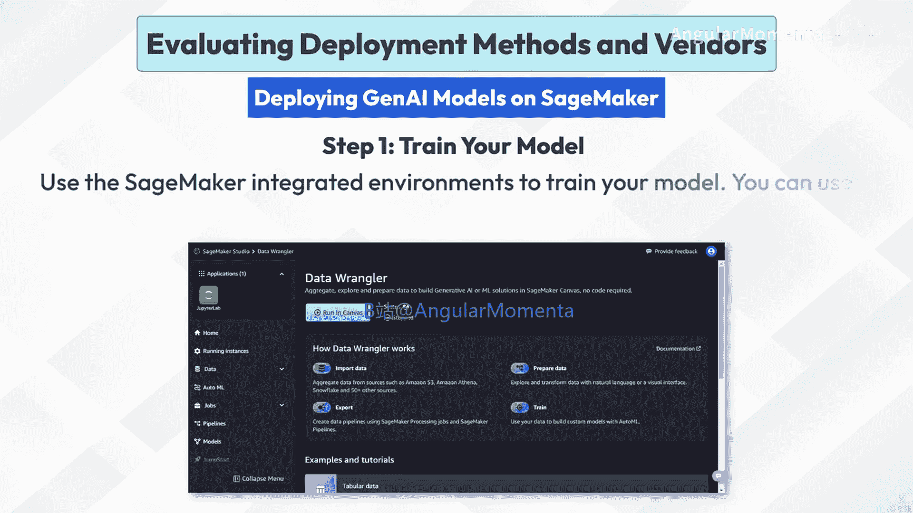

设置好环境后，下一步就是部署模型。在训练好生成式 AI 模型后，下一步就是部署。以下是具体方法。

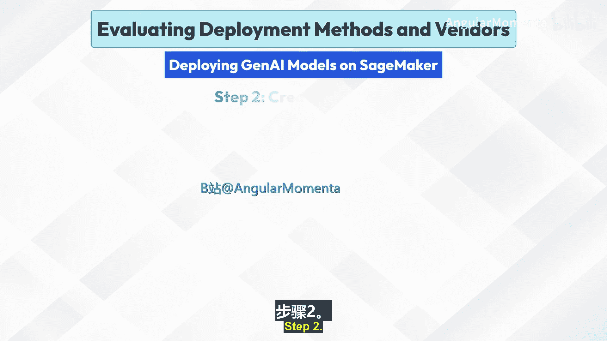

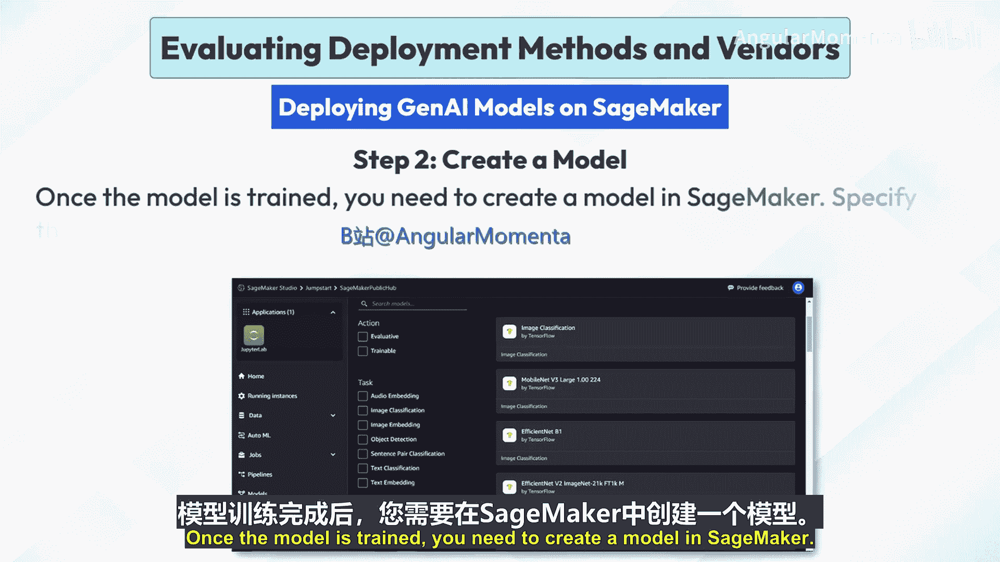

以下是部署步骤：

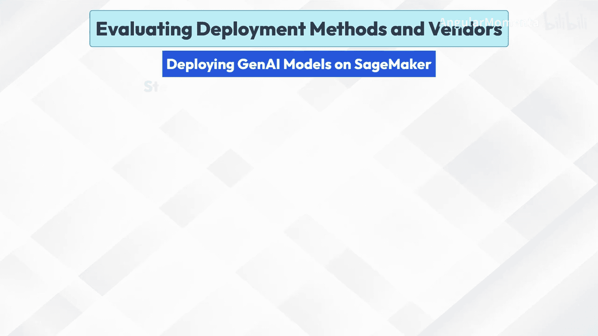

1.  **训练模型**：使用 SageMaker 的集成环境来训练你的模型。你可以使用内置算法或自定义代码。
2.  **创建模型**：模型训练完成后，你需要在 SageMaker 中创建一个模型。指定模型工件的位置和推理镜像。
    *   **模型工件位置示例**：`s3://your-bucket/path/to/model.tar.gz`
    *   **推理镜像示例**：`763104351884.dkr.ecr.us-east-1.amazonaws.com/tensorflow-inference:2.9-cpu`
3.  **创建端点配置**：定义模型的端点配置，指定扩展所需的实例类型和实例数量。
4.  **部署模型**：
    *   **实时推理**：使用 `create_endpoint` API 或 SageMaker 控制台将模型部署到实时推理端点，从而允许你实时生成预测。
    *   **批量推理**：使用 SageMaker Batch Transform，通过一批输入数据调用你的模型。
5.  **保护端点**：为端点配置身份验证和访问权限，以控制谁可以调用它。

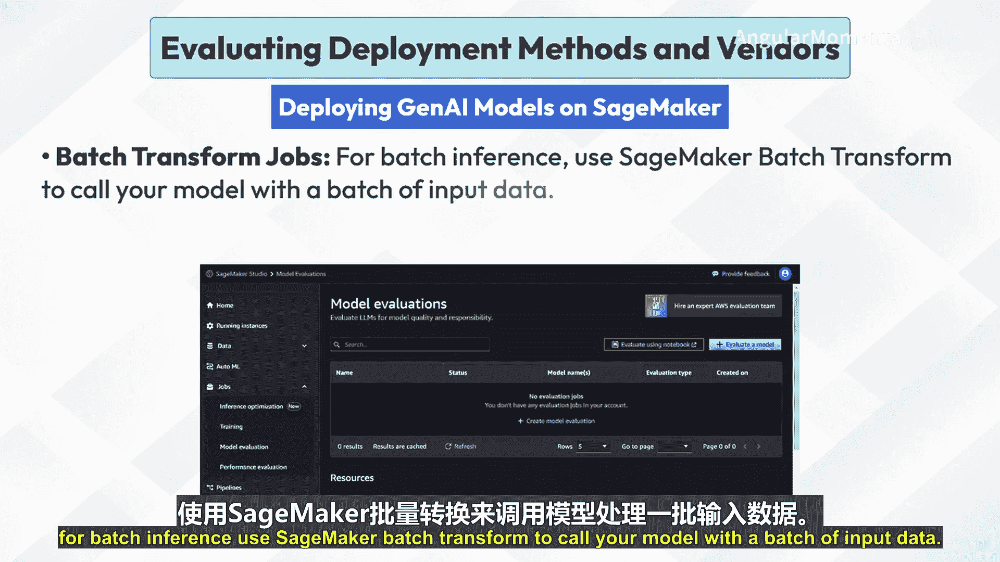

## 在 SageMaker 上监控与维护模型 📊

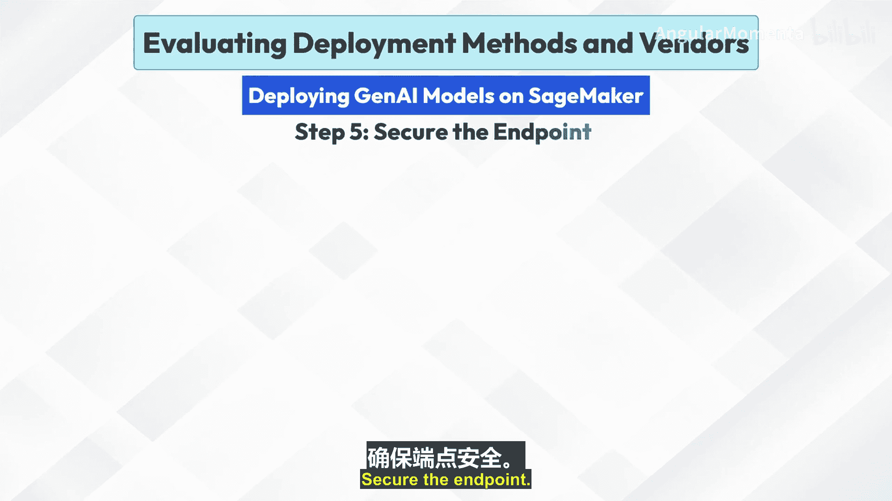

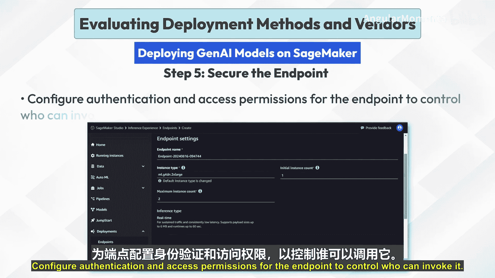

模型部署后，监控和维护对于其成功至关重要。SageMaker 提供了多种工具来帮助你完成这项工作。

以下是监控与维护的关键方面：

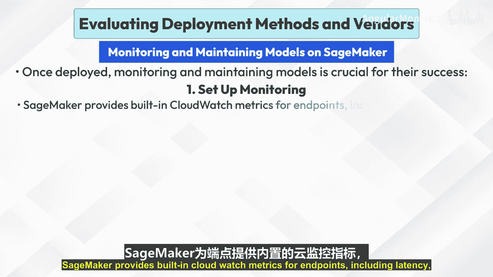

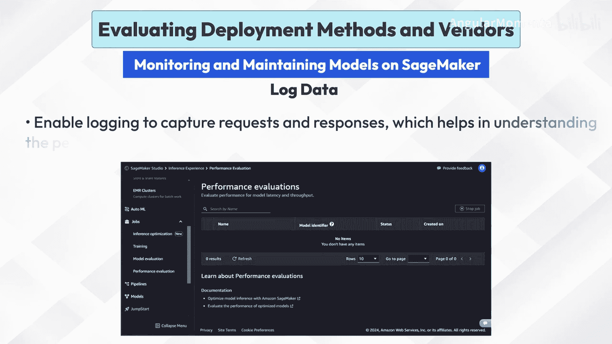

*   **设置监控**：SageMaker 为端点提供了内置的 CloudWatch 指标，包括延迟、调用次数和错误。考虑使用 SageMaker Debugger 来监控模型训练并检测模型行为中的异常。
*   **记录数据**：启用日志记录以捕获请求和响应，这有助于理解模型的性能。
*   **模型性能跟踪**：通过 SageMaker Model Monitor 监控模型漂移和数据漂移，它允许你分析预测质量随时间的变化。
*   **重新训练模型**：建立一个反馈循环，从用户那里收集反馈并持续改进模型。使用计划作业自动重新训练，或定期评估性能指标以决定何时重新训练。

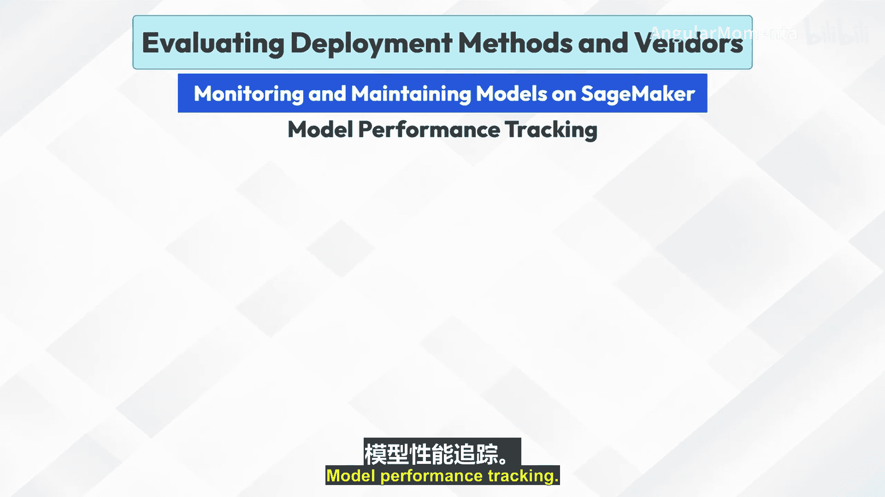

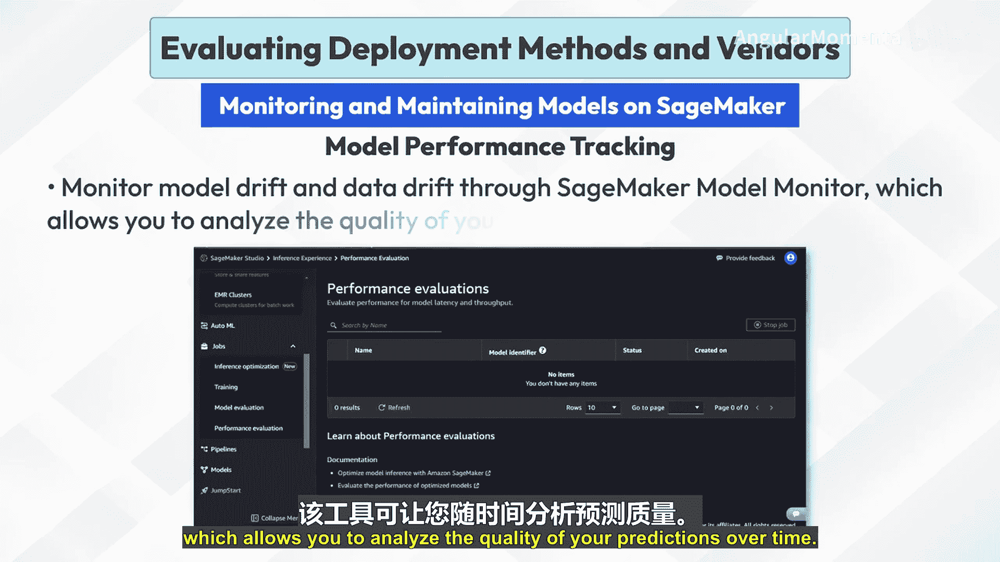

## 总结 📝

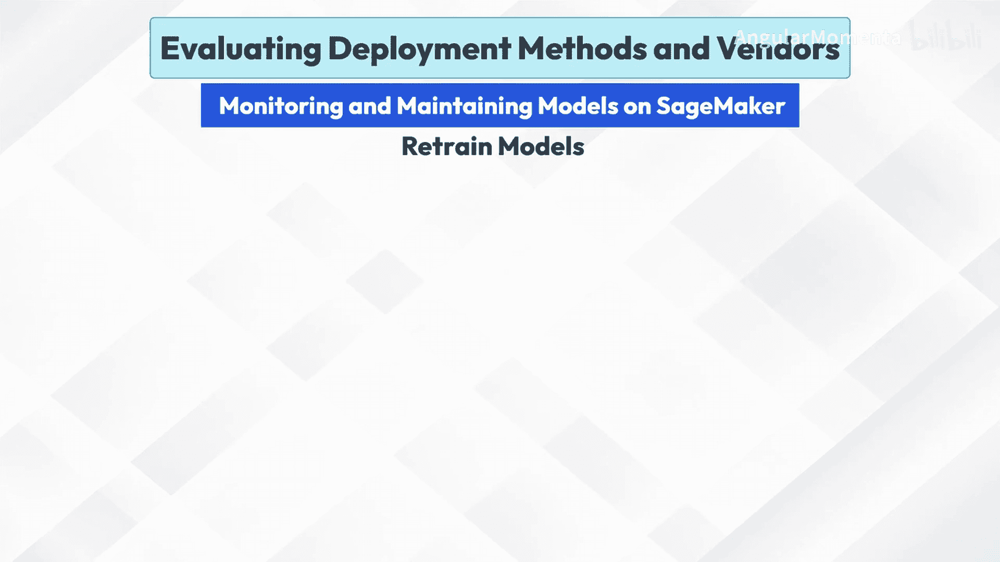

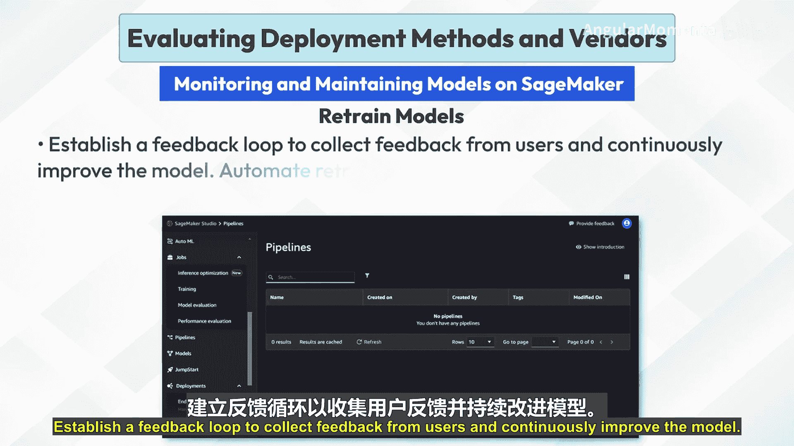

本节课中，我们一起学习了如何评估生成式AI的部署方法与供应商，并重点深入了解了AWS SageMaker这一全托管服务平台。我们探讨了SageMaker的核心功能，包括数据准备、模型训练、部署和监控。接着，我们分步讲解了如何设置SageMaker环境，以及如何将训练好的生成式AI模型部署到SageMaker上进行实时或批量推理。最后，我们强调了模型部署后监控与维护的重要性，并介绍了SageMaker提供的相关工具。掌握这些知识，是确保你的AI应用从研究成功走向实际生产环境的关键一步。