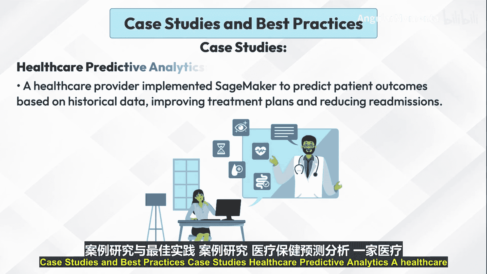
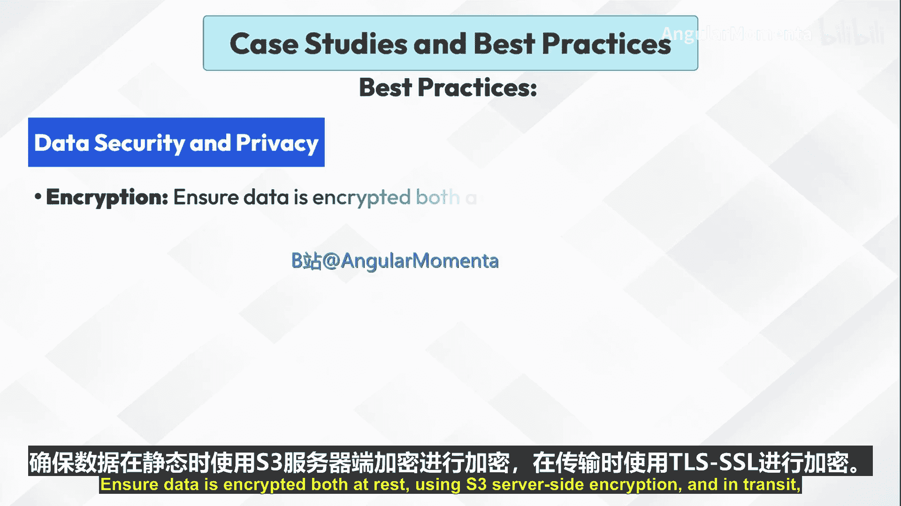
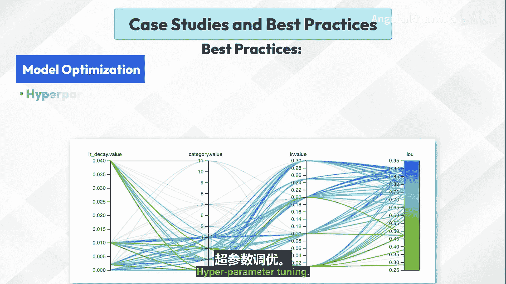
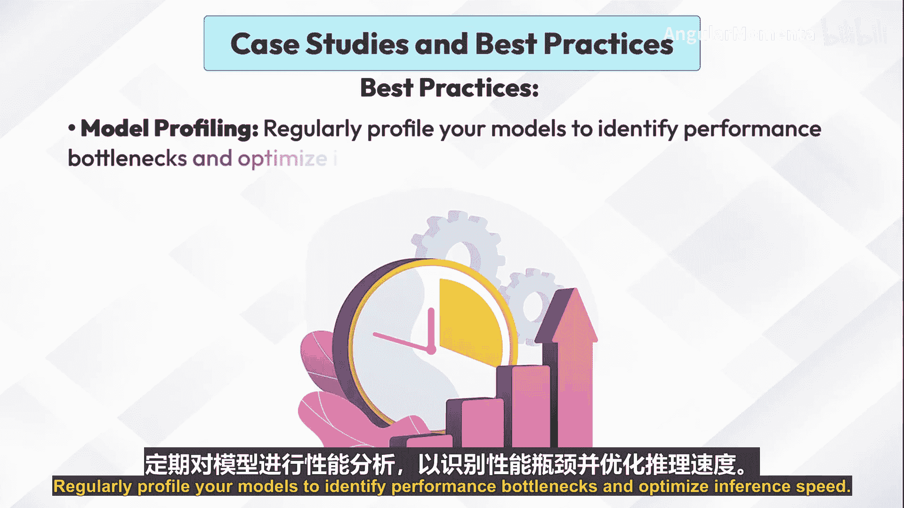
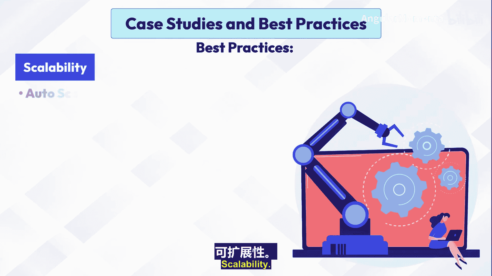
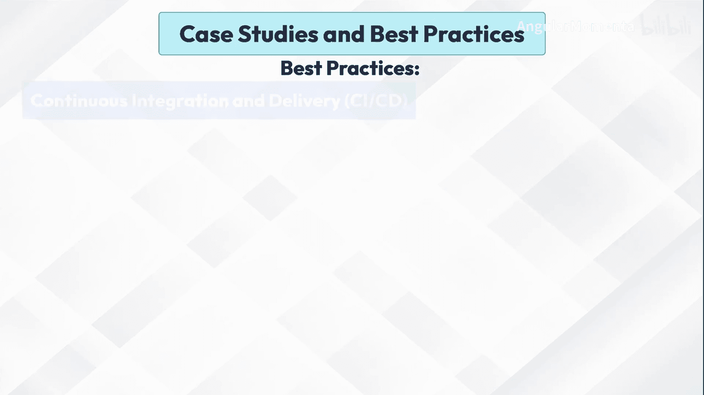
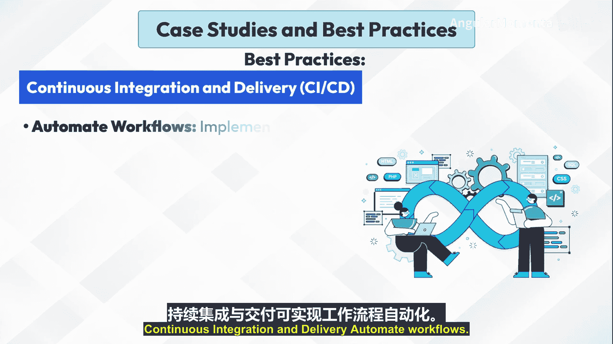
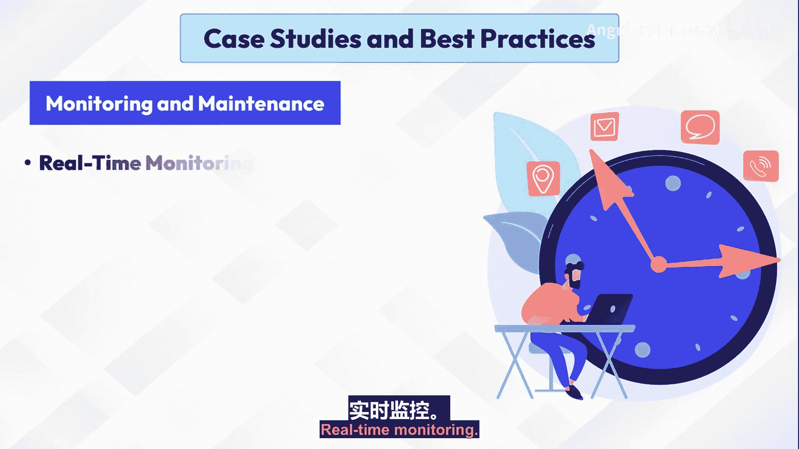
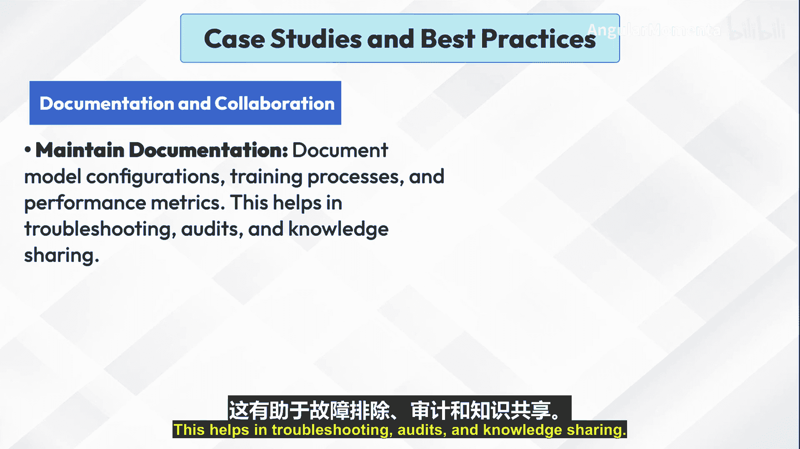

# 005：案例研究与最佳实践 🧠

在本节课中，我们将通过具体的行业案例来了解生成式AI的实际应用，并学习一系列确保项目成功部署与高效运行的最佳实践。我们将重点关注两个案例，并深入探讨从数据安全到模型维护的完整生命周期管理策略。

## 案例研究

以下是两个不同行业应用Amazon SageMaker的成功案例。

### 医疗健康预测分析

一家医疗服务提供商实施了SageMaker，基于历史数据预测患者的治疗结果。这一应用优化了治疗方案，并显著降低了患者的再入院率。

### 电子商务推荐系统

一家电子商务企业利用SageMaker构建了能够适应用户行为的推荐算法。该系统的部署显著提升了网站的转化率。

## 最佳实践

上一节我们看到了SageMaker在不同场景下的成功应用。本节中，我们将系统性地学习确保这些项目成功部署与持续运行的核心最佳实践。

### 数据安全与隐私

保护数据是机器学习项目的基石。以下是关键的安全措施：

*   **加密**：确保数据在静态存储（使用S3服务器端加密）和传输过程中（使用TLS/SSL）均被加密。
*   **访问控制**：实施严格的IAM策略来控制对数据和SageMaker资源的访问。遵循最小权限原则，并定期审查权限设置。

### 模型优化

构建高性能模型需要精细的调优。以下是优化模型的关键步骤：

*   **超参数调优**：使用SageMaker的自动化超参数调优功能来寻找最佳的模型配置。利用SageMaker内置的算法进行高效调优。
*   **模型性能剖析**：定期剖析模型，以识别性能瓶颈并优化推理速度。

### 可扩展性

为了应对变化的业务需求，系统必须具备弹性伸缩能力。

*   **自动扩缩容**：利用SageMaker的自动扩缩容功能来处理变化的工作负载，并优化资源使用。根据流量和需求调整端点实例类型和自动扩缩策略。
*   **实例选择**：根据模型的复杂度和所需的计算能力，选择合适的实例类型。

### 持续集成与持续交付

自动化工作流能极大提升开发与部署效率。

*   **自动化工作流**：为模型训练、测试和部署实施CI/CD流水线。使用SageMaker Pipelines来管理端到端的机器学习工作流。
*   **版本控制**：对模型工件、代码和配置进行版本控制，以确保可复现性，并在需要时便于回滚。

### 监控与维护

模型部署后，持续的监控与更新至关重要。

*   **实时监控**：使用CloudWatch和SageMaker Model Monitor来跟踪模型性能、延迟和数据质量。为异常或性能问题设置警报。
*   **定期更新**：使用新数据定期重新训练模型，以适应不断变化的模式并保持准确性。以最小化中断的方式更新模型版本并进行部署。

### 文档与协作

良好的文档和团队协作是项目长期成功的保障。

*   **维护文档**：记录模型配置、训练过程和性能指标。这有助于故障排除、审计和知识共享。
*   **促进协作**：利用SageMaker Studio的协作功能，实现基于团队的模型开发和评审。在团队内有效地共享笔记本和站点。

## 总结

本节课中，我们一起学习了生成式AI在医疗和电商领域的实际应用案例，并系统性地探讨了从数据安全、模型优化、系统可扩展性到自动化部署、持续监控及团队协作的全套最佳实践。掌握这些策略，将帮助你更稳健、高效地集成和部署人工智能解决方案。