# 006：AWS Bedrock 服务入门 🚀

在本节课中，我们将要学习 AWS Bedrock 服务。AWS Bedrock 是一项旨在简化基础模型（特别是生成式 AI 模型）部署和管理的服务。Bedrock 提供了一套来自领先 AI 公司（如 Anthropic、Stability AI 等）的预训练模型，以及用于大规模定制和部署这些模型的工具。

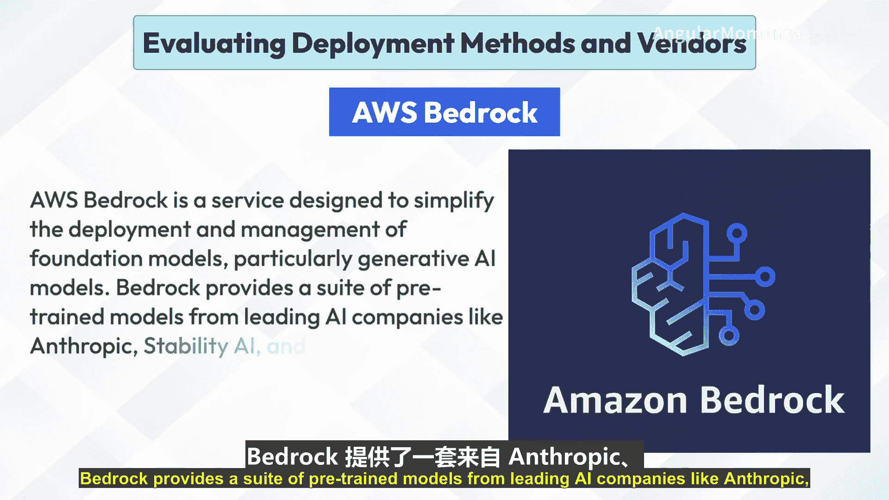

## AWS Bedrock 核心特性

AWS Bedrock 的关键特性包括：

*   **预训练基础模型**：提供用于文本生成、图像生成等多种应用场景的先进模型。
*   **定制与微调**：提供工具，允许用户使用自己的数据定制模型，以更好地适应特定用例。
*   **可扩展部署**：能够轻松部署和扩展模型。
*   **与 AWS 服务集成**：可与 S3、Lambda 和 CloudWatch 等其他 AWS 服务无缝集成，以增强功能和监控能力。

上一节我们介绍了 AWS Bedrock 的核心特性，本节中我们来看看如何为生成式 AI 模型设置 Bedrock。

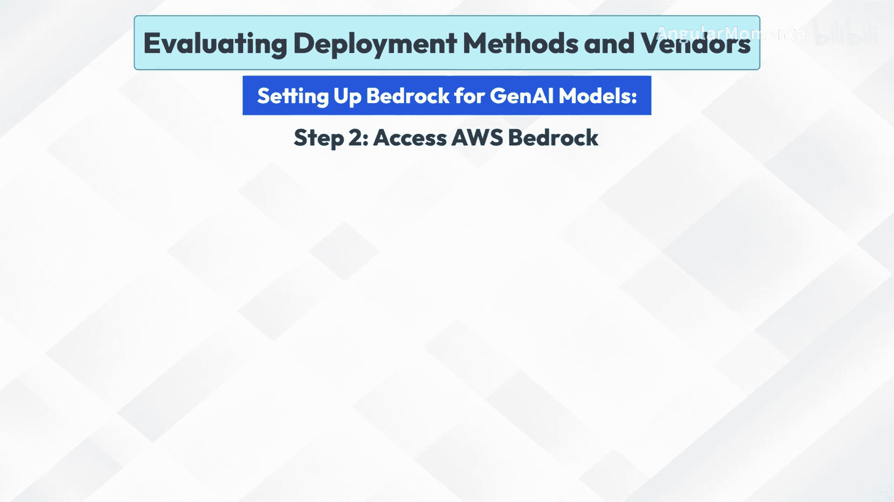

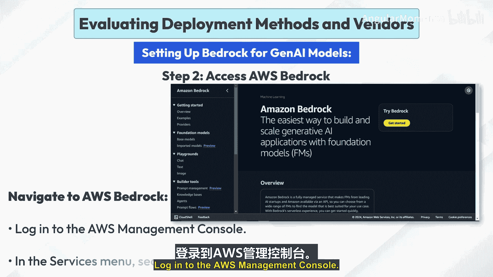

## 为生成式 AI 模型设置 Bedrock

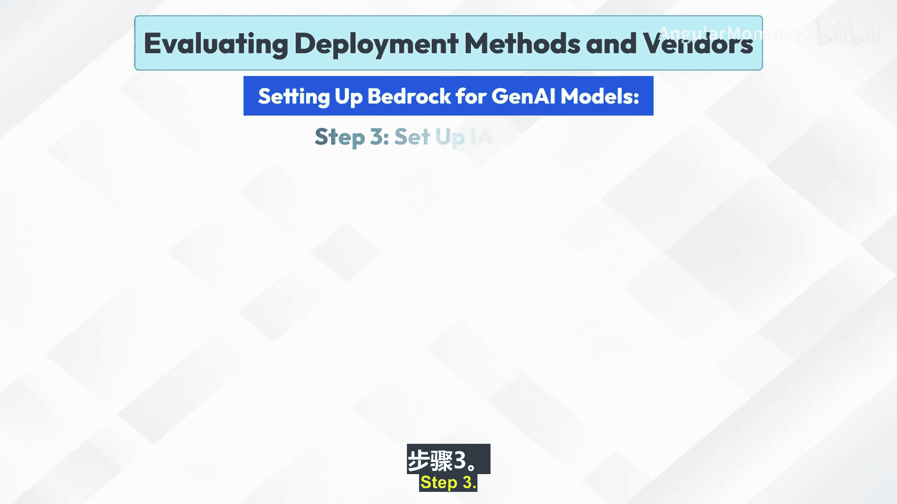

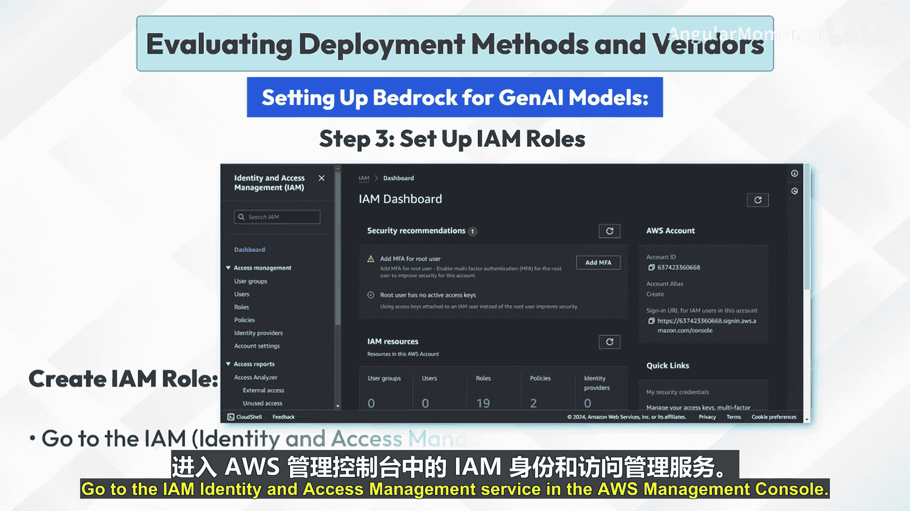

以下是设置 Bedrock 的详细步骤。

### 步骤 1：创建 AWS 账户

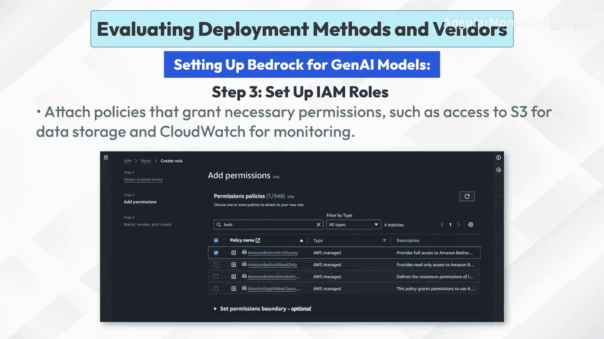

如果您没有 AWS 账户，请前往 AWS 官方网站进行注册。注册时需要提供必要的详细信息，如电子邮件地址、密码和联系信息。

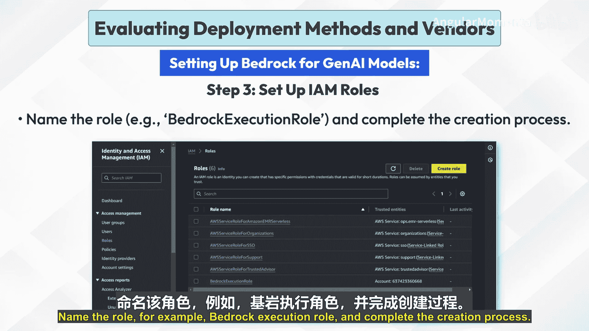

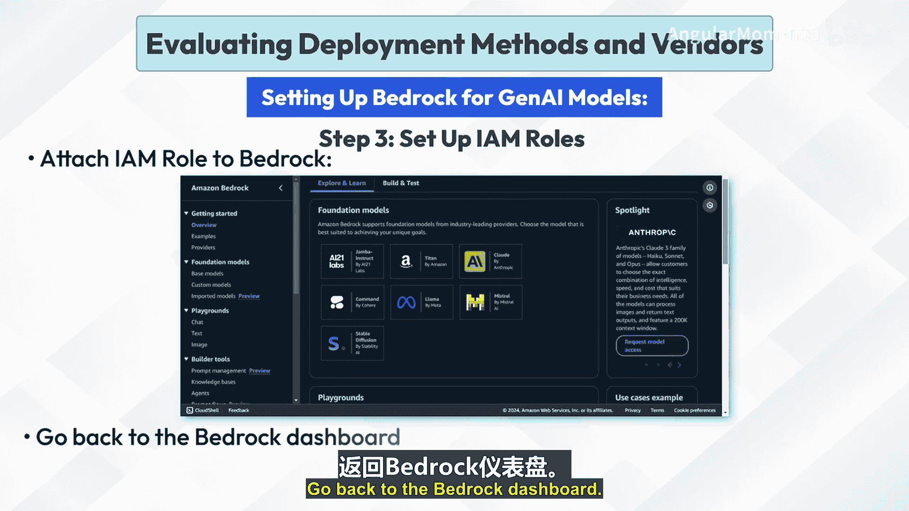

### 步骤 2：访问 AWS Bedrock

登录 AWS 管理控制台。在服务菜单中搜索“Bedrock”并选择它。

### 步骤 3：设置 IAM 角色

IAM（身份和访问管理）角色用于授予 Bedrock 必要的权限。

1.  **创建 IAM 角色**：在 AWS 管理控制台中，导航到 IAM 服务。在侧边栏中点击“角色”，然后点击“创建角色”。选择“AWS 服务”作为可信实体类型，并选择“Bedrock”作为将使用此角色的服务。
2.  **附加策略**：附加授予必要权限的策略，例如访问 S3 进行数据存储和访问 CloudWatch 进行监控的权限。
3.  **命名角色**：为角色命名（例如 `bedrock-execution-role`），并完成创建过程。
4.  **将 IAM 角色附加到 Bedrock**：返回 Bedrock 仪表板，在设置 Bedrock 资源时，附加先前创建的 IAM 角色。

### 步骤 4：选择预训练模型

在 Bedrock 仪表板中浏览可用模型。导航到列出预训练模型的部分。查看可用模型的描述和规格，以找到适合您应用程序的模型（例如，文本生成、图像生成）。点击模型进行选择，这将打开一个详细视图，您可以查看有关模型功能、训练数据和用例的更多信息。

### 步骤 5：准备定制数据

为了定制模型，您需要准备数据。

1.  **将数据上传到 S3**：在 AWS 管理控制台中转到 S3 服务。创建一个新存储桶或选择一个现有存储桶，将您的数据文件上传到此存储桶。
2.  **数据格式化**：确保您的数据已按照您要定制的模型要求进行清理和预处理。常见格式包括 CSV、JSON 或 Parquet。如果必要，请为数据添加标签，特别是在有监督学习任务中。

### 步骤 6：定制模型

现在，我们可以开始定制模型以更好地适应特定任务。

1.  **启动定制**：在 Bedrock 仪表板中，选择要定制的模型。选择定制或微调模型的选项。
2.  **提供微调数据**：指定您之前上传的 S3 存储桶和数据文件。
3.  **配置参数**：配置微调所需的任何必要参数，例如学习率、训练轮数、批次大小等。
4.  **启动定制过程**：启动定制作业并监控其进度。此过程可能需要一些时间，具体取决于数据大小和模型复杂度。
5.  **验证定制**：定制完成后，使用验证数据集验证微调模型的性能。如果需要，进行调整并重复微调过程。

### 步骤 7：选择部署配置

在部署模型之前，需要配置部署环境。

1.  **选择实例类型**：在 Bedrock 仪表板中，根据模型的计算要求和预期流量负载选择合适的实例类型。AWS 提供了针对不同工作负载优化的多种实例类型。
2.  **定义端点**：设置模型将部署到的端点。这将是您的应用程序与模型交互的接口。配置端点名称、扩缩选项和安全参数等设置。

### 步骤 8：部署模型

配置完成后，即可部署模型。

1.  **启动部署**：从 Bedrock 仪表板启动部署过程。监控部署状态，确保端点变为活动状态。
2.  **测试部署**：向已部署的模型端点发送示例请求以验证其性能。检查延迟、准确性和任何可能的错误。
3.  **与应用程序集成**：从 Bedrock 控制台获取端点 URL。将此 URL 集成到您的应用程序代码中以发送推理请求。这通常涉及向端点发送带有输入数据的 HTTP POST 请求。确保您的应用程序能正确处理响应和错误。

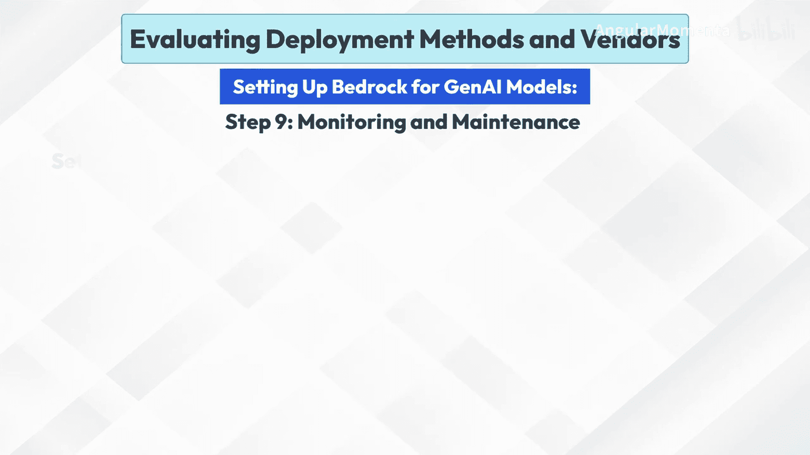

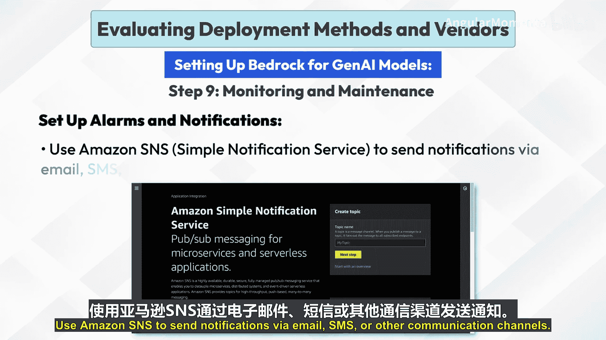

### 步骤 9：监控与维护

部署后，持续的监控至关重要。

1.  **启用日志记录**：设置日志记录以捕获有关模型推理和端点性能的详细信息。使用 AWS CloudWatch Logs 存储和分析日志数据。配置日志组和日志流以有效组织日志。
2.  **监控性能**：使用 AWS CloudWatch 监控关键性能指标，如延迟、吞吐量、错误率和实例利用率。创建仪表板以可视化这些指标，并设置警报以在超过特定阈值时接收通知。
3.  **设置警报和通知**：配置 CloudWatch 警报，以根据特定条件（例如高错误率或延迟超过可接受限制）触发通知。使用 Amazon SNS（简单通知服务）通过电子邮件、短信或其他通信渠道发送通知。

### 步骤 10：自动扩缩配置

为了应对流量变化，需要配置自动扩缩。

1.  **定义自动扩缩策略**：设置自动扩缩，以根据流量负载自动调整实例数量。定义指定添加或删除实例条件的扩缩策略。例如，可以在 CPU 利用率超过 70% 时扩展，在低于 30% 时缩减。
2.  **配置扩缩操作**：为您的部署指定最小和最大实例数。设置冷却期以防止可能导致不稳定的快速扩缩操作。
3.  **测试自动扩缩**：模拟流量以确保自动扩缩策略按预期工作。监控系统如何响应不同的负载进行扩缩，并根据需要调整策略。

### 步骤 11：维护与更新

长期维护是保证服务稳定性的关键。

1.  **定期模型重新训练**：定期使用新数据重新训练模型，以保持其准确性和相关性。使用 Bedrock 的定制工具更新模型，并以最短的停机时间部署新版本。
2.  **端点管理**：通过监控端点性能并根据需要进行调整来管理端点。停用不再使用的端点以节省成本。
3.  **成本管理**：使用 AWS Cost Explorer 监控您的使用情况和成本。优化资源分配以平衡性能和成本。这可能涉及选择不同的实例类型、调整自动扩缩策略或优化模型以减少资源消耗。

## 最佳实践

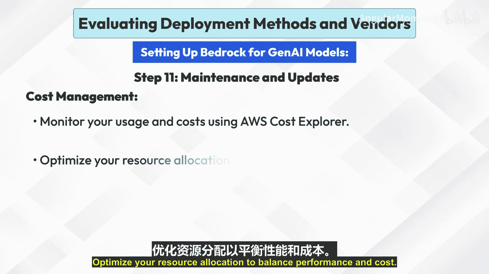

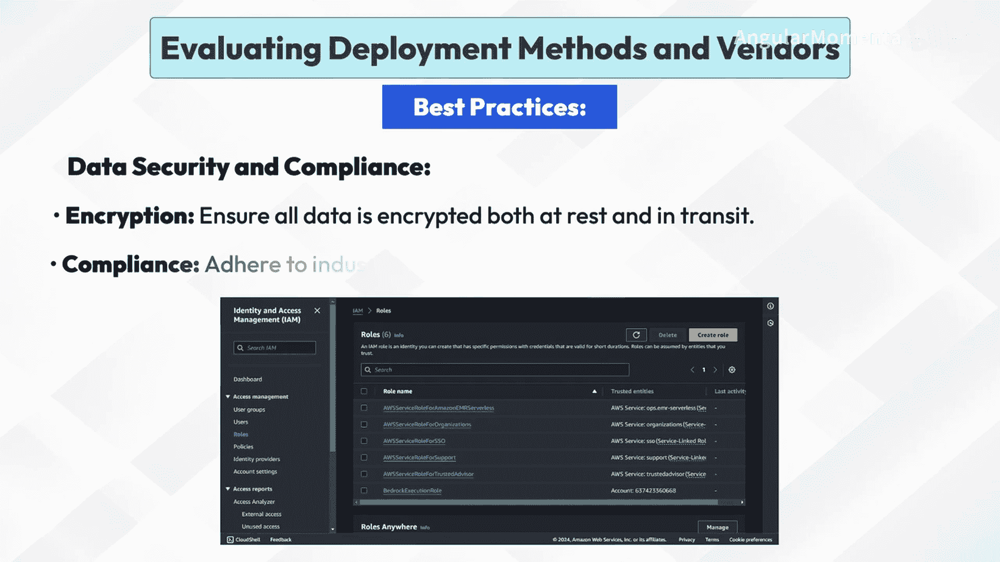

遵循最佳实践可以确保部署的健壮性和效率。

*   **数据安全与合规性**
    *   **加密**：确保所有数据在静态和传输过程中都经过加密。
    *   **合规性**：遵守行业特定的法规和标准，例如 GDPR、HIPAA。
*   **模型优化**
    *   **微调**：定期使用新的相关数据微调模型。
    *   **性能调优**：优化模型配置以获得更好的性能和更低的延迟。
*   **可扩展性与灵活性**
    *   **自动扩缩**：利用自动扩缩来处理峰值负载。
    *   **灵活的架构**：设计您的部署架构，使其灵活且易于根据不断变化的需求进行调整。
*   **持续集成与部署**
    *   **自动化流水线**：使用 CI/CD 流水线自动化模型训练、测试和部署。
    *   **版本控制**：维护模型的版本控制，以跟踪更改并在需要时方便回滚。
*   **监控与反馈循环**
    *   **实时监控**：设置全面的监控，以便及时发现和解决问题。
    *   **反馈循环**：实施反馈机制，根据真实世界数据持续改进模型性能。

## 总结

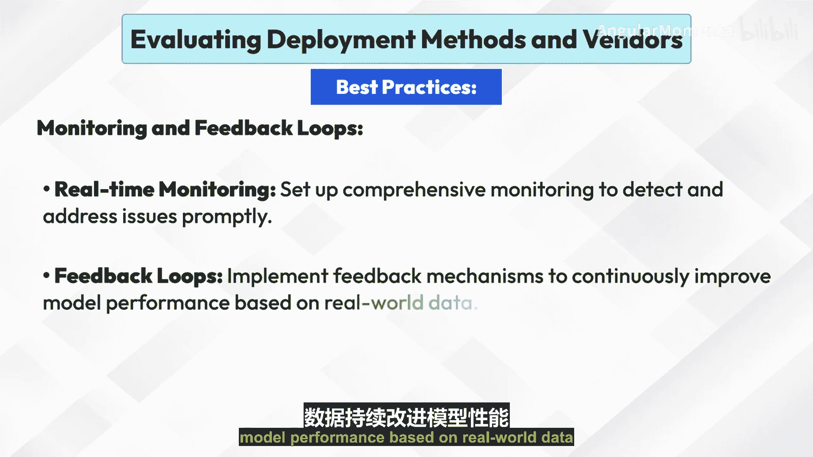

本节课中我们一起学习了 AWS Bedrock 服务。我们从其核心特性开始，详细介绍了从账户创建、IAM角色设置、模型选择与定制，到部署配置、监控维护以及自动扩缩的完整流程。最后，我们还探讨了确保服务安全、高效、可扩展的一系列最佳实践。通过掌握这些内容，您将能够利用 AWS Bedrock 有效地部署和管理生成式 AI 模型。