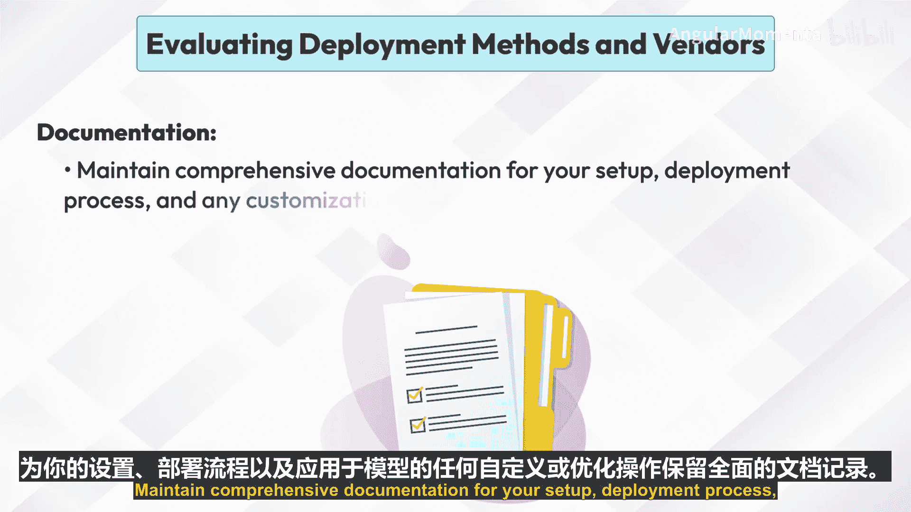

# 007：Anthropic AI 本地部署指南 🚀

在本节课中，我们将学习如何为 Anthropic 的生成式 AI 模型设置本地开发与部署环境。我们将从了解 Anthropic 公司及其模型特点开始，逐步介绍硬件软件准备、环境搭建、模型部署以及后续管理的最佳实践。

---

## 概述

Anthropic 是一家专注于 AI 安全与研究的公司，致力于开发可解释、可靠且可控的 AI 系统。其模型以顶尖性能、高安全性和灵活性著称。要在本地部署这些模型，需要完成环境配置、模型加载和推理流程搭建等一系列步骤。

---

## Anthropic 公司简介

Anthropic 是一家由前 OpenAI 研究人员创立的 AI 安全与研究公司。其核心目标是应对高级 AI 带来的挑战与风险，通过在模型中优先考虑安全性和对齐性，确保 AI 系统的部署有益且安全。

Anthropic AI 模型的关键特性包括：
*   **顶尖性能**：能够生成连贯且上下文相关文本的高质量语言模型。
*   **伦理 AI**：强调安全性、可靠性以及与伦理准则的对齐。
*   **灵活性**：模型可以针对特定用例进行适配和微调。

---

## 设置本地环境

上一节我们介绍了 Anthropic 及其模型特点，本节中我们来看看如何为部署这些模型准备本地环境。这主要涉及满足硬件和软件两方面的要求。

### 硬件要求

确保本地机器拥有充足的计算资源。大型 AI 模型通常需要强大的 CPU 或 GPU、充足的内存和存储空间。

以下是推荐的硬件规格：
*   **CPU**：多核处理器。
*   **GPU**：至少一块高性能 GPU（需兼容 NVIDIA CUDA）。
*   **内存**：16 GB 或更多 RAM。
*   **存储**：充足的磁盘空间，建议使用 SSD。

### 软件要求

以下是部署所需的基础软件环境：
*   **操作系统**：Linux（如 Ubuntu 20.04 或更高版本），或带有 WSL2 的 Windows。
*   **Python**：确保安装 Python 3.8 或更高版本。建议使用 `pyenv` 等包管理器来管理不同 Python 版本。
*   **CUDA 和 cuDNN**：用于 GPU 加速。需安装 NVIDIA CUDA 工具包和 cuDNN 库。

### 环境搭建与依赖安装

完成基础软件安装后，需要创建隔离的环境并安装必要的依赖库。

以下是环境搭建的具体步骤：
1.  **创建虚拟环境**：使用 `venv` 或 `conda` 创建虚拟环境以管理依赖。
    ```bash
    python -m venv anthropic-env
    source anthropic-env/bin/activate  # Linux/macOS
    # 或
    .\anthropic-env\Scripts\activate  # Windows
    ```
2.  **安装依赖**：安装必要的库和框架，例如 PyTorch、TensorFlow 以及 Anthropic 特定的软件包。
    ```bash
    pip install torch anthropic
    ```

---

## 本地部署生成式 AI 模型

环境准备就绪后，本节我们将具体学习如何在本地部署 Anthropic 的生成式 AI 模型。

部署过程主要包含以下几个步骤：
*   **模型选择**：从 Anthropic 的模型库中选择合适的生成式 AI 模型。这可以是一个预训练的语言模型，也可以是你自己训练的定制模型。
*   **加载模型**：将选定的模型加载到你的环境中。
*   **搭建推理流程**：设置完整的推理流程，包括数据预处理、模型推理和后处理。
*   **运行推理**：执行推理流程，从模型获取预测结果。

一个简化的模型加载与推理代码示例如下：
```python
import anthropic

# 初始化客户端（需替换为你的 API 密钥）
client = anthropic.Anthropic(api_key="your-api-key")

# 调用模型进行推理
response = client.messages.create(
    model="claude-3-opus-20240229",
    max_tokens=100,
    messages=[{"role": "user", "content": "你好，请介绍一下你自己。"}]
)
print(response.content)
```

---

## 管理本地部署

成功部署模型后，有效的管理对于确保其性能与可靠性至关重要。

以下是管理本地部署的几个关键方面：
*   **资源监控**：使用如 `nvidia-smi`（用于 GPU）和 `htop`（用于 CPU 和内存）等工具监控资源使用情况。
*   **模型更新**：定期更新模型和依赖项，以获取最新的性能改进和安全补丁。
*   **日志与调试**：实施日志记录，以跟踪模型性能和问题。
*   **备份与版本控制**：使用 Git 等版本控制系统管理代码和模型版本，并定期备份模型和重要数据。

---

## 本地托管最佳实践

遵循最佳实践可以确保本地部署获得最优的性能和可靠性。

以下是一些重要的最佳实践建议：
*   **环境隔离**：使用虚拟环境或 Docker 容器来隔离依赖项，避免冲突。
*   **安全性**：实施防火墙和访问控制等安全措施，保护部署环境免受未授权访问。
*   **性能优化**：通过模型量化、剪枝等技术优化模型性能。
*   **可扩展性规划**：为可扩展性做好规划，如果本地资源不足，考虑过渡到更强大的基础设施（例如基于云的解决方案）。
*   **文档维护**：为你的环境设置、部署过程以及对模型应用的任何定制或优化维护全面的文档。

---

## 总结




本节课中，我们一起学习了 Anthropic AI 模型的本地部署全流程。我们从 Anthropic 公司的背景和模型特性开始，详细讲解了搭建本地环境所需的硬件与软件条件。接着，我们逐步完成了从模型选择、加载到运行推理的部署步骤。最后，我们探讨了部署后的管理策略以及确保系统稳定、高效运行的最佳实践。掌握这些知识，你将能够为 Anthropic 的强大生成式 AI 模型建立一个可靠的本地开发和测试环境。