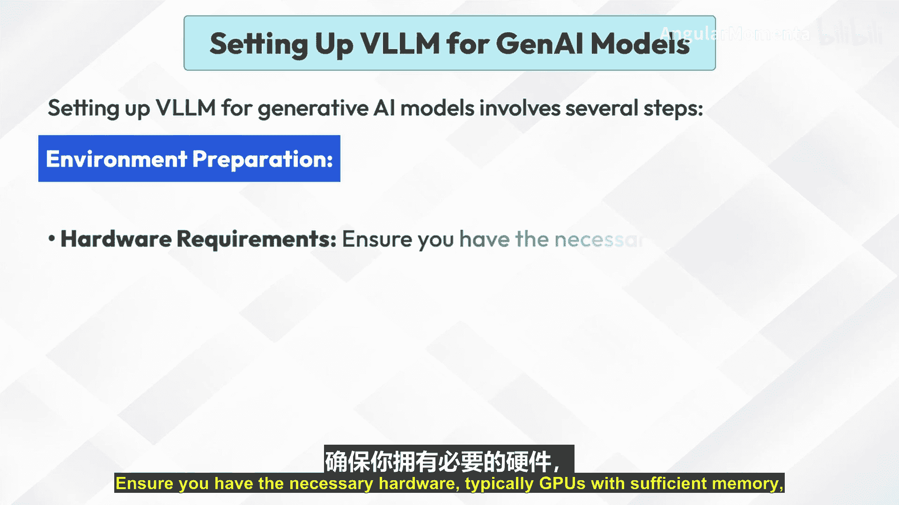
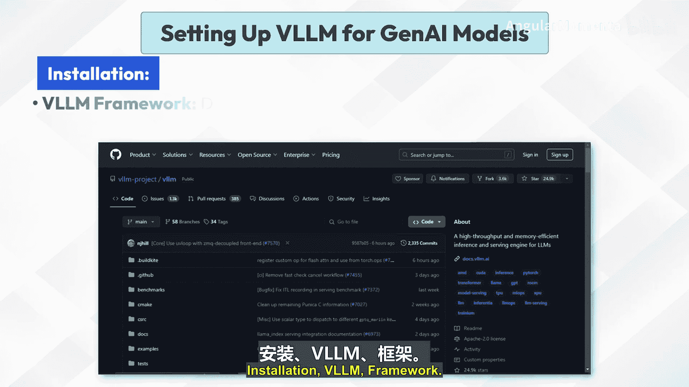
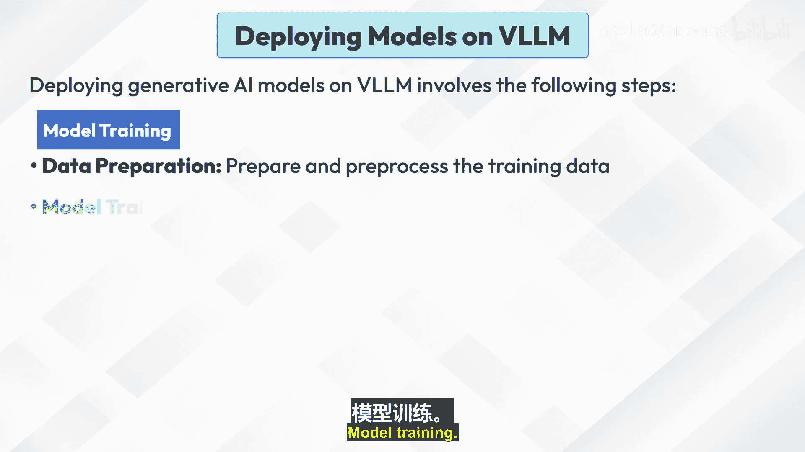
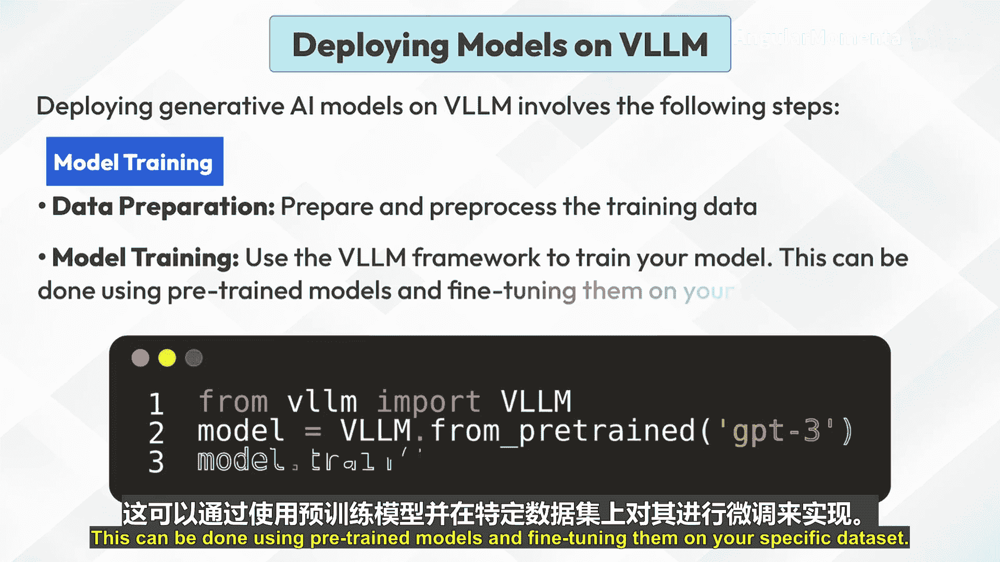
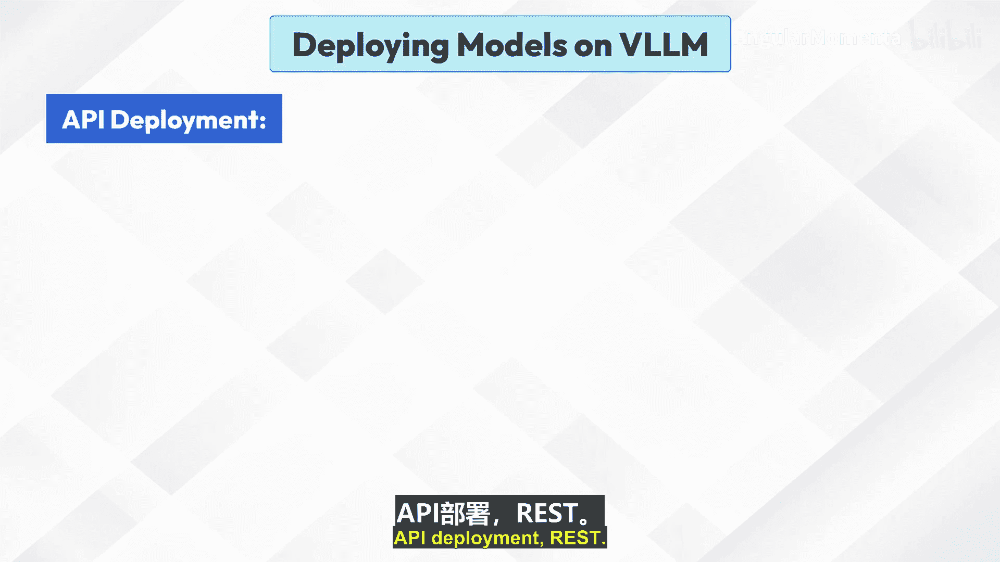
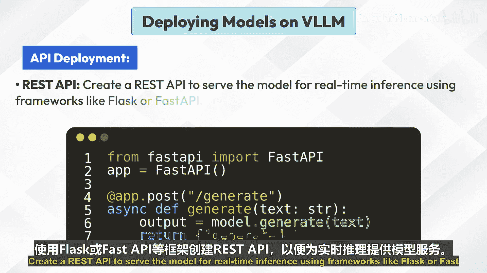
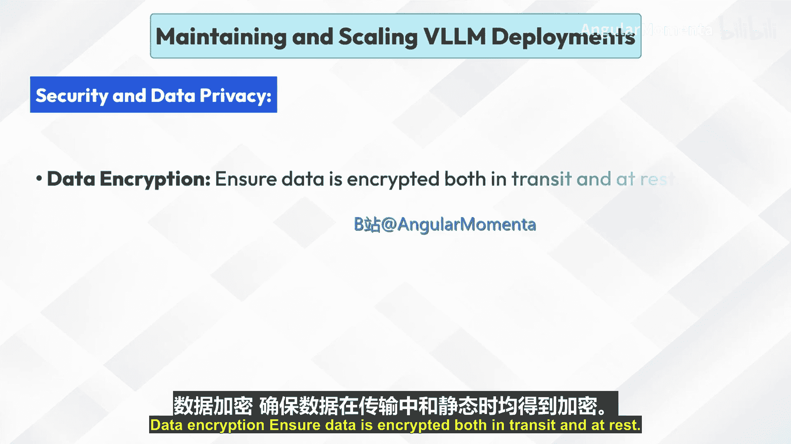

**应用生成式人工智能集成与部署策略：P08-02：vLLM 部署与管理**

在本节课中，我们将学习如何为生成式人工智能模型设置、部署和维护 vLLM 框架。vLLM 是一个专为高效处理大规模语言模型计算需求而设计的框架，支持本地和分布式部署。

---

### **概述：什么是 vLLM？** 🧠

vLLM 指的是“超大规模语言模型”。这类人工智能模型利用海量数据集和强大的计算资源来执行各种自然语言处理任务。这些模型以其理解和生成类人文本的能力而闻名，使其在聊天机器人、虚拟助手、内容生成和语言翻译等广泛应用中非常有用。

vLLM 框架旨在高效处理这些模型的计算需求，支持本地和分布式部署。这使得组织能够在利用 VLM 强大能力的同时，保持对其数据和基础设施的控制。

---

### **为生成式 AI 模型设置 vLLM** ⚙️

上一节我们介绍了 vLLM 的基本概念，本节中我们来看看如何为生成式 AI 模型设置 vLLM 环境。这个过程涉及几个关键步骤。

以下是设置 vLLM 的主要步骤：

1.  **环境准备**
    *   **硬件要求**：确保拥有必要的硬件，通常是具有足够内存的 GPU，例如 NVIDIA A100 或 V100。
    *   **依赖项**：安装必要的库和框架，例如 CUDA、cuDNN、PyTorch、TensorFlow 以及 vLLM 特定的库。

2.  **安装 vLLM 框架**
    *   从官方仓库下载并安装 vLLM 框架，或通过 `pip` 等包管理器进行安装。
    *   **代码示例**：`pip install vllm`
    *   安装模型训练和推理所需的任何额外工具，例如分词器和 transformers 库。

3.  **配置**
    *   **配置文件**：创建配置文件，指定模型参数、预训练模型的路径以及其他相关设置。
    *   **资源分配**：配置资源分配，例如 GPU 数量、内存限制和批处理大小。

---

### **在 vLLM 上部署模型** 🚀

完成环境设置后，下一步就是将生成式 AI 模型部署到 vLLM 框架上。这涉及从训练到提供服务的完整流程。

以下是在 vLLM 上部署生成式 AI 模型的步骤：

1.  **模型训练**
    *   **数据准备**：准备并预处理训练数据。
    *   **模型训练**：使用 vLLM 框架训练模型。这可以通过使用预训练模型并在特定数据上进行微调来完成。

2.  **模型推理**
    *   **加载模型**：加载训练好的模型以进行推理。
    *   **生成文本**：使用模型生成文本或执行其他 NLP 任务。

3.  **API 部署**
    *   **REST API**：创建 REST API 来为模型提供实时推理服务，可以使用 Flask 或 FastAPI 等框架。

---

### **维护与扩展 vLLM 部署** 📈

成功部署模型只是开始，为了确保服务长期稳定可靠，持续的维护和扩展策略至关重要。

以下是维护和扩展 vLLM 部署的关键方面：

1.  **监控与日志记录**
    *   **性能监控**：使用监控工具跟踪模型性能、资源利用率和延迟。
    *   **日志记录**：实施日志记录，以捕获推理请求、响应和任何错误信息。

2.  **扩展**
    *   **水平扩展**：添加更多模型实例以处理增加的负载。这可以通过使用 Kubernetes 等容器编排工具来实现。
    *   **负载均衡**：使用负载均衡器在多个实例之间分配请求。

3.  **模型更新**
    *   **重新训练**：定期使用新数据重新训练模型，以保持准确性和相关性。
    *   **版本控制**：为模型实施版本控制，以管理更新和回滚。

4.  **安全与数据隐私**
    *   **数据加密**：确保数据在传输和静态时都经过加密。
    *   **访问控制**：实施严格的访问控制措施，以保护模型和数据。

---

### **总结** ✅

本节课中，我们一起学习了 vLLM 框架的完整部署与管理流程。我们从了解 vLLM 的基本概念开始，逐步讲解了如何为生成式 AI 模型设置环境、安装和配置 vLLM 框架。接着，我们探讨了在 vLLM 上进行模型训练、推理和 API 部署的具体步骤。最后，我们强调了部署后的维护工作，包括监控、扩展、模型更新以及安全措施，这些都是确保生成式 AI 应用长期稳定、高效运行的关键。掌握这些策略，将帮助你有效地在生产环境中部署和管理大规模语言模型。