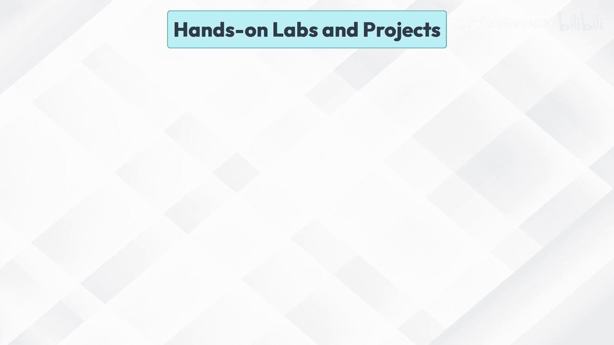
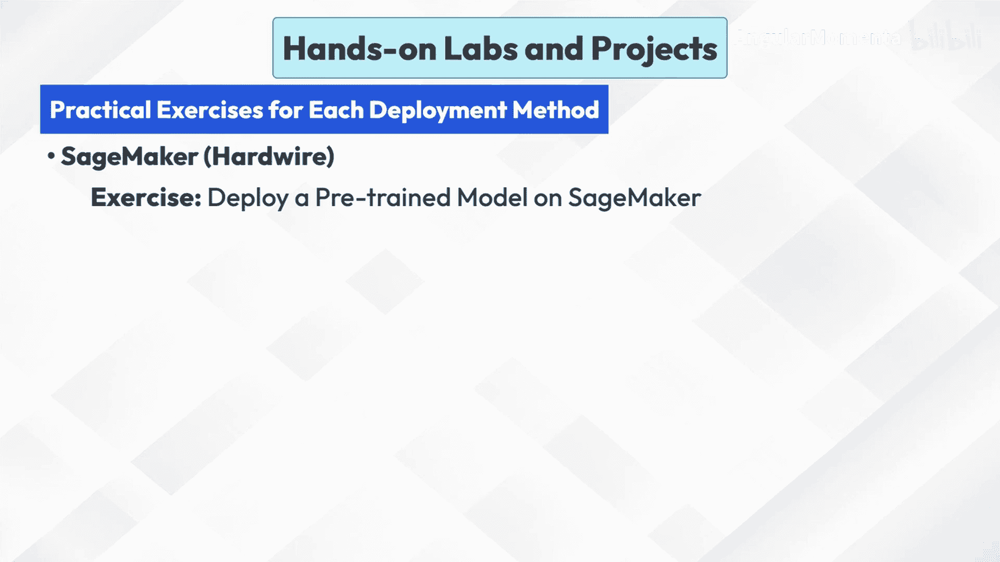
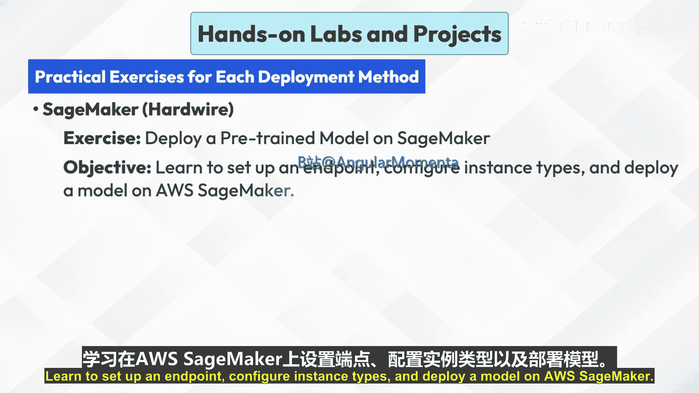
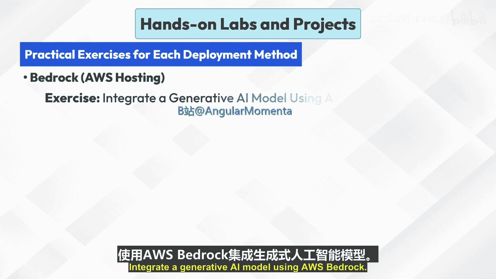
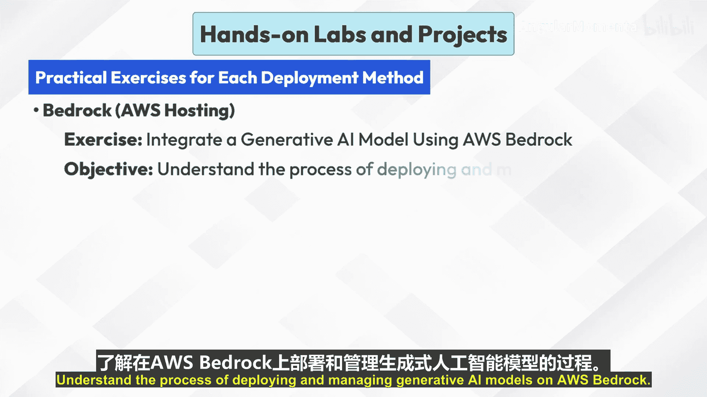
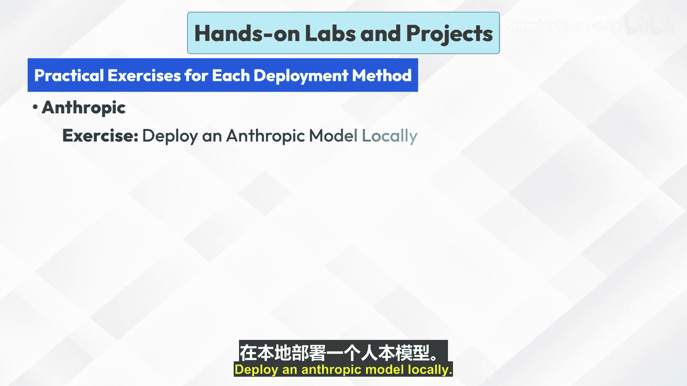
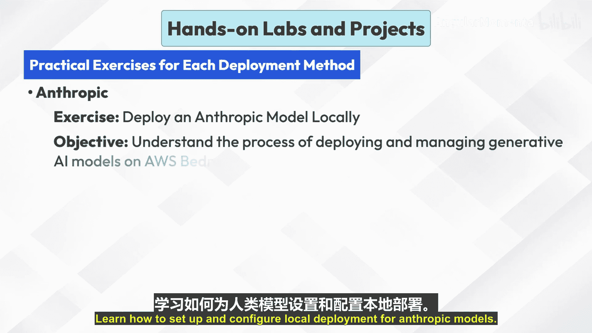
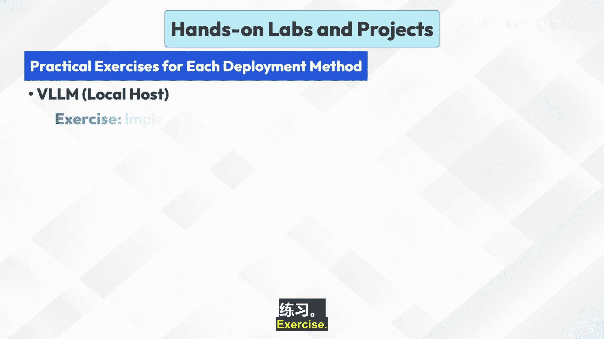
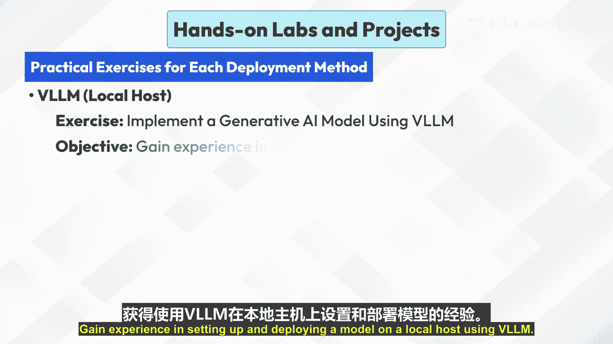

# 010：动手实验与项目 🧪

在本节课中，我们将通过一系列动手实验和项目，实践不同的生成式AI模型部署方法。我们将重点学习在AWS SageMaker、AWS Bedrock、Anthropic本地环境以及VLLM本地主机上的部署流程。每个练习都旨在帮助你掌握从环境配置到模型部署、测试和监控的核心技能。

## AWS SageMaker 部署练习 🚀

上一节我们介绍了不同的部署平台，本节中我们来看看如何在AWS SageMaker上部署一个预训练模型。

**练习目标**：学习在AWS SageMaker上设置端点、配置实例类型并部署一个预训练模型。

以下是部署的核心步骤：

1.  **创建SageMaker Notebook实例**：在AWS控制台中启动一个Notebook实例作为开发环境。
2.  **使用SageMaker SDK部署模型**：在Notebook中，利用AWS提供的SDK加载并部署你的预训练模型。
    ```python
    # 示例：使用SageMaker Python SDK部署模型
    from sagemaker.huggingface import HuggingFaceModel

    # 创建HuggingFace模型对象
    huggingface_model = HuggingFaceModel(
        model_data='s3://my-bucket/model.tar.gz',
        role='MySageMakerExecutionRole',
        transformers_version='4.26.0',
        pytorch_version='1.13.1',
        py_version='py39'
    )

    # 部署模型到端点
    predictor = huggingface_model.deploy(
        initial_instance_count=1,
        instance_type='ml.g5.2xlarge'
    )
    ```
3.  **使用样本数据测试端点**：向部署好的模型端点发送请求，确保其功能正常。
    ```python
    # 示例：调用端点进行预测
    sample_input = {"inputs": "Hello, how are you?"}
    response = predictor.predict(sample_input)
    print(response)
    ```
4.  **监控部署模型的性能和可扩展性**：利用Amazon CloudWatch等工具监控端点的延迟、调用次数和错误率，以便根据需求进行扩展。












## AWS Bedrock 部署练习 🏔️


了解了SageMaker的部署后，我们转向AWS的另一项托管服务——Bedrock，它专门用于简化基础模型的访问和使用。


**练习目标**：理解在AWS Bedrock上部署和管理生成式AI模型的流程。

以下是使用AWS Bedrock的关键步骤：



1.  **设置AWS Bedrock环境**：在AWS控制台中访问Bedrock服务，并请求启用你需要使用的模型。
2.  **将生成式AI模型部署到Bedrock**：Bedrock本身提供了一系列预置的领先模型（如来自Anthropic、AI21 Labs的模型），你无需自行托管，可直接通过API调用。
3.  **使用样本应用程序集成模型**：编写一个简单的应用程序（例如一个Python脚本），通过Bedrock的API来调用模型。
    ```python
    # 示例：使用Boto3调用Bedrock上的Claude模型
    import boto3
    import json

    bedrock_runtime = boto3.client('bedrock-runtime', region_name='us-east-1')

    body = json.dumps({
        "prompt": "\n\nHuman: 写一首关于云的诗。\n\nAssistant:",
        "max_tokens_to_sample": 300
    })

    response = bedrock_runtime.invoke_model(
        modelId='anthropic.claude-v2',
        body=body
    )
    response_body = json.loads(response['body'].read())
    print(response_body['completion'])
    ```
4.  **使用AWS Bedrock工具监控和管理模型**：通过Bedrock控制台监控使用情况、成本和性能指标。

## Anthropic 模型本地部署练习 💻

除了使用云服务，有时我们也需要在本地环境部署模型。接下来，我们学习如何本地部署Anthropic的模型。



**练习目标**：学习如何为Anthropic模型设置和配置本地部署。

以下是本地部署Anthropic模型的主要步骤：

1.  **安装必要的库和依赖项**：根据模型要求，安装Python、PyTorch或TensorFlow等框架及Anthropic提供的客户端库。
    ```bash
    pip install anthropic
    ```
2.  **配置本地环境设置**：设置API密钥、模型路径等环境变量或配置文件。
    
3.  **本地部署模型并运行样本推理**：运行模型服务，并编写代码进行文本生成测试。
    ```python
    import anthropic

    client = anthropic.Anthropic(api_key='your_api_key_here')

    message = client.messages.create(
        model="claude-3-opus-20240229",
        max_tokens=1000,
        temperature=0,
        messages=[
            {"role": "user", "content": "你好，请介绍一下你自己。"}
        ]
    )
    print(message.content)
    ```
4.  **排查常见部署问题并优化性能**：解决可能遇到的依赖冲突、内存不足等问题，并通过调整批处理大小、使用GPU加速等方式优化推理速度。

## 使用 VLLM 进行本地主机部署练习 ⚡

最后，我们探索一个高效的本地部署工具——VLLM，它特别适合大规模语言模型的快速推理。

**练习目标**：获得使用VLLM在本地主机上设置和部署模型的经验。

以下是使用VLLM部署的步骤：

1.  **使用VLLM设置本地开发环境**：安装VLLM及其依赖。
    ```bash
    pip install vllm
    ```
2.  **将VLLM库集成到项目中**：在Python脚本中导入VLLM，并加载模型。
3.  **部署生成式AI模型并使用测试用例验证其性能**：启动一个离线推理服务，并发送请求进行测试。
    ```python
    from vllm import LLM, SamplingParams

    # 加载模型
    llm = LLM(model="meta-llama/Llama-2-7b-chat-hf")

    # 准备采样参数和提示词
    sampling_params = SamplingParams(temperature=0.8, top_p=0.95)
    prompts = ["The future of AI is", "Once upon a time in a"]

    # 生成文本
    outputs = llm.generate(prompts, sampling_params)
    for output in outputs:
        print(output.outputs[0].text)
    ```
4.  **优化模型和本地环境以获得更好性能**：利用VLLM的PagedAttention等特性，以及调整硬件设置来提升吞吐量和降低延迟。
    
    


---


**本节课总结**：本节课中我们一起学习了四种生成式AI模型的部署方法。我们实践了在**AWS SageMaker**上创建端点并部署模型，探索了使用托管服务**AWS Bedrock**直接调用模型，完成了**Anthropic模型**的本地环境配置与部署，并体验了利用**VLLM**在本地主机进行高效模型推理的流程。通过这些动手练习，你应该对如何在不同环境中将AI模型投入实际应用有了更具体的认识。