# 011：你以为你了解AI部署？🤔

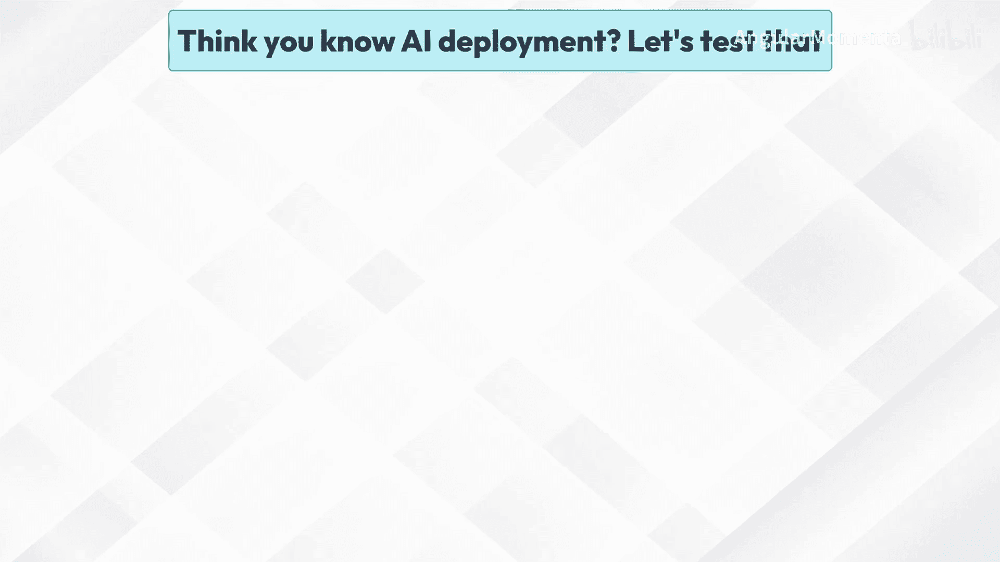

在本节课中，我们将通过一系列问答来测试你对生成式AI部署的理解。我们将回顾生成式AI的核心概念、部署挑战、集成方法、性能优化以及成本与合规性考量。通过本次学习，你将能够系统地评估和规划生成式AI模型的部署策略。

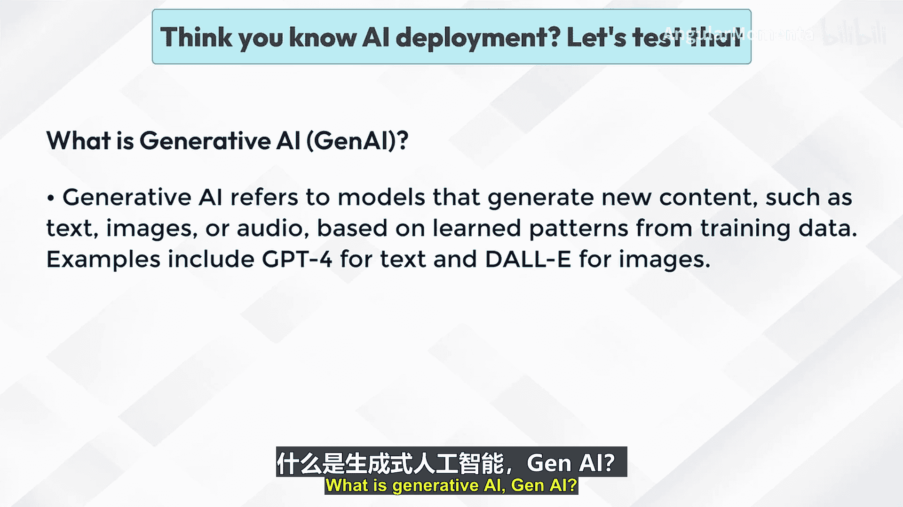

## 什么是生成式AI？🤖

生成式AI指的是能够根据从训练数据中学到的模式，生成新内容（如文本、图像或音频）的模型。例如，用于文本生成的GPT-4和用于图像生成的DALL-E。

## 生成式AI模型与其他AI模型有何不同？⚖️

生成式AI模型专注于创造新内容，而不仅仅是基于现有数据进行分类或预测结果。

## 生成式AI模型的关键组成部分是什么？🧩

关键组成部分包括：
*   **模型架构**：例如，Transformer架构。
*   **训练数据**：用于训练模型的数据集。
*   **训练算法**：用于优化模型参数的算法。
*   **超参数**：控制训练过程的参数。

## 生成式AI在行业中的常见用例有哪些？💼

常见用例包括：
*   **内容创作**：例如，写作和艺术创作。
*   **客户支持**：例如，聊天机器人。
*   **模拟**：例如，生成用于训练的合成数据。

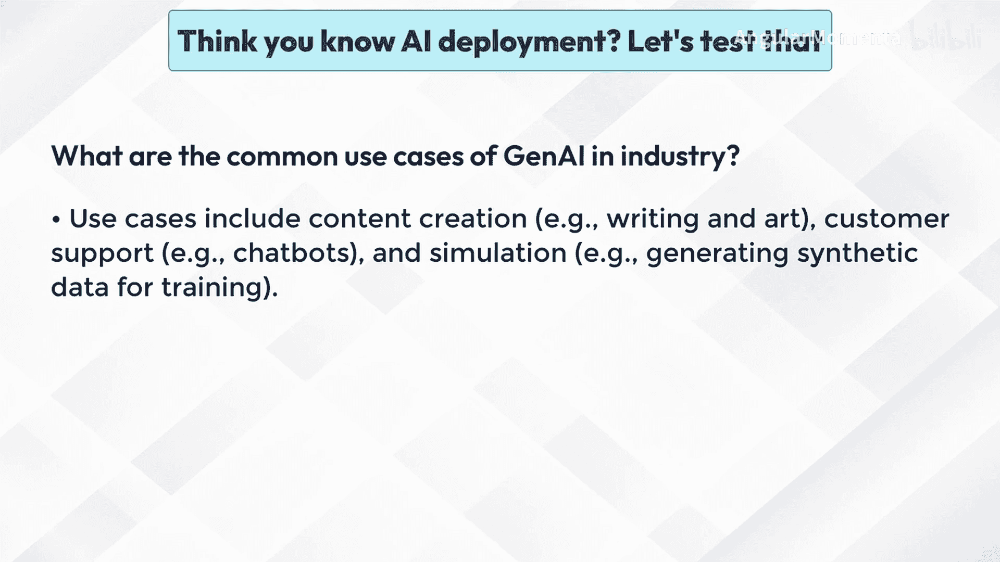

## 部署生成式AI模型面临的主要挑战是什么？🚧

挑战包括可扩展性、性能调优、数据隐私、合规性以及与现有系统的集成。

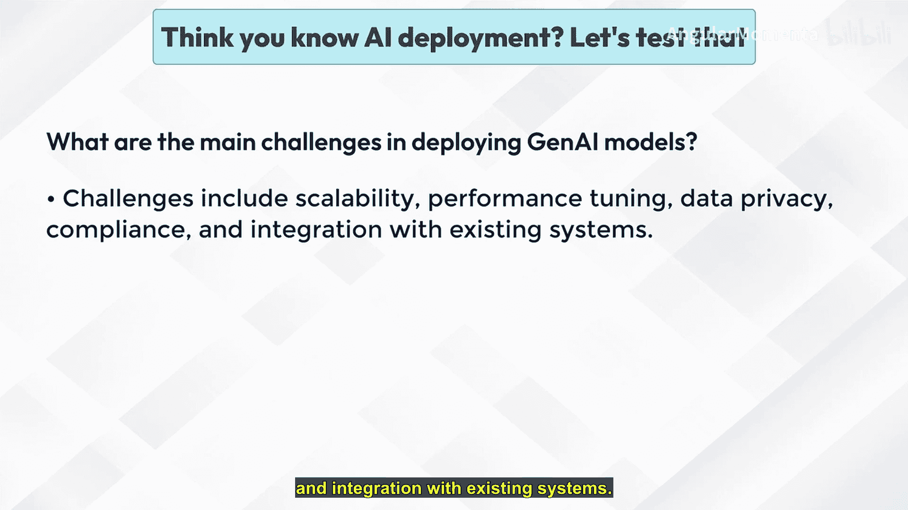

## 在生成式AI的语境中，什么是模型集成？🔗

模型集成涉及将生成式AI模型纳入现有工作流或应用程序中，以增强功能或提供新特性。

## 将生成式AI模型集成到现有系统中有哪些好处？✨

好处包括增强能力、自动化内容生成以及改善用户体验。

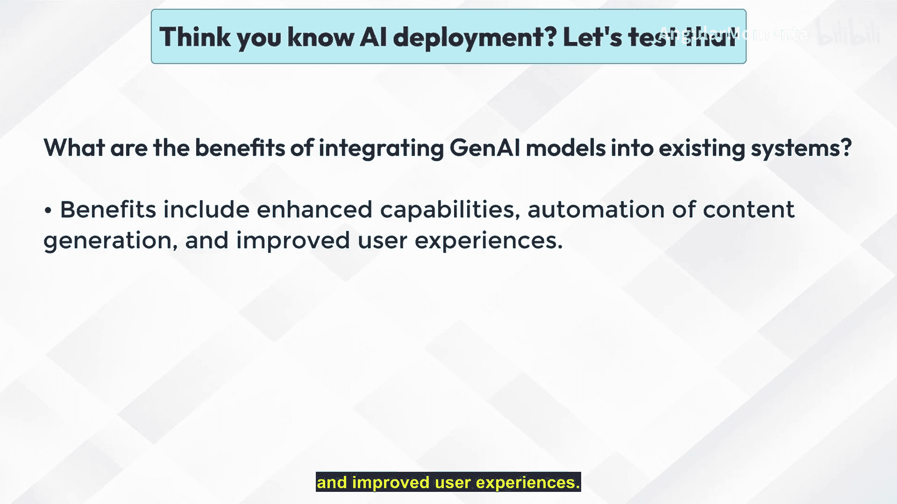

## 在部署生成式AI模型之前应考虑哪些因素？📋

因素包括模型准确性、可扩展性、性能、成本、数据隐私和合规性。

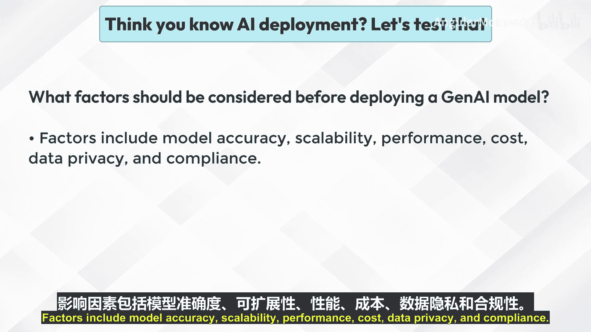

## 如何评估生成式AI模型是否准备好部署？✅

通过评估模型在验证数据上的性能、其鲁棒性以及处理现实世界数据的能力来评估准备情况。

## 数据隐私和合规性在生成式AI部署中有多重要？🔒

确保数据隐私和合规性对于保护用户数据、遵守法规和维持信任至关重要。

## 如何评估生成式AI模型的可扩展性需求？📈

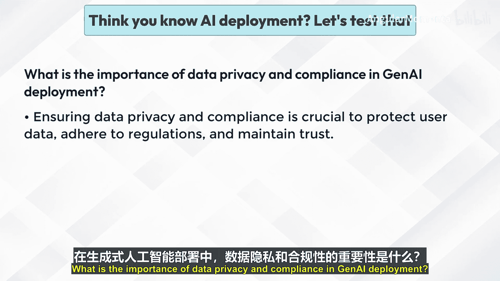

通过在各种负载下测试模型的性能，并考虑其处理不断增长的数据和用户数量的能力来评估可扩展性。

## 部署生成式AI模型有哪些成本考量？💰

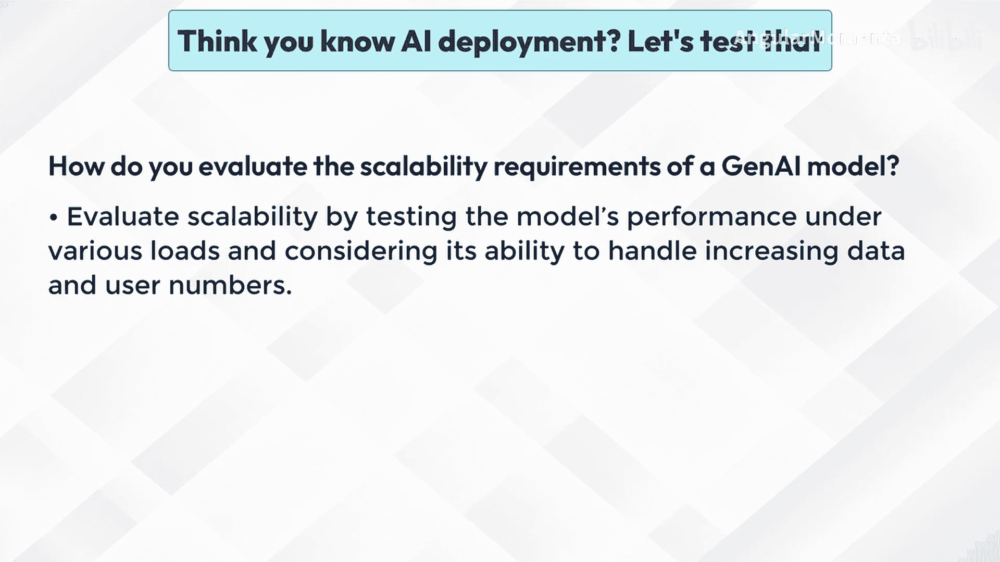

成本包括基础设施、计算资源、存储和潜在的许可费用。

## 如何确定生成式AI模型在生产环境中的预期延迟？⏱️

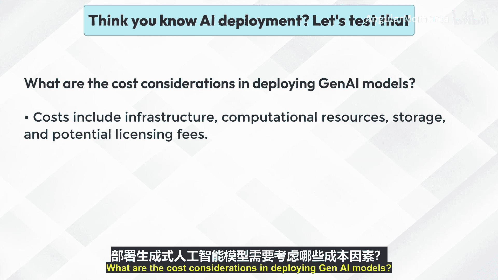

通过在现实条件下测试模型的响应时间并对其进行效率优化来衡量延迟。

## 部署生成式AI模型时有哪些安全考量？🛡️

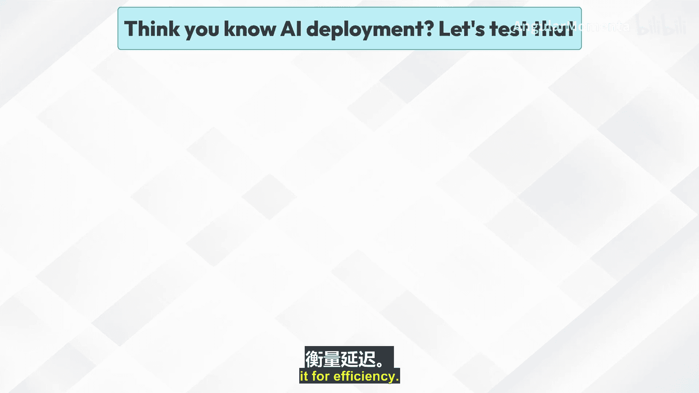

安全考量包括保护模型免受未经授权的访问、保护传输中和静态数据的安全，以及确保模型能够抵御对抗性攻击。

## 部署生成式AI模型有哪些不同的方法？🌐

方法包括基于云的部署、本地部署和混合解决方案。

## AWS SageMaker如何促进生成式AI模型的部署？☁️

AWS SageMaker为训练、调优和部署模型提供托管服务，并与其他AWS服务集成。

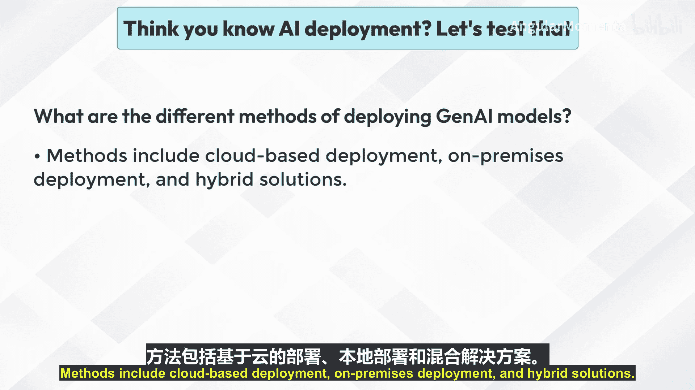

## 什么是AWS Bedrock，它如何协助托管生成式AI模型？🪨

AWS Bedrock是一项完全托管的服务，提供预构建的生成式AI模型和基础设施，使部署和扩展生成式AI应用变得更加容易。

## 如何使用Anthropic进行生成式AI模型的本地托管？🏠

Anthropic提供用于在本地运行生成式AI模型的工具和框架，提供对部署和数据隐私的控制。

## 使用VLLM进行生成式AI模型本地部署有哪些优势？⚡

VLLM提供低延迟、可扩展且能控制硬件资源的高效本地模型执行。

## 如何为生成式AI模型选择合适的部署方法？🤔

根据成本、性能、数据隐私需求、可扩展性和集成要求等因素进行选择。

## 将生成式AI模型集成到现有系统的常用技术有哪些？🔧

技术包括使用API、将模型嵌入应用程序，以及与微服务集成。

## 如何使用API集成生成式AI模型？🔌

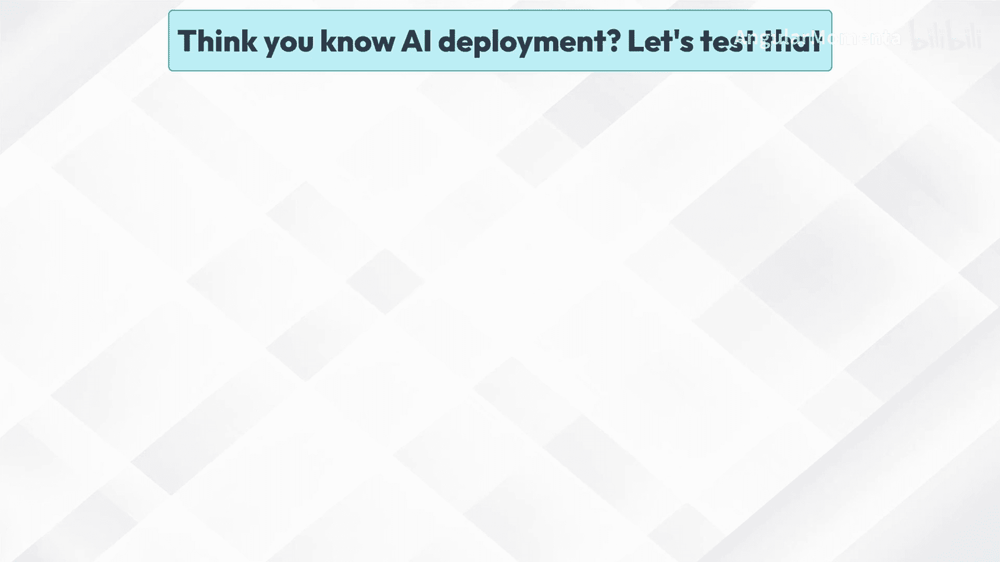

API支持生成式AI模型与其他应用程序之间的通信，从而实现无缝集成和交互。

## 微服务在生成式AI模型集成中扮演什么角色？🧩

微服务允许模块化部署和扩展生成式AI功能，便于集成和维护。

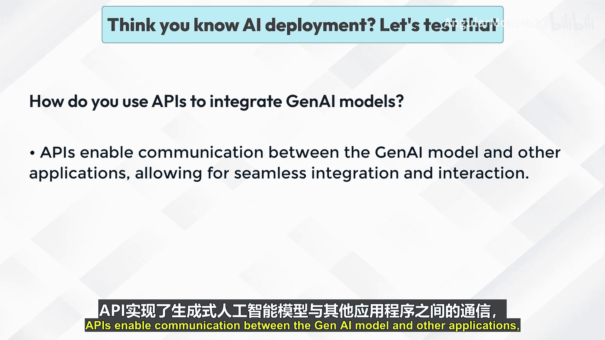

## 容器化（例如Docker）如何帮助集成生成式AI模型？📦

容器化确保不同环境间的一致性，并简化生成式AI模型的部署和扩展。

## 使用Kubernetes部署生成式AI模型有哪些好处？⚓

Kubernetes为容器化应用（包括生成式AI模型）提供自动化部署、扩展和管理。

## 如何优化已部署生成式AI模型的性能？🚀

通过调优超参数、优化代码和使用硬件加速（例如GPU）来优化性能。

## 有哪些技术可用于减少生成式AI模型的延迟？⚡

技术包括模型优化、高效数据处理和利用硬件加速器。

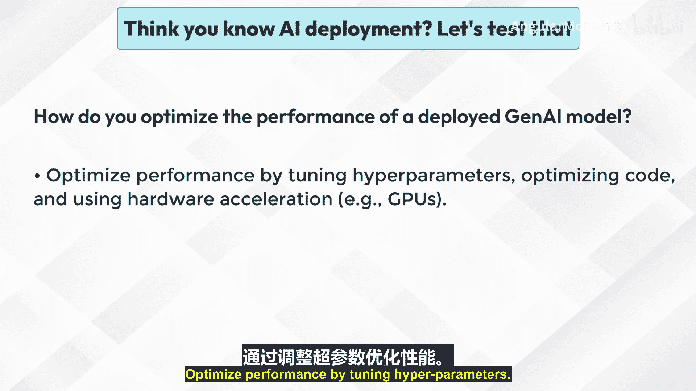

## 如何处理生成式AI模型的大规模部署？🌍

使用负载均衡、分布式计算和高效资源管理等技术来处理大规模部署。

## 有哪些方法可以监控生产环境中生成式AI模型的性能？📊

方法包括使用监控工具、分析性能指标以及为异常情况设置警报。

## 如何对生成式AI模型进行负载测试？🏋️

负载测试涉及在模型上模拟各种负载，以评估其性能并识别瓶颈。

## 部署生成式AI模型需要监控哪些关键指标？📈

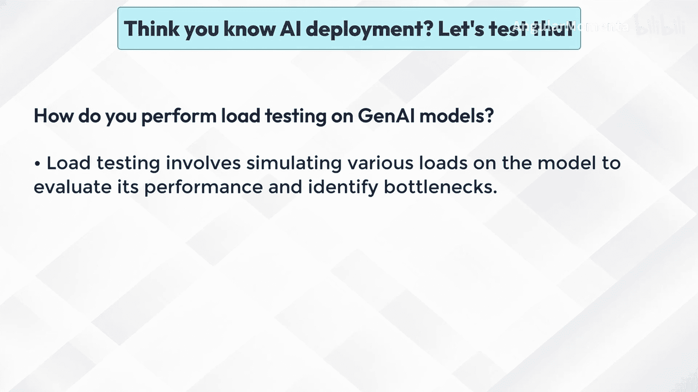

关键指标包括响应时间、准确性、资源利用率和错误率。

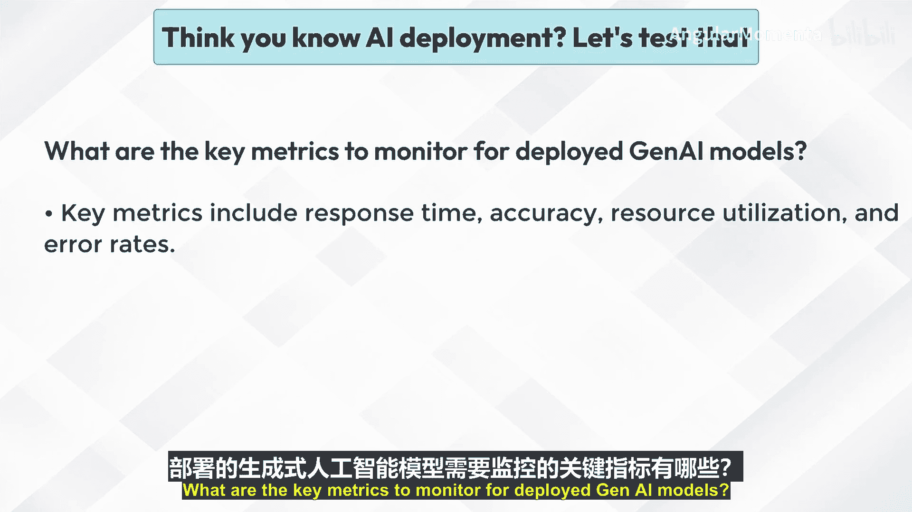

## 如何为生产环境中的生成式AI模型设置日志记录？📝

通过集成日志记录库或服务并配置它们以捕获相关数据来设置日志记录。

## 哪些工具可用于监控生成式AI模型？🔧

工具包括云监控服务（例如AWS CloudWatch）、应用性能管理工具和自定义仪表板。

## 如何处理已部署生成式AI模型中的错误和异常？⚠️

通过实施错误处理机制、记录异常情况并设置自动恢复流程来处理错误。

## 实时监控在生成式AI部署中有多重要？⏰

实时监控有助于及时发现和解决问题，确保持续的模型性能和可靠性。

## 如何确保生成式AI模型的可扩展性？📈

通过设计能够处理增加负载的模型、使用可扩展的基础设施以及优化资源使用来确保可扩展性。

## 扩展生成式AI模型有哪些挑战？🚧

挑战包括管理资源分配、保持性能以及确保成本效益。

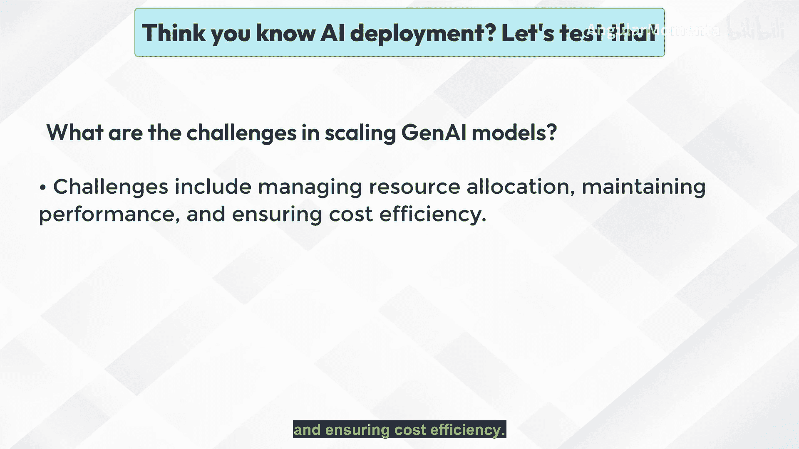

## 如何为生成式AI模型实现自动扩展？🤖

可以使用根据需求自动调整资源的云服务来实现自动扩展。

## 在云平台上扩展生成式AI模型的最佳实践是什么？☁️

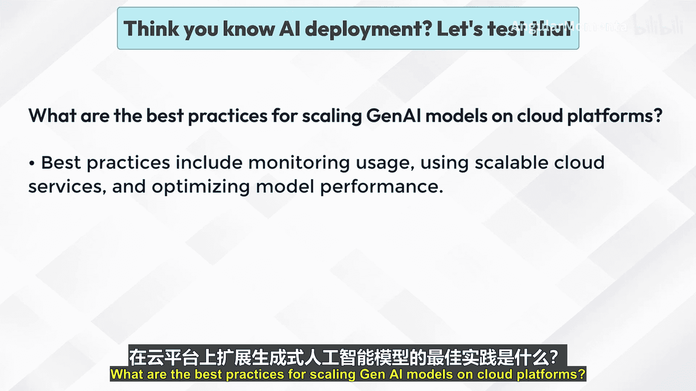

最佳实践包括监控使用情况、使用可扩展的云服务以及优化模型性能。

## 如何管理可扩展生成式AI模型的资源分配？⚙️

通过使用基于云的资源管理工具、优化资源使用并根据需求进行调整来管理资源分配。

## 生成式AI模型部署中存在哪些数据隐私问题？🔐

问题包括对敏感数据的未经授权访问、数据泄露以及遵守数据保护法规。

## 部署生成式AI模型时如何确保遵守数据保护法规？⚖️

通过实施数据保护措施、进行定期审计以及遵守相关法规（例如GDPR）来确保合规性。

## 生成式AI模型可以使用哪些技术来匿名化数据？🎭

技术包括数据掩码、聚合和假名化，以保护用户隐私。

## 如何为生成式AI模型实施数据加密？🔐

通过使用加密算法来保护静态和传输中的数据，以实施加密。

## 在生成式AI部署中维护数据隐私的最佳实践是什么？🛡️

最佳实践包括使用加密、匿名化数据以及遵守数据保护法规。

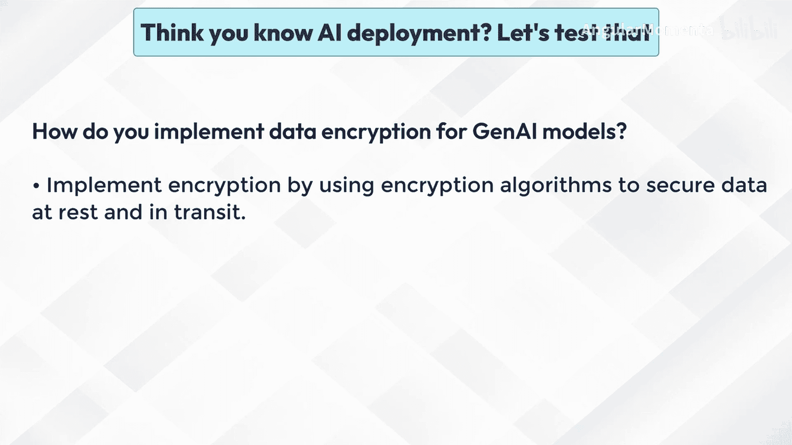

## 如何管理与部署生成式AI模型相关的成本？💰

通过优化资源使用、使用具有成本效益的基础设施以及监控支出来管理成本。

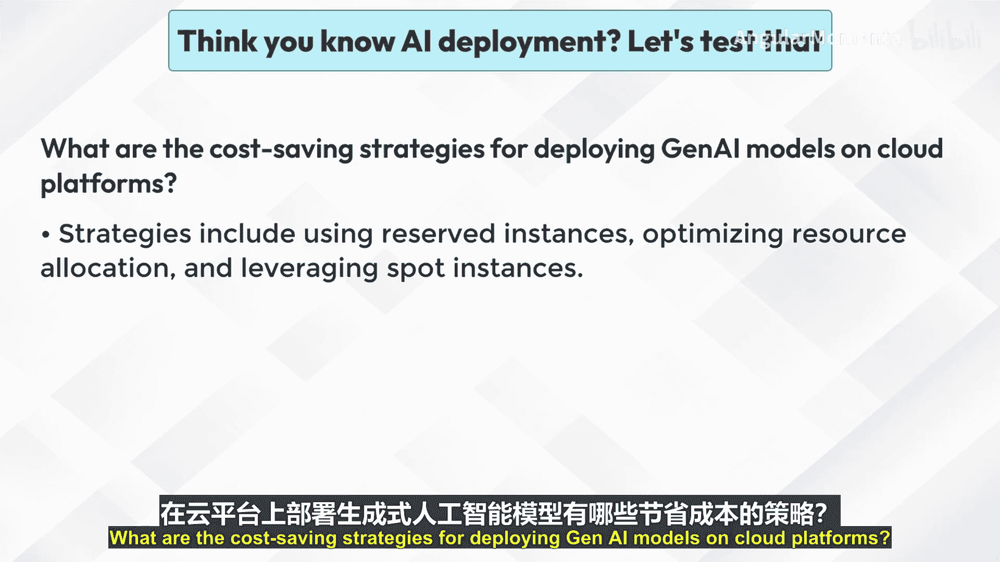

## 在云平台上部署生成式AI模型有哪些成本节约策略？💡

策略包括使用预留实例、优化资源分配以及利用竞价实例。

## 如何计算生成式AI模型的总拥有成本？🧮

通过包含基础设施、维护和运营费用来计算总拥有成本。

## 不同部署方法对生成式AI模型的成本影响是什么？⚖️

成本影响因基础设施（云与本地）、资源使用和许可费用而异。

## 如何优化资源使用以降低生成式AI部署的成本？⚙️

通过调整资源分配、使用高效算法以及利用云成本管理工具来优化资源使用。

## 部署生成式AI模型有哪些企业级考量？🏢

考量包括可扩展性、与现有系统的集成、合规性和资源管理。

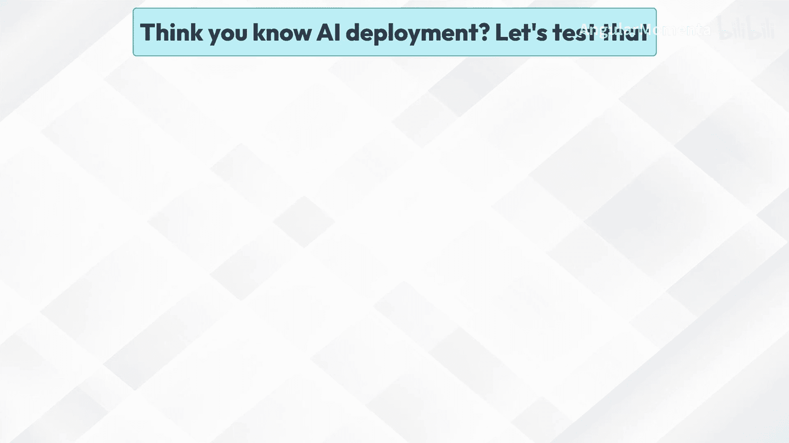

## 如何处理生成式AI模型部署中的用户数量问题？👥

通过适当扩展基础设施、确保模型能够处理并发请求以及实施负载均衡来处理用户数量问题。

## 用户并发性对生成式AI模型性能有何影响？📊

高用户并发性可能会增加延迟和资源利用率，从而影响性能，这可能需要进行扩展和优化。

## 如何在企业环境中确保生成式AI模型的高可用性？🔄

通过使用冗余基础设施、实施故障转移机制以及采用分布式系统来确保高可用性。

## 生成式AI部署中灾难恢复的最佳实践是什么？🌪️

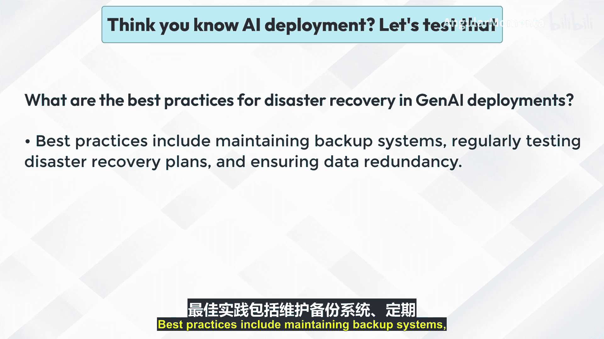

最佳实践包括维护备份系统、定期测试灾难恢复计划以及确保数据冗余。

## 在AWS SageMaker上部署生成式AI模型有哪些实践练习？🛠️

练习包括使用SageMaker训练模型、将其部署为端点，并将其与Web应用程序或API集成。

## 如何使用AWS Bedrock设置生成式AI模型部署？🪨

通过在AWS Bedrock上选择预构建模型、配置部署设置，并通过提供的API将其与应用程序集成来设置。

## 使用Anthropic本地部署生成式AI模型的步骤是什么？🏠

步骤包括安装必要的软件、配置模型环境，以及在管理依赖项和资源的同时在本地硬件上运行模型。

## 如何使用API将生成式AI模型集成到Web应用程序中？🔌

通过从Web应用程序调用生成式AI模型的API、处理API响应并在用户界面中显示生成的内容来进行集成。

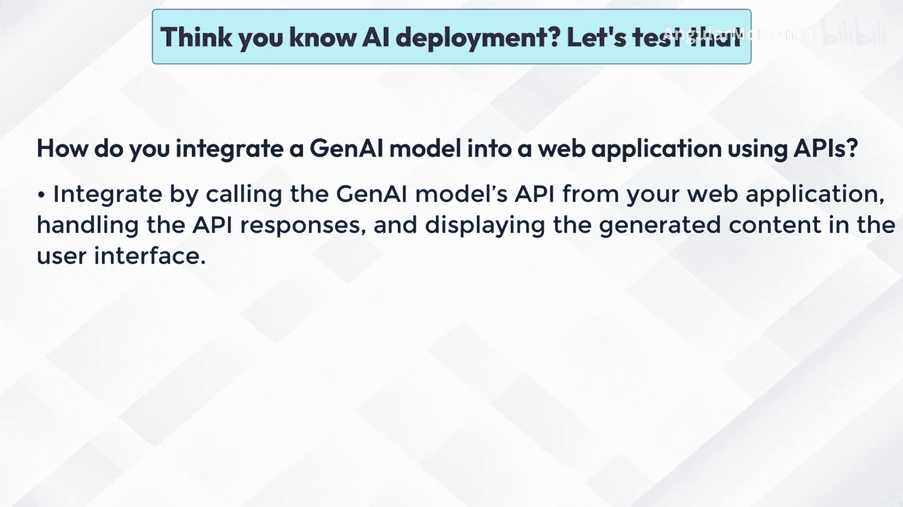

## 有哪些用于生成式AI部署实践的真实项目？🎯

项目可能包括开发用于客户支持的聊天机器人、创建用于营销的内容生成工具，或构建用于创意设计的图像生成应用程序。

## 能否提供一个成功的生成式AI模型部署案例研究？📚

一个例子是OpenAI的GPT-3集成到各种自然语言处理应用中，包括聊天机器人和内容生成工具。

## 从失败的生成式AI模型部署中可以吸取哪些教训？💡

教训可能包括充分测试的重要性、可扩展性规划的必要性，以及强大的错误处理和监控的需求。

## 不同行业如何部署和集成生成式AI模型？🏭

各行业为各种应用部署生成式AI模型，例如医疗保健用于患者数据分析、金融用于欺诈检测、娱乐用于内容创作。

## 企业应用中有哪些生成式AI的创新用例示例？💡

示例包括个性化营销内容生成、自动报告撰写和高级客户服务聊天机器人。

## 公司如何处理已部署生成式AI模型的维护？🔧

公司通过定期更新模型、监控性能并根据需要利用新数据重新训练模型来处理维护。

## 生成式AI模型部署有哪些新兴趋势？🚀

趋势包括边缘计算的增加使用、模型效率的进步，以及生成式AI与其他AI技术日益增长的集成。

## 生成式AI在企业应用中的未来如何发展？🔮

未来正朝着更复杂的模型、更深入地集成到业务流程中以及增强的定制能力方向发展。

## 哪些新技术正在影响生成式AI模型的部署？💻

技术包括硬件（例如GPU、TPU）的进步、改进的云服务和创新的软件框架。

## 硬件进步将如何影响生成式AI模型的部署？⚙️

硬件进步将实现更快的训练和推理、降低成本，并允许更高效地部署更复杂的模型。

## 边缘计算在生成式AI部署的未来中扮演什么角色？📶

边缘计算将使生成式AI模型能够在更靠近数据源的地方运行，减少延迟，并在远程或移动环境中实现实时处理。

## 如何确保已部署生成式AI模型的持续改进？🔄

通过根据用户反馈定期更新模型、纳入新数据以及改进算法来确保持续改进。

## 在生产环境中更新生成式AI模型的最佳实践是什么？🛠️

最佳实践包括使用版本控制、逐步推出更新，并在全面部署前彻底测试新版本。

## 如何将用户反馈纳入生成式AI模型的改进中？🗣️

通过分析用户交互、识别改进领域，并根据收集到的见解更新模型来纳入反馈。

## 持续学习和适应生成式AI模型面临哪些挑战？🚧

挑战包括管理数据质量、避免模型漂移，以及确保更新不会引入新问题。

## 如何利用A/B测试优化生成式AI模型？🧪

通过并行比较不同模型版本或配置，并分析其性能以确定最佳方法，来利用A/B测试。

## 部署和集成生成式AI模型的关键要点是什么？🎯

关键要点包括充分测试、监控和优化的重要性，以及解决可扩展性和数据隐私问题的必要性。

## 生成式AI模型部署中应避免哪些常见陷阱？⚠️

常见陷阱包括忽视性能优化、未能规划可扩展性以及忽视数据隐私和合规性问题。

## 如何衡量生成式AI模型部署的成功？📊

通过评估模型准确性、用户满意度、性能效率和投资回报率等指标来衡量成功。

## 持续学习资源对生成式AI部署有多重要？📚

持续学习资源对于跟上技术进步、提高技能以及适应生成式AI部署中的新挑战非常重要。

## 如何了解生成式AI集成和部署的最新发展？🌐

通过关注行业新闻、参与相关社区和会议，以及参与持续的培训和教育资源来保持更新。

---

本节课中，我们一起学习了生成式AI部署的全方位知识。我们从核心概念和挑战出发，探讨了集成方法、性能优化、成本控制及合规性等关键环节。通过了解不同的部署策略（如云服务、本地及混合方案）和实用工具（如AWS SageMaker、Bedrock），你已掌握了规划和执行生成式AI项目部署的基础框架。记住，成功的部署离不开周密的测试、持续的监控以及对数据隐私与可扩展性的高度重视。