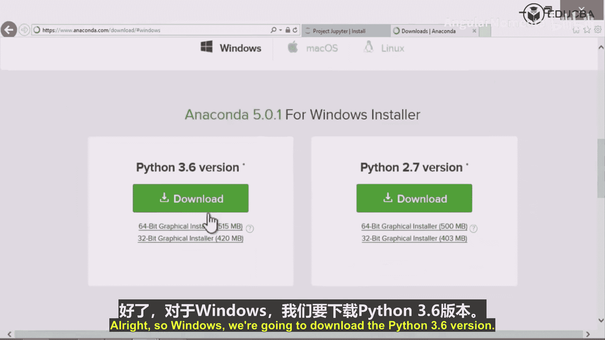
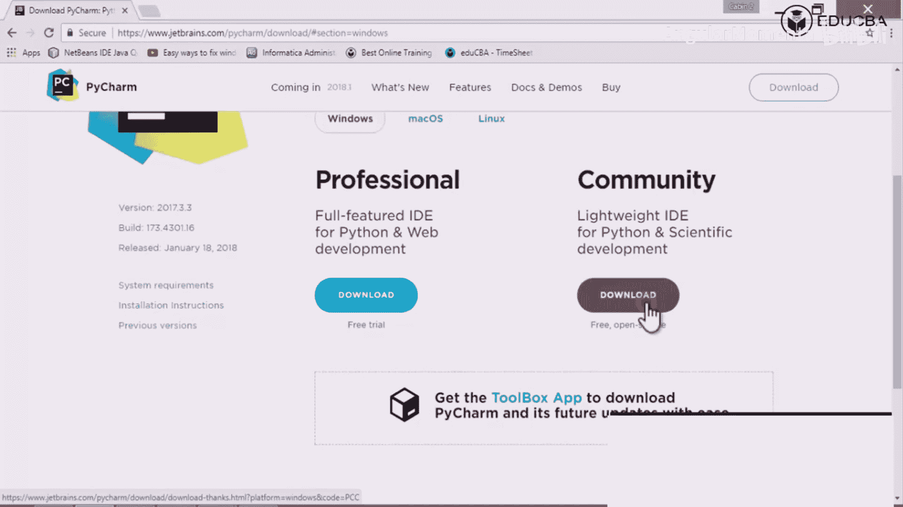
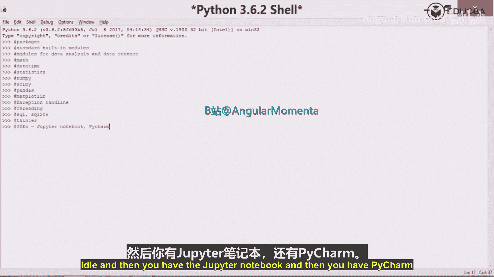

数据分析高级Python：构建与优化：P02-01：Anaconda发行版概念 🐍

在本节课中，我们将要学习数据分析所需的Python环境搭建，重点介绍Anaconda发行版及其核心概念，并简要了解我们将使用的集成开发环境。

Anaconda是一个集成了Python、Jupyter Notebook以及众多数据分析必备软件包的发行版。它极大地简化了环境配置过程，使我们能够快速开始数据分析工作。对于数据科学领域，Anaconda被广泛且迅速地采用。

### 什么是Anaconda发行版？

上一节我们提到了数据分析的环境需求，本节中我们来看看Anaconda如何满足这些需求。

Anaconda是一个**发行版**，它捆绑了Python解释器、Jupyter Notebook以及我们将要使用的大量核心软件包。这意味着像NumPy、SciPy、Matplotlib、Pandas等库在安装Anaconda时就已经预装好了，无需我们单独安装，这对初学者非常友好。

### 如何下载与安装Anaconda？

以下是下载Anaconda的步骤：

1.  访问Anaconda官方网站：`https://www.anaconda.com`。
2.  点击“Download”按钮，进入下载页面。
3.  根据你的操作系统（Windows、macOS或Linux）选择对应的安装程序。
4.  对于Windows用户，建议下载**Python 3.6版本、64位的图形化安装程序**（如果你的电脑是64位系统）。
5.  下载完成后，运行安装程序（通常是一个`.exe`文件）。
6.  安装过程非常简单，只需在图形界面中不断点击“Next”即可完成。

安装完成后，Anaconda发行版就部署好了，我们可以开始使用其中的各种应用，例如Jupyter Notebook。

### 另一个IDE：PyCharm

除了Jupyter Notebook，我们还会使用另一个集成开发环境（IDE）——PyCharm。PyCharm由JetBrains公司开发，功能强大，尤其在版本控制等方面能提供很大帮助。

以下是获取PyCharm的说明：

*   **社区版**：这是一个免费的开源版本，完全满足科学计算和数据分析的需求。
*   **专业版**：这是一个付费版本，提供了更多面向Web开发等专业领域的特性。

对于本课程的学习，下载并安装**社区版**就足够了。其安装过程与Anaconda类似，下载安装程序后按照指引完成即可。

### 环境概览与后续安排

至此，我们已经了解了核心的环境组件。我们将在后续视频中详细讲解具体的设置步骤。目前，我们已经可以准备就绪，进入编程环节。我们将主要使用两种工具：**Jupyter Notebook** 和 **PyCharm**。

本节课中我们一起学习了Anaconda发行版的概念、其预装软件包的优势、以及如何下载安装Anaconda和PyCharm。这些工具为我们后续的数据分析Python编程打下了坚实的基础。