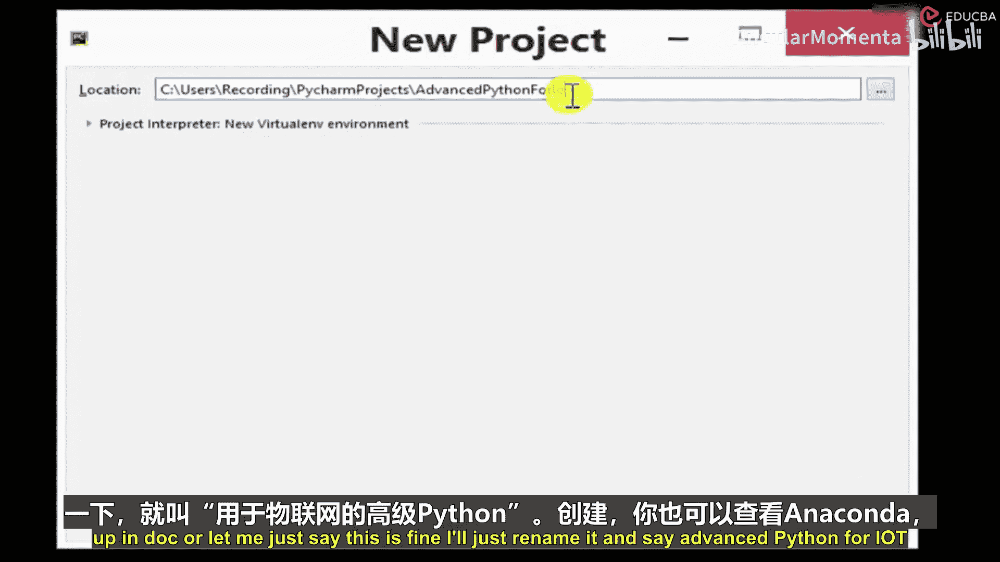
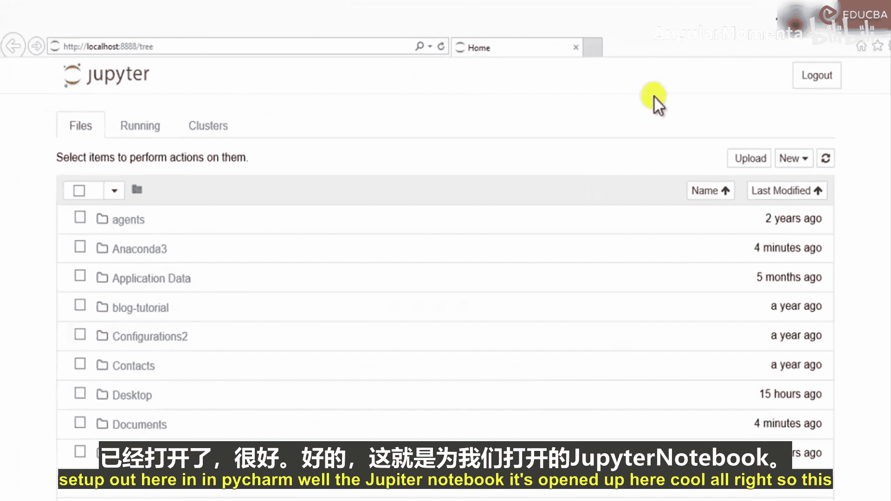
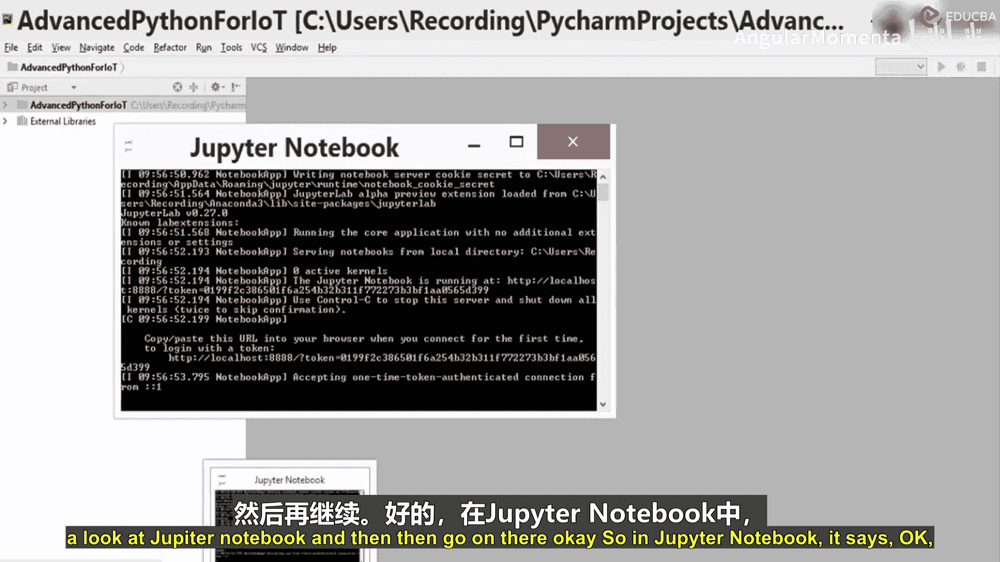
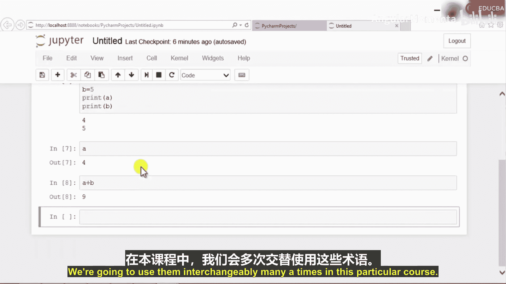

# 003：PyCharm与Anaconda安装与配置 🛠️

在本节课中，我们将学习如何安装和配置两个重要的Python开发工具：PyCharm集成开发环境和Anaconda数据科学平台。我们将完成从下载到基本使用的全过程。

## 概述

我们将同时安装PyCharm Community Edition和Anaconda。PyCharm是一个功能强大的Python IDE，适合构建和管理复杂的项目。Anaconda则是一个集成了众多数据科学库和Jupyter Notebook的Python发行版。我们将学习如何配置它们并了解其基本用法。

---

## 安装PyCharm Community Edition

首先，我们从官方网站下载PyCharm Community Edition的安装程序并启动它。

以下是安装步骤：

1.  运行安装程序，选择“Community Edition”版本。
2.  在安装选项中，确认选择64位版本，然后点击“Next”。
3.  选择创建程序快捷方式等选项，接受默认设置即可。
4.  点击“Install”开始安装过程。

安装程序将自动完成PyCharm的安装。与此同时，我们也将并行安装Anaconda。

---

## 安装Anaconda

在PyCharm安装的同时，我们启动Anaconda的安装程序。

以下是安装步骤：

1.  运行Anaconda安装程序，选择自定义安装位置或使用默认路径。
2.  确保不覆盖任何旧版本，以避免冲突。
3.  完成安装后，我们可以在开始菜单中找到Anaconda Navigator和Anaconda Prompt。

至此，PyCharm和Anaconda都已安装完毕。接下来，我们将学习如何使用它们。

---

## 配置与使用PyCharm

安装完成后，我们首次运行PyCharm Community Edition。启动时，我们可以跳过初始设置，直接进入主界面。

为了配置Python解释器，我们需要进行以下操作：

1.  进入“File”菜单，选择“Settings”。
2.  在设置窗口中，找到“Project Interpreter”选项。
3.  在这里，我们可以查看和选择已安装的Python解释器，例如Python 3.6。

配置完成后，我们可以创建一个新项目。

以下是创建新项目的步骤：

1.  点击“Create New Project”。
2.  为项目命名，例如“Advanced_Python_For_DA”。
3.  选择项目的存储位置，例如桌面或特定文件夹。
4.  点击“Create”完成项目创建。

现在，我们可以在项目中创建Python文件并运行代码。例如，创建一个名为`test.py`的文件，输入`print(“Hello World”)`，然后使用快捷键`Ctrl+Shift+F10`运行它。

---

## 使用Jupyter Notebook

Anaconda安装完成后，我们可以通过Anaconda Navigator或开始菜单启动Jupyter Notebook。Jupyter Notebook是一个基于Web的交互式计算环境，非常适合数据分析和教学。

让我们了解Jupyter Notebook的基本用法：

1.  Jupyter Notebook启动后，会在浏览器中打开文件浏览器界面。我们可以导航到之前为PyCharm项目创建的文件夹。
2.  点击“New”按钮，选择“Python 3”来创建一个新的Notebook文件。
3.  在出现的代码单元格中，我们可以编写和执行Python代码。例如，输入`print(“Hello World”)`，然后按`Shift+Enter`运行该单元格。
4.  Jupyter Notebook的优势在于可以分段执行代码。我们可以在不同的单元格中分别编写代码，并独立运行它们。例如，在一个单元格中定义变量`a=4, b=5`，在下一个单元格中计算`a+b`，变量值会在整个Notebook会话中保持。
5.  除了代码单元格，我们还可以插入Markdown单元格来添加文本说明、标题和文档。例如，使用`#`创建标题，编写课程描述等。

这种将代码、输出和文档说明结合在一个文件中的方式，使得分析和展示工作流程变得非常清晰。

---

## 工具间的协作使用

在数据科学项目中，我们经常需要结合使用PyCharm和Jupyter Notebook。

以下是它们各自的典型用途：

*   **PyCharm**：更适合构建结构化的项目，例如需要多个模块、文件夹和复杂包管理的应用程序开发。
*   **Jupyter Notebook**：更适合进行探索性数据分析、快速原型设计、数据可视化和制作可重复的研究报告。

在本课程中，我们将根据任务的需要，灵活地交替使用这两种工具。PyCharm帮助我们构建稳健的项目框架，而Jupyter Notebook则助力我们进行快速的数据探索和交互式编程。

---

## 总结

本节课中，我们一起完成了PyCharm和Anaconda的安装与基本配置。我们学习了如何在PyCharm中创建项目、配置解释器并运行Python脚本。同时，我们也探索了Jupyter Notebook的核心功能，包括创建笔记本、分段执行代码以及使用Markdown添加文档。理解这两种工具的定位和基本操作，为我们后续的数据分析高级Python编程打下了坚实的基础。