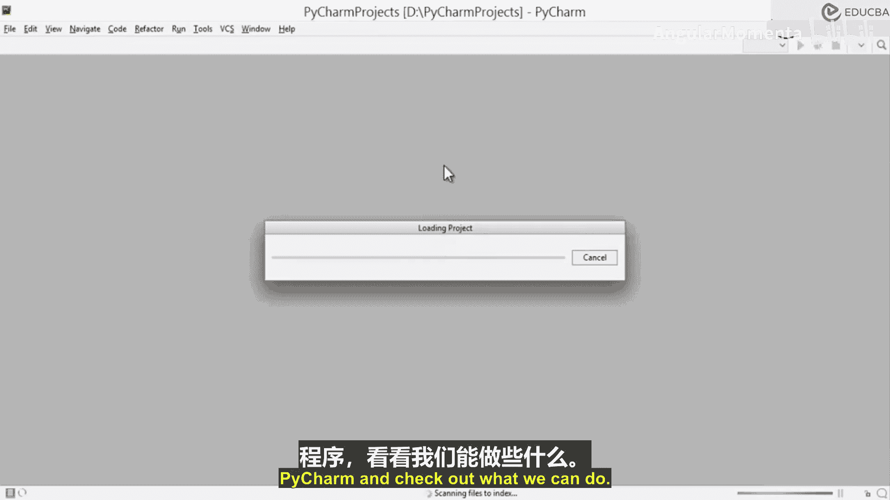
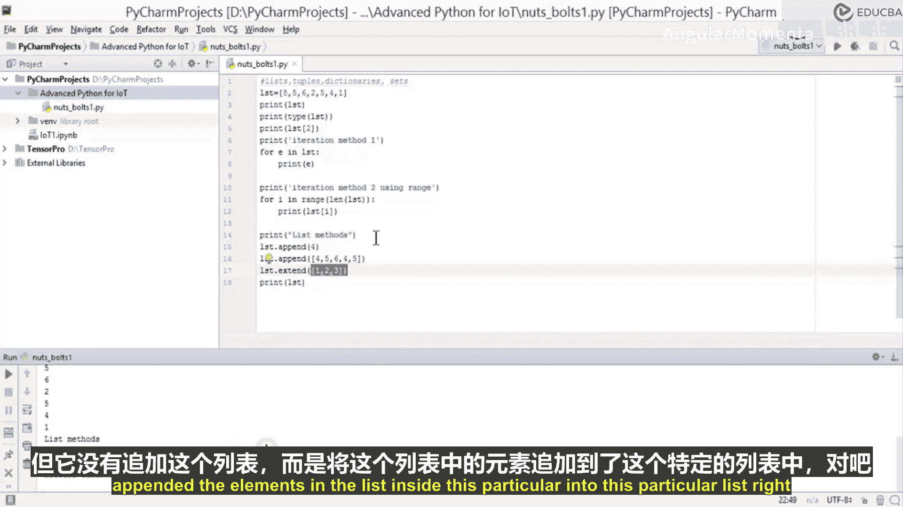

# 004：在PyCharm中执行程序

在本节课中，我们将学习如何在PyCharm中执行Python程序，并对Python的核心概念进行一次快速回顾。我们将从基础的“Hello World”程序开始，然后复习Python中的几种主要数据结构及其基本操作。

---

## 概述

本节课程旨在帮助您熟悉PyCharm环境，并快速回顾Python编程的核心概念。我们将从执行一个简单的程序开始，然后复习列表、元组、字典和集合这四种基本数据结构。这些知识是后续学习更高级数据分析库（如NumPy和Pandas）的基础。

---



## Python基础快速回顾

上一节我们介绍了课程目标，本节中我们来看看Python的一些核心概念。虽然假设您已具备Python基础，但这里将对一些关键点进行简要回顾。

### 数据结构简介

Python中有四种主要的内置数据结构，它们分别是：列表（List）、元组（Tuple）、字典（Dictionary）和集合（Set）。这些结构是构建更复杂数据操作的基础。

### 列表操作示例

列表是使用方括号 `[]` 定义的可变序列。以下是列表的一些基本操作：

```python
# 定义一个列表
LST = [0, 1, 2, 3]
print(LST)
print(type(LST))
```

您可以通过索引访问列表中的元素，索引从0开始：

```python
# 访问列表元素
print(LST[2])  # 输出索引为2的元素
```

以下是遍历列表的两种方法：

```python
# 迭代方法1：直接遍历元素
print("迭代方法1:")
for element in LST:
    print(element)

# 迭代方法2：通过索引遍历
print("迭代方法2:")
for i in range(len(LST)):
    print(LST[i])
```

列表有多种方法可以修改其内容。以下是几个常用方法：

*   **`append()`**: 在列表末尾添加一个元素。
*   **`extend()`**: 将另一个列表中的所有元素添加到当前列表末尾。

让我们通过代码看看它们的区别：

```python
# 使用append方法
LST.append(4)
print(LST)  # 输出: [0, 1, 2, 3, 4]

# 使用append添加另一个列表（会作为单个元素嵌套进去）
LST.append([5, 6])
print(LST)  # 输出: [0, 1, 2, 3, 4, [5, 6]]

# 使用extend方法添加另一个列表的元素
LST.extend([7, 8])
print(LST)  # 输出: [0, 1, 2, 3, 4, [5, 6], 7, 8]
```

如您所见，`append()` 会将整个参数作为一个元素添加，而 `extend()` 则会展开参数中的元素并逐个添加。

---

## 总结



本节课中我们一起学习了如何在PyCharm中运行Python程序，并对Python的基础数据结构——列表进行了快速回顾。我们了解了列表的定义、元素访问、两种遍历方式以及 `append()` 和 `extend()` 等关键方法。掌握这些基础知识对于后续学习更高级的数据分析工具至关重要。在接下来的课程中，我们将以此为基础，探索元组、字典、集合以及NumPy和Pandas等库中的高级数据结构。