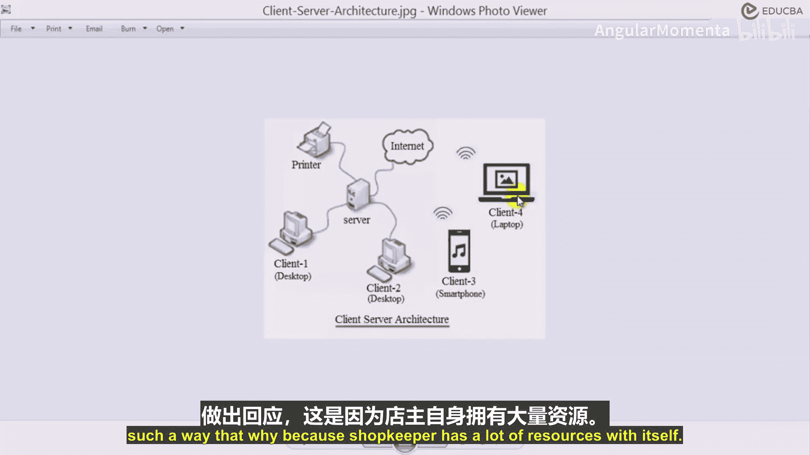
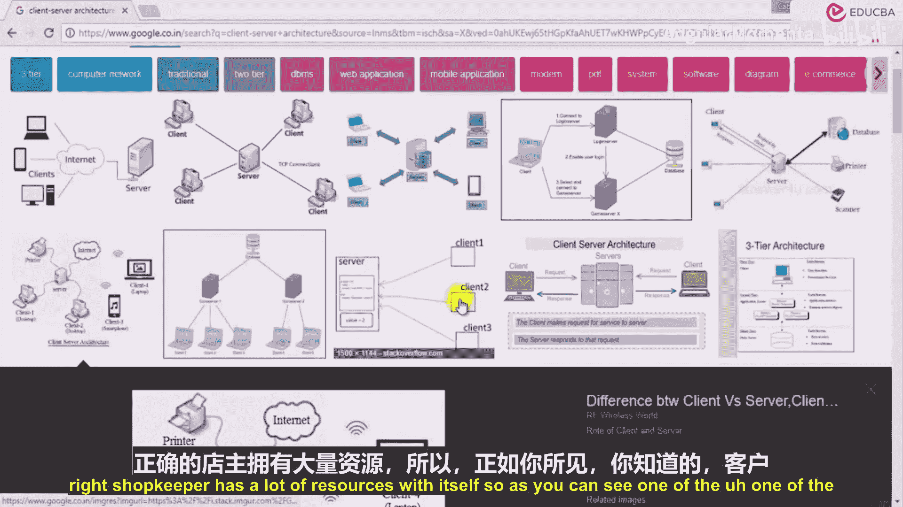
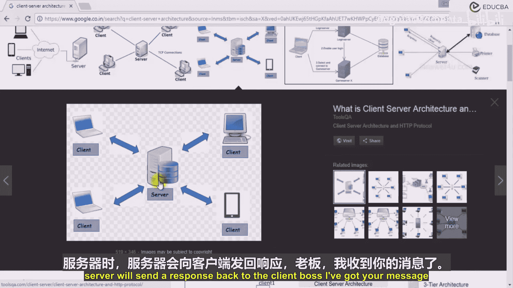

# 007：客户端服务器的网络层面 🖧

在本节课中，我们将要学习网络编程的核心概念，特别是在物联网等场景中至关重要的客户端-服务器模型。我们将通过日常生活中的例子来理解这个模型，并了解它如何支撑起像WhatsApp这样的现代通信应用。

## 概述

网络在编程中扮演着重要角色，尤其是在物联网领域。许多设备通过互联网或本地网络连接在一起，并相互通信。当我们谈论“网络”时，可能首先想到的是社交网络，如WhatsApp、Facebook或LinkedIn。但在计算机领域，网络指的是通过某种接口或中介，将世界各地的两台计算机或设备连接起来。

## 从消息传递理解网络

为了理解网络，我们以消息传递或聊天为例。这涉及从一台计算机或设备向另一台发送信息。

假设用户XYZ在他的手机上使用WhatsApp，向他的朋友ABC发送了一条“hi”消息。这条消息从XYZ的手机发送到ABC的手机，并显示在ABC的WhatsApp应用里。这里产生一个问题：这两部手机是直接连接在一起的吗？实际上，它们并非直接相连。那么它们连接到了谁？

想象一部智能手机通过Wi-Fi连接到互联网，另一台笔记本电脑也连接到互联网。XYZ可能通过手机应用登录，而ABC可能使用WhatsApp网页版在笔记本电脑上接收消息。两者都通过互联网连接，但最终都需要与一个中心实体通信。

## 引入客户端-服务器模型

网络中最流行的模型之一就是**客户端-服务器模型**。这个模型类似于店主与顾客的关系。

*   店主（服务器）只有一个，他拥有丰富的资源（如货物、数据）。
*   顾客（客户端）可以有很多个，他们向店主提出请求（例如，想买什么商品）。
*   店主收到请求后，向顾客提供响应（例如，交付商品）。

在计算机术语中：
*   **服务器** 是一个中心节点，拥有资源（如数据、处理能力），并等待接收请求。
*   **客户端** 是向服务器发起请求以获取服务或资源的节点。

它们之间的关系可以表示为：
```
客户端 --(请求)--> 服务器
服务器 --(响应)--> 客户端
```

## 模型的工作方式

以下是客户端-服务器模型的关键工作流程：

1.  多个客户端连接到服务器，但客户端之间不直接连接。
2.  当客户端需要数据或服务时，它会向服务器发送请求。
3.  服务器处理请求，并从其资源中获取或生成所需的数据。
4.  服务器将响应发送回发起请求的特定客户端。





## 以WhatsApp为例

现在，让我们将这个模型应用到WhatsApp的消息传递中：

1.  用户XYZ（客户端1）发送消息“hi”。
2.  这条消息首先被发送到WhatsApp的服务器。
3.  服务器收到消息后，可能会向XYZ发送一个确认响应（例如，“消息已送达”）。
4.  同时，服务器知道这条消息需要传递给用户ABC（客户端2）。
5.  服务器将消息“hi”推送给在线的ABC客户端。
6.  ABC在他的设备上收到消息。

关键在于，两个用户（客户端）并没有直接连接。他们是通过WhatsApp服务器这个中介进行通信的。服务器管理了所有的连接和消息路由。这就是流行的客户端-服务器模型的工作方式。

## 总结



本节课中，我们一起学习了网络编程的基础——客户端-服务器模型。我们通过店主与顾客的类比理解了服务器（资源提供者）和客户端（服务请求者）的角色。并以WhatsApp为例，看到了该模型如何在实际应用中运作，使得设备能够通过一个中心服务器进行间接通信，而非直接相连。理解这个模型是构建和理解大多数网络应用的基础。