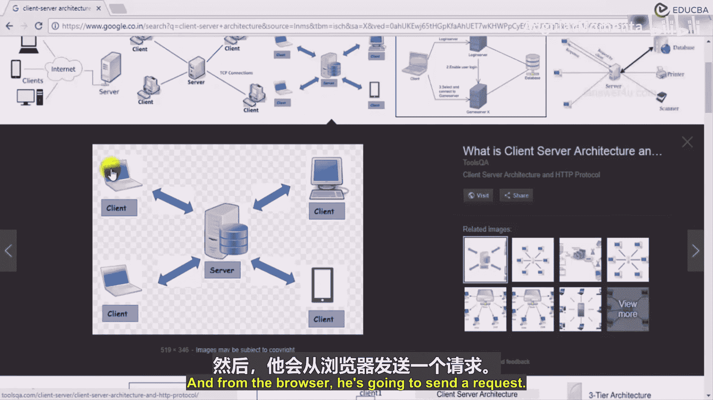
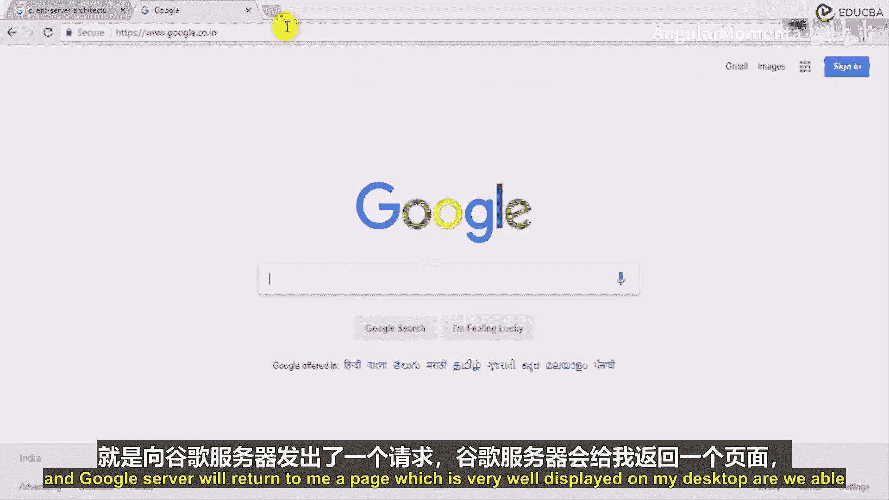
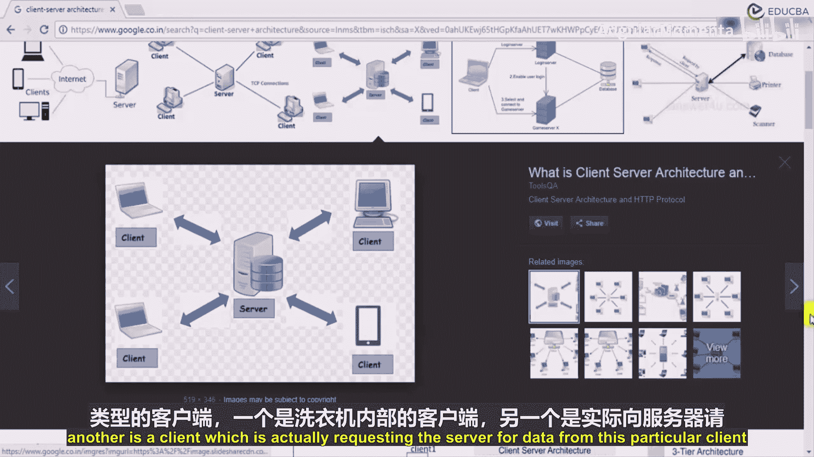

# 008：客户端与服务器的消息通信 💬

在本节课中，我们将学习客户端与服务器之间如何进行消息通信。这是理解网络应用，特别是物联网（IoT）应用如何工作的基础。我们将通过一个简单的比喻来解释消息传递的流程，并探讨它在实际场景中的应用。

## 消息传递流程详解

上一节我们介绍了网络通信的基本概念，本节中我们来看看一个具体的消息传递模型，它类似于我们日常使用的即时通讯工具。

当客户端发送一条消息时，它会收到一个**单勾**（✔️）。这个单勾表示消息已成功发送到互联网，并被服务器接收。但这**不意味着**接收方客户端已经收到了消息，它只表示消息已抵达中央服务器。

当接收方客户端上线时，服务器会将消息转发给它。一旦接收方客户端成功收到消息，它会通知服务器。服务器随后会向原始发送方客户端发送一个**双勾**（✔️✔️）确认，表示接收方已收到消息。

如果接收方客户端进一步**打开并阅读**了消息，它会再次通知服务器。服务器则会向发送方客户端发送**蓝色双勾**（🔵✔️✔️）确认，表示消息已被阅读。

以下是消息状态变化的完整流程：
1.  **消息发送**：客户端A发送消息到服务器。
2.  **服务器确认**：服务器接收消息，并向客户端A返回单勾（✔️）。
3.  **消息投递**：接收方客户端B上线，服务器将消息转发给它。
4.  **接收确认**：客户端B接收消息，服务器向客户端A返回双勾（✔️✔️）。
5.  **阅读确认**：客户端B阅读消息，服务器向客户端A返回蓝色双勾（🔵✔️✔️）。

这就是客户端-服务器模型的基本工作流程。服务器作为位于外部的中央枢纽，负责协调两个客户端之间的通信。这是网络通信中广泛使用的流行模型。

## 物联网（IoT）应用实例

理解了基本模型后，我们来看看它在物联网领域的具体应用。在这个场景中，客户端通常是嵌入在设备中的智能硬件。

在我们的物联网应用中，设备（如ESP8266、树莓派或其他联网设备）会连接到互联网。这些设备可以从各种传感器收集大量外部环境数据，或执行某些计算任务。

设备会定期向服务器更新数据。让我们以一个真实的用例来说明：假设我们将一个物联网控制器安装在一台洗衣机中。

这个控制器（即客户端）负责监控洗衣机的各种状态。以下是它可能收集的数据示例：
*   洗衣机的开机与关机时间。
*   电机启动的时间与状态。
*   洗衣机是否正常工作。
*   水温是否达到预设水平。

因为这些设备连接到了互联网，它们会将数据发送到服务器。服务器随后将这些数据存储到数据库中。

## 数据监控与请求响应

数据存储在服务器后，如何被查看呢？这时会出现另一种客户端：数据监控方。

例如，对于三星或惠而浦的洗衣机，公司的维护人员可能需要监控全美所有洗衣机的运行状态。他可以通过浏览器（如Chrome）登录一个管理平台。

当他在浏览器中输入网址（例如 `www.educba.com`）并按下回车时，就向EDUCBA的服务器发送了一个**请求**。同样，他也可以向洗衣机数据服务器发送请求，询问“我想查看这台洗衣机的数据”。

服务器在收到请求后，会从数据库（存储了来自洗衣机客户端的数据）中提取相关信息。接着，服务器将这些数据组织成网页格式（使用HTML、CSS、JavaScript等技术），并以**HTTP响应**的形式发送回浏览器。

最终，这个响应会以网页的形式显示在维护人员的屏幕上，使他能够实时监控洗衣机的状态。

这里存在两种不同的客户端：
1.  **设备客户端**：位于洗衣机内部，负责收集和发送数据。
2.  **用户客户端**：位于浏览器中，负责向服务器请求并查看数据。

## 总结

本节课中我们一起学习了客户端-服务器通信模型的核心流程，包括消息发送、接收和阅读确认的状态变化。我们还探讨了该模型在物联网领域的实际应用，区分了作为数据生产者的设备客户端与作为数据消费者的用户客户端。理解这种双向通信机制是构建高效、可监控的网络化数据分析应用的基础。