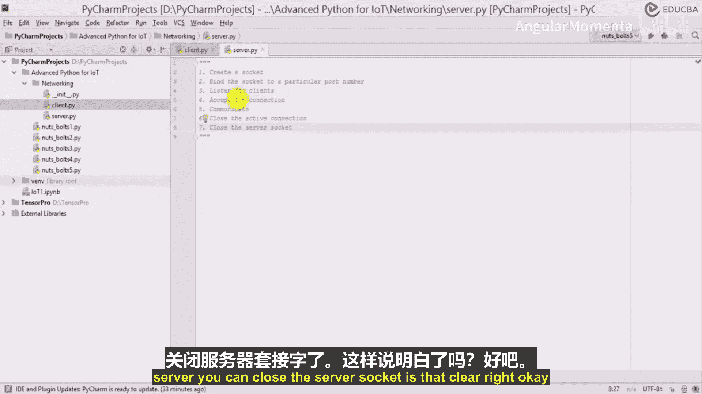

# 010：网络编程基础 🖧

在本节课中，我们将学习网络编程的核心概念，并动手创建一个简单的客户端-服务器模型。我们将了解套接字（Socket）的工作原理，以及客户端和服务器端编程的基本步骤。

---

## 创建项目结构

首先，我们为物联网项目创建一个网络编程相关的包和文件。

在项目文件中，创建一个名为 `networking` 的包。在该包内，创建两个Python文件：`client.py` 和 `server.py`。这两个文件将分别用于编写客户端和服务器端的代码。

---

## 客户端编程步骤 📡

上一节我们创建了项目结构，本节中我们来看看客户端编程的具体步骤。客户端代码的编写主要包含四个清晰的步骤。

以下是客户端编程的四个核心步骤：

1.  **创建套接字**
    首先，需要创建一个套接字。套接字是网络通信的端点，它由 **IP地址** 和 **端口号** 共同标识。可以将其理解为一个在特定设备端口上运行、并连接到互联网的应用程序。

2.  **连接到服务器套接字**
    创建套接字后，客户端需要将其连接到目标服务器的套接字上，以建立通信链路。

3.  **进行通信**
    连接建立后，客户端和服务器就可以开始相互通信了，例如发送和接收数据。

4.  **关闭套接字**
    通信结束后，客户端应关闭其套接字，释放网络资源。

---

## 服务器端编程步骤 🖥️

了解了客户端的工作流程后，本节我们来看看服务器端。服务器端的步骤稍多一些，因为它需要持续监听并处理来自多个客户端的连接请求。

以下是服务器端编程的六个核心步骤：

1.  **创建套接字**
    与客户端一样，服务器首先也需要创建一个套接字。

2.  **绑定套接字到端口**
    服务器需要将其套接字绑定到一个特定的端口号上。这类似于商店选择一个固定的营业地址，方便客户前来访问。例如，可以将服务器绑定到端口 `8080` 或 `80`。

3.  **监听连接**
    绑定端口后，服务器必须开始监听是否有客户端尝试连接。就像开店后，需要等待顾客上门。

4.  **接受客户端连接**
    当有客户端发起连接时，服务器需要接受这个连接。接受连接意味着在客户端和服务器之间建立了一条持续的通信通道，双方可以借此进行对话。

5.  **进行通信**
    连接建立后，服务器就可以通过这个连接与客户端进行数据交换（发送和接收）。服务器可能需要同时处理多个连接，就像餐厅有多个服务员同时为不同桌的客人服务一样。

6.  **关闭连接与服务器**
    与单个客户端的通信结束后，关闭该活动连接。处理完所有客户端请求后，最终可以关闭服务器套接字。

---

## 总结

本节课中我们一起学习了网络编程的基础。我们明确了客户端编程的四个步骤：**创建套接字 -> 连接服务器 -> 通信 -> 关闭套接字**。同时也掌握了服务器端编程的六个步骤：**创建套接字 -> 绑定端口 -> 监听 -> 接受连接 -> 通信 -> 关闭**。理解这些步骤是构建任何网络应用的基础。在接下来的实践中，我们将把这些步骤转化为具体的Python代码。