# 011：编写客户端与服务器端代码 🖥️

在本节课中，我们将学习如何使用Python的`socket`模块编写一个简单的客户端与服务器端程序，实现网络通信。我们将从创建套接字开始，逐步完成连接、数据发送与接收等核心步骤。

## 概述

网络编程的核心是客户端与服务器之间的通信。Python的`socket`模块提供了实现这种通信所需的所有工具。本节将引导你编写一个基础的客户端和服务器端脚本，让它们能够在同一台机器上通过指定的端口进行对话。

---

## 导入Socket模块

编写客户端或服务器端代码的第一步是导入`socket`模块。这个模块包含了创建和管理网络连接所需的所有类和方法。

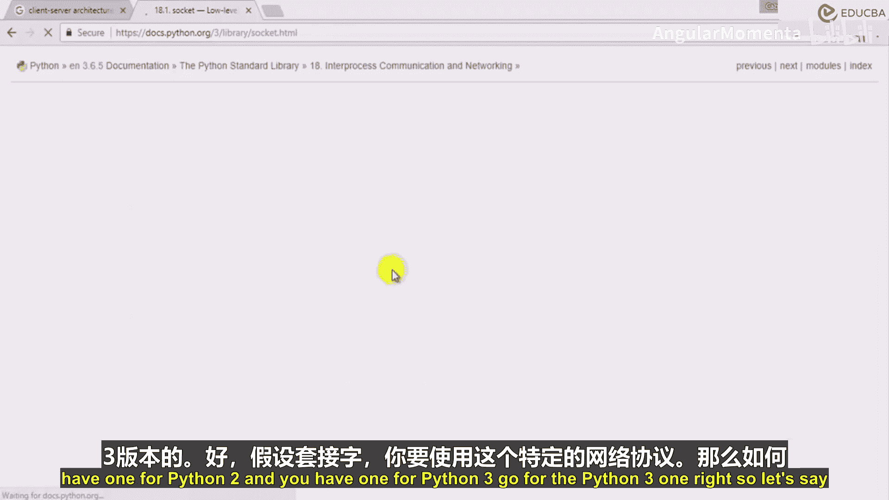

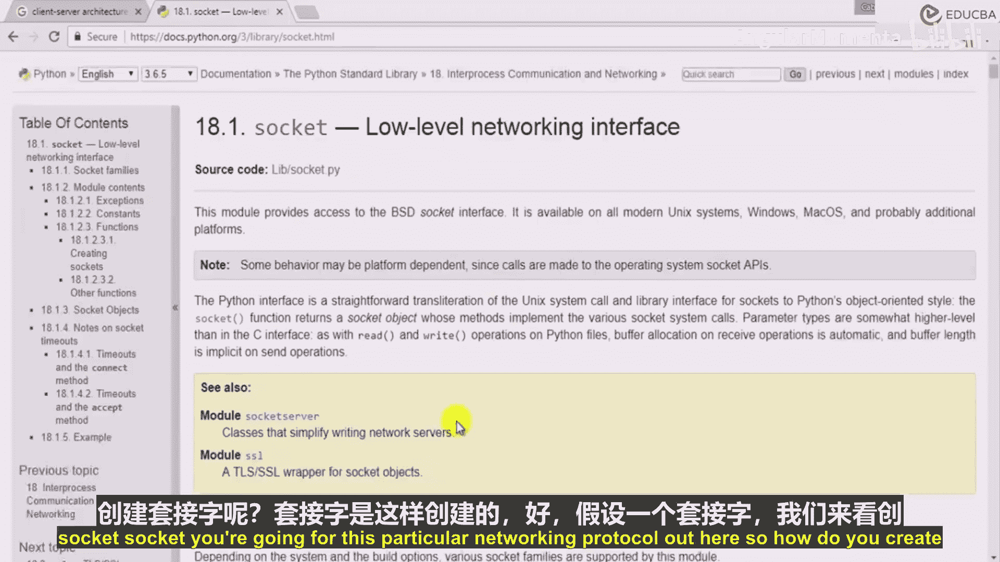

```python
import socket
```

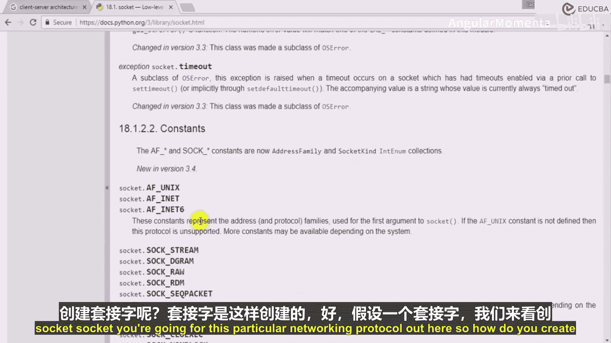

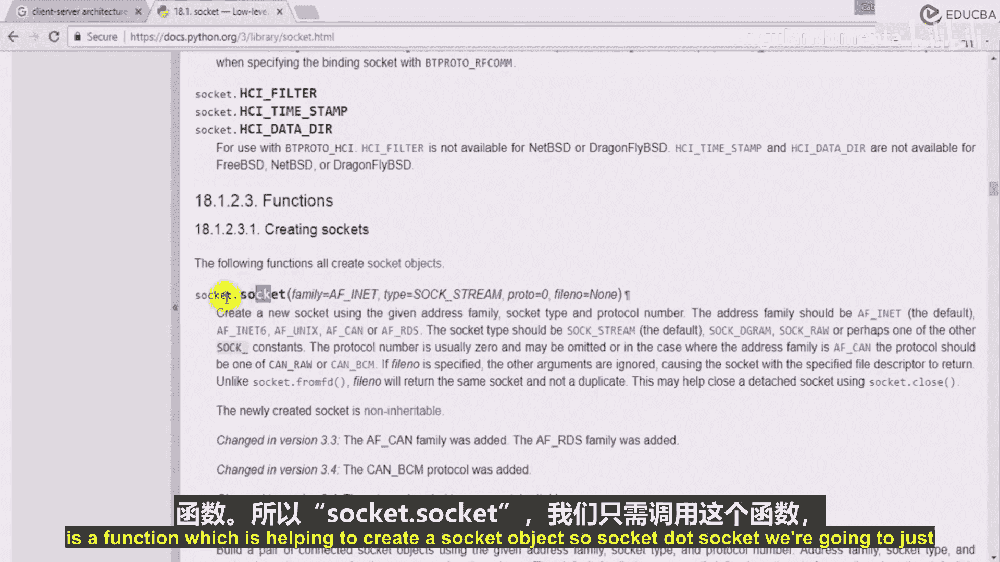

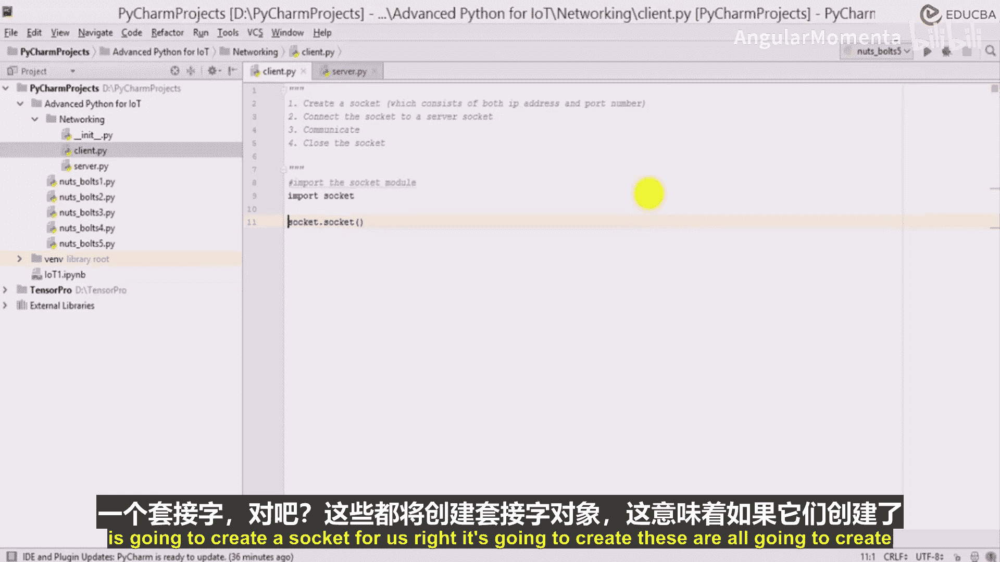

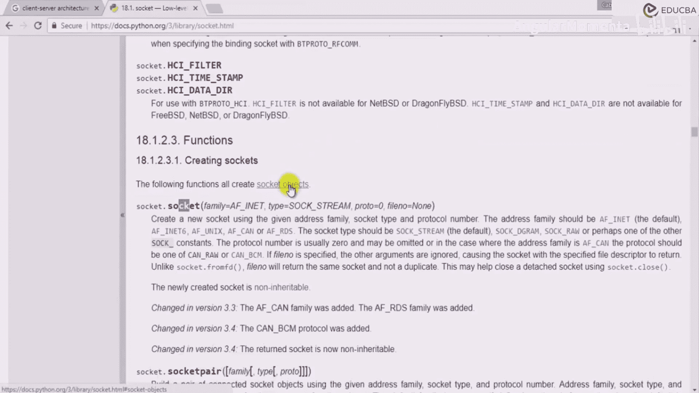

---

## 创建套接字对象

上一节我们导入了`socket`模块，本节中我们来看看如何创建套接字对象。套接字是网络通信的端点。

`socket.socket()`函数用于创建一个新的套接字对象。无论是客户端还是服务器端，都需要创建这样一个对象。

```python
client_socket = socket.socket()
server_socket = socket.socket()
```

---

## 服务器端：绑定与监听

创建服务器端套接字后，需要将其绑定到一个具体的IP地址和端口上，并开始监听来自客户端的连接请求。

以下是服务器端需要执行的关键步骤：

1.  **绑定地址**：使用`bind()`方法将服务器套接字绑定到本地主机的特定端口（例如1234）。
2.  **开始监听**：使用`listen()`方法使服务器套接字进入监听状态，等待客户端连接。
3.  **接受连接**：使用`accept()`方法接受一个客户端的连接请求。此方法会返回一个新的套接字对象（用于与该特定客户端通信）和客户端的地址。

```python
# 绑定到本地主机的1234端口
server_socket.bind(('localhost', 1234))
print("服务器已绑定到端口号 1234")

# 开始监听
server_socket.listen()
print("服务器正在监听客户端连接...")

# 接受一个客户端连接
connection, address = server_socket.accept()
print(f"收到来自地址 {address} 的客户端连接")
```

---

## 客户端：连接到服务器

客户端套接字创建后，需要主动连接到服务器。

以下是客户端需要执行的关键步骤：

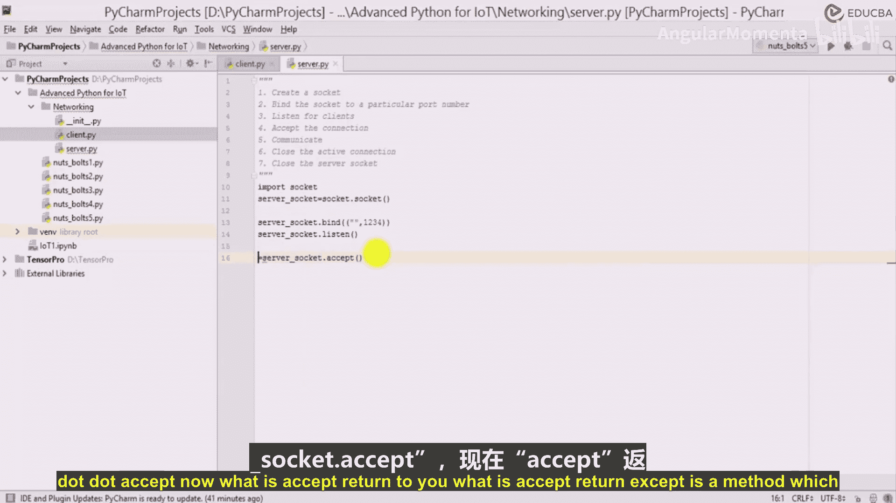

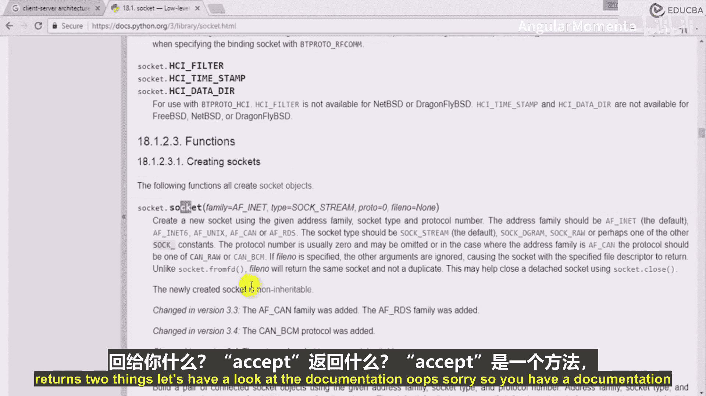

1.  **连接到服务器**：使用`connect()`方法，指定服务器的地址（如`localhost`）和端口号（如1234），发起连接。

```python
# 连接到本地主机上的服务器，端口为1234
client_socket.connect(('localhost', 1234))
```

---

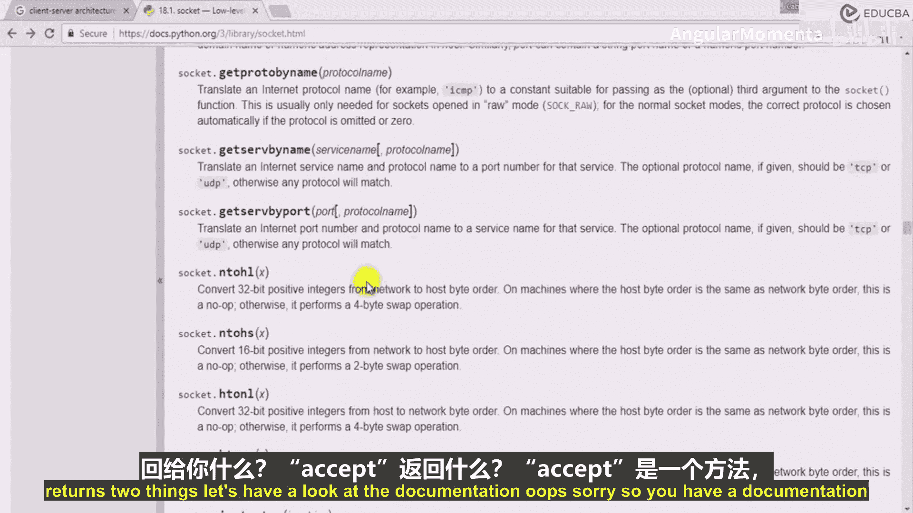

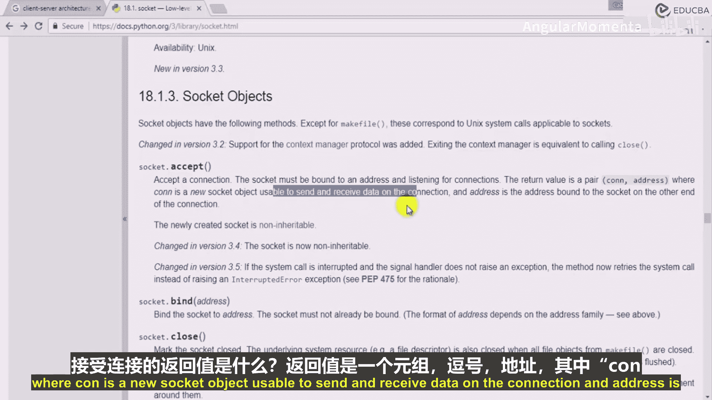

## 发送与接收数据

连接建立后，客户端和服务器就可以通过各自的套接字对象进行数据交换。需要注意的是，网络传输的数据必须是字节（bytes）格式，而不是字符串。

以下是数据交换的流程：

1.  **客户端发送数据**：客户端使用`sendall()`方法发送数据。在发送前，需要将字符串使用`encode()`方法编码为字节。
2.  **服务器接收数据**：服务器使用`recv()`方法接收数据。接收到的数据是字节格式，需要使用`decode()`方法解码为字符串。

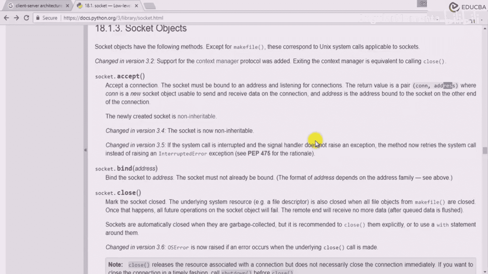

```python
# 客户端发送消息
message = "你好，服务器！我是客户端。"
client_socket.sendall(message.encode())

# 服务器接收消息
data = connection.recv(1024) # 1024是缓冲区大小
decoded_message = data.decode()
print(f"从客户端接收到的消息：{decoded_message}")
```

---

## 关闭连接

通信完成后，必须正确关闭套接字以释放系统资源。

以下是关闭连接的步骤：

1.  关闭用于数据通信的活跃连接（服务器端由`accept()`返回的`connection`对象）。
2.  关闭主服务器套接字和客户端套接字。

```python
# 客户端关闭连接
client_socket.close()

# 服务器端关闭连接
connection.close()
server_socket.close()
```

---

## 总结

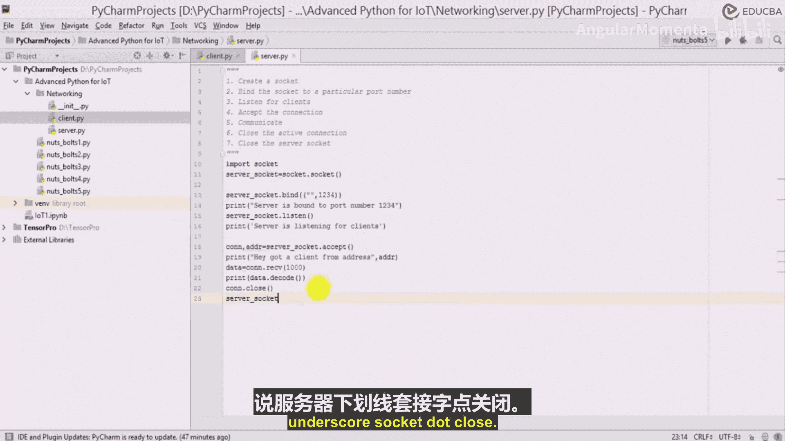

本节课中我们一起学习了网络编程的基础。我们使用Python的`socket`模块，逐步实现了客户端与服务器端的代码。关键步骤包括：导入模块、创建套接字、服务器绑定与监听、客户端发起连接、进行字节格式的数据收发，以及最后关闭所有连接。虽然这个例子运行在同一台机器上，但其原理完全适用于不同机器间的网络通信。