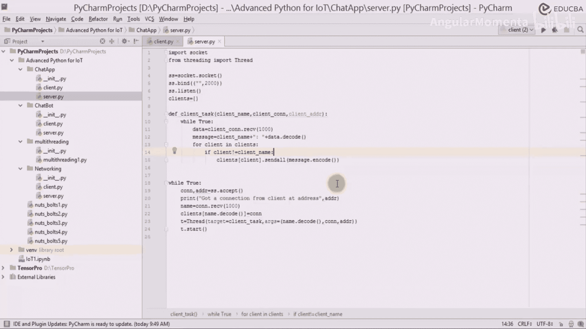
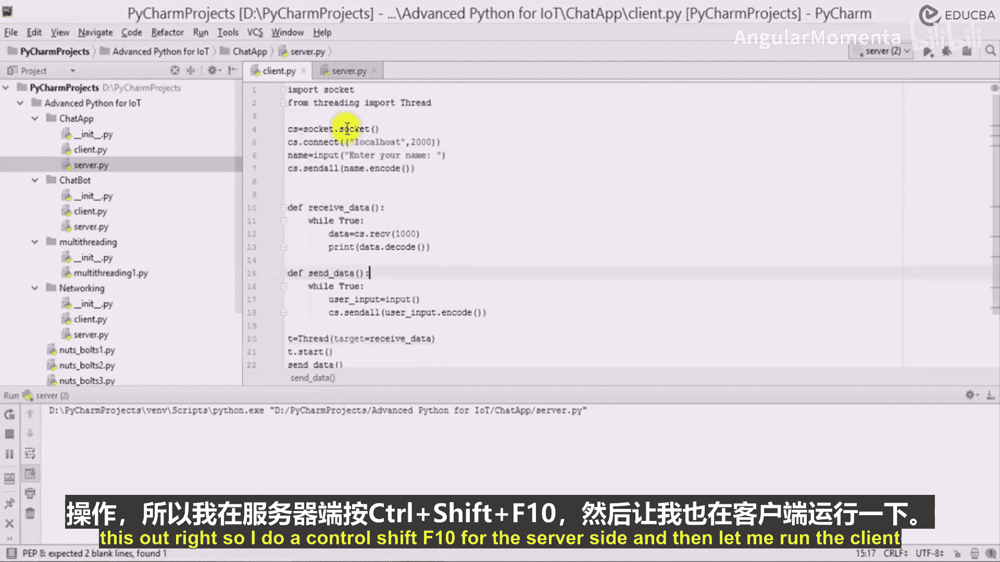
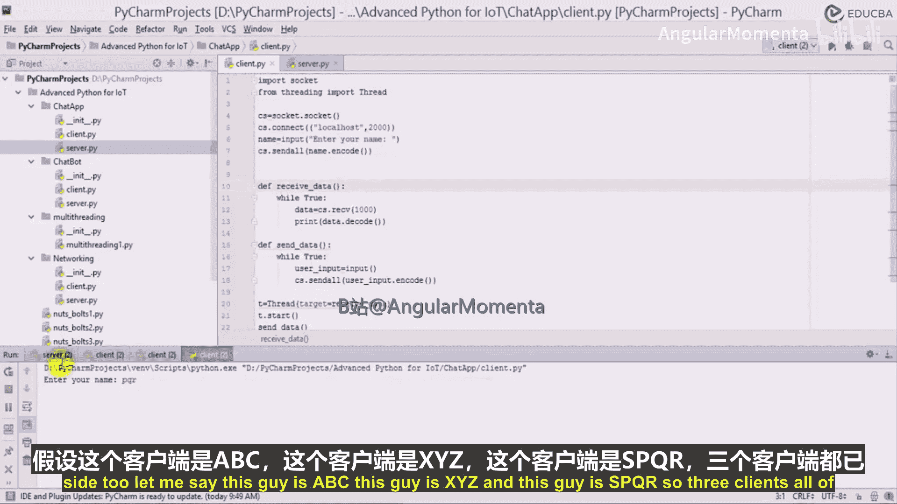
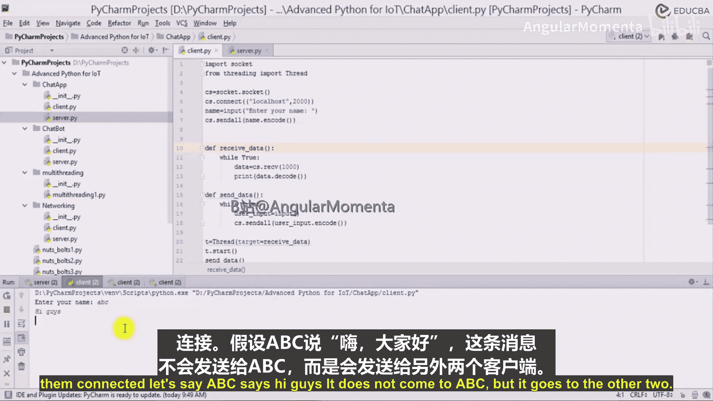
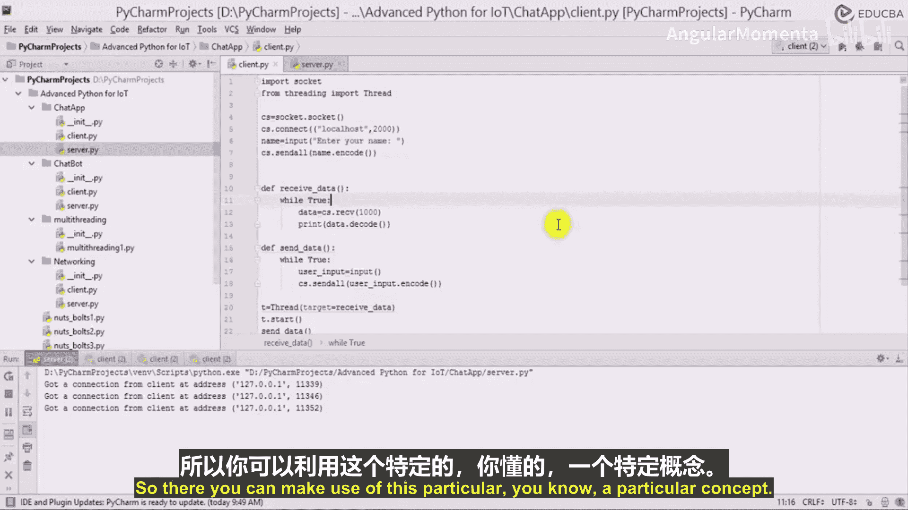
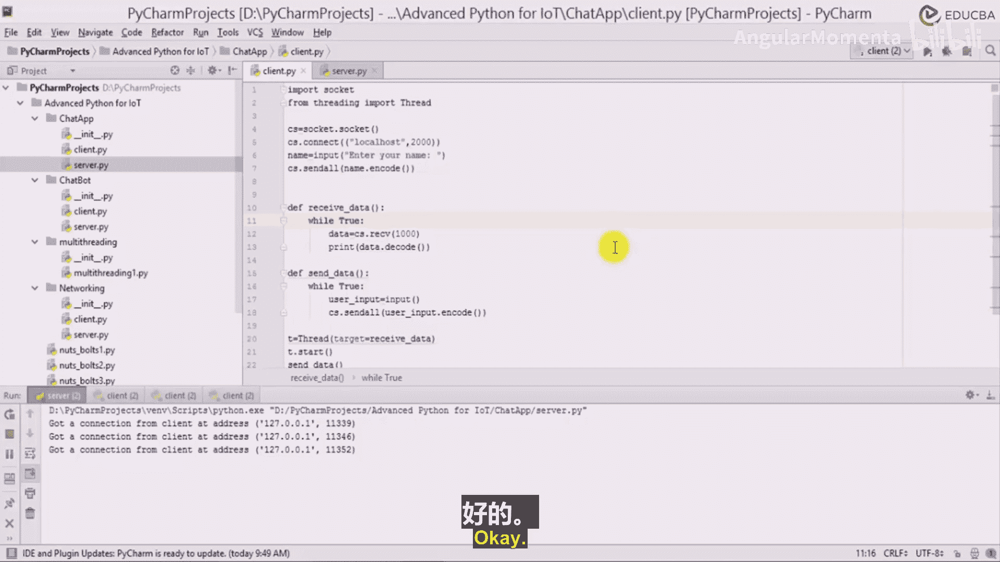

# 019：学习创建聊天应用 🗨️

在本节课中，我们将学习如何利用Python的线程（Threading）和套接字（Socket）编程来构建一个基础的聊天应用程序。我们将通过一个具体的代码示例，演示多个客户端如何通过一个中央服务器进行通信。

## 概述



我们将创建一个典型的客户端-服务器架构的聊天应用。服务器负责接收来自所有客户端的消息，并将其广播给其他客户端。每个客户端都将运行在一个独立的线程中，以实现并发通信。本节的核心目标是理解多线程与网络套接字在构建实时通信应用中的协同工作原理。



## 服务器端逻辑

上一节我们介绍了网络编程的基础概念，本节中我们来看看如何实现服务器端的核心逻辑。服务器的关键职责是持续接受新的客户端连接，并为每个连接创建一个独立的线程来处理消息收发。



以下是服务器端代码的核心步骤：

1.  **创建并绑定套接字**：服务器首先创建一个套接字对象，并将其绑定到特定的主机地址和端口。
2.  **监听连接**：服务器开始监听来自客户端的连接请求。
3.  **接受连接并创建线程**：当有客户端连接时，服务器接受该连接，获取客户端的套接字和地址信息，并为这个客户端创建一个新的线程。
4.  **处理客户端消息**：在每个客户端线程中，服务器持续接收该客户端发送的消息。
5.  **广播消息**：当收到一个客户端的消息后，服务器会遍历所有已连接的客户端列表，并将消息发送给除消息来源以外的所有其他客户端。



其核心广播逻辑可以用以下伪代码表示：
```python
for client in connected_clients:
    if client != message_sender:
        client.send(message)
```

## 客户端连接与测试

理解了服务器如何工作后，我们来看看客户端的连接过程以及如何进行测试。客户端需要连接到服务器，并能够同时发送和接收消息。

以下是启动和测试的步骤：

1.  首先运行服务器端程序。
2.  然后启动多个客户端程序，每个客户端在连接时都需要输入一个唯一的名称（如ABC， XYZ）。
3.  当客户端ABC发送消息“hi guys”时，服务器会收到这条消息。
4.  根据广播逻辑，服务器会将此消息转发给所有其他客户端（如XYZ），但不会发回给ABC本身。
5.  同样，其他客户端发送的消息也会被广播给除了发送者之外的全体成员。

通过这种方式，三个客户端（例如ABC， PQR， XYZ）就能通过服务器进行群组聊天。每个客户端发送的消息都会被其他客户端接收到，从而实现基本的聊天功能。

## 应用原理与扩展

我们已经成功创建了一个基础的聊天应用。这个示例清晰地展示了如何使用线程管理多个并发的网络连接，以及如何使用套接字进行数据传输。



本节课中我们一起学习了构建聊天应用的核心模式：**一个中央服务器** 与 **多个客户端线程**。这种客户端-服务器模型和广播通信机制是许多实时应用（如在线聊天室、简单协作工具）的基础。



掌握这些原理至关重要，因为它们是更高级概念的基础。例如，当你希望创建一个具有图形界面的应用，比如一个包含录音和发送按钮的语音聊天工具时，你可以在前端界面之下，利用我们今天所学的这种套接字与线程的通信架构来处理网络数据传输部分。