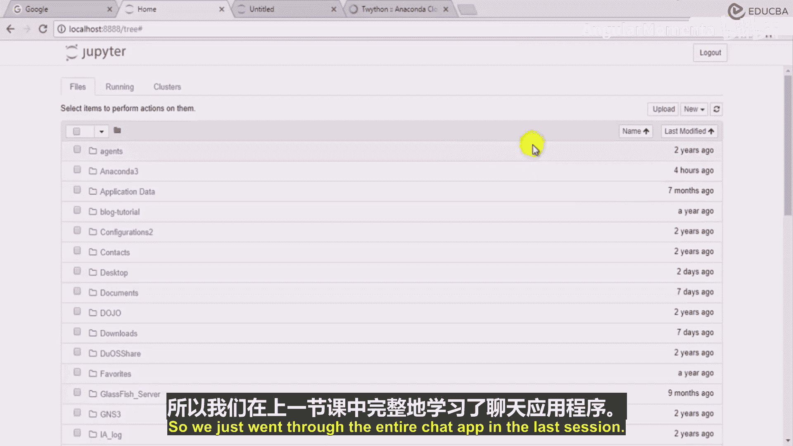
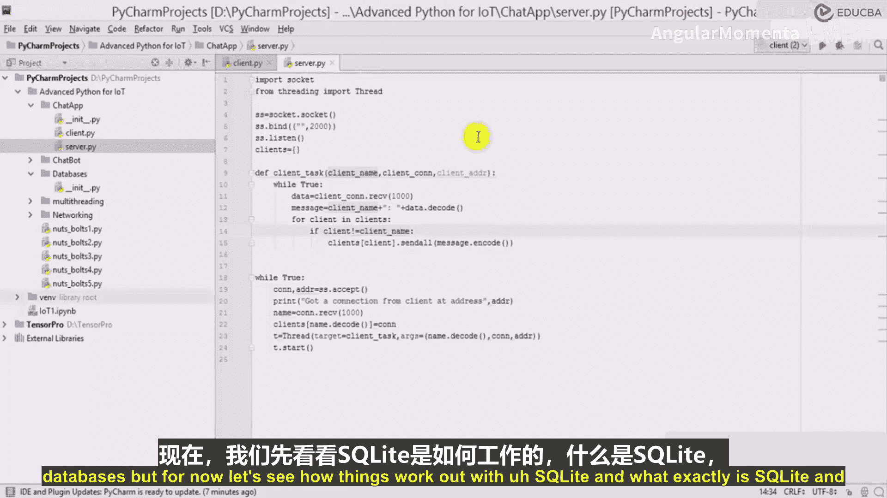
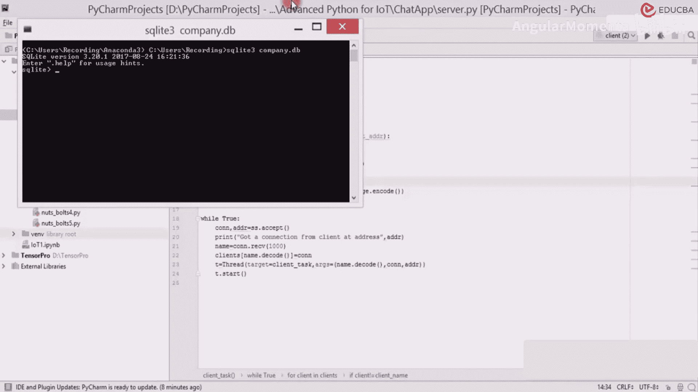

# 020：PyCharm数据库与SQLite 🗄️




在本节课中，我们将学习数据库的基础知识，特别是SQLite数据库，并探讨如何在Python应用程序中使用它来存储和管理数据。我们将从理解数据库的必要性开始，然后学习如何创建数据库和表，最后将其与我们的聊天应用程序联系起来。

上一节我们介绍了网络编程和多线程，并构建了一个基础的聊天应用。本节中，我们来看看如何为这个应用引入数据库来存储更复杂的用户数据。

## 为什么需要数据库？

在之前的聊天应用中，我们使用字典来存储客户端信息，例如用户名和连接对象。然而，这种方法存在局限性。

以下是字典存储的局限性：
*   字典只能存储有限的信息，通常是一对键值（如 `name: connection`）。
*   无法高效地存储和查询更复杂的用户信息，例如地址、电话号码或电子邮件。
*   当数据量增大（例如有上千个客户端）或需要长期保存时，字典并非理想的解决方案。

虽然可以将数据存储在文件中（如文本文件、CSV或Excel），但使用文件进行复杂的数据操作、查询和调试通常比较繁琐。相比之下，数据库提供了更结构化、高效和可靠的数据管理方式。大多数现代应用程序都广泛使用数据库。

## 引入SQLite数据库

为了学习数据库与Python的集成，我们将从SQLite开始。SQLite是一个轻量级的数据库引擎，非常适合入门和开发原型。

我们的长期目标是将聊天应用扩展，把客户端的详细信息（如邮箱、生日等）存储在数据库中。但首先，让我们学习SQLite的基础操作。

## 创建SQLite数据库和表

我们将通过命令行来创建数据库和表。以下是具体步骤：




1.  打开Anaconda Prompt（或系统终端）。
2.  使用 `sqlite3` 命令创建并进入一个名为 `company.db` 的数据库文件。命令是：`sqlite3 company.db`
3.  在数据库环境中，我们可以创建表。例如，创建一个名为 `employee` 的表。创建表的SQL命令通常如下格式：
    ```sql
    CREATE TABLE employee (
        id INTEGER PRIMARY KEY,
        name TEXT NOT NULL,
        email TEXT
    );
    ```



本节课中我们一起学习了数据库的基本概念及其在应用中的重要性，并初步实践了如何使用命令行创建SQLite数据库和表。在接下来的课程中，我们将深入学习如何在Python代码中连接和操作这个数据库，最终实现为聊天应用添加数据持久化功能。