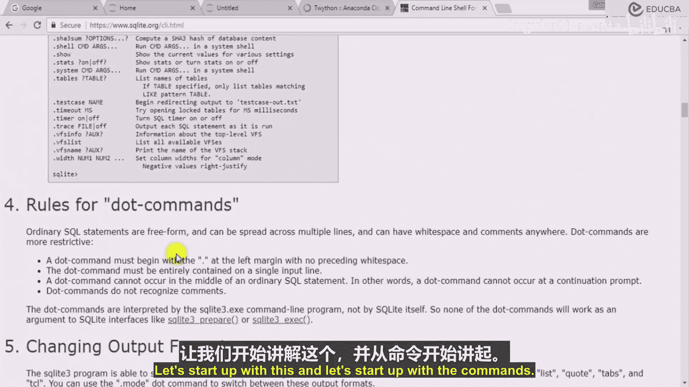
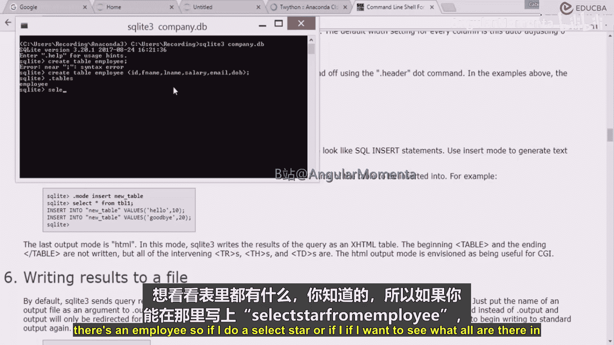
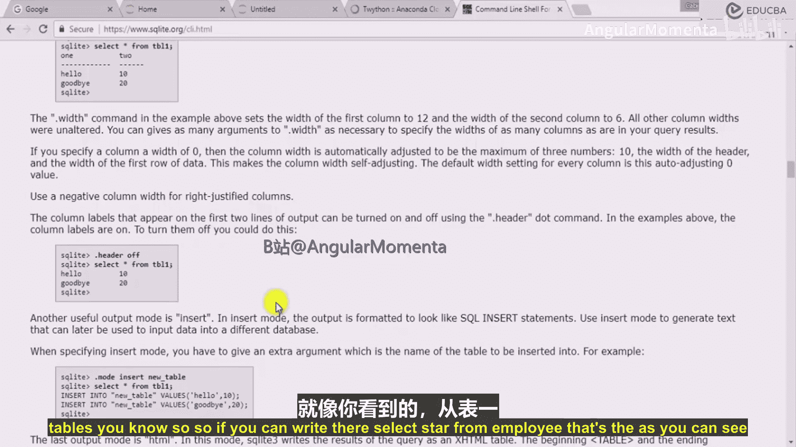
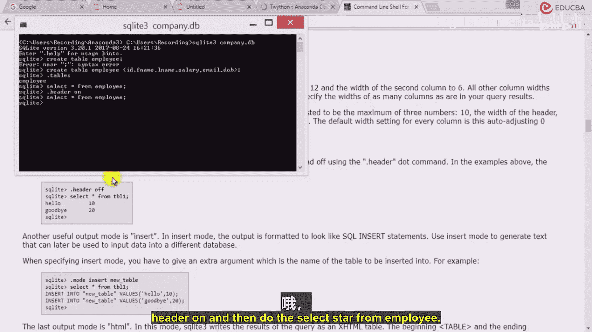
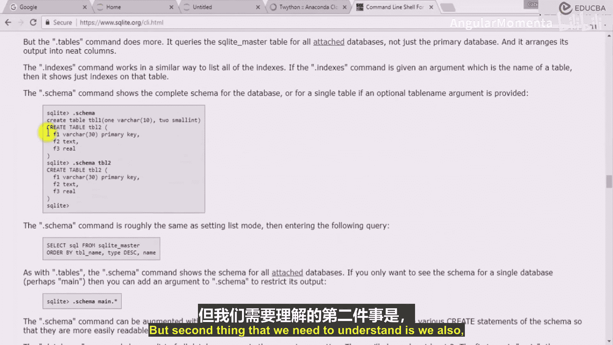
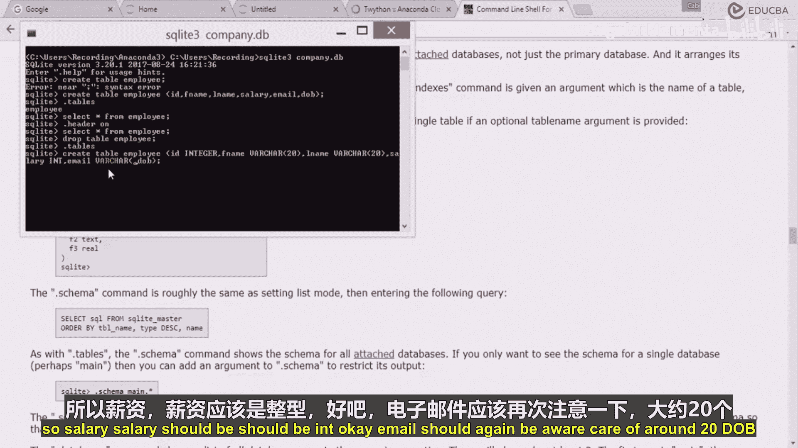
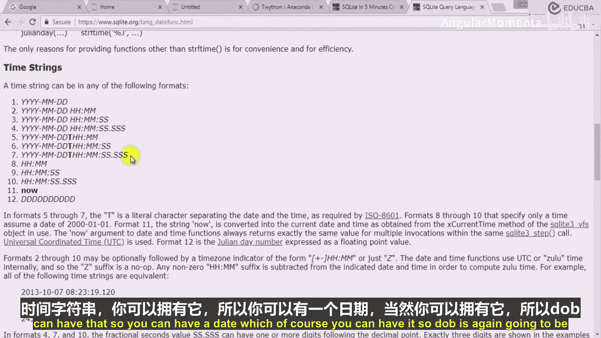
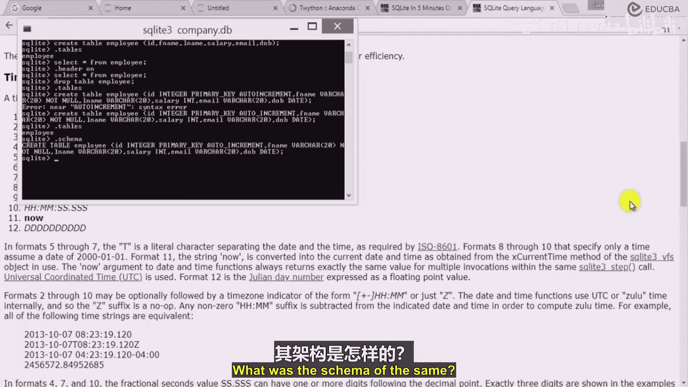

# 021：创建表格的命令 📝

在本节课中，我们将学习如何在SQLite数据库中创建表格。这是构建数据库结构的第一步，我们将详细讲解创建表格的命令语法、数据类型定义以及一些关键约束。

上一节我们介绍了SQLite的基本概念和命令行工具，本节中我们来看看如何使用SQL命令来定义和创建数据表。


## 创建表格的基础语法



创建表格的核心命令是 `CREATE TABLE`。其基本语法结构如下：

```sql
CREATE TABLE table_name (
    column1 datatype constraint,
    column2 datatype constraint,
    ...
);
```

*   `CREATE TABLE` 是SQL关键字，用于指示创建新表。
*   `table_name` 是你为新表起的名字。
*   括号 `()` 内定义了表的列（字段）。
*   每一列的定义包括列名、数据类型和可选的约束（如 `NOT NULL`, `PRIMARY KEY` 等）。
*   每个SQL语句（除了部分点命令）必须以分号 `;` 结尾。

## 创建表格的实践步骤

以下是创建一个名为 `employee` 的员工表的详细步骤。





首先，我们尝试一个不完整的命令，以理解错误信息：



```sql
CREATE TABLE employee;
```
执行此命令会报错，因为创建表时必须至少定义一列。

接下来，我们创建一个包含基本列定义的表：



```sql
CREATE TABLE employee (
    id INTEGER,
    first_name TEXT,
    last_name TEXT,
    salary INTEGER,
    email TEXT,
    dob DATE
);
```
执行成功后，可以使用 `.tables` 命令查看数据库中现有的表，确认 `employee` 表已创建。

## 为表格添加约束



约束用于定义关于列中数据的规则，确保数据的准确性和可靠性。以下是几个重要的约束：

*   **`PRIMARY KEY`**：唯一标识表中的每一行。一个表只能有一个主键。
*   **`AUTOINCREMENT`**：通常与 `INTEGER PRIMARY KEY` 一起使用，确保主键值自动递增。
*   **`NOT NULL`**：强制该列不能存储 `NULL` 值（即必须有值）。
*   **数据类型**：定义列可以存储的数据种类，如 `INTEGER`（整数）、`TEXT`（文本）、`REAL`（浮点数）、`DATE`（日期）等。

让我们重新创建一个带有约束的、更完善的 `employee` 表。首先，删除旧表：

```sql
DROP TABLE employee;
```

然后，创建新表：



```sql
CREATE TABLE employee (
    id INTEGER PRIMARY KEY AUTOINCREMENT,
    first_name TEXT NOT NULL,
    last_name TEXT,
    salary INTEGER,
    email TEXT,
    dob DATE NOT NULL
);
```
在这个例子中：
*   `id` 是自动递增的主键。
*   `first_name` 和 `dob` 是必填项（`NOT NULL`）。
*   `last_name`、`salary` 和 `email` 允许为空。

创建后，可以使用 `.schema employee` 命令查看该表的完整结构定义。

## 查看表格结构与数据

创建表格后，我们可以使用以下命令进行查看：

1.  **查看所有表格**：使用 `.tables` 命令。
2.  **查看表格结构**：使用 `.schema table_name` 命令。
3.  **查看表格数据**：使用 `SELECT` 语句。为了更清晰地显示列标题，可以先开启标题显示模式：
    ```sql
    .header on
    SELECT * FROM employee;
    ```
    由于我们尚未插入数据，此查询将返回一个空的结果集，但会显示列名。



本节课中我们一起学习了在SQLite中创建表格的核心命令 `CREATE TABLE`。我们掌握了定义列名、数据类型（如 `INTEGER`, `TEXT`, `DATE`）以及添加约束（如 `PRIMARY KEY`, `AUTOINCREMENT`, `NOT NULL`）的方法。此外，我们还学习了如何使用 `.tables`、`.schema` 和 `DROP TABLE` 等命令来管理和查看数据库中的表结构。这是构建任何数据库应用的基础，为后续的数据插入、查询和操作做好了准备。