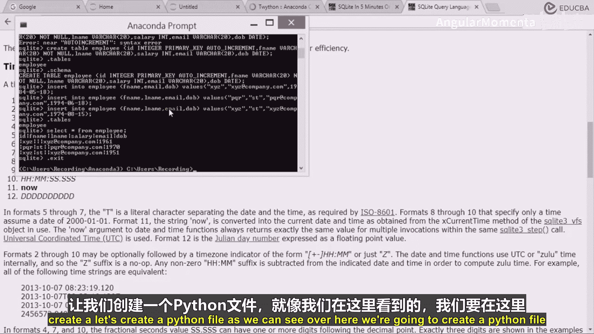

# 022：在表中插入数值

在本节课中，我们将学习如何在SQLite数据库的表中插入数据。我们将介绍基本的`INSERT`语句，包括插入所有列数据和选择性插入部分列数据，并演示如何查询和查看已插入的数据。

## 概述

上一节我们介绍了如何创建数据库和表。本节中，我们来看看如何向已创建的表中填充数据。我们将使用`INSERT INTO`语句，并学习其两种主要用法：为所有列插入值，以及仅为指定的列插入值。

## 向表中插入数据

要向表中插入数据，我们可以使用`INSERT`命令。

基本的语法格式是：
```sql
INSERT INTO 表名 (列1, 列2, ...) VALUES (值1, 值2, ...);
```

### 插入所有列的值

如果你想为表中的每一列都提供值，可以省略列名，直接按表定义的列顺序提供所有值。

以下是插入所有列值的示例：
```sql
INSERT INTO employee VALUES (1, ‘XYZ’, ‘Doe’, 50000, ‘xyz@company.com’, ‘1984-05-18’);
```

### 选择性插入部分列的值

有时，你可能只想为表中的部分列插入数据，其他列允许为空或使用默认值。这时，你需要在`INSERT INTO`语句中明确指定要插入数据的列名。

以下是选择性插入的示例。假设我们只想插入`F_name`（名）、`email`（邮箱）和`DOB`（出生日期）这三列：

```sql
INSERT INTO employee (F_name, email, DOB) VALUES (‘XYZ’, ‘xyz@company.com’, ‘1984-05-18’);
```
在这个例子中：
*   `F_name`的值是字符串`‘XYZ’`。
*   `email`的值是字符串`‘xyz@company.com’`。
*   `DOB`是日期类型，其值格式为`‘YYYY-MM-DD’`，即`‘1984-05-18’`。

### 插入多条记录

你可以连续执行多个`INSERT`语句来添加多条员工记录。

以下是插入更多员工的示例：
```sql
-- 插入员工PQR，提供更多信息
INSERT INTO employee (F_name, L_name, email, DOB) VALUES (‘PQR’, ‘PQSD’, ‘pqr@company.com’, ‘1994-01-01’);

-- 插入另一个名为XYZ但信息不同的员工
INSERT INTO employee (F_name, email, DOB) VALUES (‘Xyz’, ‘xyz@company.com’, ‘1974-08-05’);
```

## 查询与验证数据

插入数据后，我们需要验证操作是否成功。最常用的方法是使用`SELECT`语句查询表中的所有数据。

要查看`employee`表中的所有行和所有列，请使用以下命令：
```sql
SELECT * FROM employee;
```
执行此命令后，你将看到一个表格形式的输出，显示所有列（如`ID`、`F_name`、`L_name`、`salary`、`email`、`DOB`）以及我们刚刚插入的每一行数据。即使某些列（如未指定的`L_name`或`salary`）值为空（NULL），它们也会显示在结果中。

## 使用WHERE子句进行筛选查询

在实际应用中，我们经常不需要查看所有数据，而是希望根据特定条件进行筛选。这时可以使用`WHERE`子句。

例如，如果我们只想查看出生日期在某个特定年份之后的员工，可以这样查询：
```sql
SELECT * FROM employee WHERE DOB > ‘1990-01-01’;
```
或者，如果我们只想查看名字为‘XYZ’的员工：
```sql
SELECT * FROM employee WHERE F_name = ‘XYZ’;
```
`WHERE`子句是SQL中用于过滤结果集的核心工具，它允许我们执行更精确的数据检索。

## 退出SQLite

完成所有数据库操作后，你可以使用以下命令退出SQLite命令行界面：
```sql
.exit
```
执行此命令后，你将返回到操作系统的常规命令行环境。

## 总结与过渡

本节课中，我们一起学习了SQLite中插入数据的基本操作。我们掌握了使用`INSERT INTO`语句插入完整或部分数据，使用`SELECT *`查询全部数据，并初步了解了`WHERE`子句的筛选功能。这些是操作任何SQL数据库的基础。




现在，我们已经学会了如何手动在数据库中创建和填充数据。然而，在数据分析工作中，我们更希望通过Python程序来自动化这些过程。下一节，我们的目标将是建立Python代码与SQLite数据库之间的连接。我们将学习如何从Python中创建数据库连接、执行SQL命令（如插入和查询），从而实现用Python程序来管理和操作数据，为更复杂的数据分析任务打下基础。