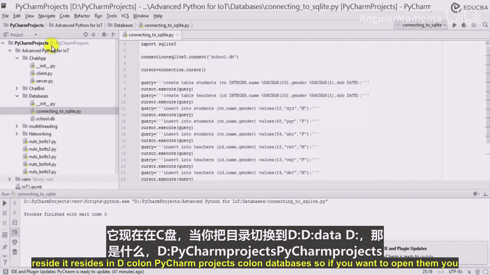
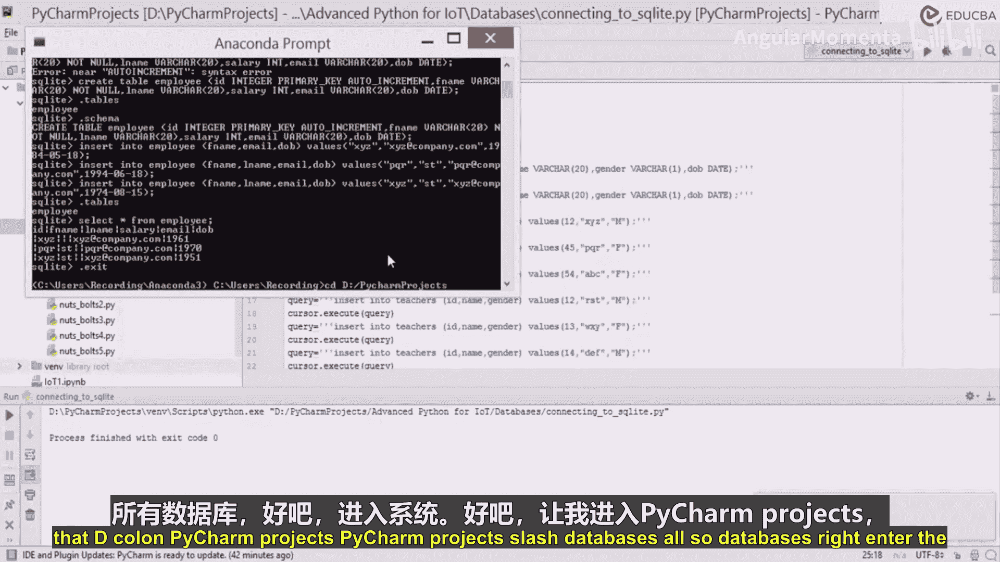
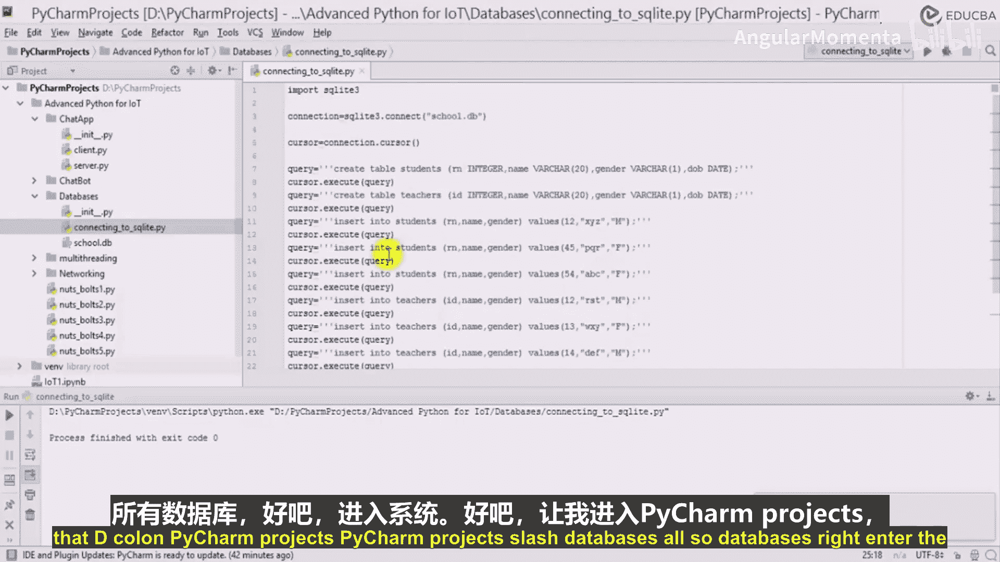
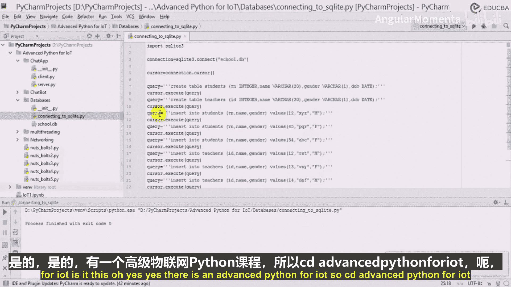
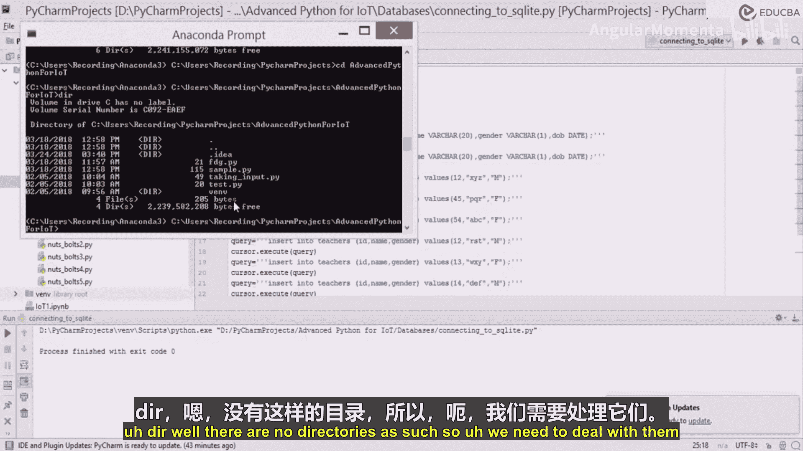

# 023：连接数据库与Python代码 🗄️➡️🐍

在本节课中，我们将学习如何使用Python代码连接并操作SQLite数据库。我们将创建一个数据库，在其中建立数据表，并向表中插入数据。

## 概述

我们将通过Python的`sqlite3`库，逐步演示如何连接到SQLite数据库、创建数据表、插入数据，并最终提交更改。整个过程将展示Python与数据库交互的基本流程。

## 创建连接与游标

首先，我们需要导入`sqlite3`库并建立与数据库的连接。如果指定的数据库不存在，系统会自动创建一个新的数据库文件。

```python
import sqlite3
```

接下来，我们使用`connect`函数连接到名为`school.db`的数据库。连接对象将帮助我们获取一个游标。

```python
connection = sqlite3.connect('school.db')
cursor = connection.cursor()
```

游标是数据库操作的核心工具，它允许我们指向数据库中的特定位置，并执行SQL查询命令。

## 创建数据表

在建立连接后，我们可以开始定义数据库的结构。以下是创建`students`（学生）表和`teachers`（教师）表的步骤。

我们将编写SQL查询语句来创建表。每个SQL命令被称为一个查询。

```python
query_student_table = """
CREATE TABLE student (
    roll_number INTEGER,
    name VARCHAR(20),
    gender VARCHAR(1),
    dob DATE
);
"""

query_teacher_table = """
CREATE TABLE teacher (
    id INTEGER,
    name VARCHAR(20),
    gender VARCHAR(1),
    dob DATE
);
"""
```

编写完查询语句后，我们需要使用游标的`execute`方法来执行它们，从而在数据库中创建相应的表。

```python
cursor.execute(query_student_table)
cursor.execute(query_teacher_table)
```

## 向表中插入数据

表结构创建完成后，下一步是向表中添加数据。我们将分别为`students`表和`teachers`表插入多条记录。

以下是向`students`表插入数据的示例。我们使用`INSERT INTO`语句，并注意字符串值需要用双引号括起来。

```python
insert_student_query = """
INSERT INTO student (roll_number, name, gender)
VALUES (12, "XYZ", "M");
"""
cursor.execute(insert_student_query)
```

我们可以复制并修改上述代码，为`students`表插入更多记录，例如学号为45和54的学生。

```python
cursor.execute("""INSERT INTO student VALUES (45, "PQR", "F", NULL);""")
cursor.execute("""INSERT INTO student VALUES (54, "ABC", "F", NULL);""")
```

类似地，我们为`teachers`表插入数据。每条记录包含ID、姓名和性别。

```python
cursor.execute("""INSERT INTO teacher (id, name, gender) VALUES (12, "UVW", "M");""")
cursor.execute("""INSERT INTO teacher (id, name, gender) VALUES (13, "XYZ", "F");""")
cursor.execute("""INSERT INTO teacher (id, name, gender) VALUES (14, "DEF", "M");""")
```

## 提交更改与关闭连接

所有数据操作完成后，必须提交更改，否则数据库不会保存任何修改。提交后，关闭数据库连接是一个好习惯。



```python
connection.commit()
connection.close()
```





运行整个脚本后，数据库文件`school.db`将被创建并保存在项目目录中。你可以使用数据库浏览器工具查看其中的`student`和`teacher`表，确认数据已成功插入。




## 总结



本节课中我们一起学习了使用Python连接和操作SQLite数据库的核心步骤。我们掌握了如何建立连接、获取游标、执行SQL查询来创建表、插入数据，并最终提交和关闭连接。这是进行数据持久化存储的基础。