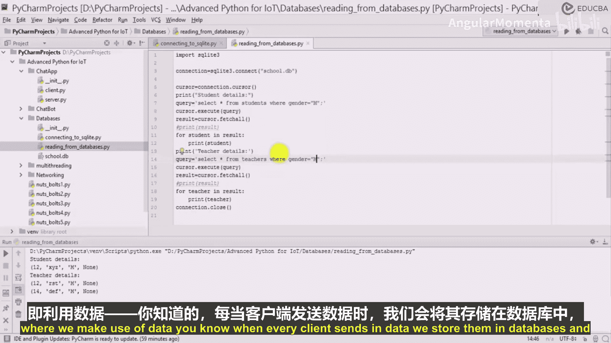

# 024：数据库查询 📊

在本节课中，我们将学习如何使用Python从SQLite数据库中读取数据。我们将涵盖建立数据库连接、执行查询以及处理查询结果的基本步骤。

上一节我们介绍了如何创建数据库和表，本节中我们来看看如何从这些表中读取数据。

## 建立连接与游标


首先，我们需要导入`sqlite3`模块，并与数据库文件建立连接。连接成功后，创建一个游标对象来执行SQL命令。

```python
import sqlite3

# 连接到数据库文件
connection = sqlite3.connect('school.db')
# 创建游标
cursor = connection.cursor()
```

## 执行查询与获取结果

以下是执行SQL查询并从数据库中获取数据的基本步骤。

1.  **定义查询语句**：编写你想要执行的SQL查询。
2.  **执行查询**：使用游标的`.execute()`方法运行SQL语句。
3.  **获取结果**：使用`.fetchall()`方法获取所有查询结果。
4.  **处理结果**：遍历结果集并打印或处理每一行数据。
5.  **关闭连接**：操作完成后，务必关闭数据库连接以释放资源。

```python
# 1. 定义查询：获取所有学生
query = "SELECT * FROM students"
# 2. 执行查询
cursor.execute(query)
# 3. 获取所有结果
result = cursor.fetchall()

# 4. 处理结果
print("学生详情：")
for student in result:
    print(student)

# 5. 关闭连接
connection.close()
```

## 使用WHERE子句进行筛选

我们可以使用`WHERE`子句来筛选特定的数据。例如，只想获取性别为男性的学生记录。

```python
# 查询所有男性学生
query_male = "SELECT * FROM students WHERE gender = 'M'"
cursor.execute(query_male)
male_students = cursor.fetchall()

print("男性学生：")
for student in male_students:
    print(student)
```

同样地，我们可以查询所有女性教师。

```python
# 查询所有女性教师
query_female_teachers = "SELECT * FROM teachers WHERE gender = 'female'"
cursor.execute(query_female_teachers)
female_teachers = cursor.fetchall()

print("女性教师：")
for teacher in female_teachers:
    print(teacher)
```

## 总结



本节课中我们一起学习了从SQLite数据库读取数据的关键操作。我们掌握了如何建立连接、创建游标、执行`SELECT`查询，以及如何使用`WHERE`子句过滤结果。这些是进行数据检索和后续分析的基础。在接下来的课程中，我们将把这些知识应用到实际项目中，例如在聊天应用程序中存储和访问用户数据。