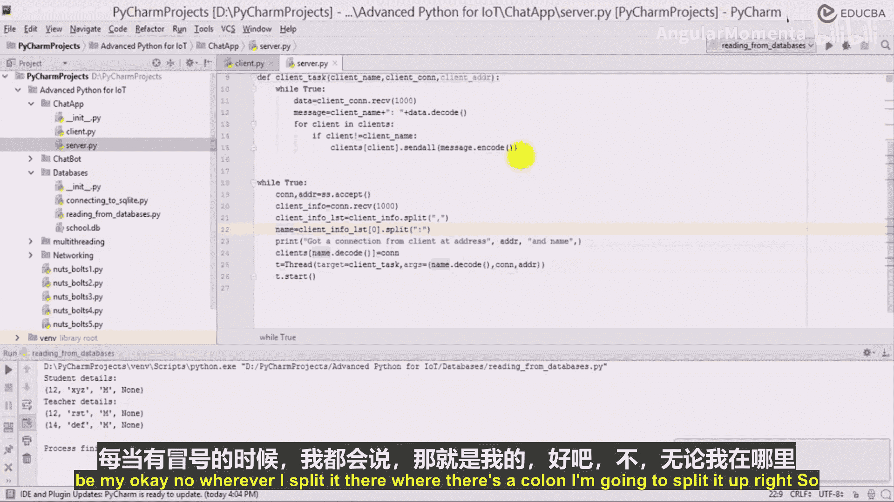
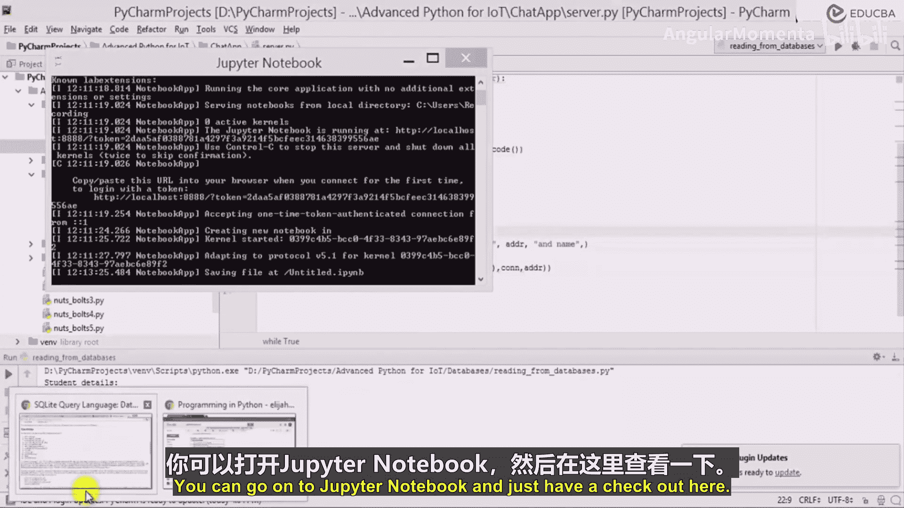
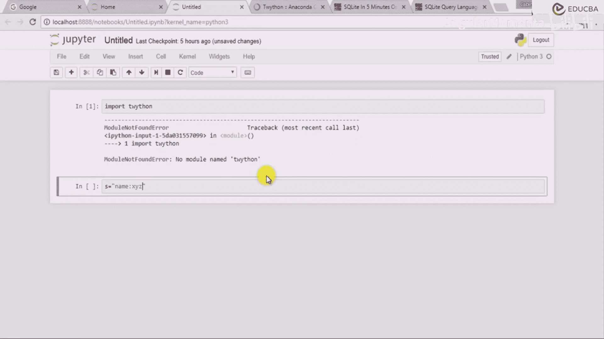
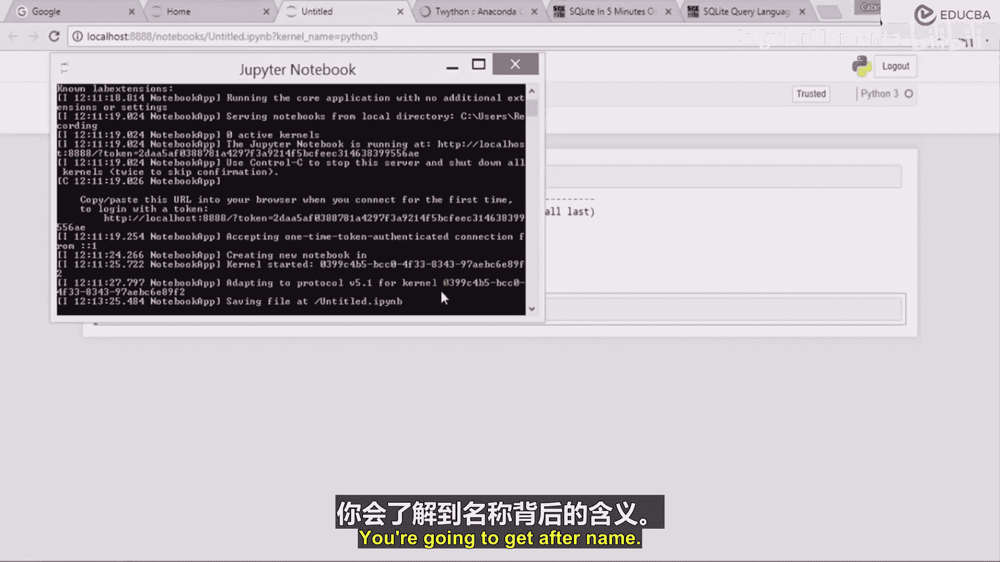
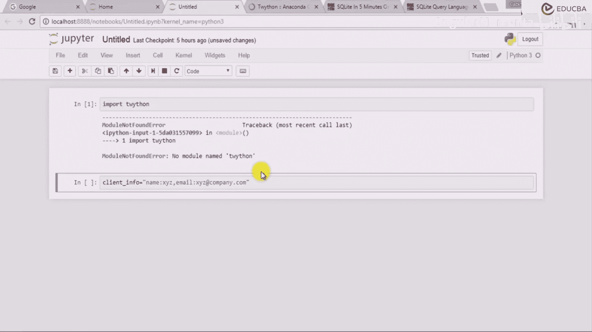

# 025：聊天应用中的变更实施 💬

在本节课中，我们将学习如何修改一个简单的聊天应用，使其能够收集并处理客户端发送的更多信息，例如姓名和电子邮件地址。我们将重点讲解如何在客户端收集数据，在服务器端解析数据，并实现基本的数据库连接概念。

---

上一节我们介绍了聊天应用的基本结构，本节中我们来看看如何修改客户端和服务器端代码，以接收和处理更多用户信息。

现在，为了在聊天应用中进行更改，我们可以直接转到聊天应用。让我们点击客户端和服务器。我们只想做一些修改，主要是希望在这里实现数据库连接功能。

我们希望当客户端连接时，不仅获取其姓名，还能获取他的许多其他详细信息。例如，除了姓名，他可能还会输入其他信息。假设他输入姓名并进入后，你可以询问他来自哪里。也许你可以询问他的电子邮件。所以，需要输入“请输入您的电子邮件”。这是一件事。

假设除了电子邮件，我还想让他提供出生日期。让我说输入。好吧，目前先不考虑出生日期，我们可以暂时不处理它。但当你除了姓名和电子邮件之外还有几项信息时，比如他的IP地址也需要存储。类似这样的信息需要存储。

我们可以这样做。我们可以直接创建一个字典。假设创建一个 `client_info` 字典，它将是一个空字典。但当姓名被输入时，我可以说 `client_info`。我将把 `name` 作为其中一个键值对放进去。`client_info['name']` 等于输入“请输入您的姓名”，而 `client_info['email']` 将成为 `client_info` 的另一个键。这样，我们就可以从用户那里获取这两项信息。当我发送时，我将对它们进行编码，基本上同时获取 `client_info['name']` 和 `client_info['email']`，将它们编码后一起发送出去。

也许我们可以创建一个字符串。假设 `client_final_info` 字符串将包含他的姓名。那么，我们就不在这里创建字典了，因为无论如何我们都要将其附加到其他地方。所以，我们在这里只使用两个简单的变量，一个是 `name`，另一个是 `email`。我将在这里定义它们，然后创建一个类似 `client_info_now` 的变量，它将等于 `name` 和电子邮件。我将以某种方式存储它，例如“姓名: [姓名]”，然后是“电子邮件: [电子邮件]”。现在，当我发送到服务器时，我将只发送 `client_info_now.encode()`。这样，我就发送了用冒号分隔的姓名和电子邮件。在姓名之后，我可以加一个逗号，以便两者之间有清晰的区分。这样，一个是姓名，一个是电子邮件，两者都在那里。

最初发送时，当然，我的服务器端应该相应地进行更改。好的，编辑器在哪里？它说“姓名: [你的姓名]”和“电子邮件: [输入]”。好的，让我检查一下。我认为这里有一个错误。好了，保存了。让我转到服务器端。

在服务器端，我基本上会收到来自客户端的连接 `conn` 和地址 `addr`。我手头有客户端的地址和姓名。所以，当我执行 `conn.recv()` 接收数据时，收到的将不仅仅是姓名，而是客户端发送的完整信息 `client_final_info`。我需要存储它们以备后用。

假设 `client_final_info`。使用 `.split` 方法在逗号处分割，这将给我一个列表 `client_info_list`。现在，这个特定的列表，我们必须处理它。分割后，我们将得到一个列表。假设我们心中有这个概念。然后我需要将它们再次分割成不同的部分。我有“姓名: [姓名]”和地址等信息。我可以直接在这里打印：“一个名为 [姓名] 的客户端已连接。”而不是在这里打印。好的，所以我复制这个并放在这里。我删除这个。我们收到了来自地址 `addr` 和姓名为 `client_final_info` 的客户端的连接。

我必须再次分割它，因为 `client_info_list` 包含这两部分。所以，假设索引0包含“姓名: [姓名]”，所以我需要再次在冒号处分割它。当有冒号时，我将在冒号处分割。也许我们可以尝试一下，只需在 Jupyter notebook 上快速测试一下。

---

以下是关键步骤的代码示例：

**客户端修改示例：**
```python
# 收集用户信息
name = input("请输入您的姓名: ")
email = input("请输入您的电子邮件: ")

# 构建发送字符串，格式为 "姓名:xxx,电子邮件:yyy"
client_info_now = f"姓名:{name},电子邮件:{email}"

# 发送编码后的信息
client_socket.send(client_info_now.encode())
```

**服务器端修改示例：**
```python
# 接收客户端信息
data = conn.recv(1024).decode()
if data:
    # 首先在逗号处分割，得到 ["姓名:xxx", "电子邮件:yyy"]
    info_parts = data.split(',')
    
    # 初始化字典存储解析后的信息
    client_data = {}
    for part in info_parts:
        # 每个部分在冒号处分割
        key, value = part.split(':')
        client_data[key] = value
    
    # 提取姓名
    client_name = client_data.get('姓名', '未知用户')
    print(f"一个名为 {client_name} 的客户端已连接。地址: {addr}")
```

---

让我们在 Jupyter notebook 中快速测试一下字符串分割的逻辑。假设这是你将收到的字符串：`"姓名:XYZ,电子邮件:XYZ@company.com"`。





我们将检查如何分割。首先，在逗号处分割得到列表：`["姓名:XYZ", "电子邮件:XYZ@company.com"]`。然后，遍历列表中的每个元素，在冒号处再次分割，以提取键值对。





---



本节课中我们一起学习了如何扩展聊天应用的功能，使其能够从客户端接收并解析包含多个字段（如姓名和电子邮件）的复合信息。我们通过构建特定格式的字符串在客户端组织数据，并在服务器端使用 `.split()` 方法进行两次分割来提取所需信息。这为将来集成数据库存储更丰富的用户资料奠定了基础。