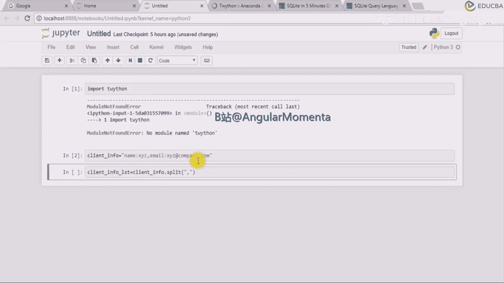
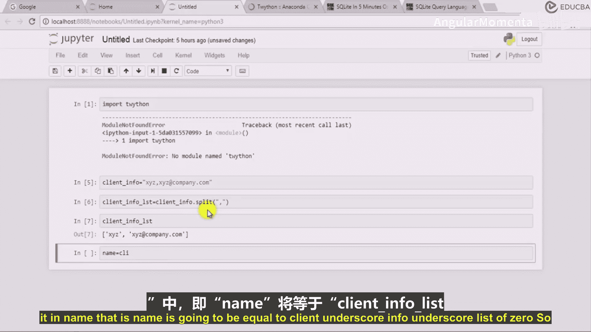
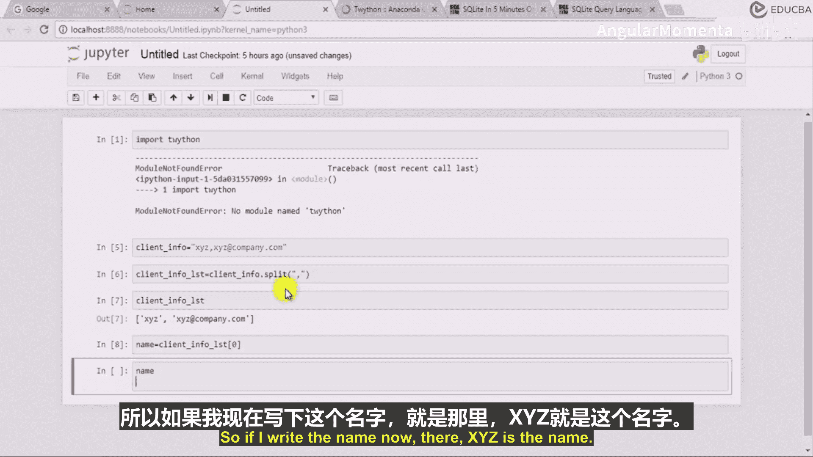
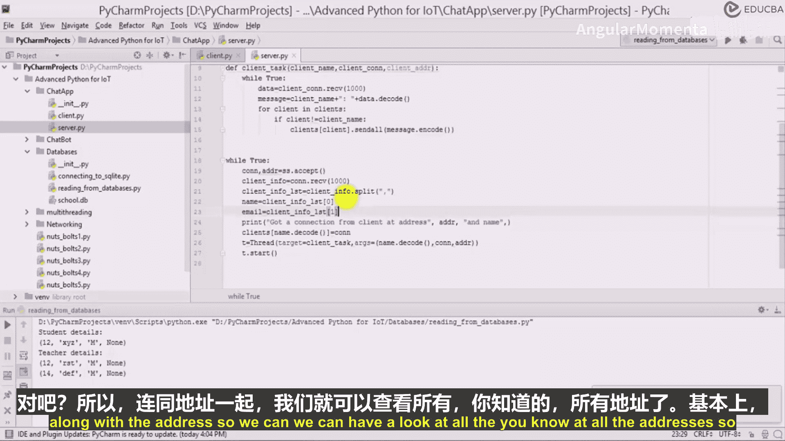
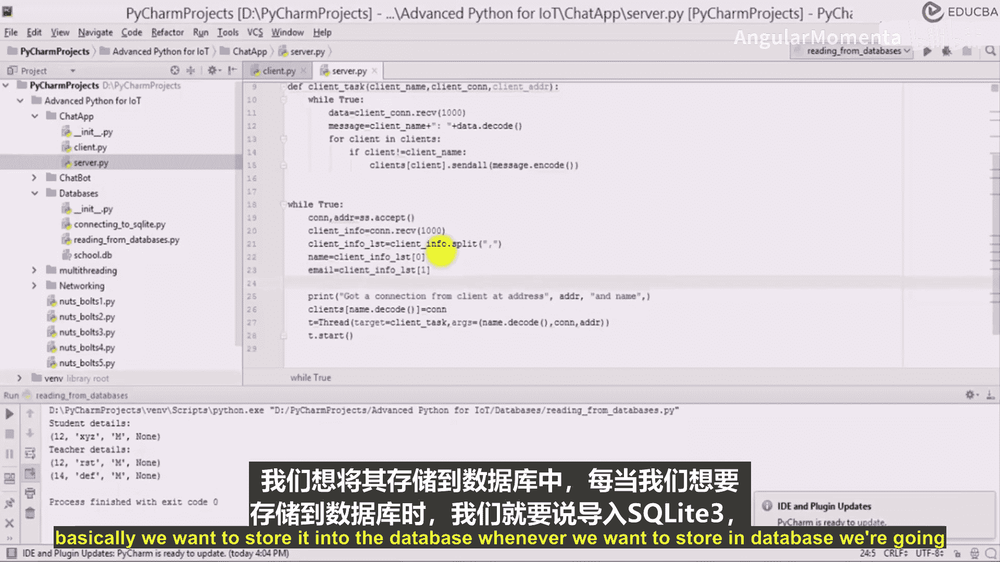

# 026：解码客户信息与数据库存储 🧩



在本节课中，我们将学习如何从接收到的二进制数据中解码客户信息，并将这些信息（如姓名和邮箱）存储到SQLite数据库中。整个过程涉及字符串分割、数据解码和数据库操作。

上一节我们介绍了网络通信中数据的接收，本节中我们来看看如何处理接收到的具体数据。

## 解码与分割客户信息

首先，我们接收到的是一个二进制格式的客户信息。为了处理它，我们需要将其解码为字符串，然后根据特定分隔符进行分割。

以下是处理步骤：
1.  对二进制数据 `client_score_info` 调用 `.decode()` 方法，将其转换为字符串。
2.  使用 `.split()` 方法，在逗号 `,` 处分割字符串，得到一个包含姓名和邮箱的列表。

```python
client_info_str = client_score_info.decode()
client_info_list = client_info_str.split(',')
```
执行上述代码后，`client_info_list` 将是一个包含两个元素的列表，例如 `['XYZ', 'xyz@company.com']`。





## 提取姓名与邮箱


从分割得到的列表中，我们可以轻松地提取出独立的姓名和邮箱变量。



以下是提取方法：
*   **姓名** 是列表的第一个元素（索引0）。
*   **邮箱** 是列表的第二个元素（索引1）。



```python
name = client_info_list[0]
email = client_info_list[1]
```
现在，`name` 变量存储了客户姓名（如“XYZ”），`email` 变量存储了客户邮箱（如“xyz@company.com”）。这些数据已经准备好被存入数据库。


## 连接与创建数据库


为了存储数据，我们需要先建立与SQLite数据库的连接，并确保存在一张可以存储客户信息的表。

以下是数据库初始化步骤：
1.  导入 `sqlite3` 模块。
2.  使用 `sqlite3.connect()` 连接到数据库文件（例如 `chat.db`）。
3.  通过连接创建游标（`cursor`）。
4.  使用游标执行SQL语句，创建 `clients` 表。该表包含 `client_name`、`email` 和 `addr` 等字段。


```python
import sqlite3


# 连接到数据库（如果不存在则创建）
connection = sqlite3.connect('chat.db')
cursor = connection.cursor()


# 创建clients表
cursor.execute('''
    CREATE TABLE IF NOT EXISTS clients (
        client_name VARCHAR(20),
        email VARCHAR(20),
        addr VARCHAR(20)
    )
''')
connection.commit()
```

## 插入数据到数据库


在成功解码信息并建立数据库连接后，最后一步是将提取出的客户数据插入到数据库表中。

以下是数据插入方法：
在每次需要保存数据时，使用游标执行 `INSERT` SQL语句，将 `name` 和 `email` 变量的值作为参数传入。


```python
# 将解码后的客户信息插入数据库
cursor.execute("INSERT INTO clients (client_name, email) VALUES (?, ?)", (name, email))
connection.commit()
```
请注意，在实际的网络服务器应用中，每个客户端连接通常在一个独立的线程中处理。因此，为每个线程创建独立的数据库游标是必要的，以避免数据操作冲突。


本节课中我们一起学习了如何解码二进制格式的客户信息，通过字符串分割提取关键数据，并最终将这些数据持久化存储到SQLite数据库中。这是构建数据处理管道的关键一步。