# 027：客户端元素索引与数据库插入 🧩

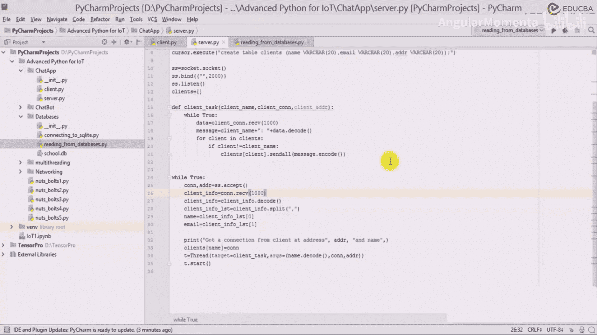


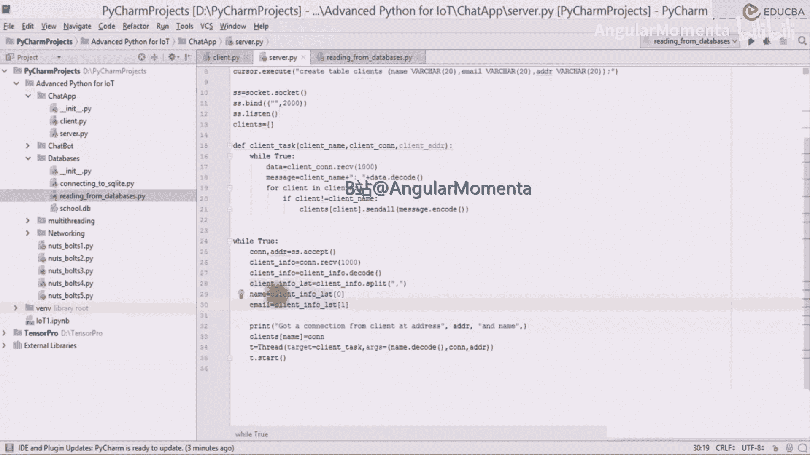


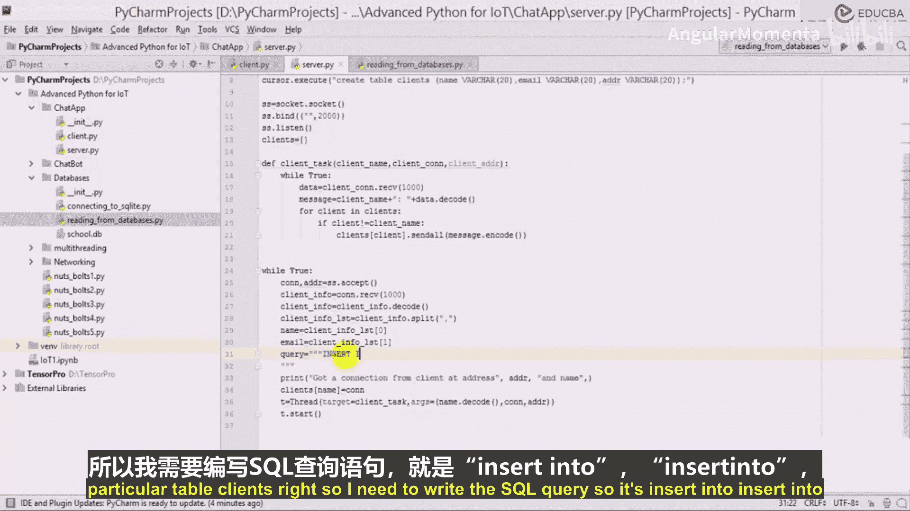

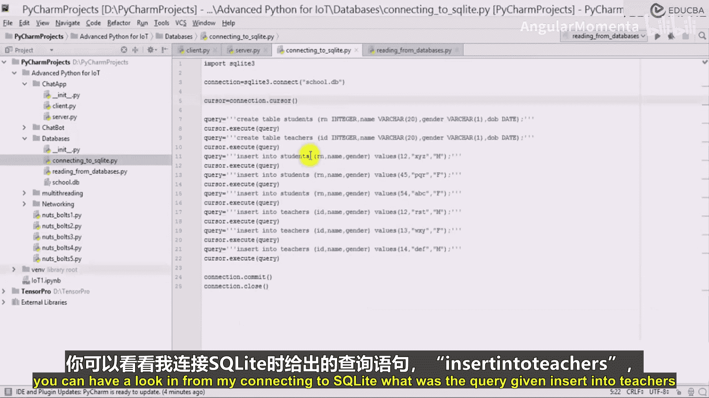

在本节课中，我们将学习如何将从客户端接收到的数据（如姓名和邮箱）进行解码、索引，并最终通过SQL查询插入到数据库的`clients`表中。我们将重点关注数据提取、SQL语句构建以及错误调试的过程。


---


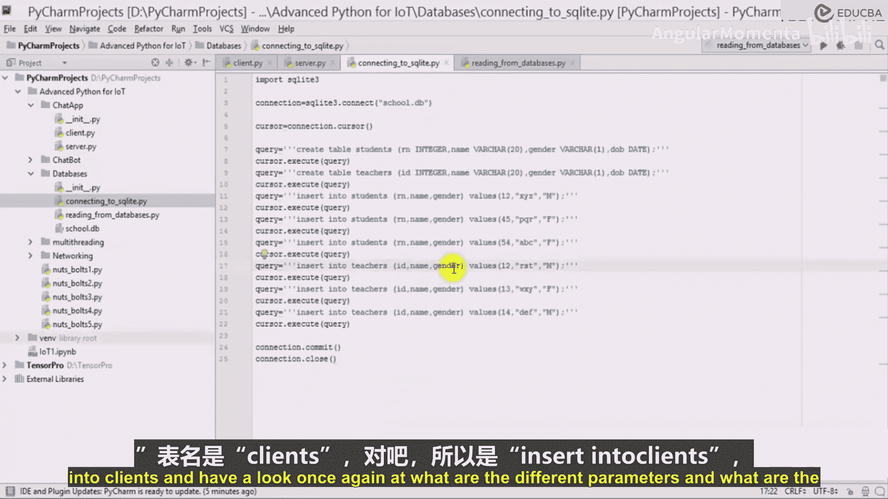


上一节我们介绍了如何建立服务器与客户端的连接并接收数据。本节中，我们来看看如何处理接收到的数据，并将其存入数据库。

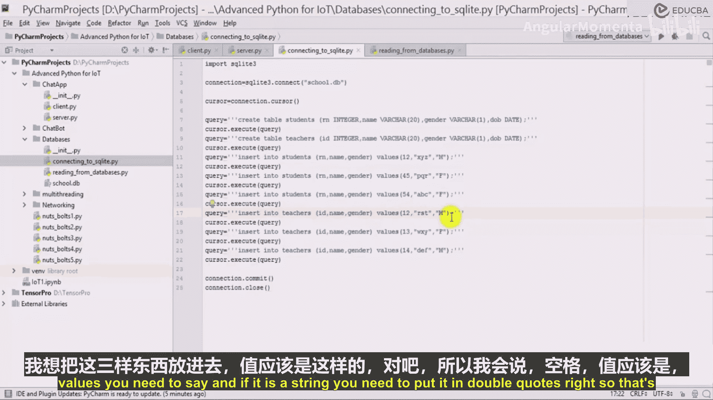


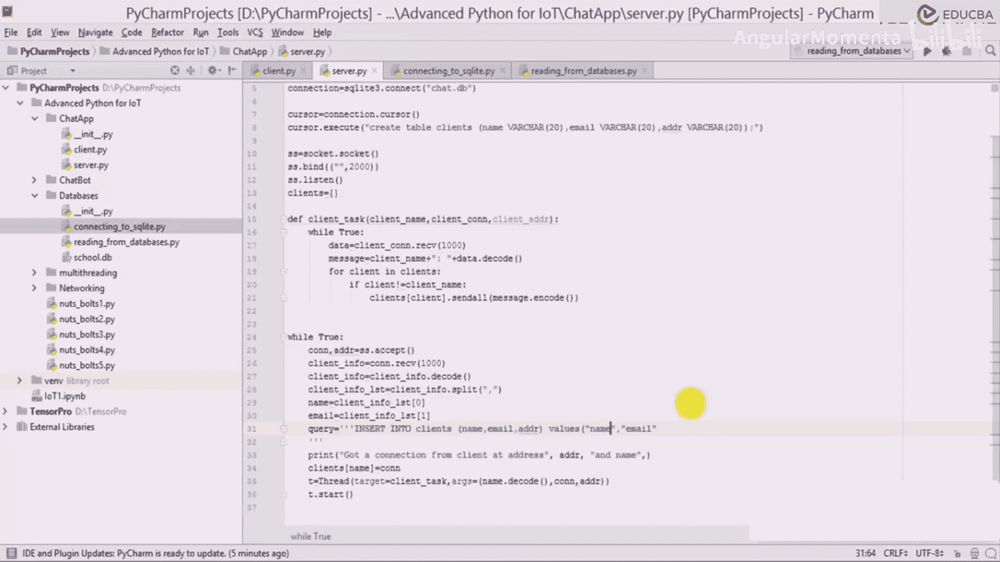


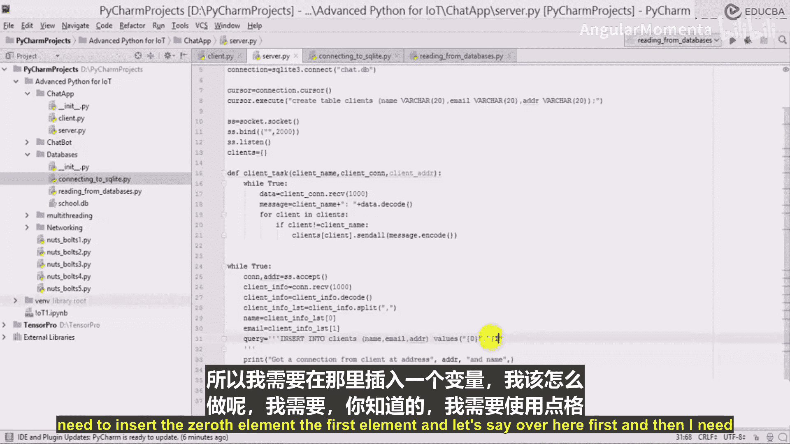

我们已经解码了客户端信息，并将其放入一个列表中。在这个列表中，我们索引了第0个元素（姓名）和第一个元素（邮箱）。现在，我们已获得来自客户端的连接，需要执行下一步操作。


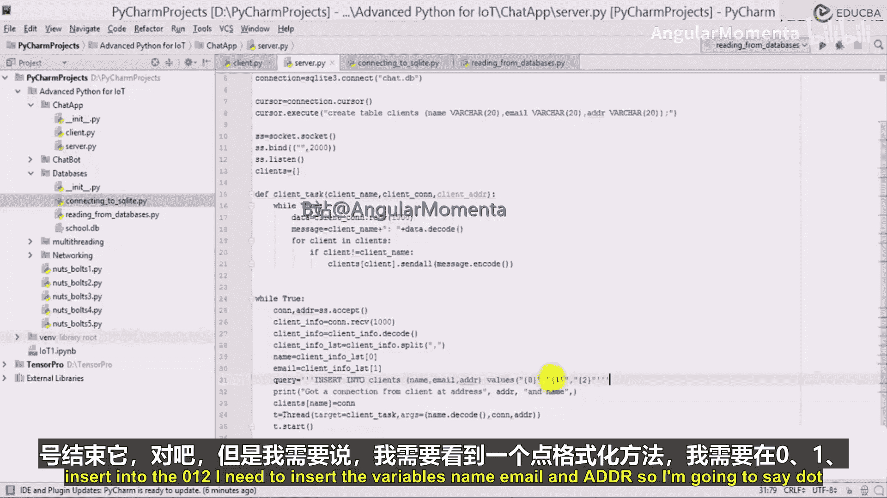

我们需要将姓名和邮箱存储到名为`clients`的特定表中。为此，我们需要编写SQL查询语句。


以下是构建插入查询的步骤：

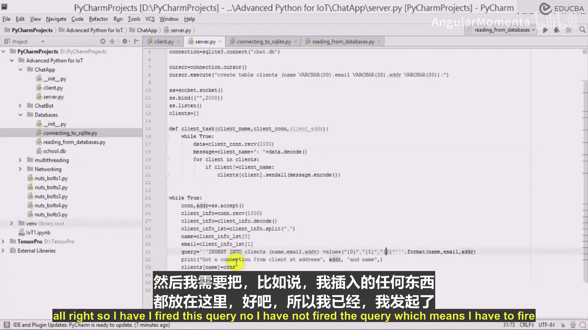


1.  **编写基础SQL语句**：使用`INSERT INTO`语句指定目标表（`clients`）和要插入的列（例如`name`, `email`, `addr`）。
2.  **处理变量插入**：查询中的值需要是变量（如`name`, `email`, `addr`），而非固定的字符串。我们使用字符串的`.format()`方法来实现。
3.  **执行与提交**：使用数据库游标的`execute()`方法运行SQL查询，然后通过连接的`commit()`方法提交事务，确保数据永久保存。

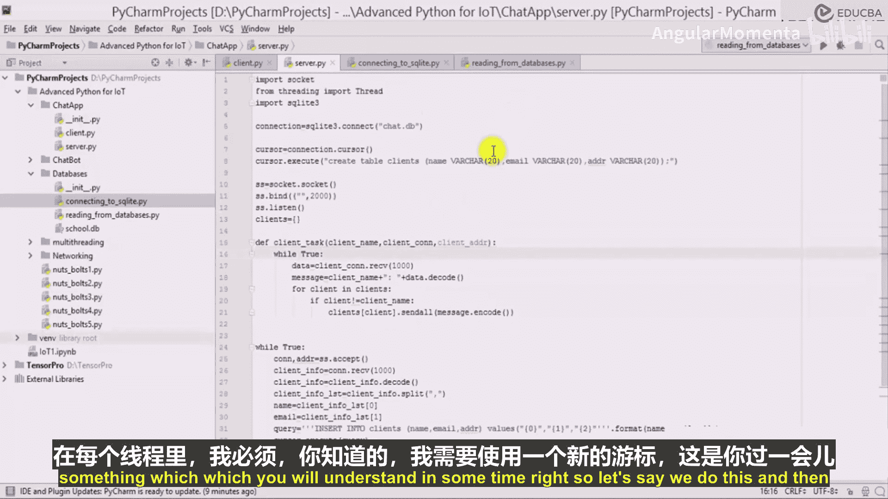

核心的SQL插入语句和Python执行代码如下：
```python
query = """INSERT INTO clients (name, email, addr) VALUES ("{}", "{}", "{}")""".format(name, email, addr)
cursor.execute(query)
connection.commit()
```


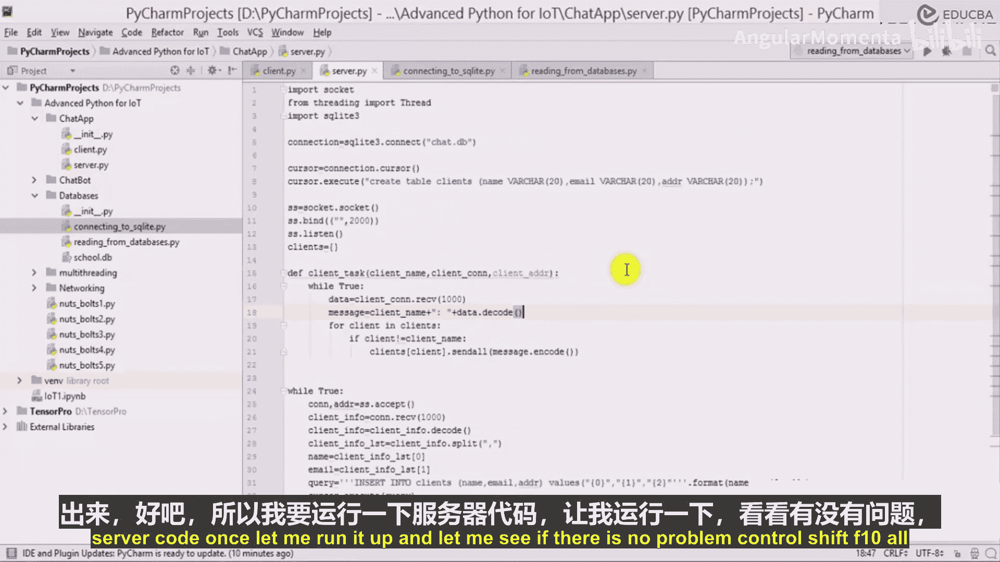


---


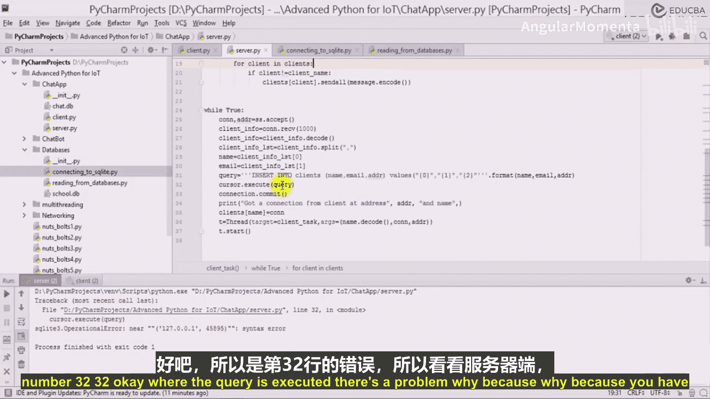

在编写并执行代码后，我们遇到了错误，需要进行调试。


首先遇到的错误是“near ... syntax error”。这表明SQL语句的语法可能有问题。经过检查，问题出在`addr`变量上。`addr`本身是一个包含IP和端口的元组（例如`('127.0.0.1', 65432)`），直接放入SQL语句会导致语法错误。


为了诊断问题，我们打印了`addr`及其类型：
```python
print(addr)
print(type(addr))
```
输出确认`addr`是一个元组。我们需要将其转换为字符串才能插入数据库。可以使用`str()`函数进行转换：
```python
addr_str = str(addr)
```

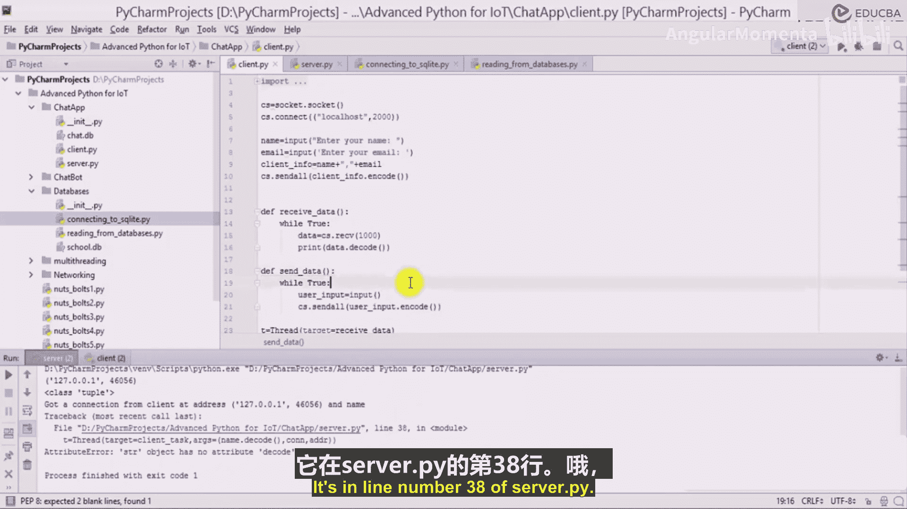


解决了`addr`的问题后，再次运行程序，又遇到了新的错误：“‘str’ object has no attribute ‘decode’”。这个错误发生在尝试对已经是字符串的`name`变量再次调用`.decode()`方法时。回顾代码，我们在更早的阶段已经对接收到的字节流进行了解码，因此此处的`name`已经是字符串，无需再次解码。我们移除了这行多余的代码。

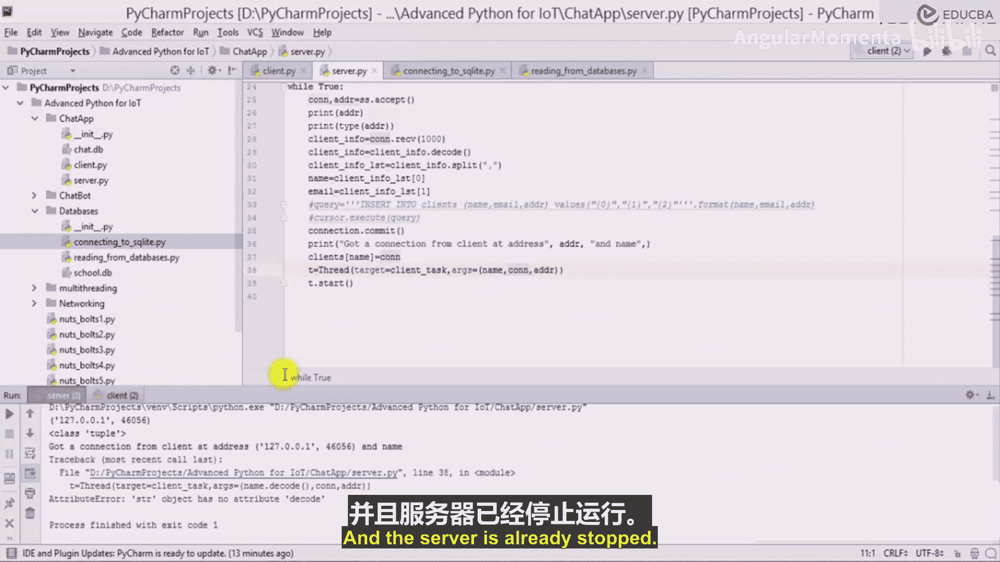

---

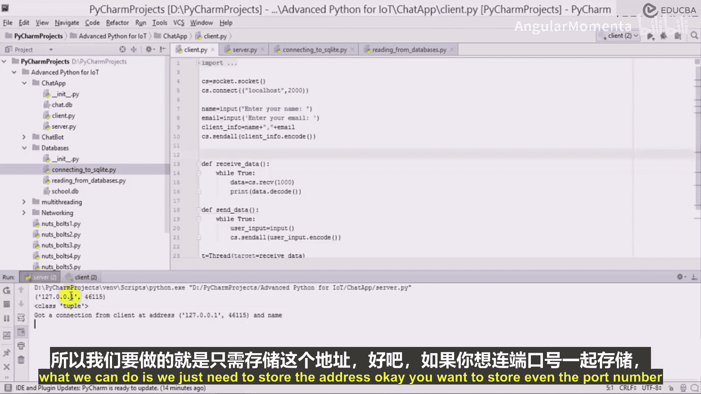


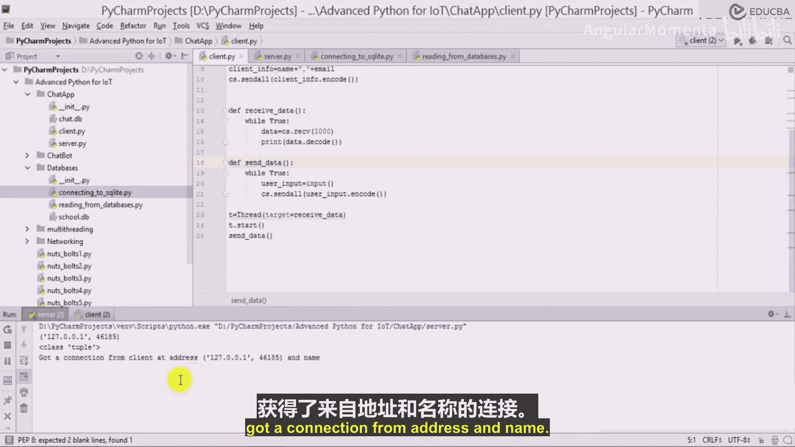

本节课中我们一起学习了如何索引客户端数据、构建动态SQL插入查询，并将数据存入数据库。我们遇到了两个典型的错误：数据类型不匹配（元组无法直接插入）和多余的方法调用（对字符串进行解码）。通过打印变量内容和类型，我们有效地定位并解决了这些问题。这个过程展示了数据处理和错误调试的基本工作流。