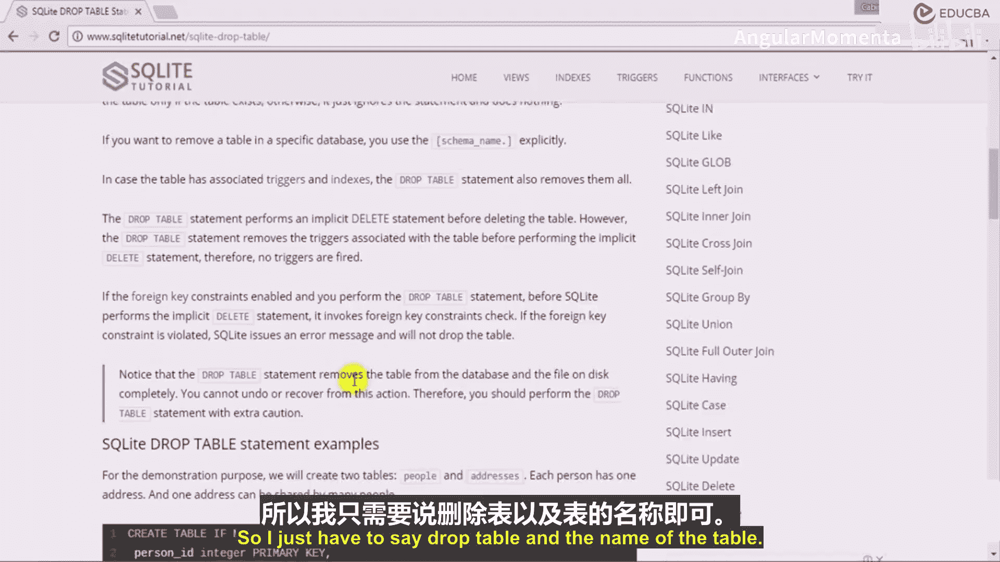
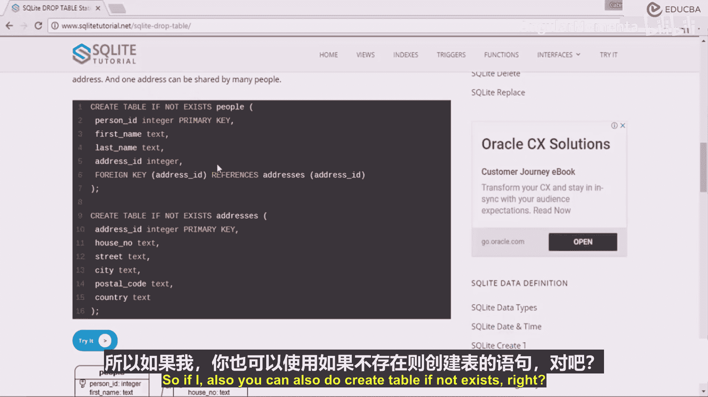
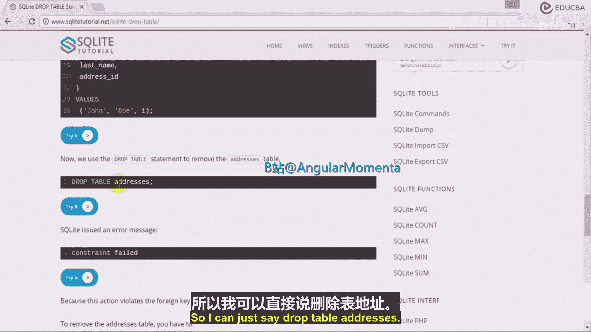
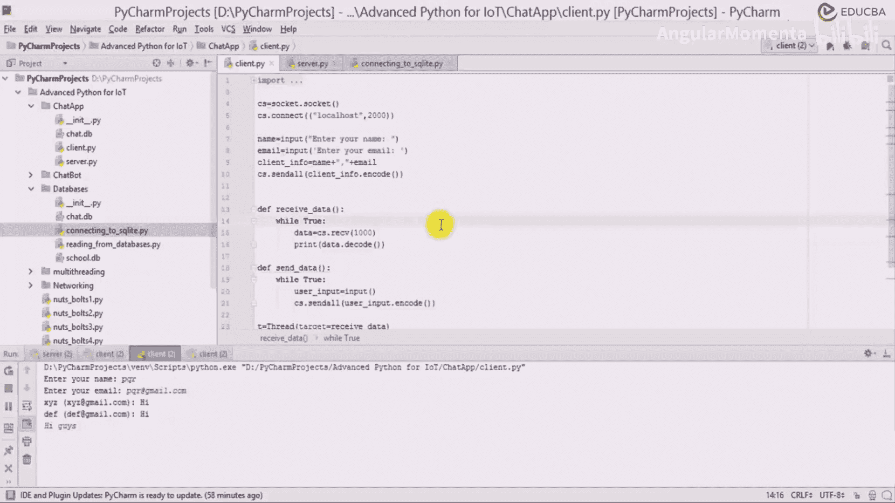

# 029：添加电子邮件与客户端名称 📧

在本节课中，我们将学习如何扩展我们的聊天服务器功能，为客户端消息添加电子邮件地址和客户端名称。我们将通过查询数据库来获取客户端的详细信息，并将其整合到消息广播中。

上一节我们介绍了基本的客户端-服务器通信模型，本节中我们来看看如何从数据库中提取客户端信息并丰富消息内容。

## 概述与准备

为了添加电子邮件信息，我们需要在服务器端修改消息处理逻辑。当服务器收到一条消息时，它不仅需要广播消息内容，还需要附上发送者的名称和电子邮件地址。这要求我们在发送消息前，先查询数据库以获取该客户端的详细信息。

首先，我们需要确保数据库表结构正确，并包含电子邮件字段。我们将重新创建 `clients` 表。

以下是创建和初始化数据库的步骤：

1.  删除已存在的旧表。
2.  创建一个包含 `name` 和 `email` 字段的新表。
3.  插入一些示例客户端数据。



```python
# 假设 conn 是数据库连接，cursor 是游标
cursor.execute("DROP TABLE IF EXISTS clients")
cursor.execute("CREATE TABLE clients (name TEXT, email TEXT)")
# 插入示例数据
clients_data = [('XYZ', 'xyz@gmail.com'), ('PQR', 'pqr@company.co'), ('DEF', 'def@company.com')]
cursor.executemany("INSERT INTO clients VALUES (?, ?)", clients_data)
conn.commit()
```





## 修改服务器消息处理逻辑

服务器在 `handle_client` 函数中接收来自客户端的消息。我们需要在广播消息之前，先根据客户端名称查询其电子邮件地址。

核心修改在于，当服务器收到消息后，执行一个SQL查询来获取该客户端的完整信息。

```python
def handle_client(client_socket, client_address, client_name):
    # ... 连接建立代码 ...
    while True:
        try:
            message = client_socket.recv(1024).decode('utf-8')
            if not message:
                break

            # 关键步骤：查询数据库获取客户端邮箱
            cursor.execute("SELECT * FROM clients WHERE name = ?", (client_name,))
            result = cursor.fetchone()  # 获取查询结果的第一行

            # 构建要广播的消息格式：`客户端名 (邮箱): 消息内容`
            broadcast_message = f"{client_name} ({result[1]}): {message}"

            # 将消息广播给所有其他客户端
            for client in clients:
                if client != client_socket:
                    try:
                        client.send(broadcast_message.encode('utf-8'))
                    except:
                        # 处理发送失败的情况
                        pass
        except:
            break
    # ... 连接关闭和清理代码 ...
```

**注意**：在多线程环境中，每个线程必须使用自己的数据库连接和游标对象。不能在线程间共享SQLite对象。因此，在 `handle_client` 函数内部，需要创建新的数据库连接。

## 处理多线程数据库连接

由于每个客户端连接都在独立的线程中处理，我们必须确保每个线程都有自己的数据库连接，以避免 `SQLite objects created in a thread can only be used in that same thread` 错误。

以下是修改后的线程处理函数结构：

```python
def handle_client(client_socket, client_address, client_name):
    # 为当前线程创建独立的数据库连接
    thread_conn = sqlite3.connect('chat.db', check_same_thread=False)
    thread_cursor = thread_conn.cursor()

    # ... 消息接收和广播逻辑（使用 thread_cursor 进行查询）...

    # 客户端断开连接后，关闭线程内的数据库连接
    thread_cursor.close()
    thread_conn.close()
```

## 运行与测试流程

完成代码修改后，我们可以启动服务器和多个客户端进行测试。

以下是启动和注册客户端的步骤：

1.  启动服务器。
2.  启动客户端1，输入名称 `XYZ` 和邮箱 `xyz@gmail.com`。
3.  启动客户端2，输入名称 `PQR` 和邮箱 `pqr@company.co`。
4.  启动客户端3，输入名称 `DEF` 和邮箱 `def@company.com`。

测试时，从任一客户端（如XYZ）发送消息“hi”。其他所有客户端（PQR和DEF）都应收到格式为 `XYZ (xyz@gmail.com): hi` 的消息。同样，从PQR发送的消息会以 `PQR (pqr@company.co): [消息]` 的格式广播给XYZ和DEF。

## 总结

本节课中我们一起学习了如何为聊天应用的消息添加客户端名称和电子邮件信息。我们通过以下步骤实现了这个功能：

1.  **重构数据库**：确保 `clients` 表包含必要的字段。
2.  **修改服务器逻辑**：在广播消息前，先根据客户端名查询数据库，获取其邮箱地址。
3.  **处理多线程**：为每个客户端处理线程创建独立的数据库连接，避免SQLite的线程限制问题。
4.  **格式化消息**：将查询到的信息整合成 `名称 (邮箱): 消息` 的格式进行广播。



通过这些修改，我们构建了一个功能更丰富的群聊系统，每条消息都清晰地显示了发送者及其联系信息。在接下来的课程中，我们将在此基础上继续开发更多高级功能。