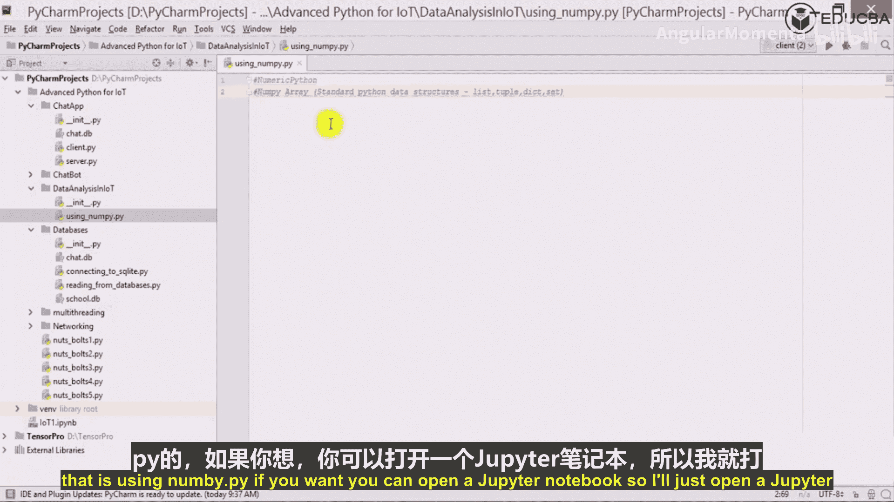

# 030：分析数据集

在本节课中，我们将要学习数据分析在物联网（IoT）领域的重要性，并介绍用于处理和分析大规模数据集的核心Python库。我们将从NumPy库开始，了解其基本概念和功能。

物联网的一个重要方面是，我们可能需要分析从不同传感器持续获取的大量数据。这些数据量非常庞大。在初始阶段可能不会用到，但在后续阶段，当需要分析大量数据、进行数值计算或处理真正庞大的数据集时，这些技能就至关重要。

例如，假设有一家像惠而浦这样的公司，销售洗衣机和空调。考虑到一个国家可能有约50%的人口使用洗衣机，市场上的洗衣机数量可能达到数十万甚至数百万台。如果一家公司决定在洗衣机中安装物联网设备来监控不同传感器的数据，以分析客户使用习惯等，那么就需要处理和分析海量数据。在这种情况下，服务器端会涌入大量数据，因此必须借助数据分析库。

我们将创建一个专门用于物联网数据分析的包。为此，我们需要了解Python中用于数据分析的库。让我们从第一个库开始。

## 使用NumPy库

我们将使用的第一个库是NumPy。NumPy是数据分析的基础库，它提供了高效处理数值计算的功能。

在深入NumPy之前，让我们再次明确数据分析的定义。数据分析是一门管理、分析大型数据集或大数据的科学。它需要工具来转换和建模数据。多年来，Python通过提供NumPy、SciPy、Pandas和Matplotlib等库，已经发展成为处理不同组件和进入数据分析领域的一个非常有效的解决方案。Matplotlib尤其用于在图表上绘制数据。

### 什么是NumPy？

NumPy是“Numeric Python”（数值Python）的缩写。它是一个开源的Python扩展模块。NumPy库提供了快速的预编译函数来执行各种数学和数值计算。同时，NumPy通过提供非常强大的数据结构丰富了Python编程语言。

我们将重点学习一种称为**NumPy数组**的数据结构。这个数据结构非常强大，有助于高效计算多维数组和矩阵。

在标准的Python数据结构中，我们有列表（list）、元组（tuple）、字典（dictionary）和集合（set）。但NumPy引入了数组的概念，这完全将Python处理数据的能力提升到了一个新的高度。我们将在后续内容中详细探讨NumPy数组。

你可以打开Jupyter笔记本来进行实践，以便更好地理解和记录。

### NumPy的特点与能力

NumPy的实现旨在处理非常庞大的矩阵和数组。此外，该模块提供了一个庞大的高级数学函数库来操作这些矩阵。你可以查看其官方文档以了解其功能的广度。

如果你访问`docs.scipy.org`并查看NumPy文档，你会发现其内容非常丰富。NumPy手册包含用户指南、参考手册等。它涵盖了数组对象、通用函数、各种例程（如排序、搜索、计数、统计）、集合操作、多项式、填充数组、输入输出、线性代数、逻辑函数、金融函数、函数式编程、数据类型例程、日期时间支持函数、字符串操作等众多主题。当然，我们不会覆盖所有内容，只会介绍其中一部分。

许多第三方应用都构建在NumPy之上。例如，SciPy库就是基于NumPy构建的。另一个重要的库Pandas同样构建于NumPy之上。Pandas利用NumPy的数组数据结构，构建了自己的两种数据结构：**Series（序列）**和**DataFrame（数据框）**，它们功能全面，非常强大。

随着课程的深入，我们将详细研究所有这些内容，并学习如何基于它们进行开发。

如果你想在Jupyter笔记本中使用这些库，只需打开笔记本并导入相应的库即可开始工作。

---

本节课中，我们一起学习了数据分析在物联网场景下的必要性，并初步认识了Python数据分析生态的核心库NumPy。我们了解了NumPy的定义、其强大的数组数据结构，以及它作为SciPy和Pandas等高级库基础的重要地位。在接下来的课程中，我们将开始动手实践，深入学习NumPy的具体用法。