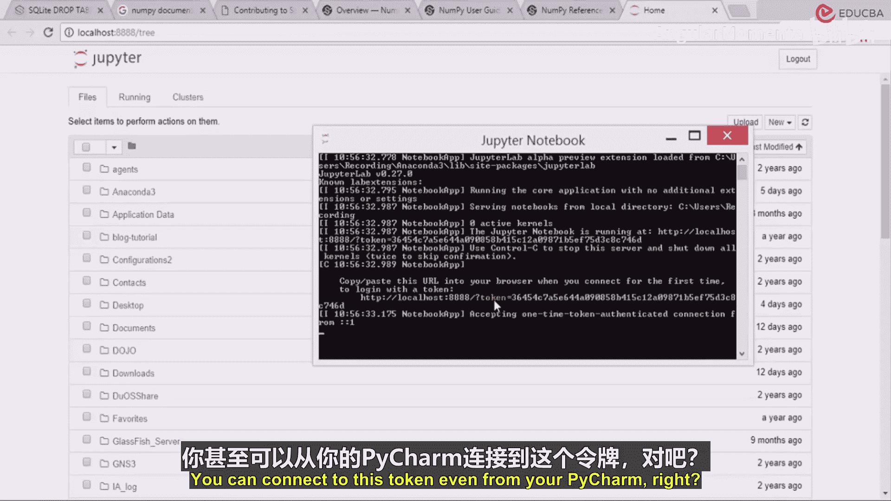
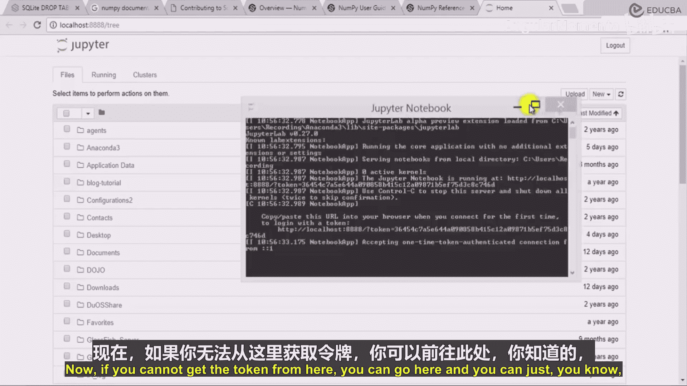
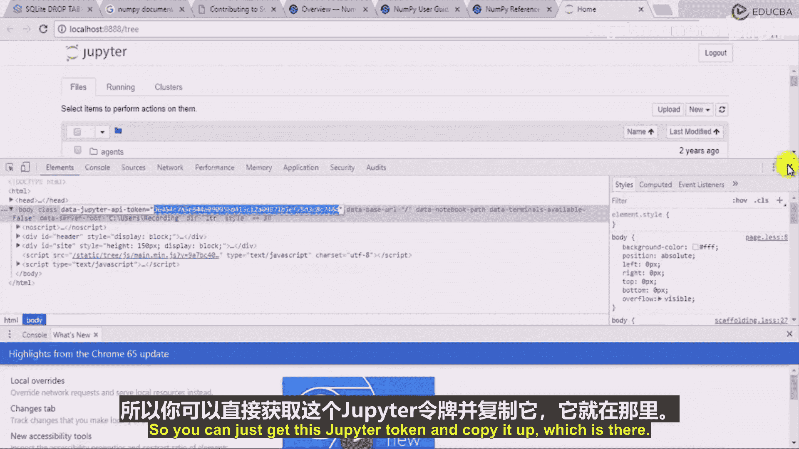
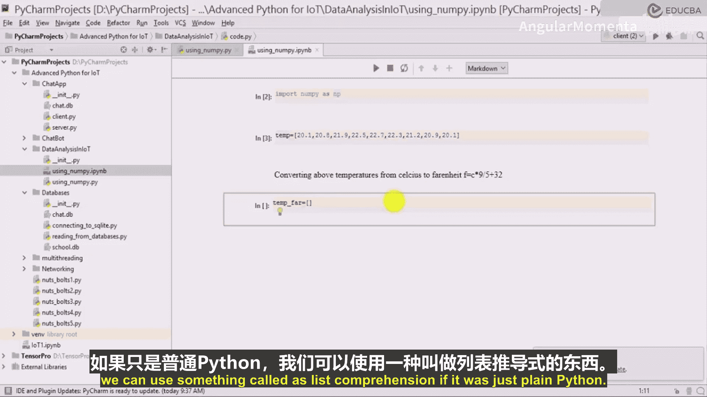

# 031：温度转换编程 🔥

在本节课中，我们将学习如何将Jupyter Notebook与PyCharm集成，并使用NumPy库进行高效的数据处理。我们将通过一个具体的例子——将摄氏温度列表转换为华氏温度——来对比Python原生列表与NumPy数组在性能和操作上的差异。

---





## 连接Jupyter Notebook到PyCharm

上一节我们介绍了NumPy的基本概念，本节中我们来看看如何在PyCharm中连接并使用Jupyter Notebook进行交互式编程。

你可以从PyCharm连接到Jupyter Notebook的令牌。如果无法从常规界面获取令牌，可以采取以下步骤。

以下是获取令牌的步骤：

1.  在浏览器中打开Jupyter Notebook。
2.  在“更多工具”选项中，找到名为“检查元素”的功能。
3.  按下键盘上的 **F12** 键。
4.  在开发者工具中，你可以找到Jupyter Notebook的令牌。
5.  复制该令牌。



复制令牌后，返回PyCharm。

在PyCharm中创建一个新的Jupyter Notebook。将其命名为“numpy”。虽然我们再次使用“numpy”这个名字，但这是一个Jupyter Notebook文件，所以没有关系。

为了测试连接，我们可以先运行一个简单的命令。

```python
print("hello")
```

运行代码以检查连接。系统会提示输入令牌。粘贴你之前复制的令牌，然后点击确认以连接到Jupyter Notebook服务器。连接成功后，代码会运行并打印出结果。

现在你可以在Jupyter Notebook中使用NumPy，并在此处直接执行操作。

---

## 导入NumPy并创建数组

在开始理解NumPy数组的强大功能之前，我们需要先导入它。

首先，在Jupyter Notebook中导入NumPy模块，并为其设置一个常用的别名。

```python
import numpy as np
```

你可以使用 **Shift + Enter** 来运行当前单元格的代码，也可以点击运行按钮。运行上述代码后，NumPy模块就被成功导入了。

---

## 列表与NumPy数组的对比

我们已经成功导入了NumPy模块。现在，在深入理解NumPy数组的伟大之处及其工作原理之前，我们需要先了解NumPy数组和Python列表之间的区别。

假设我有一个温度列表，这些温度值以摄氏度为单位。我的温度传感器位于某个远程环境位置，不断发送温度值，我正在记录这些值。

我得到的温度值单位是摄氏度。让我现在记录一些示例值。

```python
# 这是一个Python列表，存储摄氏温度
temps_celsius_list = [20.1, 20.8, 21.9, 22.5, 22.7, 22.3, 21.2, 20.9, 20.1]
```

这些是我从某个IoT设备获得的一系列温度值，它们存储在一个列表中。

---

## 任务：温度单位转换

我的任务是，将这些温度值从摄氏度转换为华氏度。

**将温度从摄氏度转换为华氏度。**

我需要将它们从摄氏度转换为华氏度，这会涉及到一些计算。

如果你还记得，华氏温度的计算公式总是：摄氏温度乘以9，除以5，然后加上32。

用公式表示就是：
**`T(°F) = T(°C) × 9/5 + 32`**

现在，我需要得到一个新的列表。这个新列表将为原始列表中的每个摄氏温度值存储对应的华氏温度值。我的任务是将每个摄氏温度值转换为对应的华氏温度值。

那么，如何从一个存储摄氏温度的列表，创建一个包含对应华氏温度的新列表呢？这就是我的任务。

我们可以使用一种叫做“列表推导式”的方法。如果只是简单的数学运算，列表推导式是一种直接的方式。

```python
# 使用列表推导式进行转换
temps_fahrenheit_list = [(temp * 9/5) + 32 for temp in temps_celsius_list]
print(temps_fahrenheit_list)
```

---



本节课中我们一起学习了如何在PyCharm中集成Jupyter Notebook，导入了NumPy库，并通过一个温度转换的例子，初步对比了使用Python列表和即将学习的NumPy数组处理数据的不同思路。下一节，我们将深入探讨NumPy数组如何更高效、更简洁地完成这类计算任务。