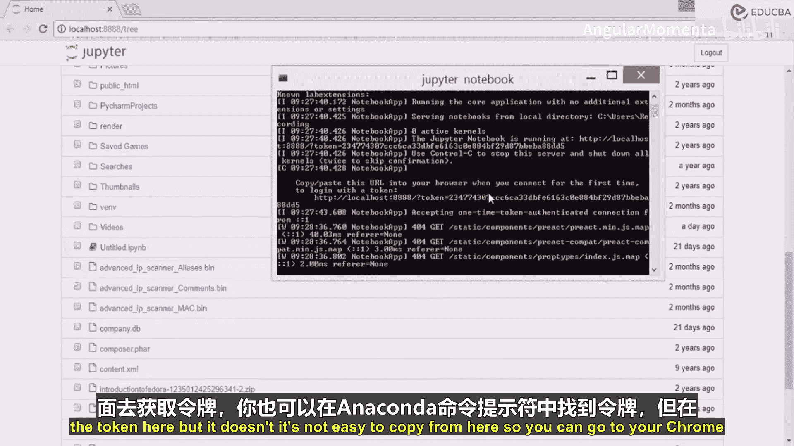
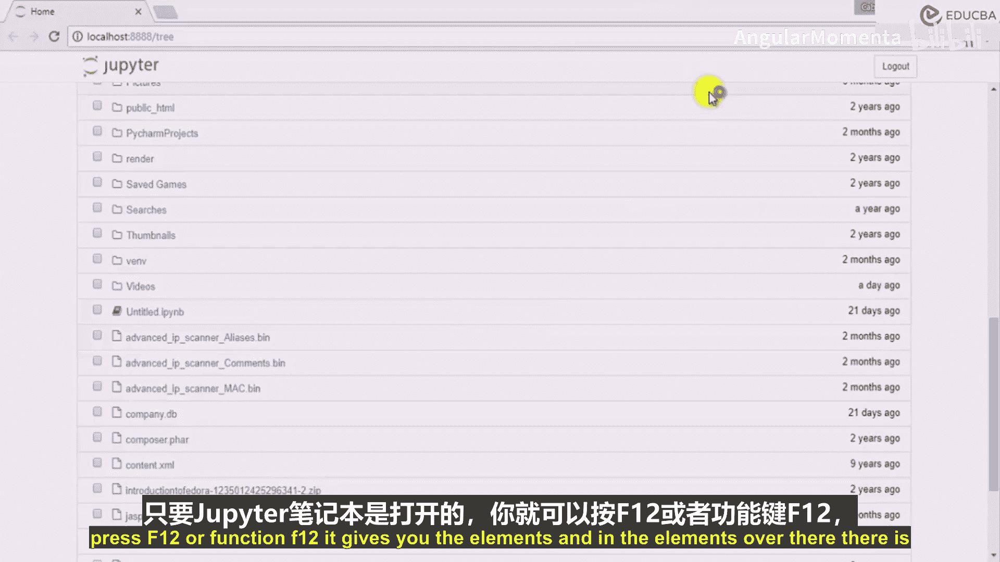
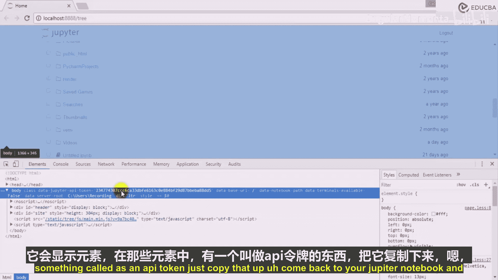
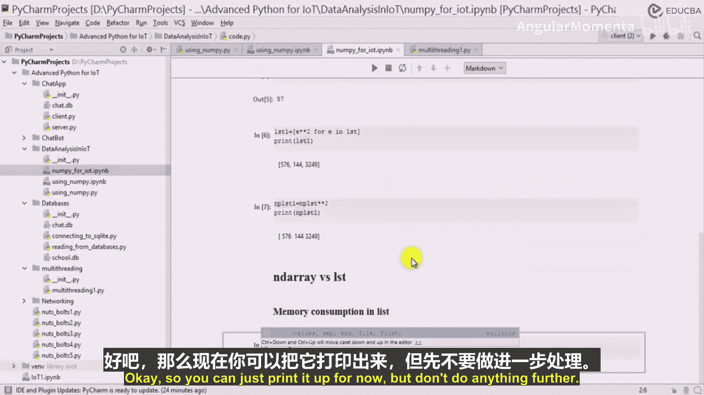

# 033：NumPy入门 🚀

在本节课中，我们将深入学习NumPy库。我们将探讨NumPy数组与Python列表的核心区别，并了解为何NumPy在数据科学中至关重要。

## 启动Jupyter Notebook环境

上一节我们介绍了数据分析库的概览，本节中我们来看看如何开始使用NumPy。首先，我们需要在Jupyter Notebook中设置环境。

导入NumPy库，通常使用别名`np`：
```python
import numpy as np
```

为了验证环境配置正确，可以执行一个简单的打印命令：
```python
print("Hello")
```






## NumPy数组与Python列表的对比



现在，我们来探讨一个核心问题：既然Python已经提供了列表，为什么还需要使用NumPy数组？

首先，创建一个Python列表和一个NumPy数组进行对比：
```python
# 创建一个Python列表
lst = [24, 12, 57]
print(type(lst))  # 输出: <class 'list'>

# 将列表转换为NumPy数组
np_arr = np.array(lst)
print(type(np_arr))  # 输出: <class 'numpy.ndarray'>
```

从表面上看，两者存储和访问数据的方式相似。例如，都可以通过索引访问元素：
```python
print(lst[0])      # 输出: 24
print(np_arr[-1])  # 输出: 57
```

## NumPy数组的优势

那么，NumPy数组相比列表有何优势？我们上次课程讨论过，NumPy支持向量化操作，无需显式循环。

以下是两种方式的对比：
```python
# 使用列表推导式对列表每个元素进行平方
lst_squared = [x**2 for x in lst]

# 使用NumPy对数组每个元素进行平方（向量化操作）
np_arr_squared = np_arr ** 2
```

向量化操作是NumPy的第一个主要优势，它使代码更简洁、执行更高效。

## 内存消耗对比

除了向量化操作，NumPy数组与列表在内存消耗上也有显著差异。本节我们来比较两者的内存使用情况。

首先，讨论列表的内存消耗。我们可以使用`sys`模块的`getsizeof`函数来查看对象的内存占用。

以下是查看内存占用的方法：
```python
from sys import getsizeof as size

# 计算列表的内存占用
list_memory = size(lst)
print(f"列表内存占用: {list_memory} 字节")
```

接下来，我们看看NumPy数组的内存消耗。NumPy数组在底层使用连续的内存块存储同类型数据，这通常比Python列表更节省内存。

以下是计算数组内存占用的示例：
```python
# 计算NumPy数组的内存占用
array_memory = np_arr.nbytes
print(f"NumPy数组内存占用: {array_memory} 字节")
```

通过对比可以发现，对于大型数据集，NumPy数组的内存效率远高于Python列表，这是其在处理大规模数值数据时的第二个关键优势。

## 总结



本节课中我们一起学习了NumPy的入门知识。我们比较了NumPy数组与Python列表，重点探讨了NumPy在向量化运算和内存效率方面的核心优势。理解这些差异是高效进行数据分析和科学计算的基础。在接下来的课程中，我们将继续探索NumPy更强大的功能。