# 001：个性化教练与ChatGPT入门 🚀

在本节课中，我们将要学习什么是生成式AI驱动的个性化教练，以及ChatGPT如何成为实现这一目标的核心工具。我们将探讨传统教练的局限性，并了解AI如何提供可扩展、高度定制化的指导。

## 个性化教练简介

欢迎来到关于使用ChatGPT及其他生成式AI技术进行个性化教练的模块。今天，我们正迈入一个教练技术的新时代，技术与个性化的结合达到了前所未有的高度。

在传统教练中，无论是职业发展、生活指导还是健身，其核心始终是关注个人的独特目标、挑战和学习风格。然而，一个长期存在的问题是可扩展性：我们如何大规模地提供个性化、有意义的建议和指导？这正是生成式AI（如ChatGPT）发挥作用的地方。

## 什么是个性化教练？

让我们从基础开始。什么是个性化教练？本质上，它是一种根据个人特定需求来定制学习体验、反馈和指导的教练方法。在个性化教练中，重点是调整内容、节奏和风格，以匹配个人的目标和偏好。

生成式AI技术，特别是ChatGPT，正在彻底改变这一领域。它为教练提供了实时提供高度定制化建议的能力，而无需持续的人工干预。

## ChatGPT带来的变革

那么，ChatGPT带来了什么？ChatGPT建立在能够理解上下文、语气甚至对话中细微差别的大规模语言模型之上。它不只是输出通用建议，而是能理解你的需求，并提供经过深思熟虑、适合具体情境的回应。

与传统资源不同，ChatGPT提供即时响应。无论是关于职业目标的快速提问，还是对健身计划的深入探讨，它都能当场提供有价值的见解。随着用户与ChatGPT互动，它会从对话中学习。这不是人类意义上的学习，但AI可以根据用户的输入调整其回应，从而提供越来越个性化的指导。

试想一下：过去受时间、地域或可用性限制的教练课程，现在可以随时随地进行了。无论是寻求职业建议的个人，还是寻求健身指导的人，ChatGPT都能提供7x24小时的个性化支持。最棒的是，它不提供“一刀切”的回应，而是能根据你独特的情况、个性和目标调整其指导。

本节课中，我们一起学习了生成式AI在个性化教练领域的应用潜力，以及ChatGPT作为核心工具如何通过理解、学习和适应来提供定制化指导。在下一节中，我们将开始实际操作，学习如何快速上手使用ChatGPT。

---

# 生成式AI个性化教练入门：02：ChatGPT快速入门指南 ⚡

上一节我们介绍了ChatGPT在个性化教练中的潜力，本节中我们来看看如何快速上手使用它。担心入门过程复杂？不必担心。我们的快速入门指南将助你在短时间内掌握ChatGPT。

## 第一步：注册OpenAI账户

访问ChatGPT网站。前往 `chat.openai.com`，你将看到ChatGPT的界面。

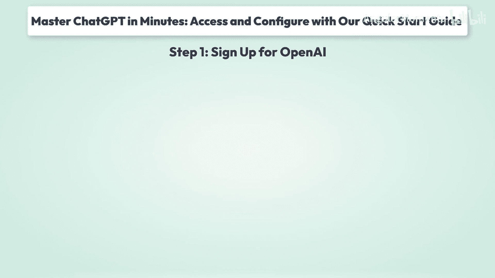


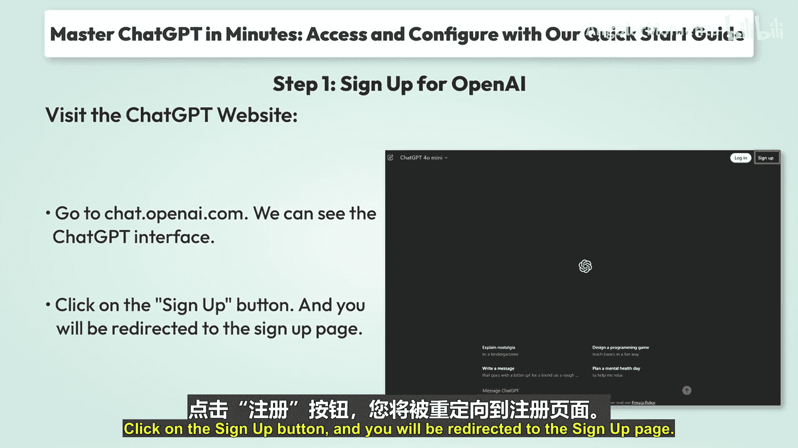

点击“Sign up”按钮，你将被重定向到注册页面。


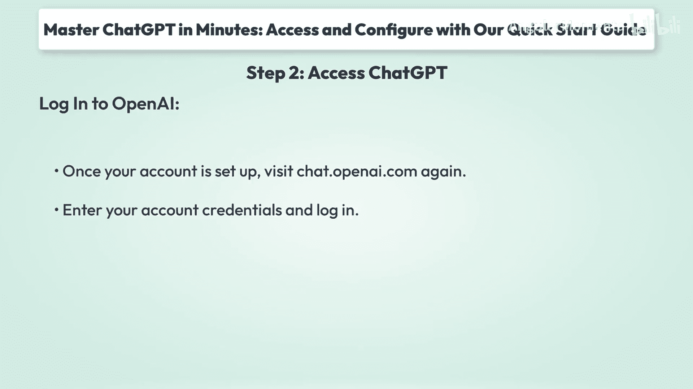

创建账户。选择使用电子邮件地址、谷歌账户或微软账户进行注册。如果通过电子邮件注册，OpenAI会发送一封验证邮件。请检查你的收件箱并验证电子邮件以继续。

## 第二步：登录ChatGPT

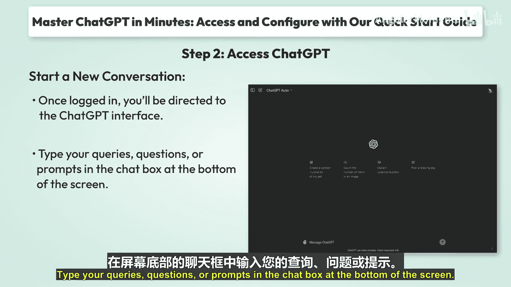

登录OpenAI。账户设置完成后，再次访问 `chat.openai.com`，输入你的账户凭据并登录。


开始新对话。登录后，你将被引导至ChatGPT界面。在屏幕底部的聊天框中输入你的查询、问题或提示，按回车键或点击发送按钮即可收到ChatGPT的回复。


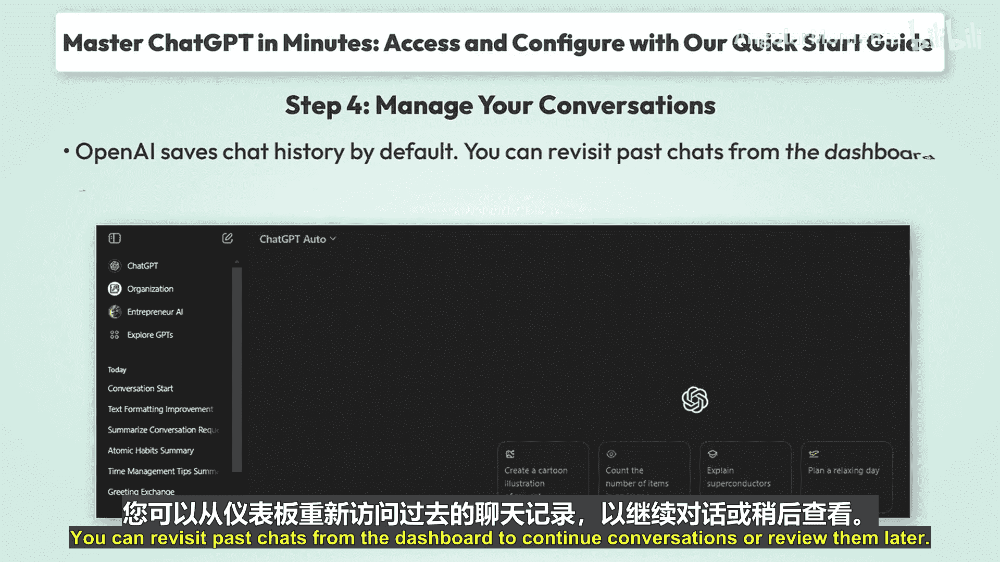


## 第三步：开始使用ChatGPT

以下是开始使用ChatGPT的几个方面：

*   **提问任何问题**：通过输入问题、寻求建议或测试不同的指令来开始。ChatGPT可以协助写作、头脑风暴、编程等。
*   **探索用例**：通过让ChatGPT帮助起草电子邮件、撰写文章、解决问题，甚至充当学习助手来测试其能力。

## 第四步：管理你的对话

OpenAI默认保存聊天记录。你可以从仪表板重新访问过去的聊天记录，以继续对话或稍后查看。


本节课中，我们一起学习了如何快速注册、登录并开始使用ChatGPT进行基本互动。掌握了这些操作，你就可以将其作为个人AI助手，用于提升生产力等各个方面。接下来，我们将通过具体示例，看看ChatGPT在不同场景下的实际应用。

---

# 生成式AI个性化教练入门：03：ChatGPT应用示例大全 🛠️

上一节我们学会了如何访问和使用ChatGPT，本节中我们来看看它在不同场景下的具体应用。以下是ChatGPT在各种任务中的实用示例，展示了其多功能性。

## 写作协助

假设你的任务是为一篇关于AI与医疗保健未来的博客文章撰写一个引人入胜的引言。你可以这样使用ChatGPT。

**提示**：你能帮我写一篇关于AI与医疗保健未来的博客文章引言吗？

ChatGPT可能会提供如下回应：
> 医疗保健的未来正由人工智能塑造，它正在彻底改变从诊断到患者护理的一切。借助AI驱动的工具，医生正在做出更准确的决策，手术变得微创，患者正在接受个性化治疗。在这篇博客文章中，我们将探讨AI如何改变医疗保健，以及这对医学的未来意味着什么。

可以看到，它抓住了主题的精髓，并为深入讨论奠定了基础。

## 编程帮助

现在，让我们转向编程。假设你的任务是使用Python计算一个数字的阶乘。你可以轻松地向ChatGPT寻求帮助。

**提示**：你能写一个Python函数来计算一个数字的阶乘吗？

ChatGPT随后会为你生成Python代码，代码可能如下所示：

```python
def factorial(n):
    if n == 0:
        return 1
    else:
        return n * factorial(n-1)
```

现在，只需用任何整数调用这个函数，它就会返回该数字的阶乘。非常方便，对吧？

## 头脑风暴

假设你正在为一段关于生产力技巧的YouTube视频构思创意。ChatGPT也可以帮助进行头脑风暴。

**提示**：你能给我一些关于生产力技巧的YouTube视频创意吗？

ChatGPT可能会建议：“今天你需要尝试的十大生产力技巧”或“如何整理你的工作空间以实现最高效率”。它甚至可以提出诸如“高效人士的晨间习惯”或“提升生产力的时间管理技巧”等想法。这就像你指尖有一个创意伙伴。

## 学习新概念

接下来，假设你试图理解一个新概念，比如用简单的术语解释区块链。

**提示**：你能用简单的术语解释什么是区块链吗？

ChatGPT会这样回应：
> 区块链就像一个数字账本，记录着交易。想象一条由区块组成的链，每个区块都保存着一次交易的信息。一旦添加，就无法更改。这使其安全且透明，因为每个人都可以看到交易，但没有人可以篡改它们。简单易懂，对吧？

## 个人发展教练

现在，假设你正在寻求一些关于个人发展的指导，比如克服拖延症。

**提示**：有什么技巧可以帮助我停止拖延吗？

ChatGPT可能会建议：将任务分解成更小、可管理的部分；设定具体的截止日期；或使用五分钟规则，即承诺只做某项任务五分钟。其他建议可能包括：通过关闭通知来消除干扰，或在完成任务后奖励自己。这些都是可以立即应用的实用有效建议。

## 膳食计划

假设你的任务是创建一周的健康膳食计划，涵盖早餐、午餐和晚餐。

**提示**：你能创建一个包含早餐、午餐和晚餐创意的一周健康膳食计划吗？

ChatGPT可以帮助你规划每天的膳食。例如，它可能建议：
*   **周一**：早餐 - 燕麦片配新鲜浆果和杏仁；午餐 - 藜麦沙拉配烤鸡和蔬菜；晚餐 - 烤三文鱼配蒸西兰花和红薯。
*   **周二**：早餐 - 希腊酸奶配蜂蜜和格兰诺拉麦片；午餐 - 火鸡牛油果卷配混合蔬菜沙拉；晚餐 - 炒豆腐配糙米和荷兰豆。

这样，你就有了一个完整、均衡的一周膳食计划。

## 客户服务模拟

假设你正在处理客户服务，并收到一份关于延迟交付的投诉。ChatGPT可以帮助你撰写专业的回复。

**提示**：你会如何回应一位对延迟交付感到不满的客户？

ChatGPT可能会提供类似这样的回复：
> 尊敬的[客户姓名]，我们真诚地为您的交付延迟道歉。我们理解这一定非常令人沮丧，我们致力于纠正这个问题。我们目前正在加急处理您的订单，并提供折扣/退款作为善意的表示。感谢您的耐心等待。如果还有其他我们可以协助的地方，请告知。此致，敬礼。[你的公司]

通过这种方式，你在解决客户关切的同时保持了专业性。

## 创意写作

现在，让我们转向更具创意性的内容。假设你的任务是写一首关于自然的短诗。

**提示**：你能写一首关于自然的短诗吗？

ChatGPT可以生成一首简单而优美的诗，例如：
> 在树木的低语和晨风的舞蹈中，自然吟唱着她古老的歌，邀请所有人一同前往。随着每一次花开和树叶沙沙作响，她编织出一个超乎想象的世界。😊

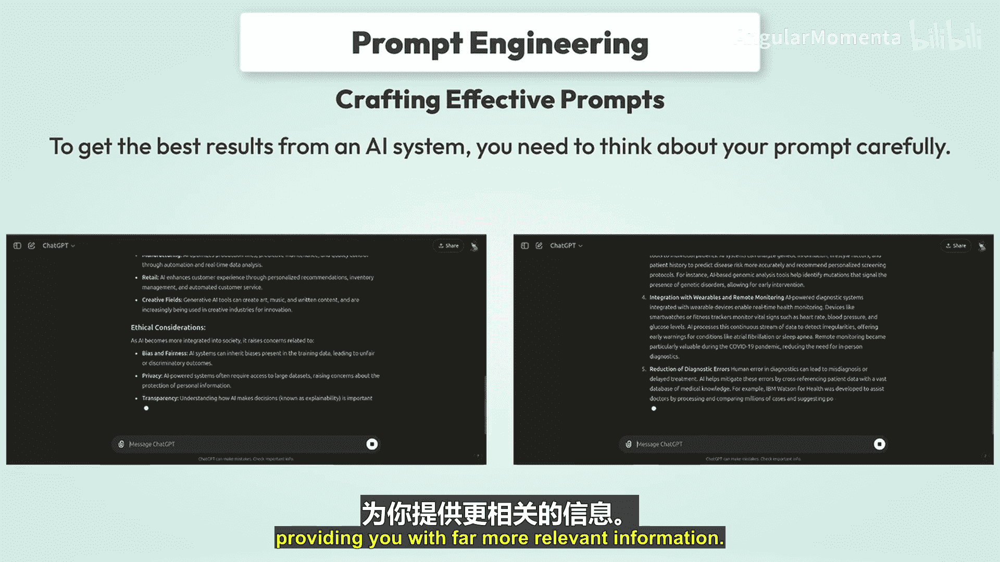

为你的写作项目提供了一个快速的创意提升。

## 健身教练

假设你需要创建一个30分钟的家庭锻炼计划，且不需要任何设备。ChatGPT可以应对这个挑战。

**提示**：你能创建一个不需要任何设备的30分钟家庭锻炼计划吗？

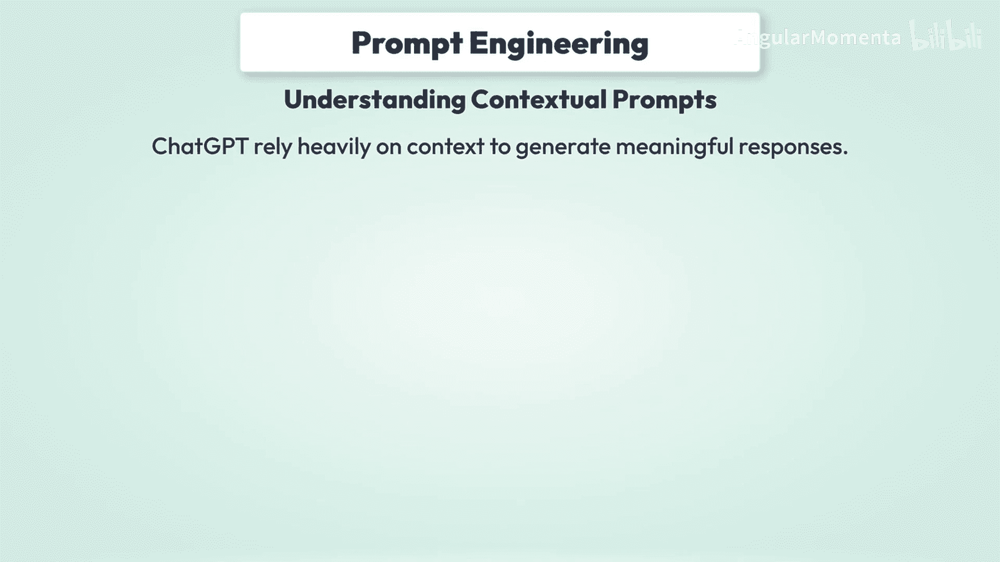

ChatGPT可能会推荐这样的计划：
*   **热身（5分钟）**：开合跳、高抬腿、手臂绕环。
*   **锻炼（20分钟）**：
    *   循环1（3轮）：深蹲、俯卧撑、登山者，各45秒。
    *   循环2（3轮）：弓步、平板支撑、波比跳，各45秒。
*   **放松（5分钟）**：拉伸练习，重点拉伸腿部、手臂和背部。

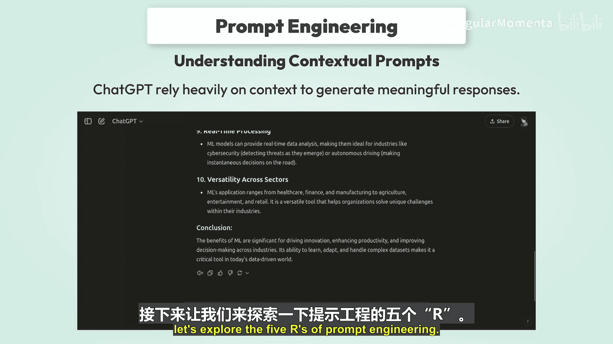

有了这样的计划，你可以轻松保持活跃，无需任何特殊设备。

## 旅行规划

最后，假设你正在计划一次为期三天的巴黎之旅，需要一个行程安排。ChatGPT可以帮助创建详细计划。

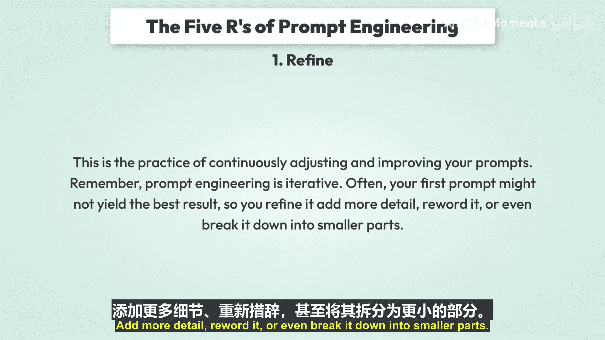

**提示**：你能为一次为期三天的巴黎之旅建议一个行程吗？

以下是ChatGPT可能提供的一个示例：
*   **第一天**：上午 - 参观埃菲尔铁塔并享受塞纳河游船。下午 - 探索卢浮宫博物馆。晚上 - 漫步香榭丽舍大街，在当地咖啡馆享用晚餐。
*   **第二天**：上午 - 参观巴黎圣母院和西岱岛。下午 - 漫步玛莱区，参观毕加索博物馆。晚上 - 体验蒙马特和圣心大教堂。😊
*   **第三天**：上午 - 探索凡尔赛宫。下午 - 在卢森堡花园放松或在玛莱区购物。晚上 - 在传统的巴黎餐厅享用告别晚餐。😊

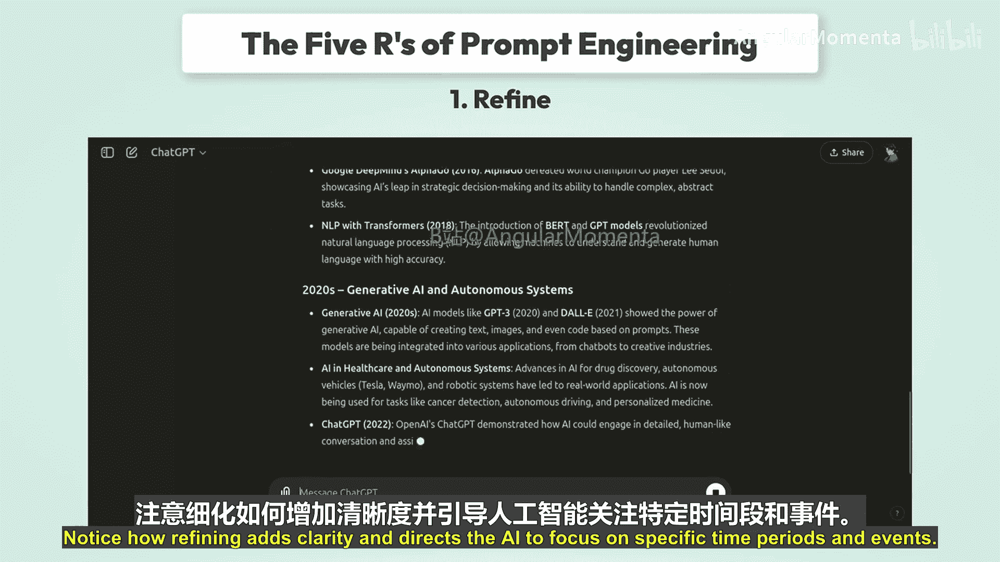

有了这个行程，你可以充分享受你的“光之城”之旅。

本节课中，我们一起探索了ChatGPT在写作、编程、学习、规划等多个领域的强大应用示例。这些例子展示了它如何作为一个多功能助手，提供即时、个性化的支持。在下一节，我们将深入探讨如何通过“提示工程”来更好地引导ChatGPT，以获得更精准的结果。


---

# 生成式AI个性化教练入门：04：提示工程核心技巧 🎯

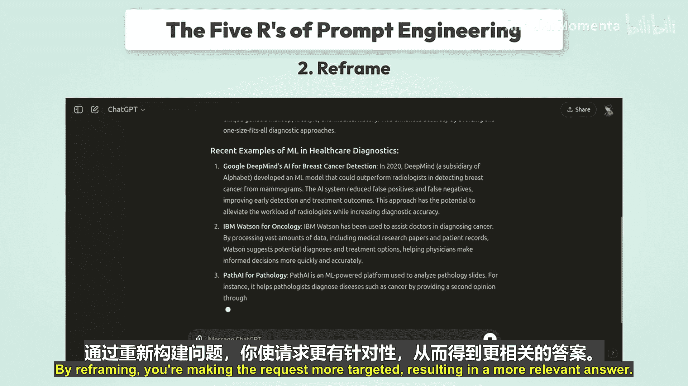

上一节我们看到了ChatGPT的广泛应用，本节中我们来看看如何通过“提示工程”来优化与它的互动，以获得最佳结果。让我们从基础开始。

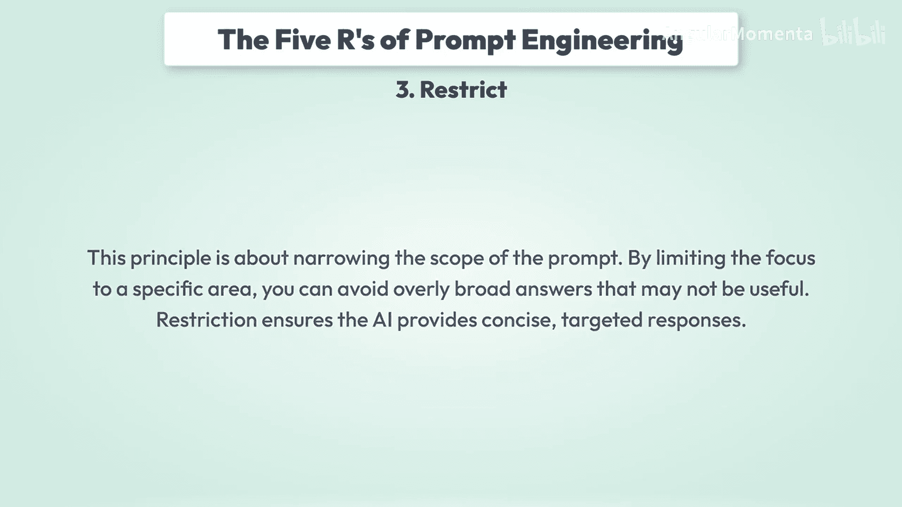

## 什么是提示工程？

提示工程的核心是指设计有效提示以引导ChatGPT等AI模型的艺术。可以把它想象成给AI下达指令：你的提示越精确、越清晰，AI的回应就越好。这是一个试验和优化的过程，用户以特定的方式提问或下达任务，以获得最佳结果。

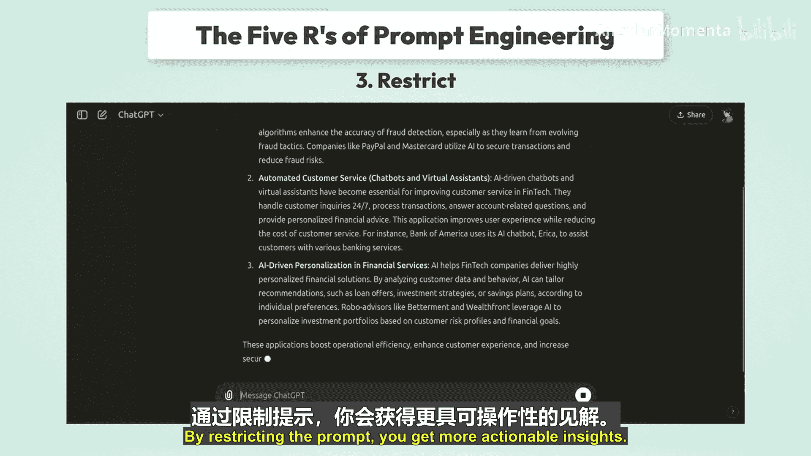

那么，为什么我们需要提示工程？AI模型虽然强大，但严重依赖于我们给出的提示。一个模糊或结构不良的提示可能导致不完整或不相关的回应。相反，一个精心设计的提示可以带来详细、有见地且相关的输出，满足用户的需求。

## 设计有效提示

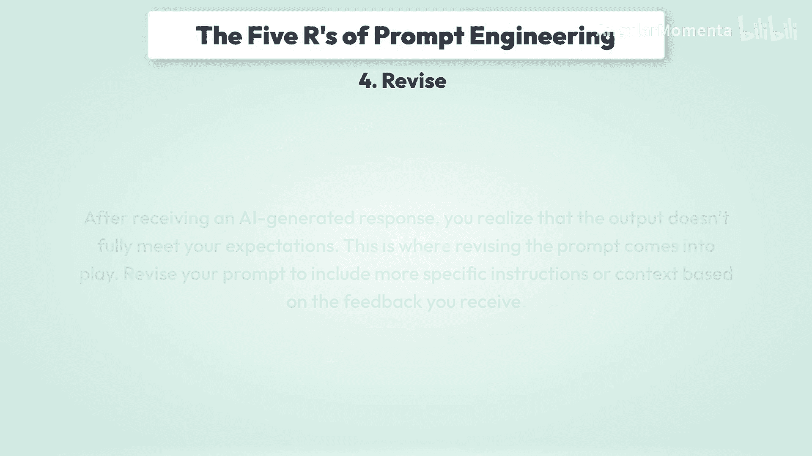

这就引出了提示工程的一个重要方面：设计有效提示。要从AI系统获得最佳结果，你需要仔细思考你的提示。一个有效的提示是清晰、具体的，并包含所有必要的细节来引导AI。

例如，如果你问“告诉我关于AI”，你会得到一个宽泛而笼统的答案。但如果你具体说明：“你能解释过去十年AI对医疗保健的影响吗，重点放在诊断方面？”突然之间，AI的工作范围就大大缩小了，为你提供更相关的信息。

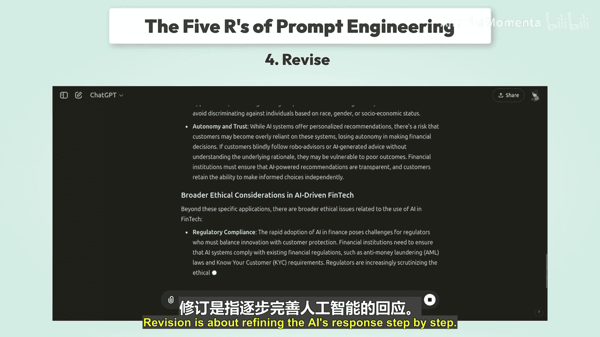


这里的关键是**精确和清晰**。

另一个关键方面是理解**上下文提示**。像ChatGPT这样的AI模型严重依赖上下文来生成有意义的回应。例如，如果你正在讨论机器学习，然后问“M的好处是什么？”，AI会理解你是在问机器学习的好处，尽管提示中没有明确说出“机器学习”这个词。上下文提示很有价值，因为它们允许你与AI进行更流畅的、类似对话的互动。

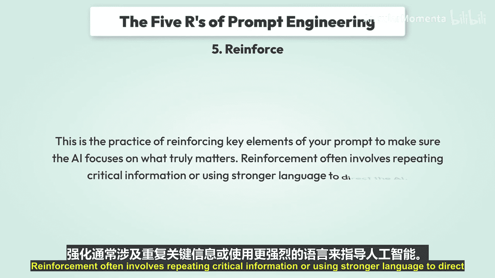

因此，提示工程帮助你最大限度地发挥生成式AI的潜力，让你能够设计出AI能清晰理解的指令。既然我们已经确立了它的重要性，现在让我们来探索提示工程的五个R原则。

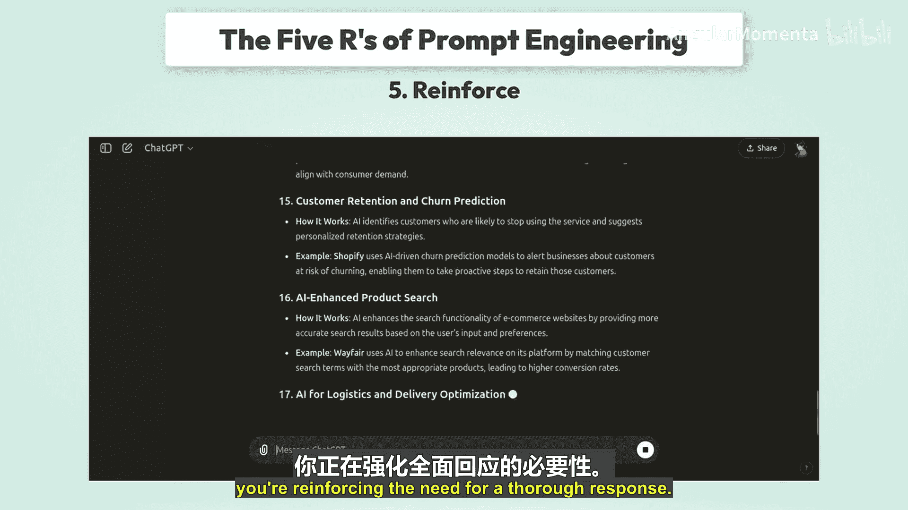

## 提示工程的五个R原则

提示工程建立在五个指导原则之上，即5R原则。每个R都代表了改进你的提示，从而提高AI互动质量的关键一步。


以下是五个R原则的具体内容：

1.  **优化（Refine）**
    这是指持续调整和改进你的提示的实践。记住，提示工程是迭代的。通常你的第一个提示可能不会产生最好的结果，所以你需要优化它：添加更多细节、重新措辞，甚至将其分解成更小的部分。

    

    **例如**：与其问“AI的历史是什么？”，你可以优化为：“你能解释从20世纪50年代至今AI的关键发展吗，并举例说明重大突破？”注意优化如何增加了清晰度，并引导AI关注特定的时间段和事件。

    

2.  **重构（Reframe）**
    有时一个问题或任务可能被AI误解。在这些情况下，重新措辞或以不同的方式构建问题可以带来更好的结果。措辞上的简单改变可以转移AI的焦点，从而提供更准确或有见地的回应。

    

    **例如**：假设你问：“为什么机器学习很重要？”如果回应太笼统，尝试重构它：“你能用最近的例子解释机器学习在医疗保健诊断中的重要性吗？”通过重构，你使请求更具针对性，从而得到更相关的答案。

    

3.  **限制（Restrict）**
    这个原则是关于通过将焦点限制在特定领域来缩小提示的范围。通过限制范围，你可以避免可能无用的、过于宽泛的答案。限制确保AI提供简洁、有针对性的回应。

    

    **例如**：与其问“AI的应用有哪些？”，这可能导致信息量过大，你可能会问：“金融科技领域排名前三的AI应用是什么？”通过限制提示，你获得了更具可操作性的见解。

    

4.  **修订（Revise）**
    有时，在收到AI生成的回应后，你发现输出没有完全达到你的期望。这时就需要修订提示。根据你收到的反馈，修订你的提示以包含更具体的指令或上下文。

    

    **例如**：如果ChatGPT给出了答案但遗漏了关键细节，请修订你的提示：“你能扩展那个答案吗，特别关注AI在金融科技中的伦理影响？”修订是关于逐步优化AI的回应。

    

5.  **强化（Reinforce）**
    最后，我们有强化。这是强化提示关键要素的实践，以确保AI专注于真正重要的内容。强化通常涉及重复关键信息或使用更强的语言来引导AI。

    **例如**：假设你正在撰写一份详细报告，并需要一个全面的列表。你可以通过这样说来强化你的提示：“提供一份电子商务中AI应用的详尽列表，并附上详细示例。”通过强调“详尽”和“详细示例”，你强化了对全面回应的需求。

    
    

本节课中，我们一起学习了提示工程的核心概念和5R原则（优化、重构、限制、修订、强化）。掌握这些技巧，你将能更有效地与ChatGPT等AI工具沟通，获得更精准、有用的结果。在下一节，我们将探讨ChatGPT如何适应不同的学习风格，实现真正的个性化教练。

---

# 生成式AI个性化教练入门：05：适应不同学习风格 🧠

上一节我们掌握了引导AI的提示工程技巧，本节中我们来看看ChatGPT如何根据用户偏好调整其回应，实现个性化教学。我们都有不同的学习方式。有些人属于视觉学习者，而另一些人则更喜欢书面说明或动手体验。传统上，教练必须调整他们的方法来适应这些不同的学习风格，但如果AI能自动、即时地做到这一点呢？这正是ChatGPT所做的，这对个性化教练来说是一个改变游戏规则的功能。

## 理解不同的学习风格

首先，让我们了解不同的学习风格。在教育心理学中，通常认可的类型包括：
*   **视觉学习者**：喜欢通过图像、图表和视觉辅助工具学习的人。
*   **听觉学习者**：通过语音或声音呈现信息时记忆更好的人。
*   **读写型学习者**：通过阅读文本或书写内容学习效果最好的个人。
*   **动觉学习者**：通过动手实践和身体互动来学习的人。

现在，想象一下以这些风格中的任何一种进行教练：教练需要确定哪种方法最适合你，并相应地调整他们的教学。而ChatGPT则可以根据用户的互动几乎即时地适应这些风格。

## ChatGPT如何适应不同风格

以下是ChatGPT适应不同学习风格的方式：

*   **对于视觉学习者**：ChatGPT可以提供强调视觉效果的解释。虽然ChatGPT本身可能无法直接生成图像，但它可以引导学习者使用视觉工具、图表和图形来理解概念。例如，如果你试图理解一个复杂的健身流程，ChatGPT可能会建议使用像锻炼示意图或视频链接这样的视觉表示来帮助你进行视觉学习。
*   **对于听觉学习者**：虽然ChatGPT主要通过文本交流，但其总结和简化复杂信息的能力可以轻松补充听觉学习工具。用户可以将ChatGPT与文本转语音工具结合使用，从而将AI生成的见解转换为音频格式。这使得那些更喜欢听而不是读的人变得容易。
*   **对于读写型学习者**：由于ChatGPT擅长基于文本的交流，它非常适合喜欢通过阅读和写作进行互动的学习者。你可以要求ChatGPT生成详细的解释、大纲或分步说明，这些都可以根据需要被引用和重新访问。
*   **对于动觉学习者**：这里事情变得非常有趣。虽然ChatGPT本身无法让用户亲身参与实践活动，但它可以提供指导，引导动觉学习者进行实际练习。例如，在健身教练中，ChatGPT可以交付一系列你可以实时尝试的动作，并根据你的反馈和进展进行调整。

## 调整节奏与复杂度

但适应学习风格不仅仅是提供不同格式的信息，还涉及节奏和语气。ChatGPT在这方面非常灵活。

*   **节奏**：如果学习者想要放慢速度，ChatGPT可以将解释分解成更小的部分，让用户在继续之前消化每个概念。对于那些喜欢快节奏的人，ChatGPT可以提供简洁、高层次的概述，只有在被要求时才会深入探讨。
*   **语气和复杂度**：ChatGPT还可以调整其语言的复杂度。如果用户是某个主题的初学者，AI可以提供简化、易于理解的解释。对于更高级的学习者，它可以提供技术性的深入讨论。

让我们看一个实际场景。假设你正在寻求职业教练，并且你喜欢详细的分步过程。在这种情况下，ChatGPT可以提供一个行动计划，包括清晰概述的步骤、资源、时间表和里程碑。但对于那些更喜欢探索性、灵活方法的人，ChatGPT可以提供开放式的建议、想法和后续步骤，让个人开辟自己的道路。

这种动态适应性使ChatGPT成为一个非常有效的工具，不仅迎合学习风格，还迎合信息传递和处理方式的个人偏好。AI根据用户输入定制回应，从而创造了一种模仿人类教练适应性的个性化体验。

## ChatGPT如何识别学习风格

但ChatGPT如何知道采用哪种学习风格呢？答案在于其分析用户互动的能力。当你与ChatGPT互动时，AI会捕捉到细微的线索，比如你提出的问题类型以及你如何回应它提供的信息。例如，如果你经常要求图表、摘要或分步说明，它会理解你可能更喜欢结构化或视觉化的学习方法。

此外，ChatGPT的灵活性意味着你可以直接指导它如何呈现信息。你可以要求它简化概念、提供示例，甚至调整其回应风格。这种实时定制确保你的教练体验随着你的偏好而发展。

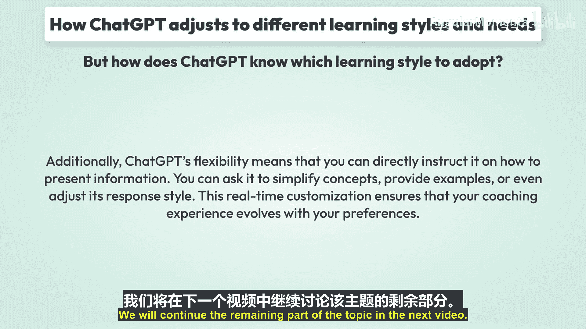


本节课中，我们一起探讨了ChatGPT如何通过识别用户偏好和互动模式，动态调整其内容呈现方式（视觉、听觉、读写、动觉）、节奏和复杂度，从而为不同学习风格的用户提供高度个性化的教练体验。这使其成为一个能够模仿人类教练适应性的强大工具。