# 002：实时反馈与持续改进

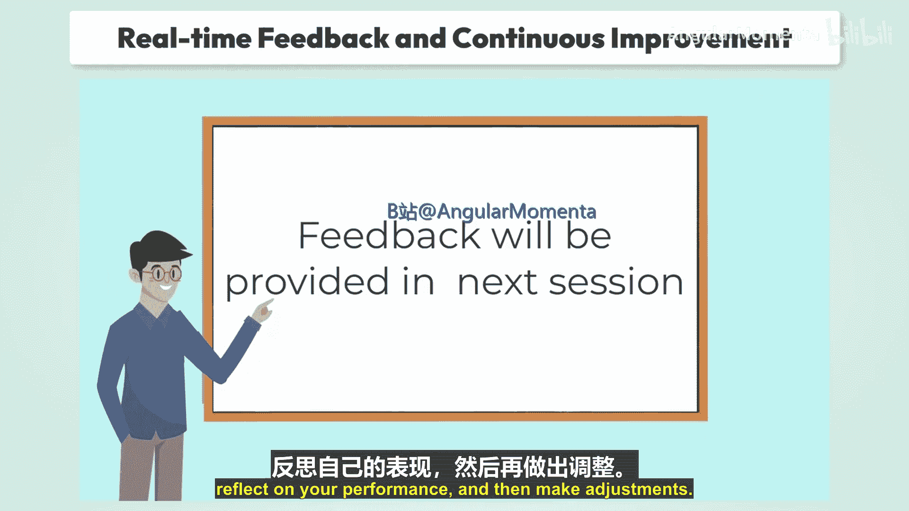

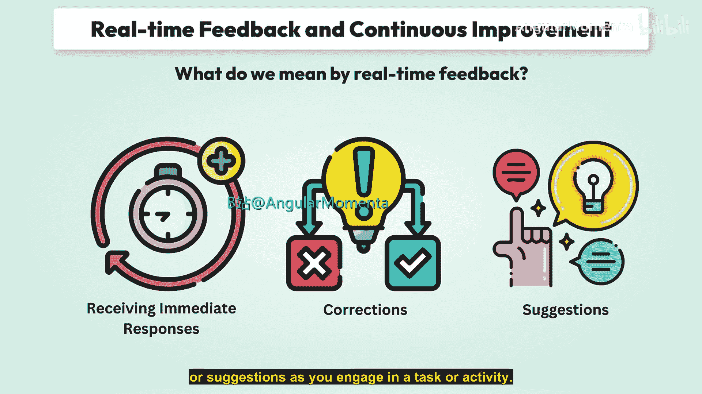

在本节课中，我们将要学习生成式人工智能（特别是ChatGPT）如何通过提供**实时反馈**和促进**持续改进**来彻底改变传统的辅导模式。我们将探讨其核心机制、应用场景以及可扩展性优势。

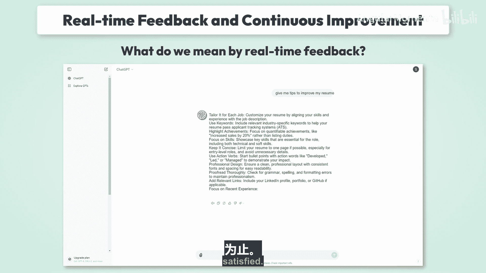

---

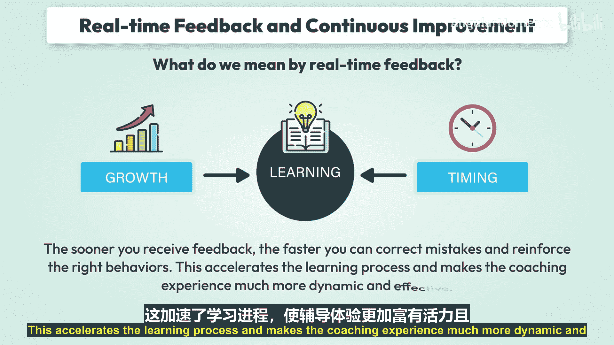

## 实时反馈：改变游戏规则

上一节我们介绍了生成式AI在辅导中的基础应用，本节中我们来看看它如何提供实时反馈。在传统辅导中，反馈通常是延迟的。你可能需要等到下一次辅导课程才能获得关于你进展的反馈，然后才能反思你的表现并进行调整。

但是，借助ChatGPT，实时反馈完全改变了局面。

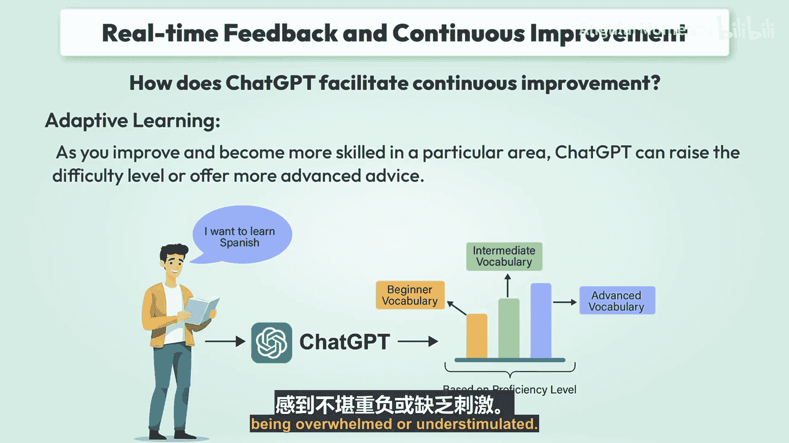

**实时反馈**指的是在你执行任务或活动时，立即获得回应、纠正或建议。无论你是在练习一项新技能、解决问题还是寻求指导，ChatGPT都能立即为你提供可操作的见解。

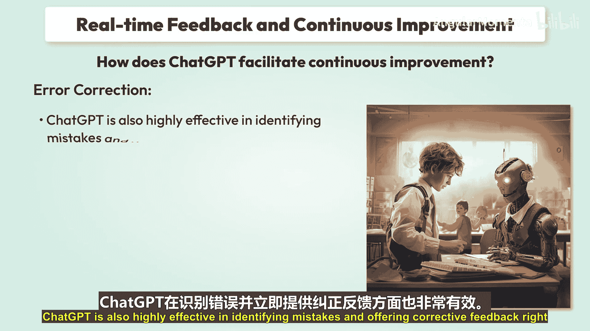

这个即时响应系统之所以强大，是因为它允许你在当下进行调整，而不是事后才进行。例如，假设你正在寻求关于如何改进简历以申请工作的建议。ChatGPT可以当场提供详细的建议，例如重新措辞某些部分或突出特定技能。这意味着你可以立即改进文档，并持续完善直到满意为止。

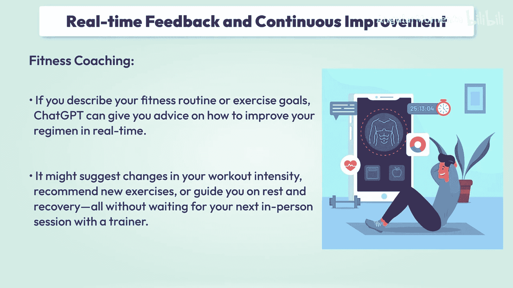

为什么这一点很重要？在学习和成长方面，时机就是一切。你越早收到反馈，就能越快纠正错误并强化正确的行为。这加速了学习过程，并使辅导体验更具活力和效果。

想象一下，你正在制定健身计划，但不确定自己的姿势或锻炼技巧。你可以向ChatGPT描述你的锻炼情况，它会根据描述立即提供关于如何改善姿势、呼吸或技巧的建议。这样，你就能实时纠正错误并提高表现，从而随着时间的推移获得更好的结果。

---

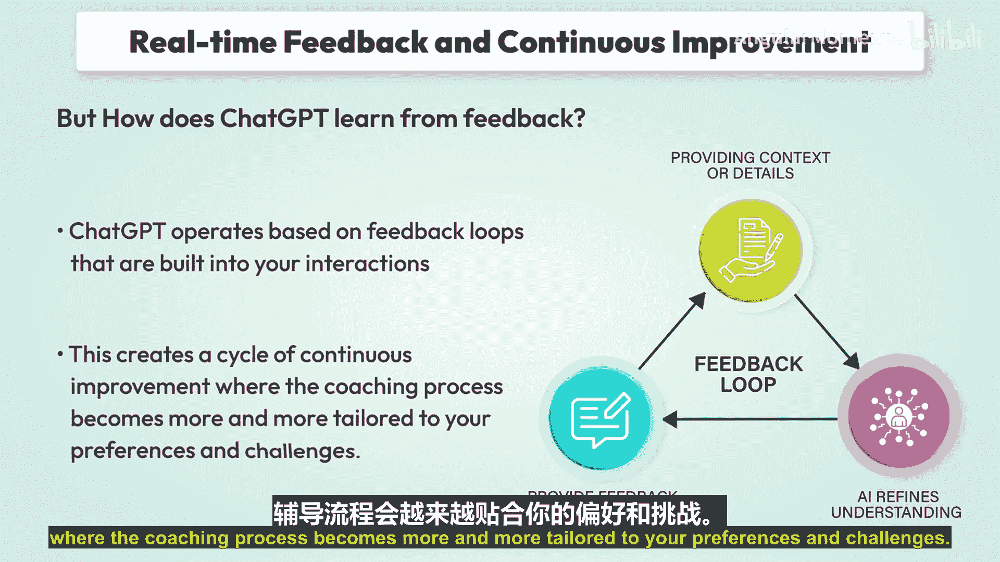

## 持续改进：AI如何促进成长

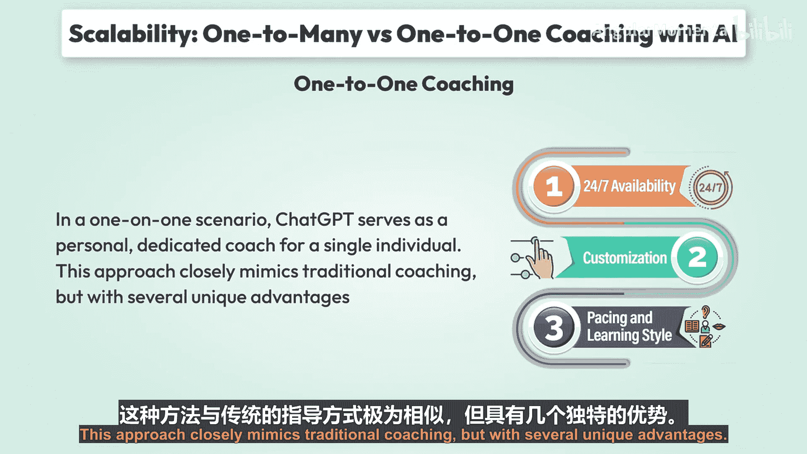

ChatGPT的一个突出特点是它能够提供随着你的进步而适应和演变的指导，这带来了一个以持续改进为中心的辅导体验。

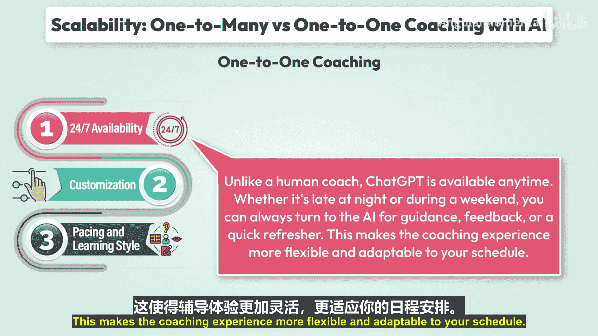

以下是ChatGPT促进持续改进的几个关键方面：

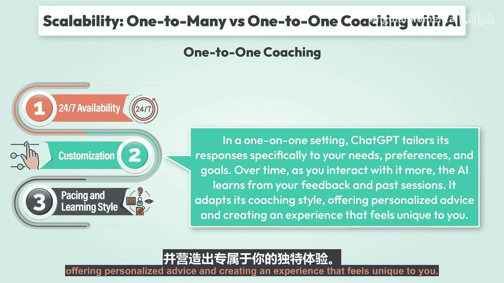

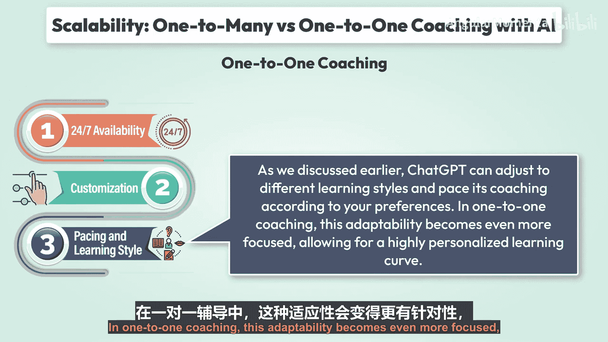

*   **持续进度跟踪**：当你与ChatGPT互动时，它会记住你过去的对话，这意味着它可以跟踪你随时间的发展。例如，如果你正在接受职业辅导，它可以参考之前的会话，帮助你反思进展并调整目标。这种持续的对话意味着你每次都不需要从头开始。
*   **适应性学习**：随着你在特定领域的进步和技能提升，ChatGPT可以提高难度级别或提供更高级的建议。例如，如果你正在学习一门新语言，ChatGPT可以根据你的熟练程度逐步引入更复杂的词汇和句子结构。这种个性化的进展让你能够持续挑战自己并成长，而不会感到不知所措或缺乏动力。
*   **错误纠正**：ChatGPT在识别错误和立即提供纠正性反馈方面也非常有效。如果你正在解决一个数学问题并犯了一个小错误，ChatGPT可以指出来并引导你找到正确的解决方案。这种即时纠正不仅能防止坏习惯的形成，还有助于巩固正确的技巧。

让我们通过几个常见的辅导场景来分解ChatGPT实时反馈的工作原理：

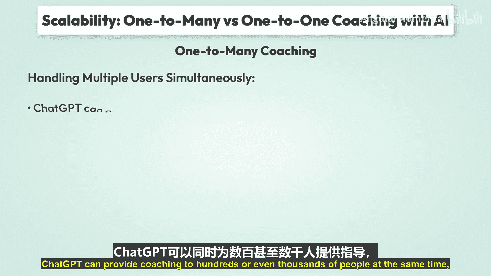

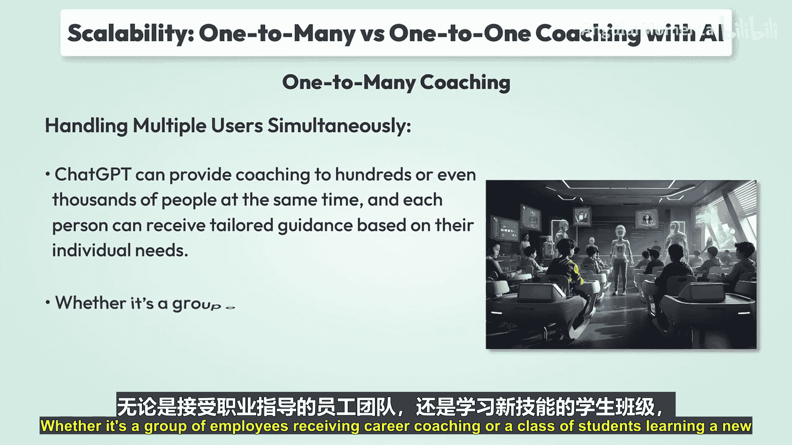

*   **职业辅导**：假设你正在为工作面试进行练习，并向ChatGPT提供了一个对常见面试问题（如“你最大的优点是什么？”）的模拟回答。ChatGPT会立即提供反馈，建议你如何完善答案、突出具体成就或更有效地组织语言。这个即时反馈循环让你可以不断优化回答，直到充满信心。
*   **健身辅导**：如果你描述你的健身计划或锻炼目标，ChatGPT可以实时给你关于如何改善计划的建议。它可能会建议改变锻炼强度、推荐新的练习，或指导你休息和恢复，所有这些都无需等待下一次与教练的面对面课程。
*   **学习新技能**：假设你正在学习编码，并且卡在某个特定问题上。ChatGPT不仅可以帮助你解决问题，还可以解释为什么某些方法比其他方法更好。随着你继续学习，它可以提供更细致的建议，以适应你不断增长的技能。

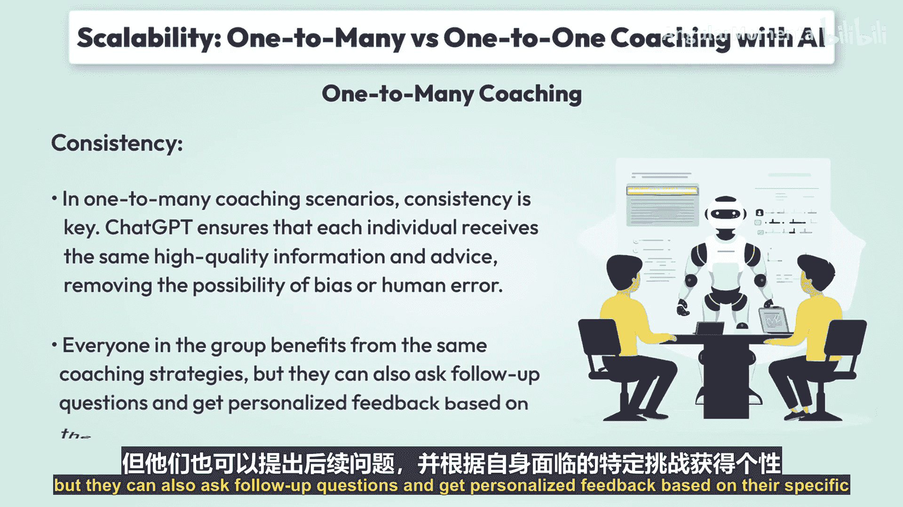

---

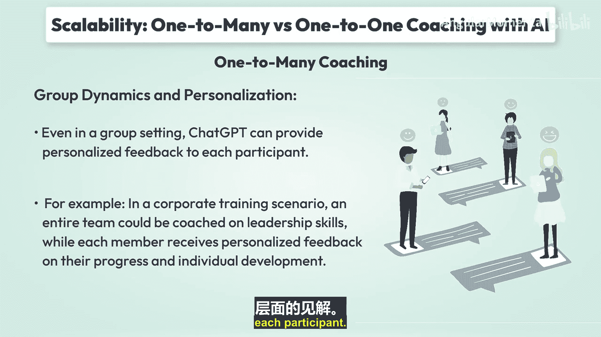

## 可扩展性：从一对一辅导到一对多辅导

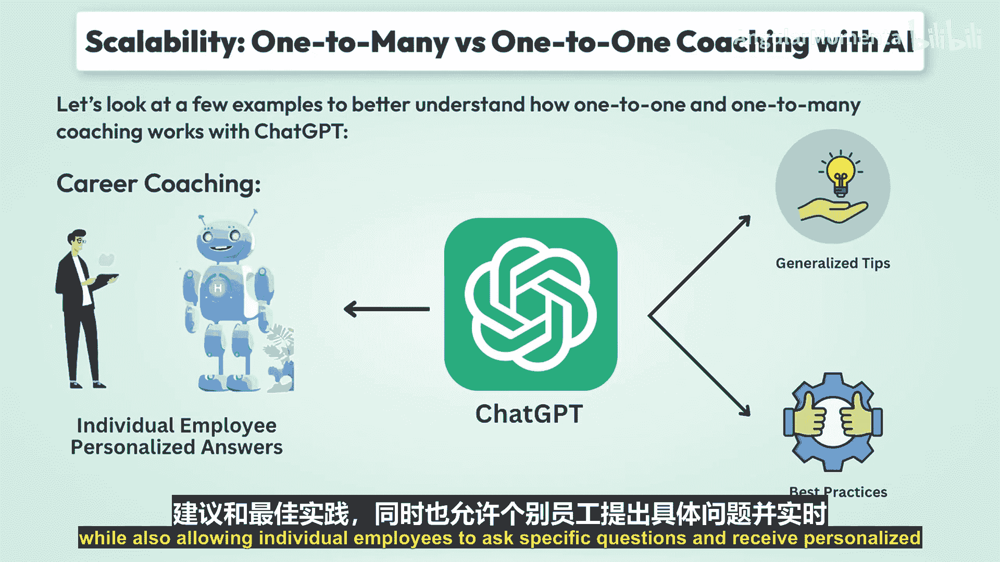

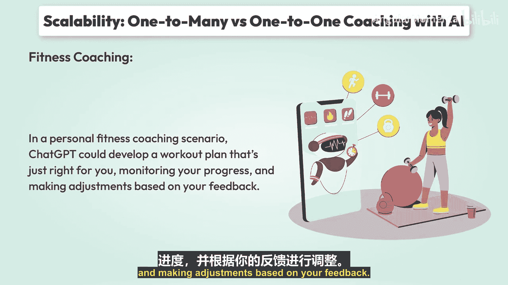

可扩展性是AI驱动辅导系统的关键优势。传统的辅导模式，无论是职业辅导、健身训练还是生活辅导，通常都需要教练和客户之间建立一对一的关系。这可能非常有效，但也非常耗费资源。教练一天只有那么多时间，只能服务有限的客户。但是，借助AI，这个限制消失了。

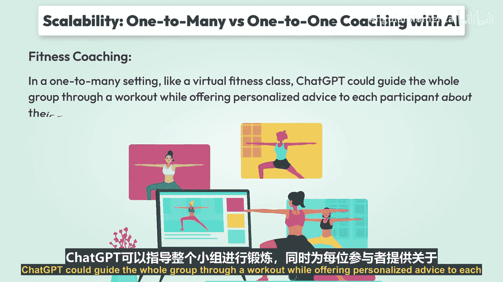

### 一对一辅导

在一对一场景中，ChatGPT充当个人的专属教练。这种方法与传统辅导非常相似，但有几个独特的优势：

*   **全天候可用**：与人类教练不同，ChatGPT随时可用，无论是深夜还是周末，你都可以随时向AI寻求指导、反馈或快速复习。这使得辅导体验更加灵活，更能适应你的日程安排。
*   **高度定制化**：在一对一设置中，ChatGPT会根据你的需求、偏好和目标专门定制其回应。随着时间的推移，随着你与它的互动增多，AI会从你的反馈和过去的会话中学习，调整其辅导风格，提供个性化建议，创造出一种为你量身定制的体验。
*   **适应节奏与学习风格**：正如我们之前讨论的，ChatGPT可以适应不同的学习风格，并根据你的偏好调整辅导节奏。在一对一辅导中，这种适应性变得更加集中，允许高度个性化的学习曲线。

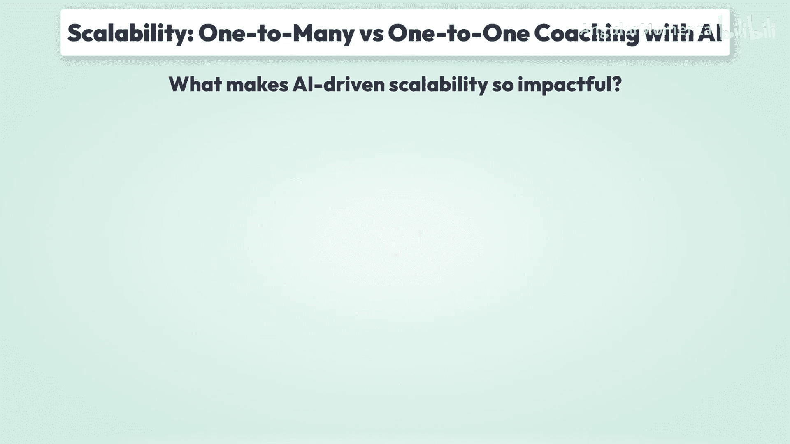

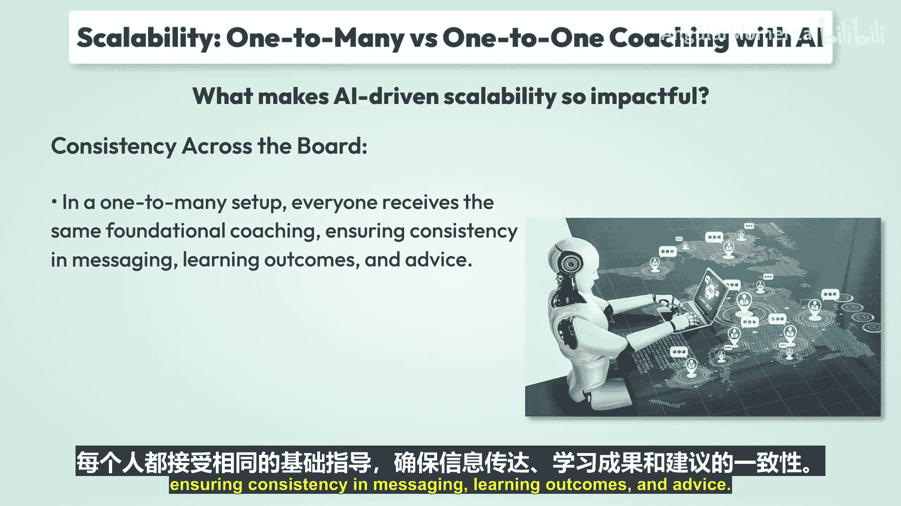

### 一对多辅导

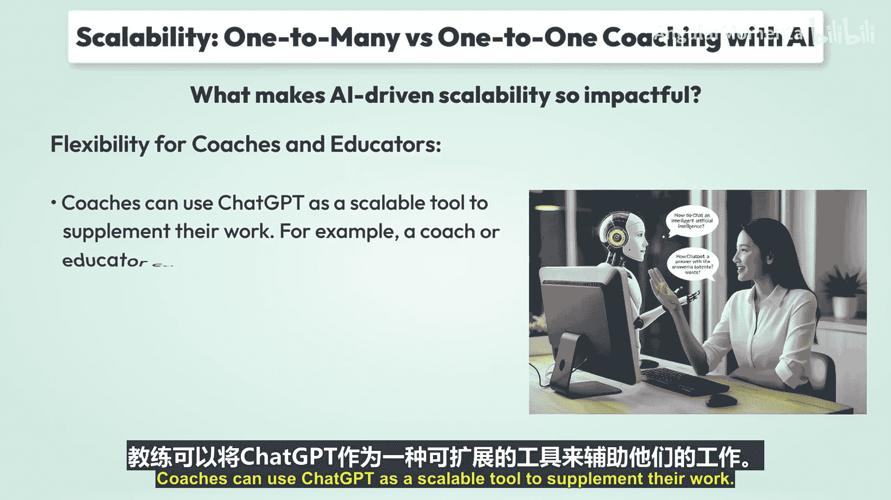

像ChatGPT这样的基于AI的辅导系统最强大的功能之一，是能够将辅导从一个个体扩展到多个个体，同时不损害个性化体验。在传统的辅导环境中，如果一位教练需要指导一群人，他可能很难为每个人提供个别关注。而有了ChatGPT，这个限制就消失了。

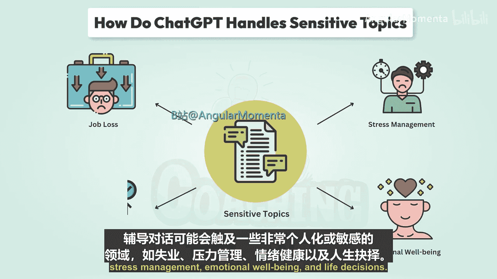

*   **同时处理多个用户**：ChatGPT可以同时为数百甚至数千人提供辅导，并且每个人都可以根据其个人需求获得量身定制的指导。无论是一群接受职业辅导的员工，还是一个学习新技能的学生班级，AI都能毫不费力地进行扩展，而不会降低辅导质量。
*   **保持一致性**：在一对多辅导场景中，一致性是关键。ChatGPT确保每个个体都接收到相同高质量的信息和建议，消除了偏见或人为错误的可能性。小组中的每个人都受益于相同的辅导策略，但他们也可以提出后续问题，并根据自己的具体挑战获得个性化反馈。
*   **兼顾群体动态与个性化**：即使在小组环境中，ChatGPT也可以为每个参与者提供个性化反馈。例如，在企业培训场景中，整个团队可以接受领导力技能辅导，同时每个成员都能获得关于其进展和个人发展的个性化反馈。ChatGPT处理宏观层面的群体辅导，同时为每个参与者提供微观层面的见解。

让我们看几个例子，以更好地理解ChatGPT如何实现一对一和一对多辅导：

*   **职业辅导**：在一对一辅导课程中，ChatGPT可能会帮助你制作简历、准备面试，并根据你的行业和经验水平提供量身定制的职业建议。它会从你的回应中学习并完善其建议。但是，在公司范围的职业发展研讨会这样的一对多环境中，ChatGPT可以提供通用的技巧和最佳实践，同时也允许个别员工实时提出具体问题并获得个性化答案。
*   **健身辅导**：在个人健身辅导场景中，ChatGPT可以为你制定一个恰到好处的锻炼计划，监控你的进展，并根据你的反馈进行调整。在一对多环境中，例如虚拟健身课程，ChatGPT可以指导整个小组进行锻炼，同时为每个参与者提供关于其姿势、节奏或饮食的个性化建议。
*   **教育与学习**：假设你在一对一环境中使用ChatGPT学习一门新语言，它会根据你的技能水平定制课程，给你实时纠正，并跟踪你的进度。但在有多名学生的课堂环境中，ChatGPT可以向每个人提供相同的课程，同时让每个学生都有机会提出具体问题、获得实时反馈，并根据他们个人的语言熟练程度获得量身定制的支持。

---

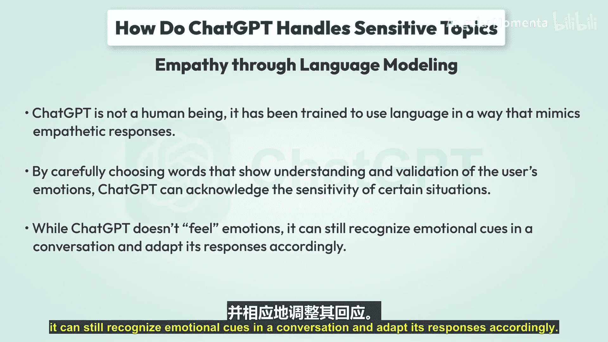

## 处理敏感话题：确保安全与尊重

当我们思考辅导时，它不仅仅是提供关于职业成长或健身计划的建议。很多时候，辅导对话会触及非常个人化或敏感的领域，如失业、压力管理、情感健康和生活决策。人类教练通常会建立融洽关系，运用同理心，并为个人提供一个安全的倾诉空间。对于ChatGPT而言，确保类似的理解和支持水平对于维持辅导过程中的信任和价值至关重要。

现在让我们探讨ChatGPT如何处理这些对话并确保积极、尊重的体验：

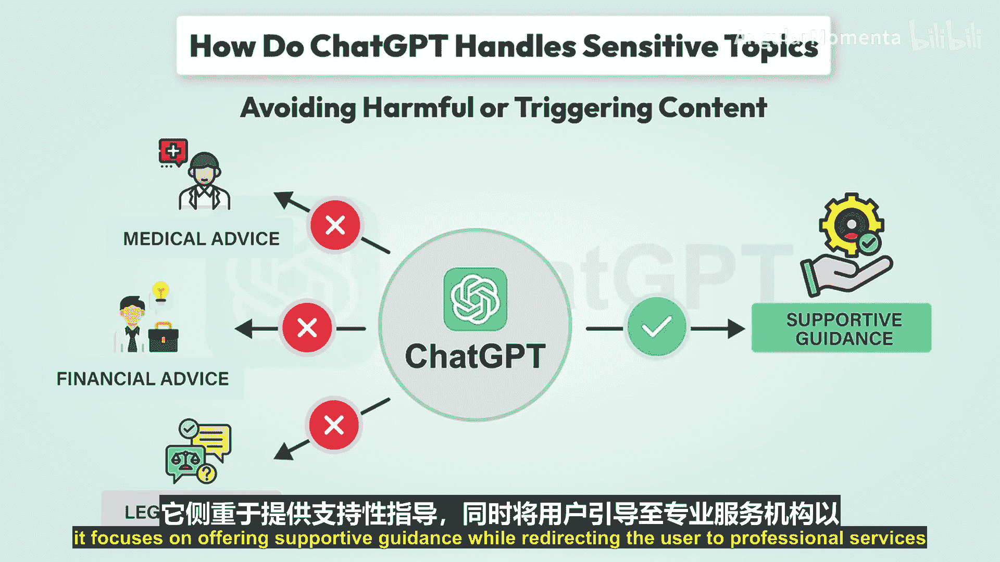

*   **中立且不带评判的语言**：ChatGPT在处理敏感话题时最强大的优势之一是其中立性。ChatGPT经过训练，能够提供不带个人偏见或评判的回应。当用户提出敏感问题，如心理健康困扰或关系挑战时，ChatGPT会以不带评判和中立的语言回应。这种中立的语气有助于维持一个安全和支持性的环境，让用户感到舒适地讨论个人问题。
*   **通过语言建模体现同理心**：尽管ChatGPT不是人类，但它经过训练，能够以模仿同理心回应的方式使用语言。通过精心选择能体现对用户情绪理解和认可的话语，ChatGPT可以承认某些情况的敏感性。虽然ChatGPT没有情感，但它仍然可以识别对话中的情感线索并相应地调整其回应。
*   **鼓励用户寻求专业帮助**：处理敏感话题的另一个关键方法是ChatGPT能够识别何时情况可能超出其能力范围。对于心理健康、创伤或高度情绪化等问题，ChatGPT可以建议向合格的专业人士（如咨询师、治疗师或法律专家）寻求建议。这里的目标不是假装ChatGPT能解决所有问题，而是引导用户找到可能更适合帮助他们的资源。
*   **避免有害或触发性的内容**：内置到ChatGPT中的最重要保障措施之一是其对有害或不适当内容的过滤。当用户提出敏感或可能触发的话题时，ChatGPT被编程为避免提供可能有害或无益的建议。例如，ChatGPT避免提供医疗、财务或法律建议，尤其是在可能导致用户产生负面结果的情况下。相反，它专注于提供支持性指导，同时将用户引导至专业服务以处理更复杂的事务。
*   **基于情境的个性化与敏感性**：ChatGPT根据用户特定需求进行调整的能力，也在其处理敏感话题的方式中发挥作用。如果它识别出用户之前提到过某些挑战或偏好，它会相应地调整其回应。这有助于创造更个性化的体验，尤其是在微妙的对话中。

---

## ChatGPT的辅导功能特性

让我们深入了解一些使ChatGPT成为有效辅导工具的关键功能。无论是职业辅导、健身指导还是生活辅导，ChatGPT都利用先进功能提供个性化和支持性的体验。

### 对话式学习

对话式学习是ChatGPT提供辅导的核心。它不是遵循僵化的“一刀切”方法，而是通过自然对话与用户互动，实时适应他们的问题、需求和学习节奏。

*   **互动性强**：使用ChatGPT进行辅导，感觉不像正式课程，而更像互动对话。这有助于保持用户的参与度和兴趣，在处理职业指导或健身计划等话题时尤为重要。
*   **适应用户水平**：ChatGPT可以根据用户的经验调整其语气、复杂性和建议。如果某人是某个话题的新手，ChatGPT会简化解释并引导他们了解基础概念。对于更高级的用户，它可以提供更深入的见解或更复杂的任务。
*   **实时反馈与支持**：当用户提问时，ChatGPT可以提供即时反馈，帮助他们实时反思、调整和改进。这种动态互动模拟了现场辅导课程，进步是逐步发生的，与用户的节奏相适应。

### 个性化进度跟踪

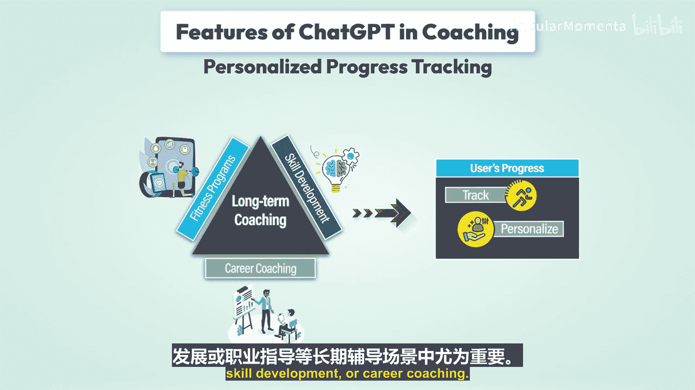

ChatGPT在辅导中最有价值的功能之一是其跟踪和个性化用户进度的能力。这在长期辅导场景中尤为重要，如健身计划、技能发展或职业辅导。

*   **记住关键里程碑**：ChatGPT可以回忆起过去对话中的重要点，使其能够跟踪你的目标、成就和需要改进的领域。
*   **定制计划**：根据用户的反馈和进度，ChatGPT可以持续完善和定制建议。这使得辅导过程具有适应性：随着用户成长或遇到挑战，ChatGPT会进行调整以提供更相关的建议或支持。
*   **跟踪长期目标**：ChatGPT不仅仅关乎即时对话。通过记录之前的互动，它旨在让用户对长期目标负责，帮助用户保持在实现长期目标的轨道上，无论是职业成长、健身成就还是个人发展。

### 与外部工具集成

ChatGPT作为辅导工具的一个强大方面是其与其他平台集成的能力，这使得辅导过程更加有效。

*   **数据集成**：ChatGPT可以与其他工具连接，如日历、健身追踪器或任务管理应用程序。这使得AI能够根据关于用户活动或日程的实时数据，提供具有情境感知能力的辅导。
*   **与生产力工具协作**：在职业辅导或生产力管理中，ChatGPT可以与Google日历、Trello或Asana等平台集成，帮助用户管理任务、截止日期和目标。这不仅帮助用户保持条理，还允许ChatGPT根据他们正在进行的项目提供实时提醒和可操作的建议。
*   **扩展学习资源**：ChatGPT可以从外部数据库、研究论文甚至Udemy或Coursera等学习平台提取信息，使用户能够访问更广泛的学习材料。这使得辅导体验更加全面，提供超越对话建议的资源。
*   **与通信工具集成**：对于小组辅导或企业环境，ChatGPT可以与Slack、Zoom或Microsoft Teams等通信平台集成，在更大的生态系统内提供无缝的辅导体验。这使得用户可以轻松地在个人辅导和团队协作之间切换，而不会丢失上下文。

---

## 总结

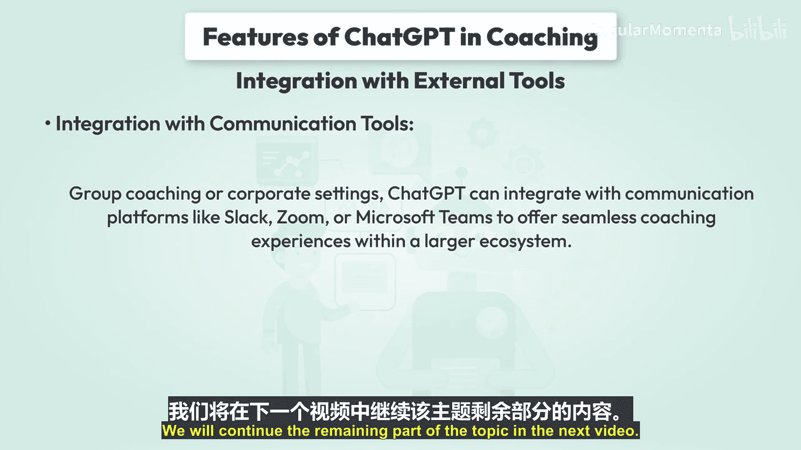

本节课中，我们一起学习了ChatGPT如何通过**实时反馈**机制，在用户执行任务时立即提供纠正和建议，从而加速学习过程。我们探讨了它如何通过**持续进度跟踪**、**适应性学习**和**错误纠正**来促进**持续改进**。此外，我们分析了AI辅导的**可扩展性**优势，既能提供深度个性化的一对一辅导，也能高效地进行一对多扩展，同时保持一致性。我们还了解了ChatGPT如何以**中立、同理的语言**处理敏感话题，并鼓励在必要时寻求专业帮助。最后，我们回顾了其核心功能，包括**对话式学习**、**个性化进度跟踪**以及与**外部工具的集成**，这些功能共同构成了一个强大、灵活且可访问的现代辅导解决方案。