生成式人工智能应用教程：03：ChatGPT生活应用指南 🧠

## 概述
在本节课中，我们将学习如何将ChatGPT作为个人助理，应用于日常生活、商业运营、内容总结、文件整理等多个场景，并探讨AI驱动式辅导的挑战与未来展望。

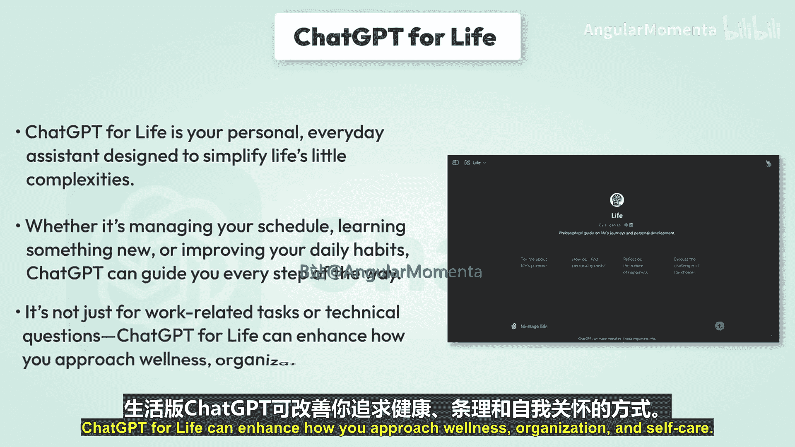

---

## ChatGPT作为生活助理 🏠

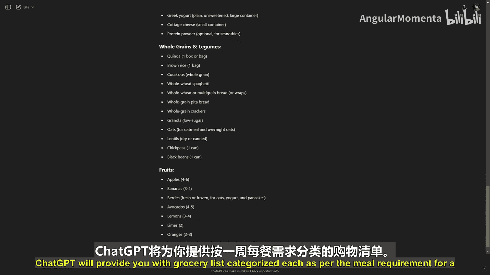

上一节我们介绍了生成式人工智能的基础概念，本节中我们来看看ChatGPT如何成为你的个人日常助手。ChatGPT for Life旨在简化生活中的各种复杂事务，无论是管理日程、学习新技能还是改善日常习惯，它都能提供一步步的指导。它不仅能处理工作任务或技术问题，更能提升你在健康、组织规划和自我关怀方面的生活品质。

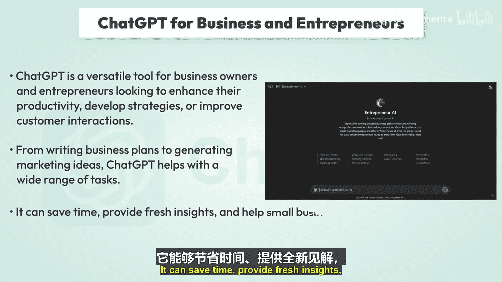

让我们通过一个“膳食计划大师”的例子，探索ChatGPT如何简化你的日常流程。

假设你需要帮助规划一周的健康膳食以保持条理。你可以向ChatGPT提供以下提示：
> 你能为我创建一个包含早餐、午餐和晚餐建议的一周健康膳食计划吗？

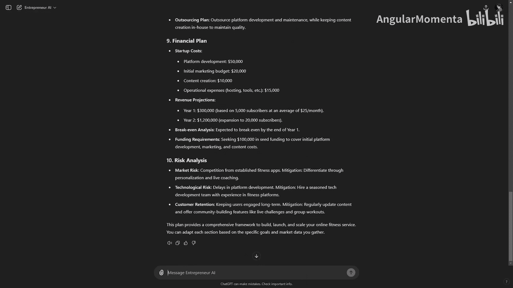

ChatGPT会展示一个为期七天的膳食计划，每天提供不同的早、中、晚餐建议。

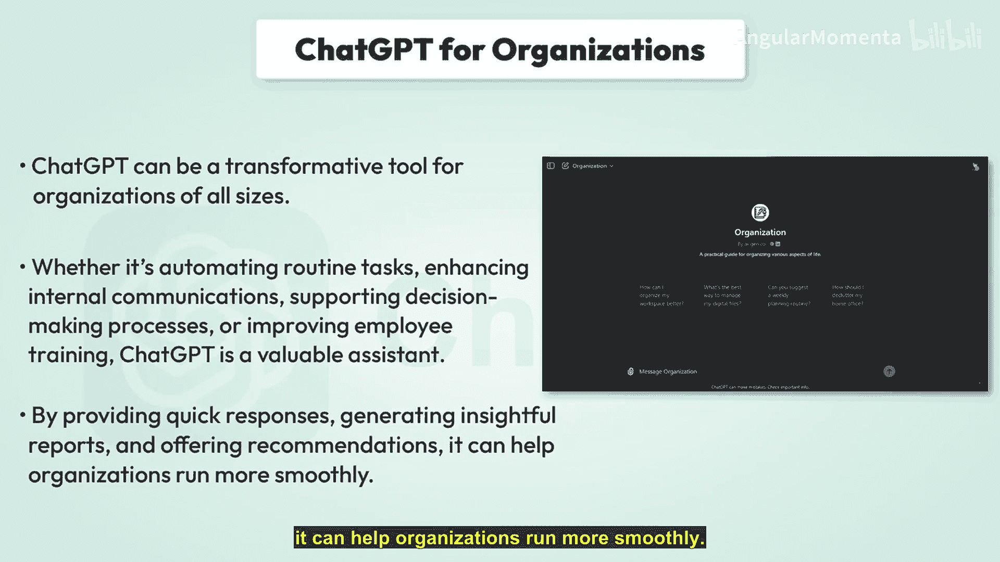

不仅如此，ChatGPT还能简化你的购物环节。当你追加提示：
> 你能为这个膳食计划创建一个购物清单吗？

ChatGPT将提供一份按一周膳食需求分类的购物清单。

---

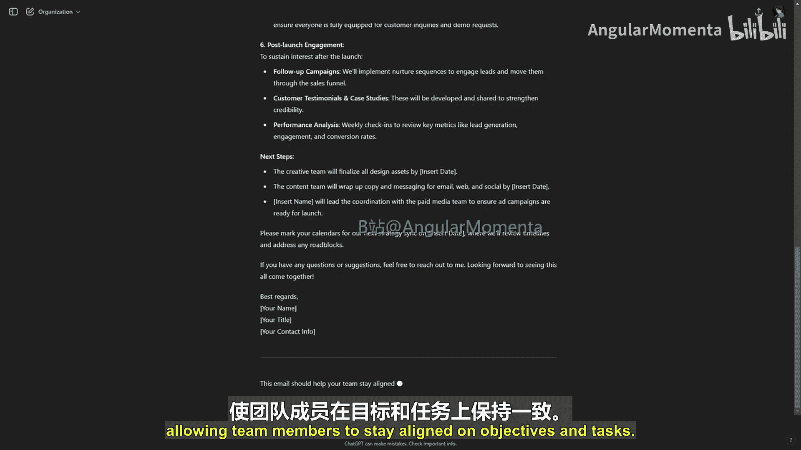

## ChatGPT用于商业与创业 💼

ChatGPT是寻求提升生产力、制定策略或改善客户互动的企业主和创业者的多功能工具。从撰写商业计划到生成营销创意，ChatGPT能协助完成广泛的任务；它可以节省时间、提供新见解，并帮助小企业主和创业者做出更明智的决策。

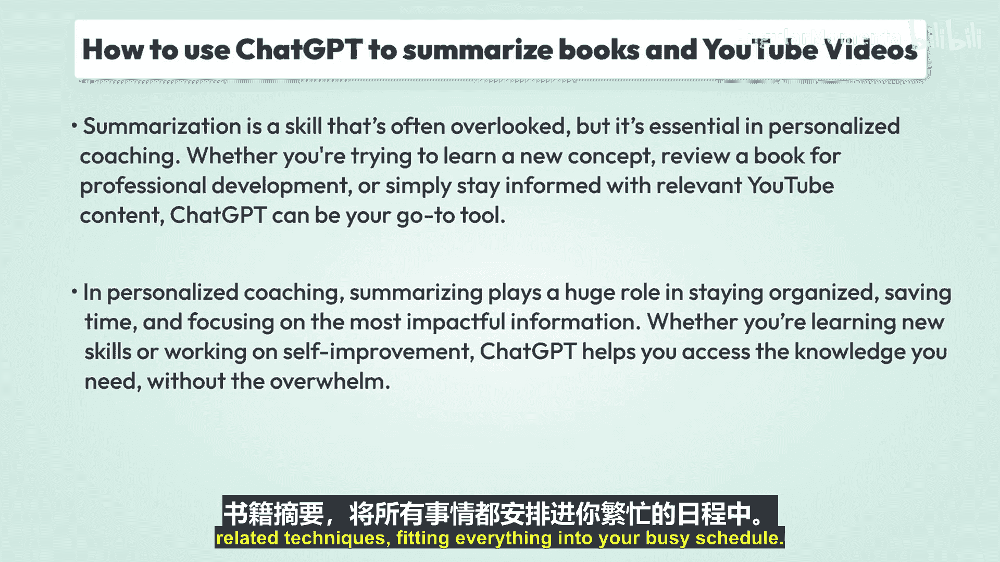

让我们通过一个具体例子来看其实际应用。假设你正在考虑开展在线健身教练服务，但不知道如何制定商业计划。你可以向ChatGPT提供以下提示：
> 你能帮我为一项新的在线健身教练服务创建一个商业计划吗？

ChatGPT会快速生成一份详细的商业计划，帮助创业者节省时间，并明确如何推进他们的商业构想。通过提供结构化方法，ChatGPT确保在规划阶段不会遗漏任何要点。

---

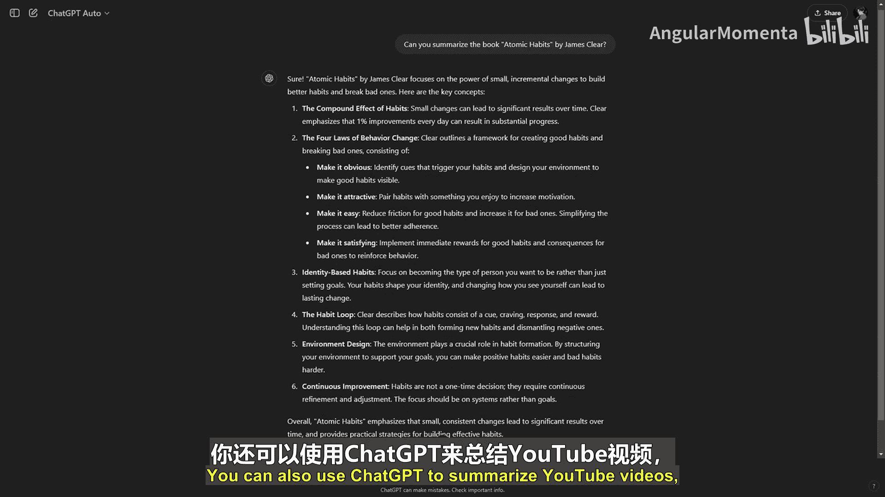

## ChatGPT用于组织管理 🏢

ChatGPT可以成为各种规模组织的变革性工具，无论是自动化常规任务、加强内部沟通、支持决策流程，还是改进员工培训，ChatGPT都是一位宝贵的助手。通过提供快速响应、生成有洞察力的报告和提供建议，它能帮助组织更顺畅地运行。

让我们看一个实际例子：在组织中，你需要通知营销团队关于即将到来的产品发布策略。你可以向ChatGPT提供以下提示：
> 你能起草一封内部邮件给营销团队，概述我们即将推出的产品发布策略吗？

ChatGPT可以通过起草清晰简洁的信息来帮助简化内部沟通。它能确保重要更新得到有效且及时的传达，使团队成员在目标和任务上保持一致。

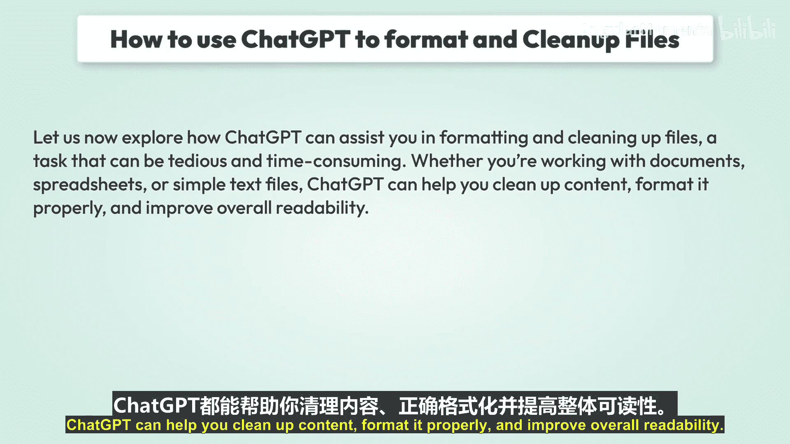

---

## 如何使用ChatGPT总结书籍与YouTube视频 📚

想象一下，你正在为一个大项目做准备，但有几本书要读或数小时的YouTube视频要看。时间紧迫，你需要快速抓住关键点。这正是生成式人工智能发挥作用的地方，它通过帮助你高效总结内容，为个性化辅导提供了强大的解决方案。

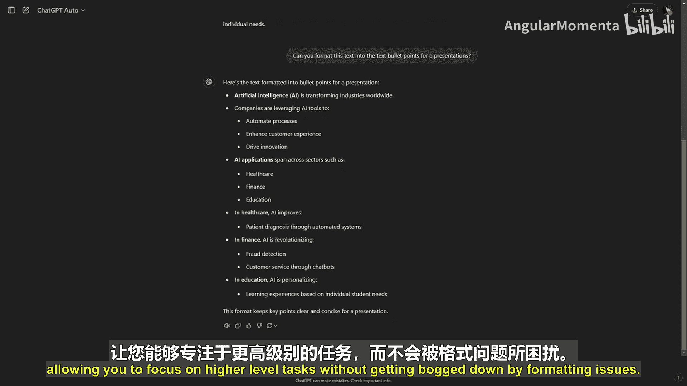

总结是一项常被忽视但至关重要的技能。无论你是试图学习新概念、为职业发展回顾一本书，还是仅仅想通过相关YouTube内容保持信息灵通，ChatGPT都可以成为你个性化辅导的首选工具。总结在保持条理、节省时间和关注最有影响力的信息方面扮演着巨大角色。无论你是在学习新技能还是致力于自我提升，ChatGPT都能帮助你获取所需知识，而不会让你感到不知所措。

想象一下，同时利用书籍和视频总结来推动你的个人成长：你可以阅读一本关于生产力的书籍摘要，同时快速浏览相关技巧的YouTube教程，将所有内容融入你繁忙的日程中。

以下是使用ChatGPT总结书籍的方法示例。你可以这样提示它：
> 请总结《原子习惯》这本书的核心观点。

输入书名后，ChatGPT会扫描书籍的关键主题，并提供简洁而全面的摘要。它会提取主要思想，在几句话中为你呈现书籍的精髓。这不仅节省了你的时间，还能帮助你在辅导课程中快速掌握核心概念。

但这还不是全部。你也可以使用ChatGPT来总结YouTube视频，这对于通过教程或信息类内容学习非常理想。要有效总结一个YouTube视频，你只需要视频的标题、描述，甚至是视频的文字稿。ChatGPT可以分析它并提供一个简洁版本，重点关注关键技巧或课程。

例如，提示可以是：
> 请总结这个关于“高效时间管理技巧”的YouTube视频。

ChatGPT会快速提取视频的要点，为你节省完整观看的时间，同时仍为你提供可以改善时间管理的核心技巧。

使用ChatGPT进行总结不仅仅是更快地浏览内容，更是关于充分利用你的时间、理清关键概念，并利用这些知识在个人和职业生活中采取有意义的行动。有了ChatGPT，总结复杂的书籍或冗长的YouTube视频变得毫不费力。在你的个性化辅导之旅中，这个工具可以改变游戏规则，确保你专注于真正重要的事情：学习、成长和实现目标。

---

## 如何使用ChatGPT格式化与整理文件 📄

现在让我们探索ChatGPT如何协助你格式化和整理文件——这是一项可能繁琐且耗时的任务。无论你处理的是文档、电子表格还是简单的文本文件，ChatGPT都可以帮助你清理内容、正确格式化并提高整体可读性。

假设你有一个需要格式化的混乱文本文件或文档。例如，想象你从多个来源复制粘贴了信息，结果结构混乱，存在不一致的间距、多余的空行和随机的大小写。

只需将内容粘贴到ChatGPT中，并要求它清理文本。这可能包括修正大小写错误、删除多余空格，甚至改善整体结构。正如你所见，ChatGPT快速高效地清理了文本，使其统一且可读。这个功能对于处理大型文档的人非常有用，无论你是在撰写报告、处理客户数据还是组织研究。

但ChatGPT能做的更多。例如，如果你需要将文档格式化为章节、标题或列表，你可以提供一个简单的提示：
> 你能将这段文字格式化为演示文稿用的要点吗？

这将有助于将大段文字转换为易于阅读的格式，如要点或章节。这个功能在准备演示文稿、创建学习笔记或清理电子邮件和报告等任务中可以节省大量时间，让你专注于更高级别的任务，而不会被格式问题困扰。

有了ChatGPT，清理和格式化文件的过程变得更顺畅、更快速、更高效。它是一个提高生产力的绝佳工具，让你能更轻松、更准确地完成项目。

---

## AI驱动式辅导的挑战 ⚠️

虽然ChatGPT和其他AI工具为个性化辅导提供了巨大潜力，但也存在一些需要注意的关键挑战。这些挑战可能影响AI驱动式辅导的效果和用户体验。

以下是主要挑战：

*   **缺乏人类直觉**：包括ChatGPT在内的AI最根本的限制之一，是无法完全复制人类的直觉、同理心和理解力。在生活辅导或心理健康等领域，教练需要读懂言外之意、捕捉情感线索，并根据个人经验提供指导。虽然ChatGPT可以模拟理解，但它缺乏人类教练所能提供的真正情感深度。
*   **处理复杂敏感问题**：虽然ChatGPT可以对一般话题提供建议，但在处理高度复杂或敏感的问题时可能会遇到困难。例如，围绕心理健康、个人创伤或重大人生决策的辅导通常需要谨慎处理、同理心和细致入微的理解。AI存在过度简化这些问题或给出不适合当前情况的建议的风险。
*   **数据隐私问题**：对于ChatGPT这类AI工具，始终存在数据隐私和安全方面的担忧。用户可能不愿与AI分享个人信息，特别是当他们不确定自己的数据将如何被使用或存储时。在信任至关重要的辅导领域，这些担忧可能成为完全接受该技术的障碍。
*   **对AI的依赖**：过度依赖AI工具有时可能导致用户完全停止寻求人类指导。这可能并非总是最佳方法，尤其是在需要人类洞察力、同理心或创造力的领域。
*   **AI模型中的偏见**：像ChatGPT这样的AI模型是在来自互联网的大型数据集上训练的，这些数据可能包含固有的偏见。这些偏见可能在辅导中出现，影响所给建议的公平性或适当性，尤其是在涉及职业发展、性别角色或文化问题等敏感话题时。

---

## 未来技术将如何演变 🚀

尽管存在这些挑战，AI与辅导的未来看起来前景无限光明。让我们看看未来几年AI驱动式辅导技术有望如何演变。

以下是未来的发展趋势：

*   **增强的情感智能**：AI的未来发展可能包括更复杂的情感智能，使ChatGPT等AI模型能够更好地解读和回应情感线索。这将涉及通过自然语言处理更准确地检测情绪、心境和上下文，使互动更有意义、更具同理心。
*   **混合辅导模式**：我们可能会看到混合模式的兴起，即AI辅助人类教练，而非取代他们。AI可以处理常规任务、提供数据驱动的见解或给出初步建议，而人类教练则专注于辅导中更复杂、情感化或个性化的方面。
*   **通过数据实现更多个性化**：随着AI变得更加先进，个性化将达到新水平。未来的AI系统将能够整合更复杂的数据源，如健康数据、绩效分析甚至生物特征数据，以提供高度个性化的建议和计划。
*   **与日常生活无缝集成**：AI工具将通过智能设备、可穿戴设备和家庭助手更深入地融入日常活动。这将实现持续、实时的辅导，使体验更加无缝，减少对专门课程的依赖。
*   **改进的隐私与道德标准**：随着AI技术的进步，我们可以预期围绕数据隐私的监管会更严格，道德标准会提高。AI系统可能会纳入更透明的数据使用政策，确保用户在分享个人信息时感到安全。
*   **AI与其他AI协作**：未来，我们可能会看到AI系统相互协作，提供更全面的辅导体验。ChatGPT可以与专门的健身、心理健康、职业规划等AI工具协同工作，提供真正多维度的辅导服务。

---

## 总结

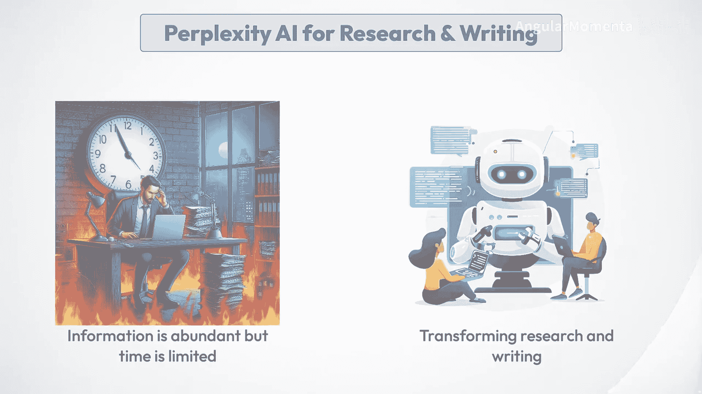

本节课中，我们一起学习了ChatGPT作为多功能助手在生活、商业、内容处理等方面的广泛应用。我们探讨了它如何通过个性化响应、实时反馈和持续学习来革新辅导领域。同时，我们也审视了AI驱动式辅导在情感理解、处理复杂问题、数据隐私等方面面临的挑战。展望未来，AI辅导将朝着更个性化、更具情感智能、更深度融入生活的方向发展，为人人提供随时可得的、数据驱动的个性化指导。在接下来的课程中，我们将继续探讨其他AI工具在研究与写作等领域的应用。