# 004：Perplexity AI 详解 🧠

## 概述
在本节课中，我们将深入学习 Perplexity AI。我们将了解它如何作为传统搜索引擎的替代品，其核心功能、与ChatGPT等工具的区别，以及如何利用它进行高效的研究与写作。课程将涵盖从基础使用到高级Pro版本的所有关键内容。

---

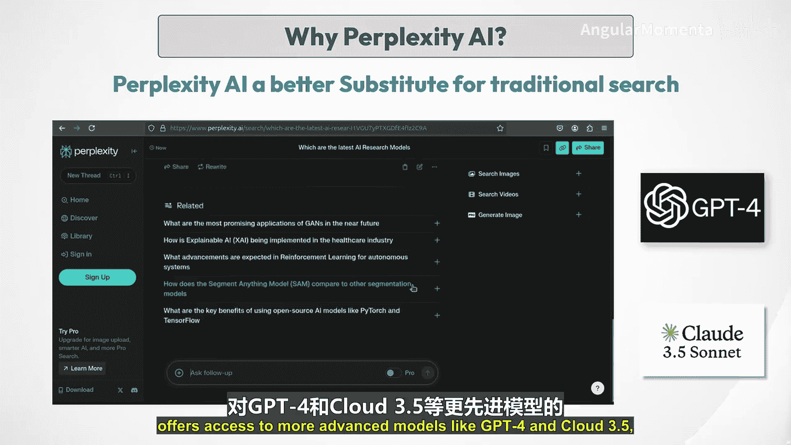

## Perplexity AI：一个更好的传统搜索替代品 🔍

上一节我们介绍了为何要关注Perplexity AI。本节中，我们来看看它如何革新信息获取方式。

Perplexity AI是一个先进的、由AI驱动的研究和对话式搜索引擎。它从根本上改变了用户获取信息的方式。与传统搜索引擎返回链接列表不同，Perplexity直接提供全面、直接的答案，并从各种来源总结相关信息。这种方法不仅节省时间，还通过提供简洁、可操作的见解来增强用户体验。

该平台采用免费增值模式。基础版本使用独立的大型语言模型（LLM），而付费版本Perplexity Pro则提供对GPT-4和Claude 3.5等更先进模型的访问，进一步增强了其能力。

---

## Perplexity AI 与 ChatGPT 和 Gemini 的区别 🤔

既然Perplexity AI基于OpenAI的GPT-3.5模型和一个具有NLP能力的独立LLM，那么它与ChatGPT和Gemini的唯一区别在于它提供实时生成的信息。ChatGPT和Gemini通过预训练模型生成结果，这可能导致答案过时，具体取决于其模型最后一次更新的时间。尽管GPT-4o模型和Gemini确实使用实时网络搜索，但这些工具首先使用预训练模型的知识，然后才访问实时网络搜索，或者仅在用户明确要求时才这样做。

Perplexity AI强调提供带有内联引用的实时、可验证信息，使其对学术和专业研究非常有用。

其独特功能，如用于优化查询的Copilot，以及允许用户将搜索范围限定在学术或创意写作等特定领域的聚焦模式，使其与竞争对手区分开来。此外，Perplexity总结内容和提供引用的能力增强了其对需要可靠来源的研究人员的实用性。

例如，当用户查询气候变化研究的最新进展时，Perplexity AI不仅检索最新的研究，还总结关键发现，并提供来自可信学术来源的引用。这种能力使研究人员能够快速掌握关键信息，而无需筛选大量文章，从而使研究过程更加高效。

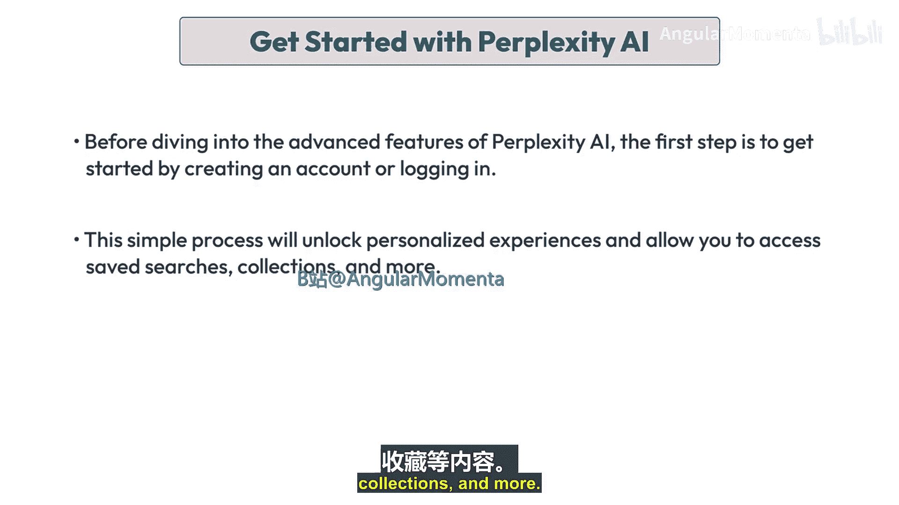

另一方面，如果在Google上搜索相同的查询，我们必须点击每个链接，阅读每个主题以找到相关信息，并获取完整的理解。

简而言之，以下是Perplexity AI的关键功能：
*   **实时信息**：Perplexity从互联网即时提取数据，确保用户获得最新的可用信息。
*   **可靠来源**：每个答案都附有来自可信来源的引用，增强了所提供信息的可信度。
*   **用户友好界面**：该平台设计易于使用，允许用户像对话一样与之互动，使信息检索变得直观。

---

## 开始使用 Perplexity AI 🚀

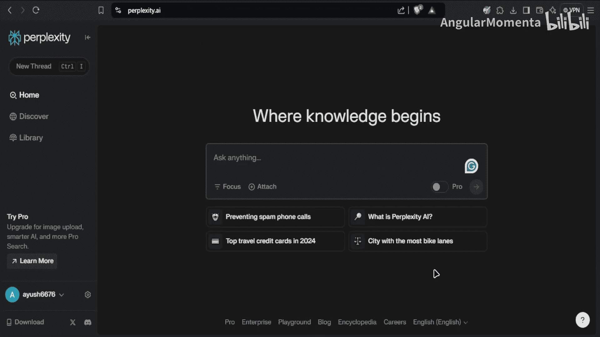

在深入了解Perplexity AI的高级功能之前，第一步是通过创建账户或登录来开始使用。这个简单的过程将解锁个性化体验，并允许您访问保存的搜索、收藏集等功能。

首先，让我们访问Perplexity AI网站，我们可以看到聊天界面，在那里我们可以互动并输入提示。

在左下角，我们可以看到登录选项。您可以选择使用Google账户或Apple账户继续，也可以简单地按照您的选择创建自己的Perplexity账户。让我们选择使用Google登录。

登录后，您将可以访问一系列功能，如个性化搜索历史、保存的收藏集和聚焦研究工具。现在您已登录，可以开始探索Perplexity AI为支持您的研究和写作工作所提供的丰富资源。

我们将在下一个视频中继续本主题的剩余部分。

---

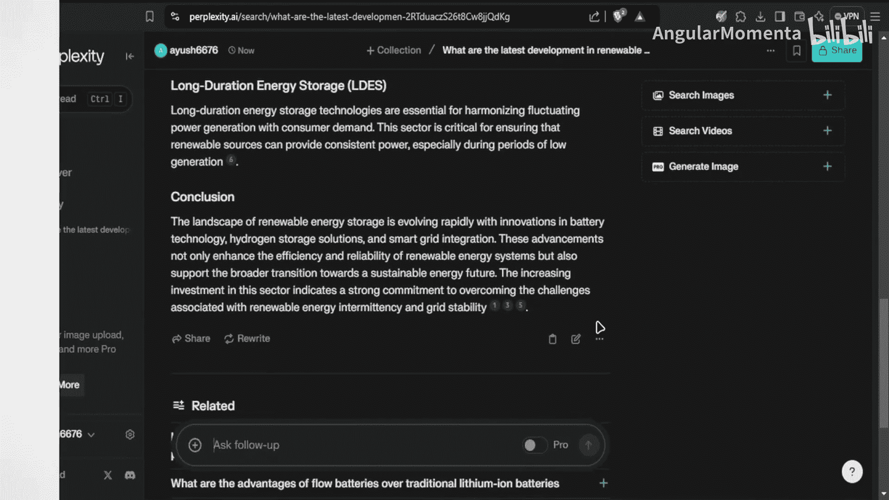

## 使用 Perplexity AI 进行研究和写作 📚

上一节我们介绍了如何开始使用Perplexity AI。本节中，我们来看看它如何具体辅助研究和写作。

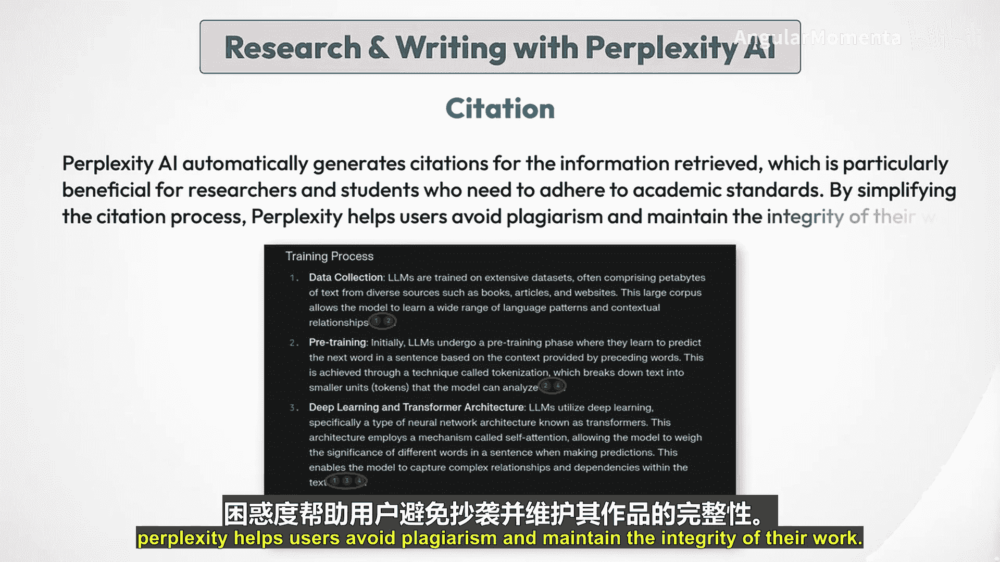

Perplexity AI作为一个交互式搜索引擎运行，利用先进算法实时分析和综合来自多个来源的信息。

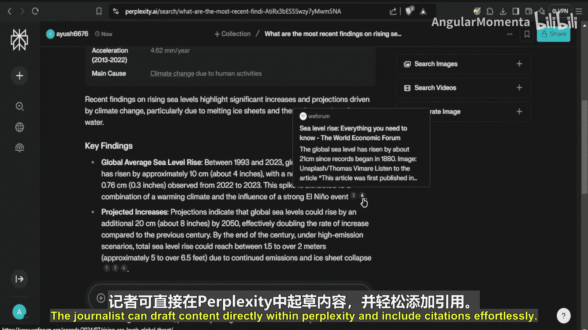

当用户输入查询时，AI处理请求，检索相关数据，并以连贯的格式呈现。这个过程涉及理解上下文、生成类人响应，并确保信息准确且最新。

让我们考虑一个具体的例子：我们想了解LLM如何工作。

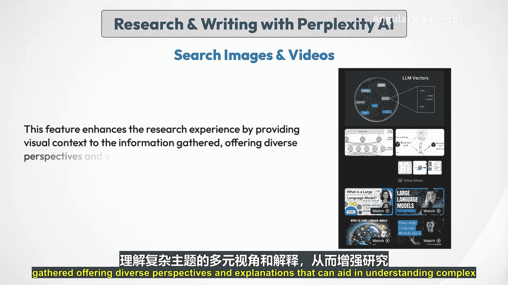

**初始查询**：用户首先在Perplexity AI搜索栏中输入查询“LLM究竟如何工作？”。
**实时信息检索**：提交查询后，Perplexity AI处理请求，并从广泛的来源（包括学术论文、文章和报告）检索相关信息。它将信息综合成一个简洁的摘要，突出显示与查询相关的关键发现。

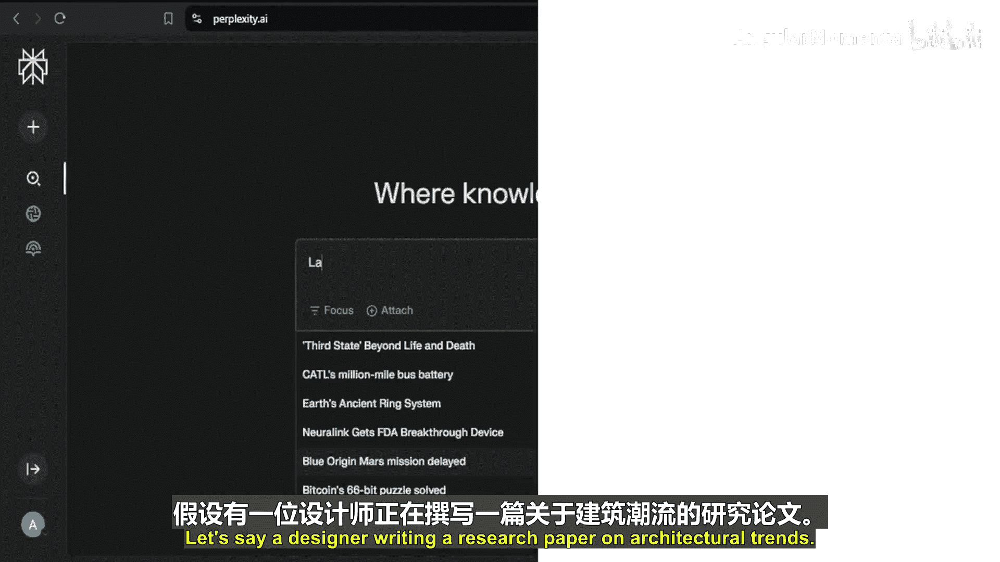

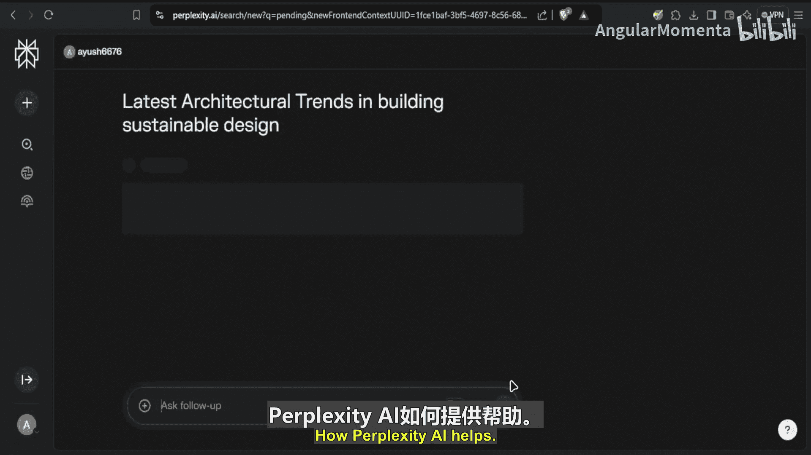

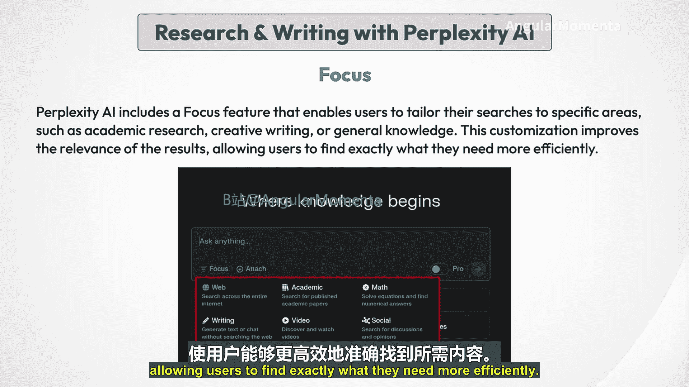

**来源**：Perplexity AI的一个突出特点是能够为其呈现的信息提供来源。每个答案都附有编号引用，允许用户验证事实并探索原始来源以获得更深入的见解。这个功能对于学术写作和研究至关重要，因为可信度和正确引用是必不可少的。

让我们设想一个场景：一名研究人员正在为论文撰写文献综述，Perplexity AI如何提供帮助？使用Perplexity的Copilot功能，研究人员可以输入广泛的问题，并收到各种学术论文的提炼、简洁的摘要。Copilot提供一组集中的来源，甚至提供可供后续引用的摘要，而不是手动搜索和阅读数十篇文章。

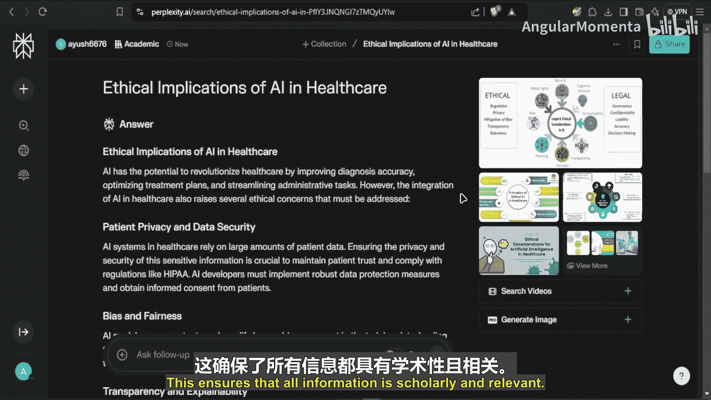

**引用**：Perplexity AI自动为检索到的信息生成引用，这对于需要遵守学术标准的研究人员和学生特别有益。通过简化引用过程，Perplexity帮助用户避免抄袭并保持工作的完整性。让我们看一个场景：一名记者需要撰写一篇关于气候变化的新闻文章并提供可信的引用，Perplexity AI如何提供帮助？

引用功能确保写作中使用的每个事实或引语都自动有合法来源支持。记者可以直接在Perplexity内起草内容，并轻松包含引用。

**搜索图像和视频**：Perplexity AI令人印象深刻的部分之一是，除了文本结果，它还提供相关的图像和视频。

这个功能通过为收集的信息提供视觉上下文，增强了研究体验，提供多样化的视角和解释，有助于理解复杂的主题。假设一位设计师正在撰写一篇关于建筑趋势的研究论文，Perplexity AI如何提供帮助？通过利用图像搜索功能，设计师可以直接从Perplexity AI的过滤结果中收集相关视觉资料，加快获取高质量图像的过程。

**聚焦模式**：Perplexity AI包含一个聚焦功能，使用户能够将搜索范围限定在特定领域，如学术研究、创意写作或常识。这种定制提高了结果的相关性，使用户能更高效地找到所需内容。

让我们举个例子：一名学生正在撰写一篇关于AI伦理影响的论文，Perplexity AI如何提供帮助？使用聚焦功能，学生可以将搜索限制在特定的学术来源，如论文或期刊文章。这确保了所有信息都是学术性的且相关。

我们将在下一个视频中继续本主题的剩余部分。

---

## Perplexity Pro：高级功能详解 ⚡

上一节我们介绍了Perplexity AI的核心功能。本节中，我们将通过Perplexity Pro将研究提升到一个新的水平。

对于那些认真希望将研究和写作提升到新水平的人来说，Perplexity Pro提供了可以极大改善工作流程和结果的增强工具。

Perplexity Pro不仅仅是一个升级版，它就像有一个专业的研究助手在身边。想象一下正在进行一个复杂的研究项目。标准的Perplexity AI在提供答案和指导研究方面做得很好，但有了Perplexity Pro，您将获得更深入的见解、更多上下文驱动的搜索，以及根据您的特定需求定制的增强响应。

那么关键区别是什么？是Pro版本在深入搜索之前澄清您查询的能力。Perplexity Pro通过提出后续问题来帮助优化您的查询，而不是让您在初始问题中思考每一个细节。这确保了它完全理解您的需求，并为您提供更量身定制的高质量响应。

例如，如果您询问如何制定有效的营销策略，Perplexity Pro可能会问您关注的是数字营销还是传统营销，从而根据您计划采取的具体方法给出更有针对性的回答。这种额外的互动层确保您获得可操作的答案，而不仅仅是通用信息。

以下是Perplexity Pro的一些独特功能，它们真正提升了您的研究和写作体验：

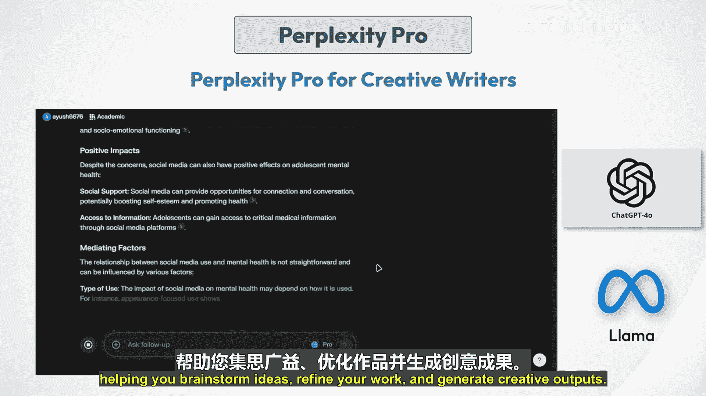

*   **无限Pro搜索**：Pro搜索改变了Perplexity处理查询的方式。与免费版本可能限制答案深度不同，Pro搜索扩展了范围，允许每次查询都能获得全面、精细的结果。这就像有一个专门的研究助手，通过提出后续问题来深入了解您的需求。
*   **升级的AI模型**：Perplexity Pro的一个重要优势是能够选择升级的AI模型。虽然免费版本主要使用标准模型，但Pro提供以下尖端选项：
    *   **GPT-4o**：以其深度推理能力闻名，帮助将复杂主题分解为更简单、易于理解的信息。
    *   **Claude 3.5 Sonnet**：该模型专为高级语言任务设计，可以提供听起来更自然的响应。
    *   **Sonar**：适用于数据密集型研究，能快速处理大量信息，对分析复杂数据集很有用。
    *   **Llama 3.1 405B**：以创意输出闻名，生成的文本感觉像对话，非常适合创意写作。
    根据您的需求（无论是更高的技术准确性还是增强的创造力）切换模型可以提高响应质量。
*   **无限文件上传**：Perplexity Pro的一个突出功能是无限文件上传。这对于处理大量数据集或文档的研究人员至关重要。您可以上传PDF、研究论文甚至代码文件进行分析。上传后，Perplexity会保持上下文，确保后续查询与您正在处理的数据直接相关。
*   **API积分**：使用Pro版本，您每月可获得5美元的API积分，这允许您将Perplexity集成到自己的应用程序或项目中。无论您是构建新的研究工具还是开发商业应用程序，这些积分都让您可以尝试API调用，利用AI的功能进行自定义用例。
*   **图像生成**：Perplexity Pro还引入了图像生成功能。该功能允许用户根据文本提示创建AI生成的视觉效果，使其成为需要视觉辅助的设计师、营销人员和研究人员的强大工具。在Pro中，我们有以下模型：
    *   Playground V3：Perplexity最新的图像生成模型。
    *   DALL-E 3：OpenAI创建的流行图像生成模型。
    *   Stable Diffusion XL：一个多功能、快速的图像生成模型。
    *   最近，Perplexity Pro还添加了Flux.1，这是Black Forest Labs创建的最新图像生成模型，用于生成更高质量的图像。

**Perplexity Pro 与学术研究**：对于学术研究人员来说，Perplexity Pro是一个改变游戏规则的工具。上传学术论文、总结复杂文本并就这些文本提出详细问题的能力，使其成为论文工作、期刊文章和研究项目不可或缺的工具。

Pro搜索确保更准确的数据支持响应，而升级的模型则提高了语言和分析的质量。

**Perplexity Pro 与创意写作**：创意作家也能从Perplexity Pro中受益匪浅。通过能够在GPT-4o和Llama等模型之间切换，作家可以探索不同的语调、声音和风格。无论是创作小说、剧本还是营销文案，Perplexity Pro都能适应您的需求，帮助您集思广益、完善作品并生成创意输出。

我们已经深入探讨了Perplexity AI及其Pro版本的每个细节，但Perplexity的功能不止于此。它提供了一套额外的工具，旨在优化您的工作流程和管理您的研究。

*   **发现**：此功能展示热门话题和最新研究，非常适合让您在自己的领域保持最新状态。无论是AI、文学、科学还是其他任何领域，您都可以根据兴趣在发现页面探索以下主题。
*   **库**：一个用于组织您的对话线程、文档和收藏集的强大工具。它是Perplexity AI管理每个对话线程和搜索的核心。在库部分，我们有：
    *   **线程**：存储并可以重新访问您正在进行的对话和研究问题。
    *   **页面**：库下一个有趣的工具。它基本上可以根据您的需要，在特定主题上生成整个博客页面，然后可以发布在社交媒体平台上，甚至可以发布在Disc页面上，以便其他人可以看到您的博客文章。
    *   **收藏集**：用户可以将他们的发现组织成收藏集，从而更轻松地管理研究项目并与他人协作。这个功能对于小组工作或正在进行的研究项目特别有用，因为它允许更好地组织和检索信息。

我们将在下一个视频中继续本主题的剩余部分。

---

## Perplexity AI 的局限性与未来展望 🔮

上一节我们探讨了Perplexity AI的强大功能。本节中，我们也要了解其在研究和写作方面的一些局限性，并展望其未来发展。

虽然Perplexity AI为研究和写作提供了许多优势，但在学术研究方面也存在一些局限性。

以下是其主要局限性：

*   **依赖在线来源**：Perplexity AI主要从网站、博客和一些开放网络上的学术论文等在线来源提取信息。然而，它无法直接访问许多学术期刊、数据库和付费学术资源，而这些对于许多领域的深入研究至关重要。
*   **缺乏同行评审内容**：Perplexity AI提供的大部分信息，即使在引用学术来源时，也可能未经同行评审或发表在声誉良好的学术期刊上。同行评审是学术研究的关键质量检查，而Perplexity的结果可能并不总是满足高级研究项目所需的标准。
*   **对复杂主题的深度有限**：虽然Perplexity AI可以提供学术主题的概述和摘要，但分析的深度可能有限，特别是对于高度专业化或复杂的主题。研究人员可能需要查阅Perplexity提供范围之外的主要来源和专家文献。
*   **引用格式不一致**：Perplexity AI提供的引用格式并不总是一致，也不总是符合APA或MLA等标准学术格式。用户可能需要手动重新格式化引用或使用引用管理器，以确保学术论文的格式正确。
*   **可能存在过时或不可靠的信息**：与任何AI系统一样，Perplexity的知识基于其训练时可用的数据。存在风险，即它提供的一些信息可能已经过时、存在偏见或不可靠，特别是在快速发展的主题上。研究人员应始终根据权威来源验证关键事实和发现。

### Perplexity AI 的未来

Perplexity AI在研究和写作领域的未来看起来很有希望，有可能彻底改变信息收集、综合和呈现的方式。

**先进的功能和能力**：Perplexity AI一直在引入创新功能，将其功能扩展到传统搜索引擎之外。
*   **Perplexity Pro**：付费版本提供对GPT-4和Claude 3.5等更先进语言模型的访问，提供更复杂的分析和生成能力。
*   **页面**：这个新功能允许用户根据提示生成可定制的网页，模糊了搜索工具和内容创作平台之间的界限。
*   **图像生成**：Perplexity AI增加了使用先进AI模型从文本提示生成图像的能力，使其成为一个多媒体研究和写作助手。

**挑战**：
*   **保持质量和准确性**：随着其规模扩大，确保所提供信息的准确性和可靠性将至关重要，特别是对于可信度至关重要的学术研究。
*   **对复杂主题的深度有限**：虽然Perplexity AI可以提供概述和摘要，但对于高度专业化或复杂的主题，分析的深度可能有限。研究人员可能仍然需要查阅主要来源和专家文献。

### 总结

在本节课中，我们一起深入学习了Perplexity AI。我们了解到，这个创新工具正在重塑我们访问和利用信息的方式。Perplexity AI以其提供简洁、准确的答案和可信来源的能力脱颖而出，使研究人员和作家能够专注于真正重要的事情：分析和创造力。随着它的不断发展，我们可以期待更多先进的功能，以满足各个领域的研究人员和作家的需求。Perplexity AI不仅仅是一个工具，它是研究和写作领域的游戏规则改变者。通过拥抱它的能力，我们可以在学术和职业追求中开启新的生产力、洞察力和创造力水平。

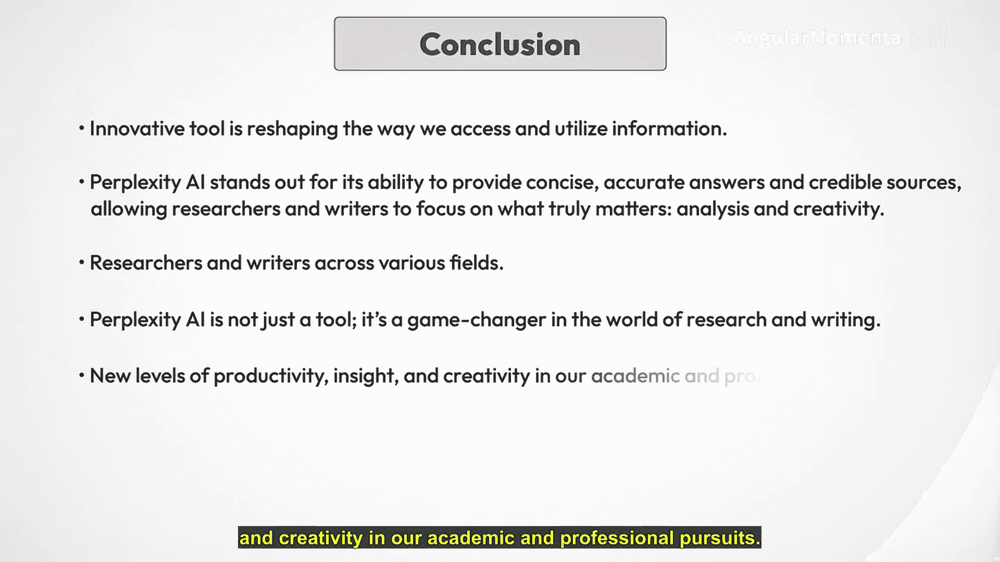

