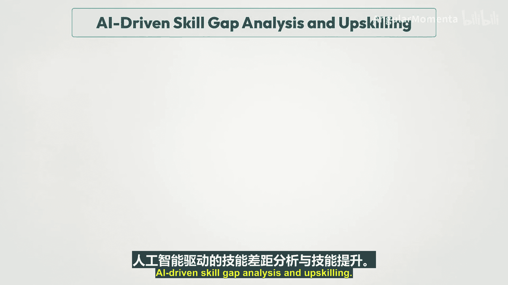
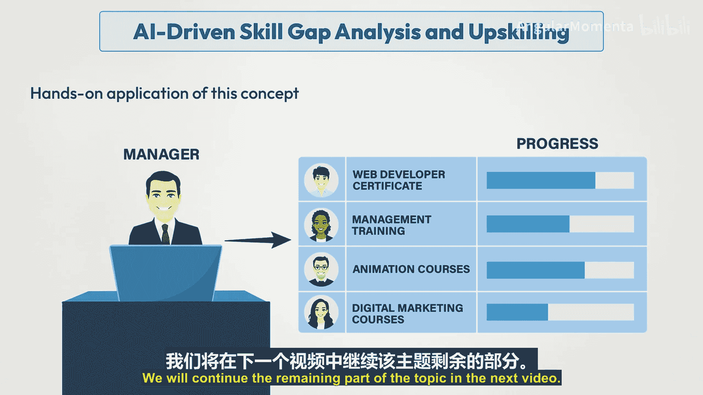

# 005：生成式人工智能绩效管理导论 🚀

在本节课中，我们将要学习生成式人工智能如何革新绩效管理。我们将探讨其核心价值、具体应用领域以及如何制定有效的实施策略。

---

## 生成式人工智能与绩效管理

生成式人工智能正通过显著提升效率、公平性和组织内反馈的整体质量，来彻底改变绩效管理。随着企业越来越多地整合人工智能技术，那些因主观性、不一致性和劳动密集型而长期受到批评的传统绩效评估方法，正在经历深刻的变革。

处于这一变革前沿的生成式人工智能，利用尖端的机器学习算法来自动化和简化绩效管理的各个方面。这包括制定个性化发展计划、提供实时反馈以及提供数据驱动的辅导见解。通过分析海量的绩效数据，人工智能可以生成公正的评估和可操作的建议，从而培养持续学习和成长的文化。

这种向智能绩效管理的转变，不仅减轻了管理者的行政负担，也为员工创造了更具吸引力和支持性的环境。通过整合生成式人工智能，组织可以超越传统的文书工作重心，转而优先考虑管理者与员工之间更有意义的对话和更深层次的关系。

然而，这一演变并非没有挑战。数据隐私、人工智能算法中潜在的偏见以及人类监督的必要性等问题仍然是关键关切。随着组织拥抱人工智能驱动的绩效管理，它们必须深思熟虑地应对这些挑战，以确保人工智能充当“副驾驶”的角色，增强而非取代人类能力。在这个快速发展的领域中，负责任地部署生成式人工智能对于释放其全部潜力，同时维护工作场所的信任和诚信至关重要。绩效管理的未来在于利用人工智能的力量与保持驱动真正员工敬业度和发展的人文关怀之间取得微妙的平衡。

---

## 整合生成式人工智能与绩效管理

随着组织努力优化其绩效管理系统，整合生成式人工智能成为一项强大的策略，以提升准确性、个性化和预测能力。这种整合不仅简化了传统流程，还为评估和发展人才引入了创新方法。

以下是生成式人工智能产生重大影响的关键领域：

### 1. 人工智能驱动的绩效评估
生成式人工智能通过为评估过程带来精确性、客观性和一致性，正在重新定义绩效评估的进行方式。传统的绩效评估常常受到偏见和不一致性的困扰，但借助人工智能，这些评估可以基于数据驱动的见解。

通过实时分析员工绩效数据，人工智能可以生成全面且公正的绩效报告，突出优势、需要改进的领域以及可操作的反馈。这确保了绩效评估不仅更公平，而且更具建设性，使员工能够了解自己的进展，管理者能够做出明智的决策。

### 2. 个性化发展计划
生成式人工智能在绩效管理中最具变革性的应用之一，是其为员工创建个性化发展计划的能力。

人工智能可以分析个人的绩效指标、学习风格和职业抱负，以生成量身定制的成长路径。这些计划可能包括具体的培训项目、技能发展机会以及与员工目标和组织目标相一致的指导建议。

通过提供持续改进的路线图，人工智能驱动的发展计划使员工能够掌控自己的职业成长，同时确保他们的发展与组织的战略需求保持一致。

### 3. 针对员工潜力的预测性分析
生成式人工智能超越了当前绩效，能够预测未来潜力，为员工的职业轨迹提供有价值的见解。通过利用预测性分析，人工智能可以评估员工在不同角色中成功的可能性，识别高潜力人才，并建议最佳职业路径。

这种远见使组织能够进行前瞻性的继任规划，确保为未来的领导角色培养合适的人才。此外，人工智能生成的预测有助于及早发现技能差距，从而进行有针对性的干预，增强员工应对未来挑战和机遇的准备能力。

---

## 人工智能在绩效管理中的价值主张

人工智能正在重塑企业在所有职能领域的运营方式，绩效管理也不例外。在本节中，我们将探讨将人工智能整合到绩效管理中的关键价值主张。我们将讨论人工智能如何减轻人类偏见、改进高潜力员工的识别，并提供对员工优势和劣势的更精细分析。这些人工智能能力不仅使绩效评估更加准确和客观，还确保员工发展与组织目标保持一致。

那么，让我们深入了解人工智能如何在现代绩效管理实践中创造价值。

### 1. 偏见规避
让我们从讨论绩效管理中最大的挑战之一——偏见开始。尽管管理者意图良好，但人类偏见不可避免地会渗入绩效评估中。这可能表现为光环效应（管理者对员工的整体积极印象影响其对特定技能的评价），或表现为严格性和宽大性偏见（管理者倾向于对所有人评分过于苛刻或过于慷慨）。

现在，人工智能为这些偏见提供了一个令人印象深刻的解决方案。通过分析庞大的数据集并进行客观比较，人工智能可以检测绩效评估中的不一致模式。例如，使用散点图可视化，人工智能可以交叉参考自我评估与管理层评估，并指出可能表明存在偏见的差异。

想象一个场景：一位管理者持续给某个特定员工群体的评分高于其他人，但根据客观指标，他们的绩效并无差异。人工智能可以标记这一点，并提示管理者重新评估，确保绩效评估在整个团队中更加公平和一致。

通过及早标记潜在偏见，组织可以在这些偏见对员工的职业发展产生持久影响之前采取纠正措施。因此，绩效评估不仅变得更加准确，而且更加公平，从而提升了员工对整个系统的信任。

### 2. 高潜力员工识别
接下来，我们来谈谈高潜力员工的识别。传统上，识别高潜力员工是一个主观的过程，通常依赖于管理者的直觉或他们对员工过去表现的了解。虽然经验和直觉确实起作用，但它们有时可能会忽视关键人才。

人工智能提供了一种数据驱动的、系统化的方式来识别这些高潜力员工。通过分析员工过去的绩效数据、技能、能力，甚至来自同事的反馈，人工智能可以就谁可能适合领导角色或更具挑战性的项目提出建议。

想象一家拥有数千名员工的大公司，手动评估每位员工的潜力将耗费大量时间。然而，人工智能可以快速处理所有这些数据，扫描表明某人可能适合承担更重要职责的模式。例如，人工智能系统可能会推荐一名初级员工参加领导力发展计划，基于其高敬业度、持续的绩效改进和强烈的同事反馈，即使他们的管理者可能没有立即认识到这些品质。

这不仅节省了时间，还确保了潜在的未来领导者能够在正确的时间得到认可和培养，使人才管理更具战略性和包容性。通过消除一些猜测，组织可以更有信心地提拔合适的人选，从而提高个人和组织的绩效。

### 3. 优势与劣势分析
传统的绩效评估通常侧重于对绩效的总体概述，但可能缺乏真正个性化发展计划所需的精细度。这正是人工智能可以大放异彩的地方。

利用先进的数据分析技术，人工智能可以综合来自多个来源的信息，无论是来自同事的反馈、项目成果，甚至是实时绩效指标，从而更清晰地描绘出员工的具体优势和需要改进的领域。

例如，想象一名员工在项目管理方面表现出色，但在团队会议中的沟通方面存在困难。人工智能可以通过分析来自不同项目和会议的反馈来发现这一趋势，使管理者能够制定有针对性的发展计划。管理者现在可以提供专注于公开演讲或团队协作的具体培训和辅导课程，同时鼓励员工继续磨练他们的项目管理技能，而不是仅仅告诉员工需要改进沟通。

通过提供这种详细的分析水平，人工智能有助于确保员工获得正确的支持和培养。反馈越个性化和可操作，员工就越能在其角色中成长。这不仅为个人，也为整个组织培养了持续改进的文化。

---

## 人工智能与绩效管理的实施策略

成功地将人工智能应用于绩效管理，需要的不仅仅是选择正确的技术。它关乎制定一个确保无缝整合和长期成功的战略。在本节中，我们将重点介绍一种分阶段的方法，使组织能够逐步采用人工智能、有效管理变革，并在人工智能融入绩效流程后衡量投资回报率。

通过战略性地采用人工智能，组织可以最大限度地减少干扰，获得利益相关者的支持，并最大化人工智能在推动业务绩效方面的益处。让我们一步步探索如何实现这一目标。

### 1. 分阶段方法
在绩效管理中实施人工智能并非一个“一刀切”的过程。它需要周密的规划，而这正是分阶段方法的用武之地。组织通常遵循的一个流行模型是“爬行-行走-奔跑”模型。该策略强调从可管理的小项目开始，逐步扩展人工智能能力。

*   **爬行阶段**：组织从基础任务开始，例如确定哪些绩效管理流程最能从人工智能中受益。例如，组织可能首先自动化生成绩效报告等日常行政任务。这个阶段是关于试水，确保组织拥有必要的基础设施和数据质量，使人工智能能够有效工作。
*   **行走阶段**：一旦对基本的人工智能应用感到满意，组织就进入行走阶段。在这里，人工智能实施的范围扩大了。组织可能开始使用人工智能来提供更多数据驱动的见解，例如检测员工绩效模式或识别技能差距。在这个阶段，人工智能被引入决策过程，但人类监督仍然是关键组成部分。
*   **奔跑阶段**：奔跑阶段是人工智能完全融入绩效管理流程的阶段。人工智能不仅自动化任务和提供见解，还开始发挥主动作用，例如预测未来员工绩效趋势或实时识别高潜力员工。

通过遵循这种分阶段的方法，组织可以逐步构建其人工智能能力，而不会使其系统或团队不堪重负。

### 2. 变革管理
人工智能实施的一个重要方面是变革管理。人工智能引入了新的工作方式，这常常会遇到阻力，尤其是在绩效评估方面。员工和管理者可能会对人工智能如何影响他们的角色或决策感到不确定甚至焦虑。

为了有效管理这种变革，组织需要一个清晰的沟通计划。重要的是要解释为什么要引入人工智能，以及它将如何不仅使组织受益，也使员工受益。例如，人工智能可以帮助使绩效评估更加客观，减少个人偏见，确保更公平的评估过程。

培训是变革管理的另一个关键方面。管理者和人力资源专业人员需要了解如何有效使用人工智能工具，以及如何解读这些工具提供的见解。这有助于他们在评估过程中保持控制感和信心。对于员工来说，重要的是要澄清人工智能是辅助决策，而不是完全取代人类判断。通过将人置于变革的核心，组织可以减轻恐惧，确保更顺利地采用人工智能工具。

最后，让员工全程参与是关键。允许他们就人工智能工具提供反馈，并成为实施旅程的一部分，有助于建立信任。这种参与式方法不仅减少了阻力，还鼓励了创新，因为员工可以根据自己的经验提出改进人工智能系统的想法。

### 3. 衡量投资回报率
衡量人工智能在绩效管理中的投资回报率对于证明其价值至关重要。要跟踪的最直接的指标之一是时间节省。人工智能可以显著减少管理者花在重复性任务上的时间，例如填写绩效评估、生成报告或分析数据。如果你能量化节省的时间并将其转化为生产力收益，你就有了一个清晰的ROI指标。

另一个关键指标是决策准确性。人工智能有助于减少绩效评估中的偏见，从而提高对员工潜力评估的准确性。随着时间的推移，你可以衡量人工智能驱动的见解如何提高了关于晋升、发展计划甚至团队结构的决策质量。例如，自使用人工智能以来，组织是否看到了高潜力员工更好的保留率？或者是否有更多员工接受了正确的辅导以提高绩效？

最后，将员工敬业度和满意度作为衡量人工智能成功与否的指标至关重要。人工智能可以支持更个性化的发展计划，从而使员工感到更受重视和更有动力。调查、反馈表和绩效数据可以让组织了解人工智能如何影响了员工的士气和敬业度。提高的员工满意度不仅提高了生产力，还增强了组织文化和保留率，这些都是衡量长期投资回报率的关键指标。

---

## 人工智能驱动的员工敬业度

生成式人工智能提供了创新的解决方案，以提升员工满意度、提供实时反馈并优化认可和奖励系统，从而创造一个更有动力和联系更紧密的员工队伍。

### 1. 员工满意度
生成式人工智能在理解和提高员工满意度方面发挥着关键作用。通过分析来自调查、反馈表甚至非正式沟通渠道的大量数据，人工智能可以检测员工情绪的模式，在问题升级之前识别潜在问题，并提出有针对性的干预措施以提升士气。

通过根据个人和团队的需求个性化敬业度策略，人工智能有助于创造一个让员工感到受重视、被倾听和被支持的工作环境。这种主动管理员工满意度的方法不仅降低了人员流动率，还提高了整体生产力和组织文化。

### 2. 实时反馈循环
传统的反馈机制常常因其不频繁以及绩效与反馈之间的滞后而效果不佳。生成式人工智能通过实现持续、实时的反馈循环，彻底改变了这一过程。

通过人工智能驱动的平台，员工可以收到关于其绩效的即时、可操作的反馈，使他们能够随时进行调整和改进。这种即时反馈机制培养了持续学习和发展的文化，员工可以不断了解自己的绩效和成长领域。此外，实时反馈使管理者能够及时解决问题，从而实现更有效和响应更快的绩效管理。

### 3. 人工智能与认可奖励系统
认可和奖励是员工敬业度的重要组成部分，而生成式人工智能通过使其更加个性化和有影响力来增强这些系统。

人工智能可以分析绩效数据、同事反馈和员工偏好，生成与员工个人产生共鸣的定制认可和奖励建议。无论是确定认可员工成就的正确时机，还是选择符合其兴趣的奖励，人工智能驱动的系统都能确保认可是及时、有意义和激励人心的。

通过自动化和个性化这些流程，人工智能不仅提升了员工士气，还增强了对组织的忠诚度和承诺。

---

## 人工智能驱动的技能差距分析与技能提升

在当今快节奏的商业世界中，员工发展是保持竞争力的关键。但你如何知道你的团队需要提高哪些技能呢？这就是人工智能的用武之地。

让我们探讨人工智能驱动的技能差距分析如何改变组织提升员工技能的方式。

首先，我们来谈谈识别技能差距。人工智能分析员工绩效数据，将其与内部和行业基准进行比较。通过这样做，人工智能可以精确指出个别员工甚至整个团队落后的地方，突出需要改进的具体领域。这超越了简单的评估，为公司提供了数据驱动的人才发展方法。

一旦识别出这些差距，人工智能就会帮助为每位员工制定个性化的学习路径。它使用先进的算法，根据每个人的独特需求、职业目标和学习风格来定制学习建议。无论是建议在线课程、内部研讨会还是在职培训，人工智能都创建了一种有针对性的技能提升方法。

例如，像IBM这样的公司已经实施了人工智能驱动的技能提升解决方案。他们的系统识别技能差距，并从其内部库中推荐学习模块。这不仅提高了员工绩效，还为他们做好了担任组织内未来角色的准备。你也可以使用像Coursera、LinkedIn Learning和Skillsoft这样的实用工具，这些平台利用人工智能根据员工的技能组合推荐学习路径。这些平台帮助组织确保其团队始终学习最相关和最有影响力的技能。

现在，让我们看看这个概念的一个实际应用。想象你是一名负责提升团队技能的管理者。通过使用人工智能驱动的平台，你可以输入团队当前的绩效数据，系统将推荐特定的课程、认证或培训计划。然后，你可以跟踪他们的进度，并根据需要调整学习路径。

通过人工智能驱动的技能差距分析，公司可以确保其员工在不断变化的市场中保持竞争力。这种方法不仅使组织受益，还通过为员工提供职业成长所需的工具来赋能他们。技能提升的未来是个性化的、数据驱动的，并由人工智能驱动。

---

## 总结

在本节课中，我们一起学习了生成式人工智能如何彻底改变绩效管理。我们从其核心价值——提升效率、公平性和反馈质量——开始，探讨了其在绩效评估、个性化发展计划和预测分析中的具体应用。我们还深入了解了人工智能如何帮助规避偏见、识别高潜力员工以及进行精细的优势劣势分析。

为了成功实施，我们学习了分阶段的“爬行-行走-奔跑”方法、有效的变革管理策略以及衡量投资回报率的关键指标。最后，我们看到了人工智能如何通过提升满意度、实现实时反馈和优化奖励系统来驱动员工敬业度，并通过精准的技能差距分析赋能员工的持续学习与发展。

总而言之，生成式人工智能在绩效管理中的应用，标志着从传统、主观的评估方式向数据驱动、个性化、前瞻性的人才管理新时代的转变。关键在于将人工智能作为增强人类决策和人际关系的工具，在技术力量与人文关怀之间取得平衡，从而释放组织的全部潜力。