# 006：基于生成式人工智能定制性能指标 📊

在本节课中，我们将学习如何利用生成式人工智能来定制性能指标，以提升绩效管理的灵活性、准确性和公平性。我们将探讨动态KPI生成、AI驱动的基准测试、远程工作环境下的指标定制，以及如何评估AI绩效管理系统的投资回报率。

## 动态KPI生成 🔄

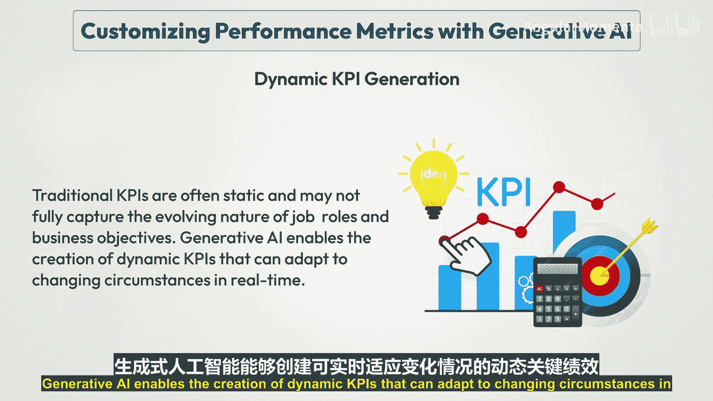

上一节我们介绍了定制性能指标的重要性，本节中我们来看看如何利用生成式人工智能创建动态的关键绩效指标。

传统的KPI通常是静态的，可能无法完全捕捉到工作角色和业务目标的动态演变。生成式人工智能通过分析项目成果、市场条件和员工个人绩效等多种数据源，能够实时生成和更新KPI，确保这些指标与当前业务目标相关且保持一致。

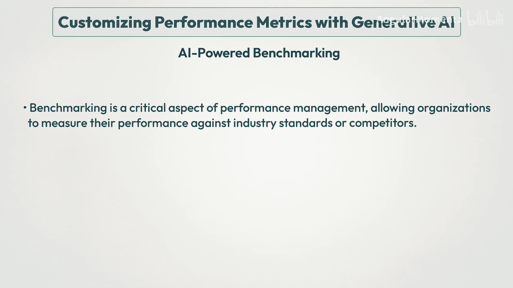

以下是动态KPI生成的核心过程：

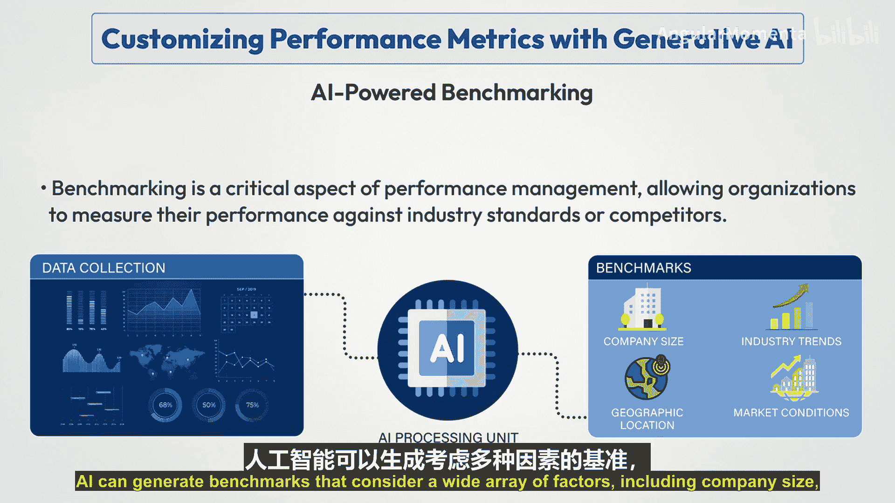

1.  **数据源分析**：AI系统分析来自项目管理系统、市场报告和员工绩效数据等多维信息。
2.  **指标生成**：基于分析结果，AI生成与当前业务重点最相关的KPI。公式可表示为：`动态KPI = f(项目数据, 市场数据, 个人绩效数据)`。
3.  **实时更新**：当业务环境或工作重点发生变化时，AI自动调整KPI，确保评估的时效性和准确性。

这种动态方法确保员工的评估基于最能反映其工作关键方面的指标，从而实现更准确、更及时的绩效评估。

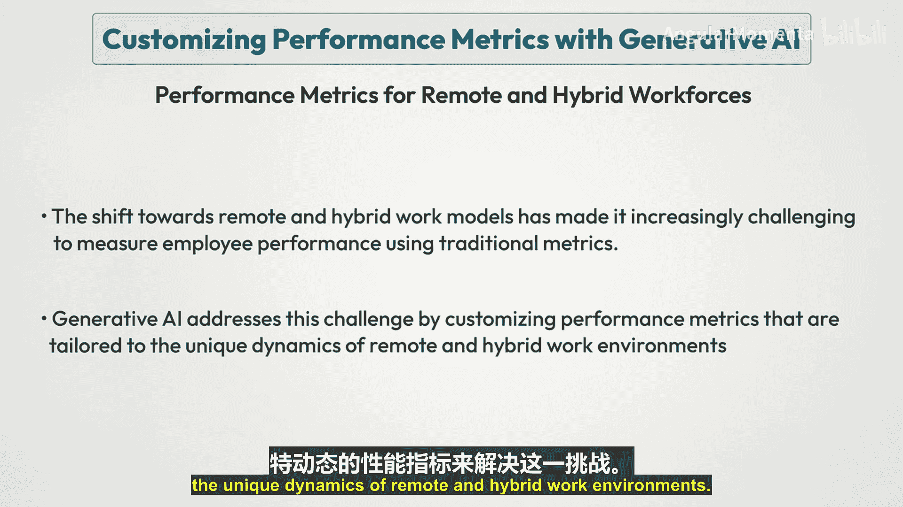

## AI驱动的基准测试 📈

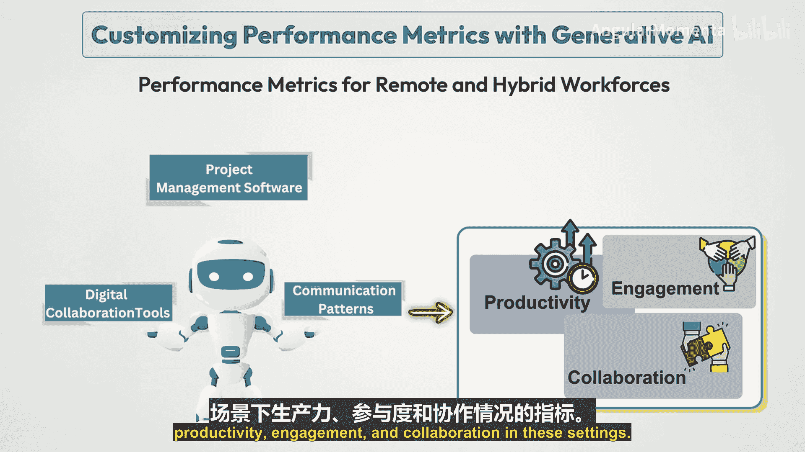

基准测试是绩效管理的关键环节，它允许组织对照行业标准或竞争对手来衡量自身表现。生成式人工智能通过自动化收集和分析基准数据，增强了这一过程，提供了更精确、更及时的洞察。

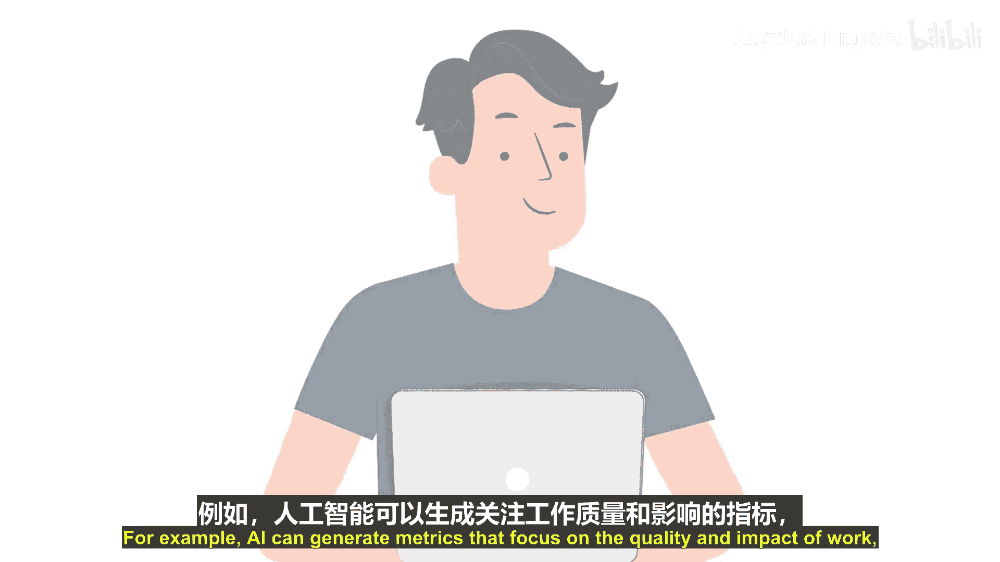

AI可以生成考虑公司规模、行业趋势、地理位置和市场状况等多种因素的基准。这些AI驱动的基准帮助组织设定现实且有抱负的绩效目标。

以下是AI在基准测试中的具体应用：

*   **数据聚合**：AI从行业报告、公开绩效数据和第三方基准服务中自动收集数据。
*   **智能分析**：分析这些数据，生成针对特定行业和公司规模的定制化基准。例如，在零售业，AI可以生成关于客户服务指标和销售效率的行业基准。
*   **持续更新**：随着新数据的出现，AI持续更新这些基准，确保绩效比较随时间推移仍然具有参考价值。

## 远程与混合工作团队的绩效指标 🏠💼

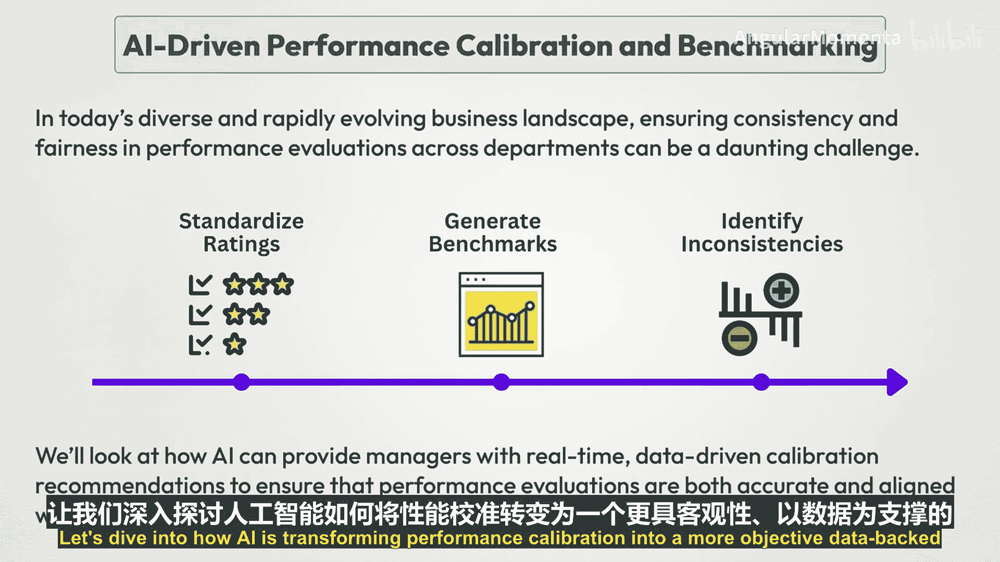

向远程和混合工作模式的转变，使得使用传统指标衡量员工绩效变得越来越具有挑战性。生成式人工智能通过定制适应远程和混合工作环境独特动态的绩效指标，应对了这一挑战。

AI可以分析来自数字协作工具、沟通模式和项目管理软件等各种来源的数据，以创建准确反映在这些环境中生产力、参与度和协作情况的指标。

例如，AI可以生成关注工作质量和影响的指标，而不仅仅是跟踪记录的工作时长。这确保了远程或混合工作的员工能够基于工作成果而非出勤情况得到公平有效的评估。

## AI驱动的绩效校准与基准测试 ⚖️

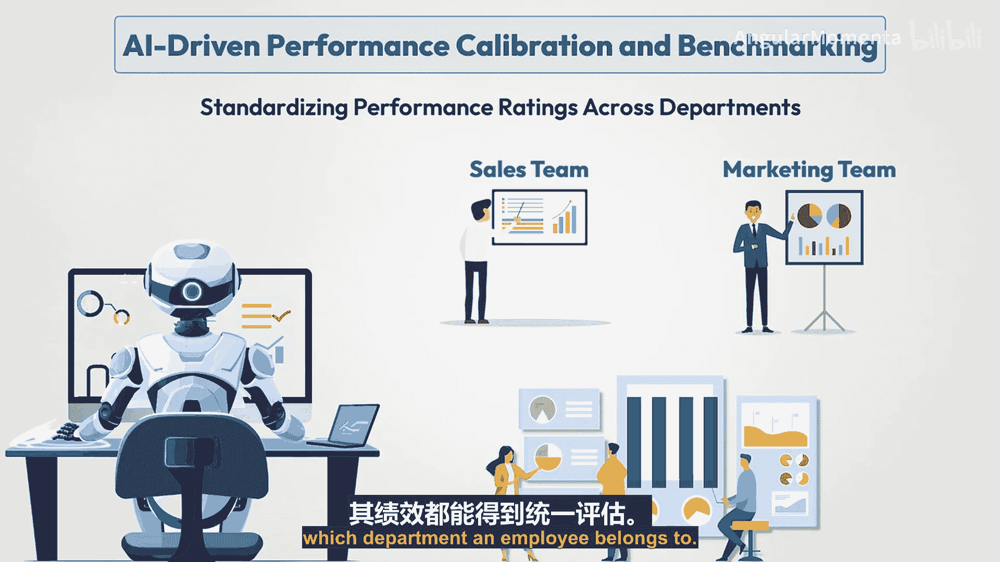

在当今多元化且快速发展的商业环境中，确保跨部门绩效评估的一致性和公平性是一项艰巨的挑战。这正是AI驱动的绩效校准和基准测试发挥作用的地方。

本节我们将探讨AI如何标准化不同团队间的绩效评级、生成行业特定基准以支持更明智的决策，并识别员工评级中的不一致性。此外，我们还将了解AI如何为管理者提供实时的、数据驱动的校准建议，以确保绩效评估既准确又与组织标准保持一致。

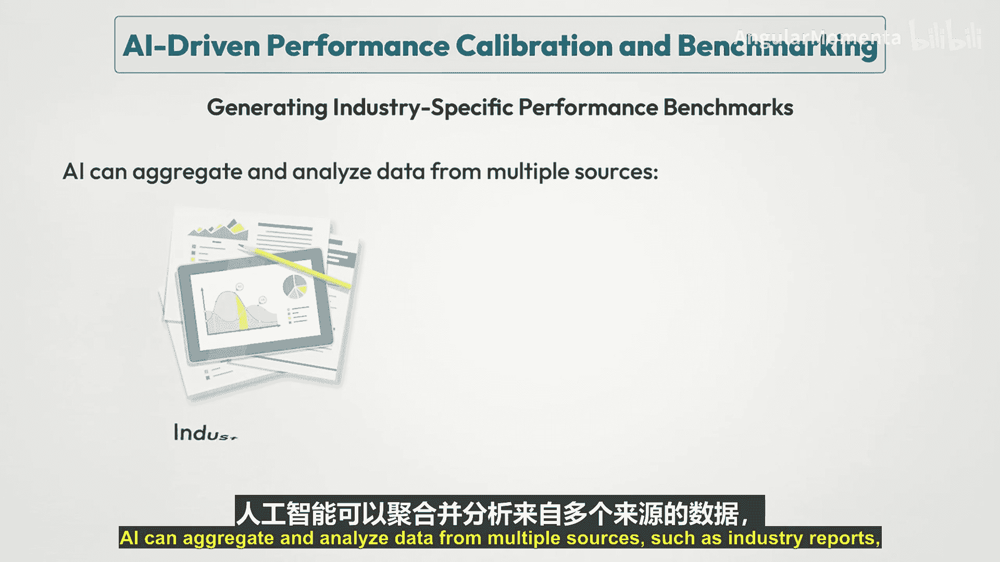

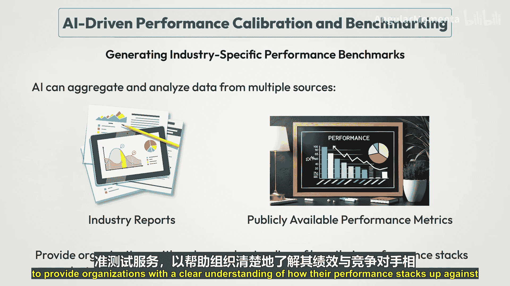

### 跨部门标准化绩效评级

组织在绩效管理中面临的最关键挑战之一，是在不同团队或部门间保持绩效评估的一致性。不同的管理者可能对绩效标准有不同的解读，导致员工评级出现差异。

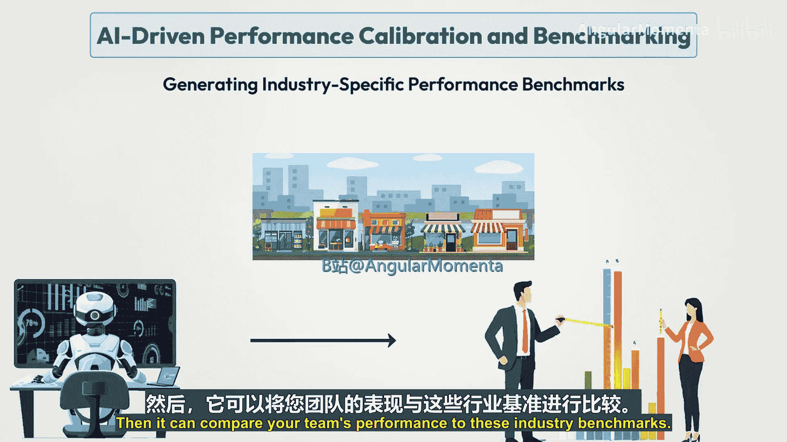

AI通过引入标准化的评估框架来解决这个问题。通过分析大量的绩效数据，AI可以帮助创建一个统一的模型，规定应如何跨部门衡量绩效。例如，AI可以分析历史绩效评级，识别管理者如何给类似角色的员工评分的模式，然后标记出差异。

### 生成行业特定绩效基准

公司内部的绩效校准至关重要，但如何知道您的组织是否跟上了行业的步伐？这就是AI生成行业特定绩效基准的能力变得无价的地方。

AI可以聚合和分析来自行业报告、公开绩效指标甚至第三方基准服务等多个来源的数据，为组织提供清晰的视角，了解其绩效与竞争对手相比如何。通过AI驱动的基准测试，公司不仅可以将员工的绩效与内部指标进行比较，还可以与行业标准进行比较。

### 识别并解决评级不一致性

即使在建立了完善的绩效评估系统的情况下，评级的不一致性也是不可避免的，特别是在大型组织中。管理者可能基于个人偏见对员工进行评级，或者他们可能只是对评级量表有不同的解读。

AI可以通过分析不同管理者和部门的评级，在识别和解决这些不一致性方面发挥关键作用。例如，它可能检测到某位管理者持续给其团队评分高于或低于同一部门的其他管理者，即使客观的绩效指标并不支持这些评级。一旦识别出这些不一致性，AI可以提醒人力资源团队或提供重新校准的建议。

### 为管理者提供AI辅助的校准建议

AI增强绩效校准最具影响力的方式之一，是在绩效评估期间为管理者提供实时的、数据驱动的建议。AI可以分析个人和团队绩效数据，将其与历史绩效趋势和行业基准进行比较，然后为管理者提供关于如何校准其评级的洞察和建议。

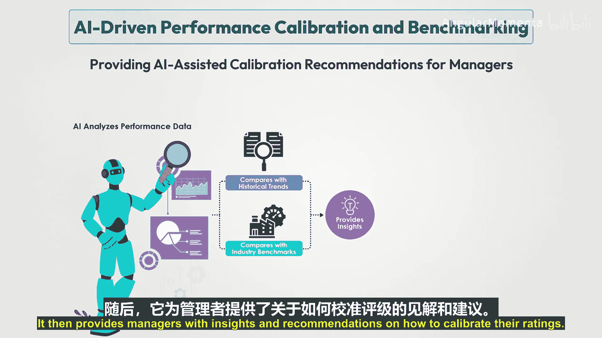

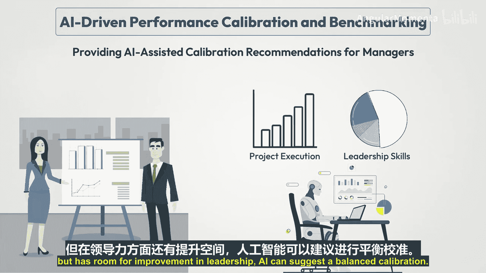

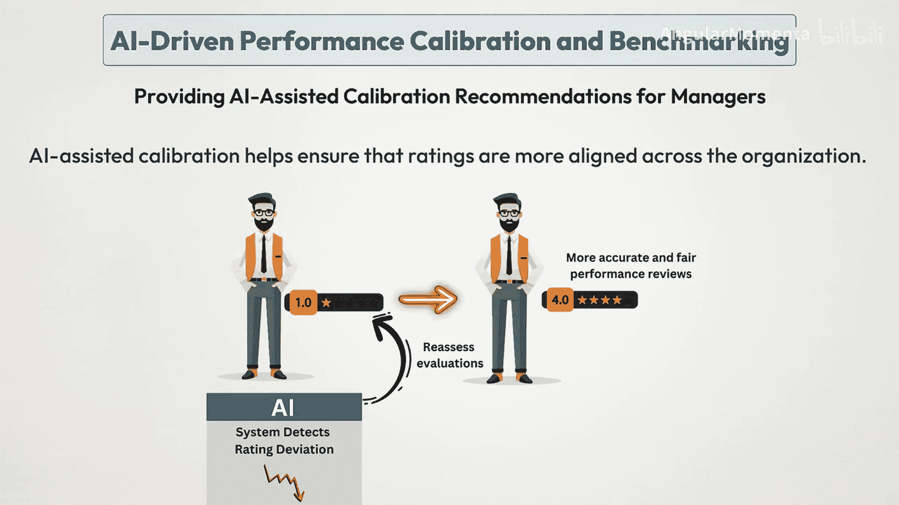

例如，如果一位管理者正在评估一名在项目执行方面持续超出预期但在领导力方面有待提高的员工，AI可以建议一个平衡的校准。系统可能会推荐一个总体较高的评级，并附上针对发展领导技能的具体辅导建议。这确保了管理者基于客观数据做出明智的决策，而不是仅仅依赖个人判断或不完整的信息。

## 评估AI驱动绩效管理的投资回报率 💰

随着组织越来越多地采用AI驱动的绩效管理系统，评估投资回报率对于理解这些技术带来的价值变得至关重要。评估AI集成的成功不仅涉及财务指标，还包括提高员工参与度和改进决策等定性收益。

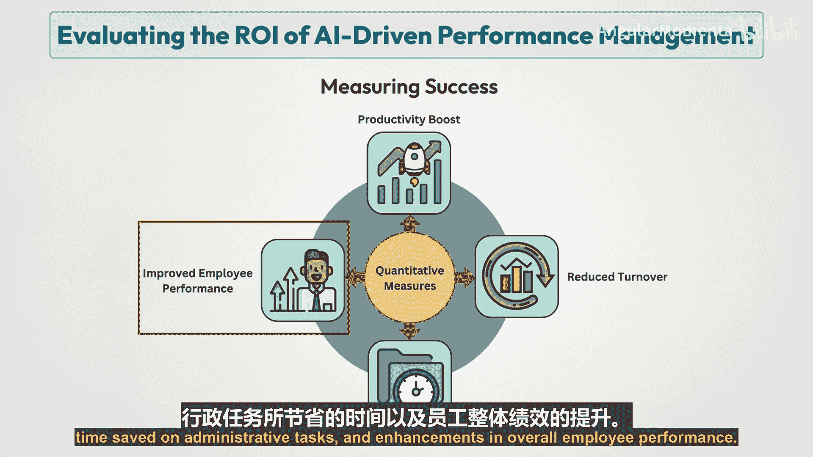

### 衡量成功

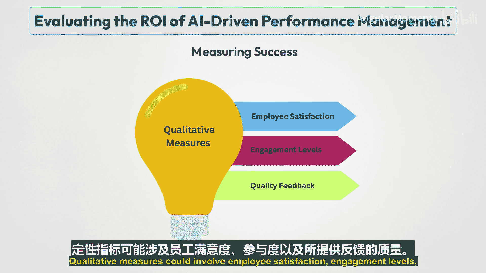

为了评估AI驱动绩效管理的投资回报率，组织必须首先建立明确的成功衡量标准。这些标准应包含定量和定性结果。

定量衡量可能包括生产力的提高、员工流动率的降低、在行政任务上节省的时间以及整体员工绩效的增强。定性衡量可能涉及员工满意度、参与度以及所提供反馈的质量。通过比较实施AI驱动系统前后的这些指标，组织可以评估AI对绩效管理的直接影响。

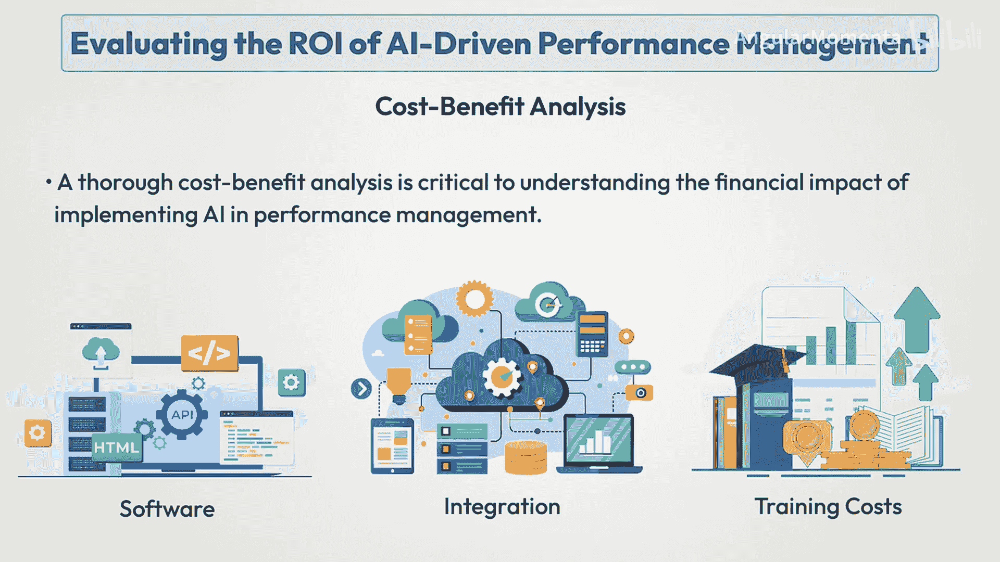

### 成本效益分析

进行全面的成本效益分析对于理解在绩效管理中实施AI的财务影响至关重要。该分析应既考虑对AI技术的初始投资（包括软件、集成和培训成本），也考虑维护和更新等持续费用。

在收益方面，组织应考虑直接和间接的收益。直接收益可能包括通过自动化手动流程节省的成本、减少对外部顾问的需求以及提高决策效率。间接收益可能包括提高的员工绩效、更高的保留率以及构建更敏捷、响应更迅速的绩效管理系统的长期价值。

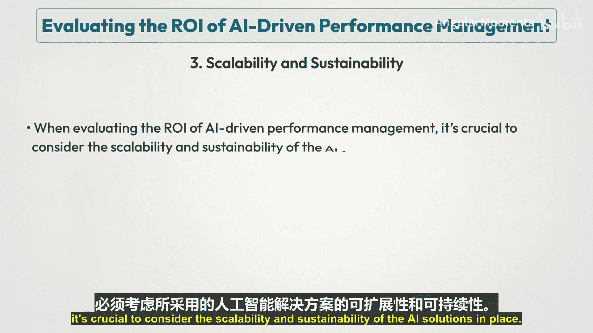

### 可扩展性与可持续性

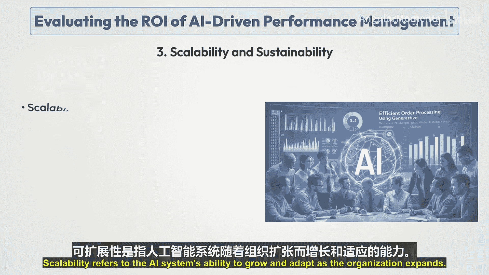

在评估AI驱动绩效管理的投资回报率时，考虑所采用的AI解决方案的可扩展性和可持续性至关重要。

可扩展性指的是AI系统随着组织发展而增长和适应的能力，确保绩效管理流程能够继续支持更大、更多样化的员工队伍。可持续性涉及评估AI解决方案是否能够在长期内以不过度的成本或资源需求得以维持。

组织应评估AI工具是否能够轻松地用新数据更新、与其他系统集成以及适应不断变化的业务需求。此外，可持续性还包括确保AI驱动的流程与组织的长期目标保持一致，例如培养持续学习和发展的文化。

## 在AI绩效系统中整合情商 🤝

情商已成为决定职场成功的关键因素。它涵盖自我意识、同理心、社交技能以及在专业环境中管理情绪的能力。传统上，衡量和提升情商是一个以人为中心的过程，依赖于人际互动和自我评估。然而，随着AI驱动的绩效管理系统的兴起，现在可以将情商整合到这些系统中，以提供更全面的员工绩效视图。

在本节中，我们将探讨AI如何通过分析沟通模式来评估情商、提供AI驱动的辅导以促进情商发展，并将情商指标纳入整体绩效评估。

### 分析沟通模式以评估情商

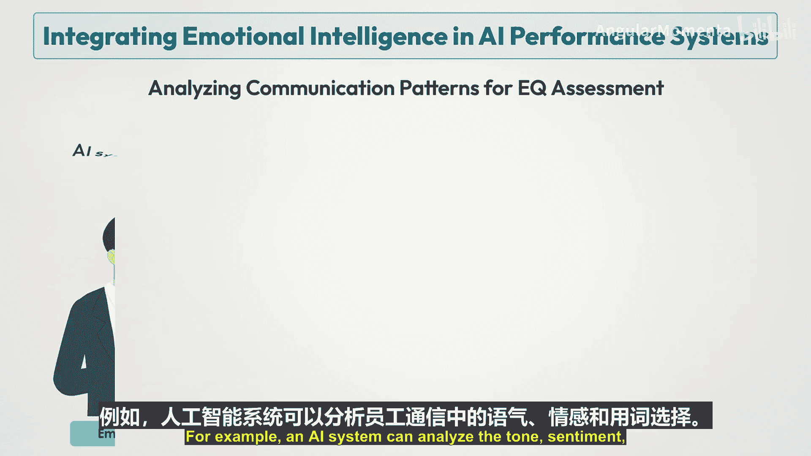

AI评估情商的开创性方式之一是通过分析书面和口头沟通模式。AI工具越来越能够处理大量的沟通数据，如电子邮件、聊天消息和录音对话，以识别情商的关键指标。

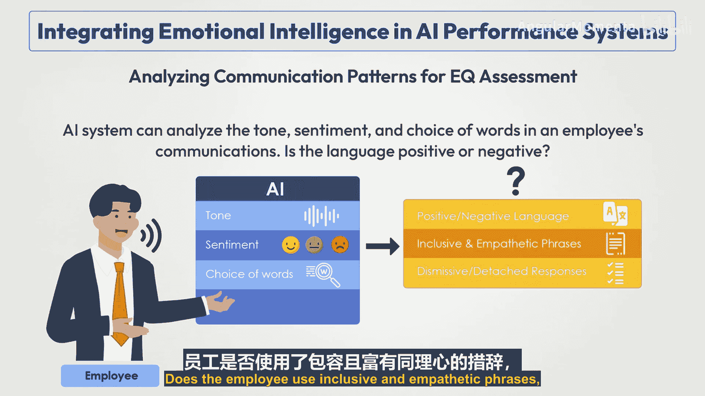

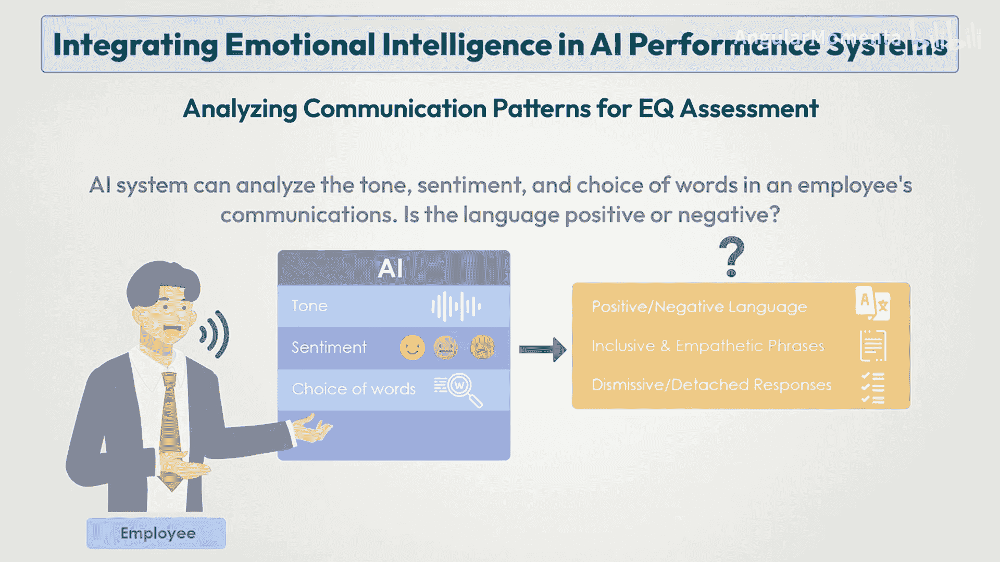

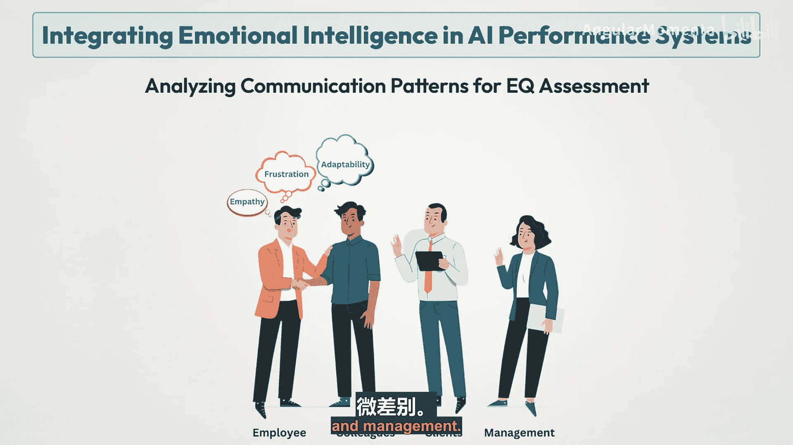

例如，AI系统可以分析员工沟通中的语气、情绪和措辞选择。语言是积极的还是消极的？员工使用的是包容和共情的短语，还是他们的回应显得敷衍或疏离？AI可以通过评估员工与同事、客户和管理层的互动方式，检测出诸如同理心、挫败感甚至适应性等细微差别。

### 用于提升情商的AI驱动辅导

一旦AI系统识别出表明员工情商水平的模式和行为，它可以通过提供个性化辅导更进一步。AI驱动的辅导平台可以提供实时反馈和量身定制的建议，帮助员工提高情商。

例如，如果系统检测到一名员工经常以防御性的方式回应反馈，它可以提供个性化资源，如文章、视频教程，甚至是互动模拟，专注于改善情绪调节和对建设性批评的开放性。这些AI驱动的辅导平台还可以使用对话式AI来模拟困难场景，让员工练习以同理心、耐心和沉着的方式回应。

### 将情商指标纳入整体绩效评估

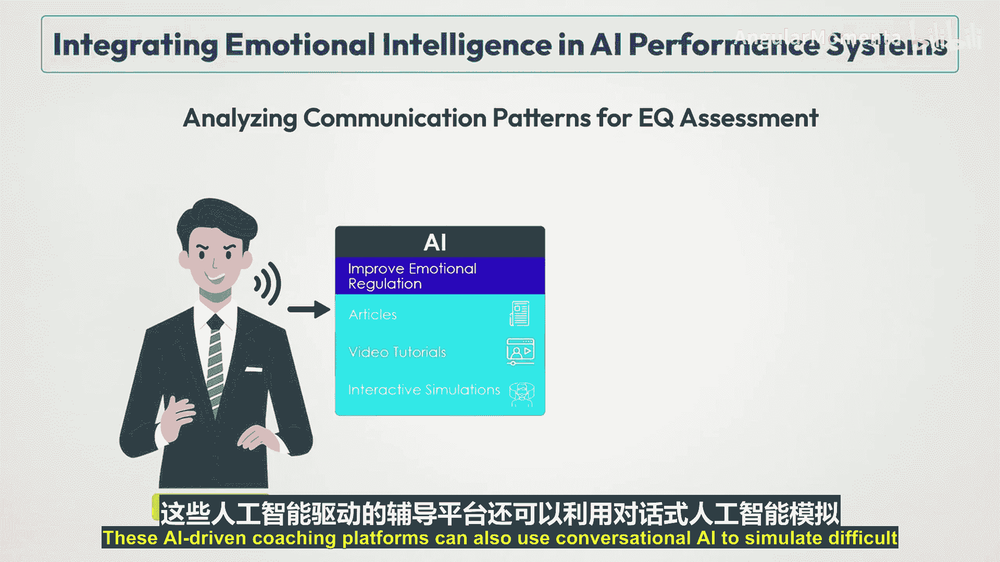

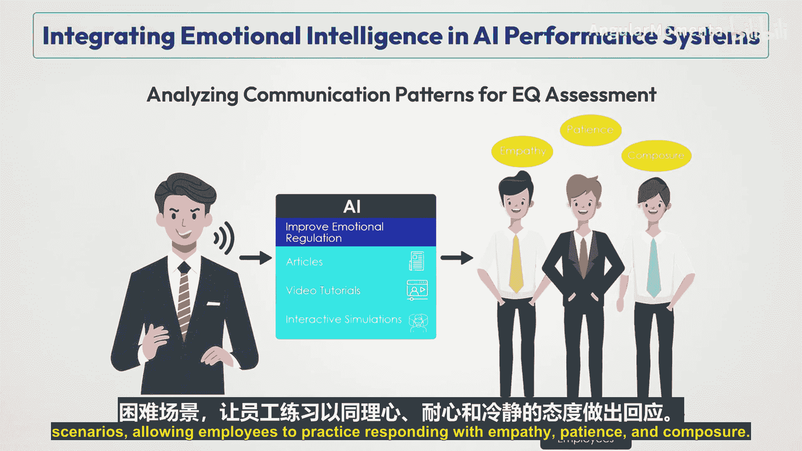

将情商纳入整体绩效评估是创建全面、公平评估的下一个前沿领域。传统的绩效指标通常侧重于硬技能和可衡量的结果，如项目完成率或销售数据。然而，情商在员工协作、领导和促进积极工作文化的能力中起着关键作用，而这些因素在传统的绩效评估中常常被忽视。

AI可以量化诸如同理心、社交意识和自我调节等情商指标，并将其整合到更广泛的绩效评估中。例如，如果一名员工持续表现出高水平的情商，例如机智地解决冲突或在困难时期支持团队成员，这些行为可以与技术技能和项目成果一起被评分和加权。

通过将情商指标与传统绩效衡量标准相结合，组织可以对员工的整体贡献形成更全面的理解。这种整体方法确保那些在人际动态方面表现出色的个人得到认可和奖励，从而培养一种重视情商与技术专长同等重要的职场文化。

---

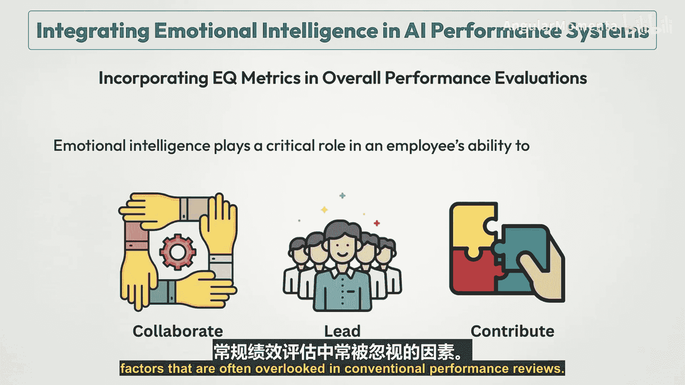

**本节课总结**

在本节课中，我们一起学习了如何利用生成式人工智能定制和优化绩效管理。我们从动态KPI的生成开始，了解了AI如何使绩效指标更具适应性和相关性。接着，我们探讨了AI在基准测试中的应用，它如何帮助组织设定更明智的绩效目标。针对现代工作模式，我们研究了AI如何为远程和混合团队定制有效的绩效指标。

此外，我们深入分析了AI在绩效校准中的作用，包括标准化评级、生成行业基准、识别不一致性以及为管理者提供校准建议。我们还学习了如何从定量和定性角度评估AI绩效管理系统的投资回报率，并考虑了其可扩展性与可持续性。

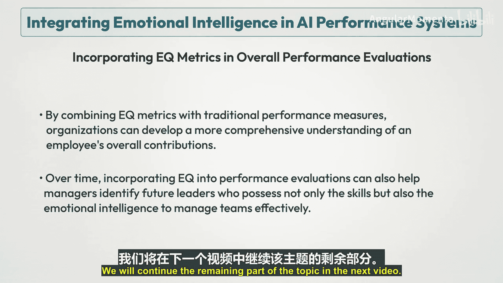

最后，我们探索了将情商整合到AI绩效系统中的前沿方法，包括通过沟通分析评估情商、提供AI辅导以及将情商指标纳入综合绩效评估。这些内容共同描绘了生成式人工智能如何助力构建更公平、更精准、更全面的绩效管理体系。