生成式人工智能在辅导、研究与表现提升中的应用：P8-03：人工智能在绩效管理中的未来趋势与平台概览 🚀

在本节课中，我们将探讨人工智能在绩效管理领域的未来趋势，并了解一些利用生成式AI优化绩效管理的具体工具和平台。

---

### **未来趋势**

上一节我们介绍了生成式AI在绩效管理中的基础应用，本节中我们来看看其未来的关键发展方向。

**1. 员工发展的高度个性化**
AI能够识别员工的个人优势、弱点、职业抱负和学习风格。这将使组织能够创建高度定制化的发展路径，使其既符合员工目标，也契合公司的战略目标。AI驱动的学习平台将提供个性化内容和培训资源，确保员工获得对其职业成长最相关、最具影响力的指导。这种高度个性化将带来更高敬业度的员工，让他们在独特的职业旅程中感受到支持与重视。

**2. 绩效管理的预测性分析**
预测性分析将在绩效管理中扮演越来越重要的角色，使组织能够在潜在问题升级前预见并解决它们。AI将分析历史绩效数据、员工行为模式和外部因素，以预测诸如员工流失、职业倦怠或实现特定绩效目标的可能性等结果。管理者将能够利用这些洞察采取主动措施，例如提供额外支持或调整工作量，以优化绩效和员工福祉。

**3. AI增强的持续反馈与辅导**
传统的年度或半年度绩效评估流程预计将让位于更持续、AI增强的反馈机制。AI驱动的平台将为员工和管理者提供实时洞察和建议，促进关于绩效和发展的持续对话。AI驱动的虚拟教练将变得更加普遍，根据员工的绩效数据提供即时反馈和个性化建议。这种持续的反馈循环将促进持续学习和改进的文化，帮助员工更有效地与组织目标保持一致并发展其技能。

**4. 绩效管理中的伦理AI与公平性**
随着AI更深地融入绩效管理，对伦理AI实践和确保评估公平性的重视将日益增长。组织需要实施稳健的框架，以减轻AI算法中的偏见，并确保AI驱动的决策是透明且可解释的。未来的趋势可能包括开发能够自我审计公平性和合规性的AI系统，以及加强对工作场所AI的监管监督。伦理AI对于维持员工与雇主之间的信任，并确保AI增强而非损害绩效管理的公平性至关重要。

**5. AI与其他新兴技术的整合**
绩效管理的未来将见证AI与区块链、物联网和虚拟/增强现实等其他新兴技术的更深度融合。例如，区块链可用于创建不可篡改的绩效数据记录，增强透明度和问责制。物联网设备可提供关于员工生产力和福祉的实时数据，输入AI系统以进行更全面的绩效评估。VR/AR可用于由AI驱动洞察引导的沉浸式培训和发展体验。这些整合将创建一个更加互联、技术更先进的绩效管理生态系统。

**6. 关注员工福祉与工作生活平衡**
AI将越来越多地用于监测和促进员工福祉，作为绩效管理的一部分。未来的AI系统将能够通过分析沟通模式、工作时间和可穿戴设备的生理数据等因素，来检测压力、疲劳或倦怠的迹象。这些信息将使组织能够及时采取行动支持员工福祉，例如提供灵活的工作安排或心理健康资源。对福祉的关注将成为绩效管理的关键组成部分，认识到健康的工作生活平衡对于持续的高绩效至关重要。

**7. AI驱动的多元与包容性倡议**
多元与包容性将成为AI驱动绩效管理中不可或缺的一部分。AI可以帮助组织更有效地跟踪和分析D&I指标，确保所有员工拥有平等的发展和晋升机会。未来的趋势可能包括能够识别绩效评估中无意识偏见并提出解决方案的AI工具。此外，AI可以帮助设计更具包容性的发展计划，以满足员工队伍的多样化需求。通过利用AI，组织将能更好地创造一个更多元、包容和公平的工作场所。

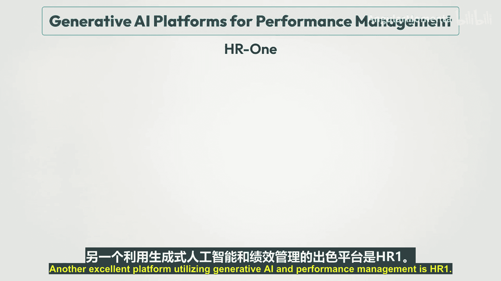

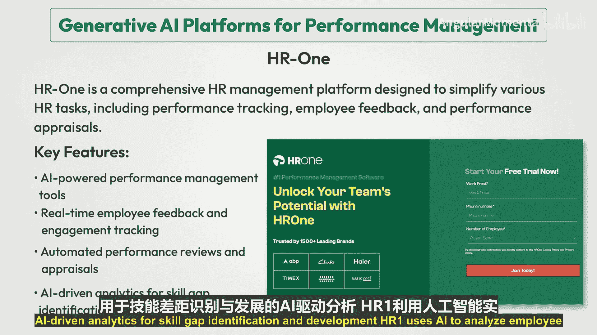

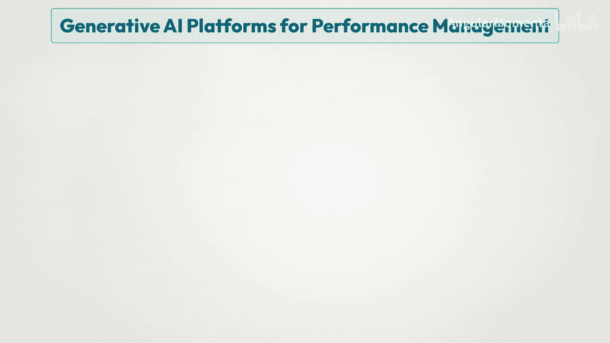

---

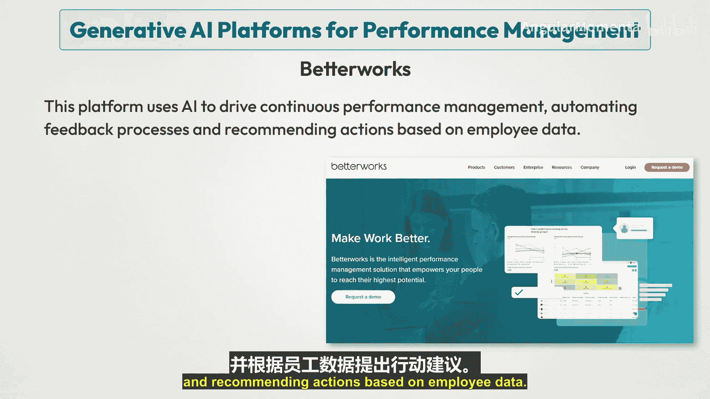

### **生成式AI绩效管理平台**

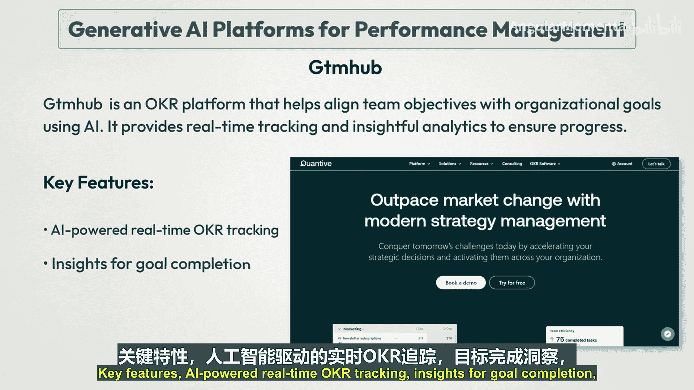

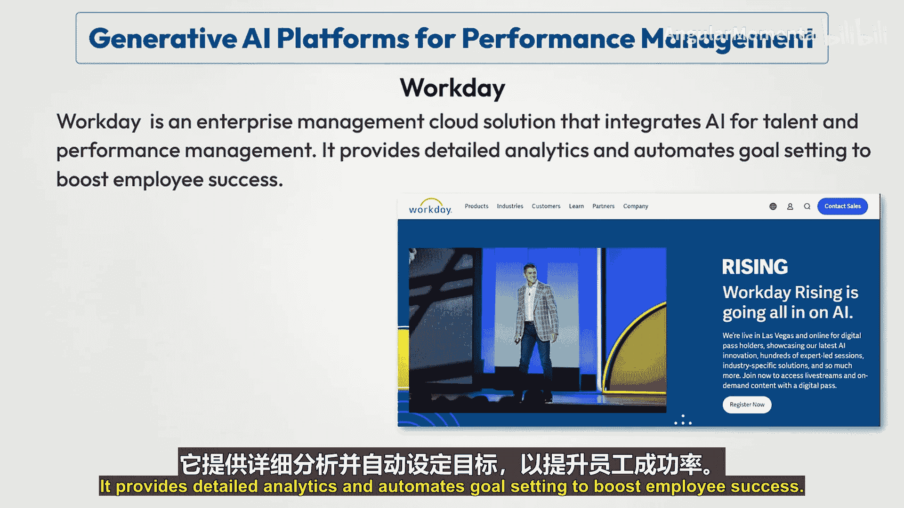

了解了未来趋势后，接下来我们具体看看一些利用生成式AI优化绩效管理的工具和平台。

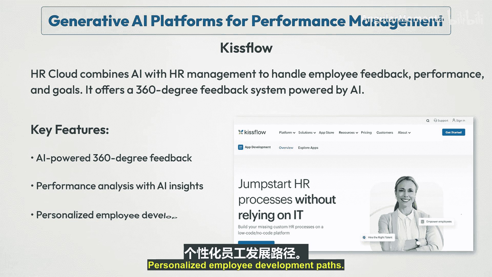

以下是部分关键平台及其功能的介绍：

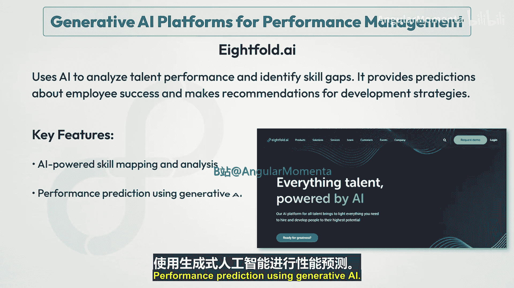

*   **Lattice**：这是一个旨在利用AI自动化绩效评估流程的人员管理平台。它分析员工反馈并提供洞察以推动个人发展。
    *   **关键特性**：`AI驱动的绩效分析`、`个性化发展计划`、`AI驱动的反馈建议`。
*   **Leapsome**：该工具利用AI增强绩效评估，帮助管理者通过AI驱动的评估、一对一会议和目标设定来评估绩效。
    *   **关键特性**：`AI驱动的绩效评估与反馈`、`基于AI洞察的目标设定与追踪`、`个性化学习与发展`。
*   **Humi**：这是一个全面的HR管理平台，旨在简化包括绩效跟踪、员工反馈和绩效评估在内的各种HR任务。
    *   **关键特性**：`AI驱动的绩效管理工具`、`实时员工反馈与敬业度追踪`、`自动化绩效评估与考核`。
*   **Betterworks**：该平台使用AI推动持续绩效管理，自动化反馈流程，并根据员工数据推荐行动。
    *   **关键特性**：`AI驱动的反馈与认可`、`绩效趋势的预测性分析`、`目标对齐与追踪`。
*   **GTMHub**：这是一个OKR平台，利用AI帮助团队目标与组织目标对齐。它提供实时跟踪和深入分析以确保进展。
    *   **关键特性**：`AI驱动的实时OKR追踪`、`目标完成度洞察`、`自动化绩效报告`。
*   **Workday**：这是一个集成了AI用于人才和绩效管理的企业云管理解决方案。它提供详细分析并自动化目标设定以促进员工成功。
    *   **关键特性**：`AI驱动的人才与绩效分析`、`自动化目标设定与追踪`、`个性化职业发展建议`。
*   **Kissflow HR Cloud**：该平台将AI与HR管理结合，处理员工反馈、绩效和目标。它提供由AI驱动的360度反馈系统。
    *   **关键特性**：`AI驱动的360度反馈`、`基于AI洞察的绩效分析`、`个性化员工发展路径`。
*   **Eightfold.ai**：该平台使用AI分析人才绩效并识别技能差距。它预测员工成功可能性，并为发展策略提供建议。
    *   **关键特性**：`AI驱动的技能映射与分析`、`使用生成式AI进行绩效预测`、`个性化学习推荐`。
*   **Culture Amp**：该平台专注于利用AI改善员工敬业度。它分析调查数据，并为团队发展提供反馈和建议。
    *   **关键特性**：`AI驱动的绩效评估`、`敬业度的预测性洞察`、`基于AI的反馈与目标设定`。
*   **BambooHR**：该平台通过使用AI简化反馈和自动化评估来简化绩效管理，帮助团队有效设定和追踪目标。
    *   **关键特性**：`AI驱动的绩效评估`、`基于AI洞察的目标设定`、`自动化反馈建议`。
*   **Jasper AI**：该工具最初设计用于内容生成，现在也应用于绩效管理，帮助管理者生成有洞察力的反馈并分析员工产出。
    *   **关键特性**：`AI生成的绩效评估`、`可定制的反馈模板`、`自动化生产力洞察`。

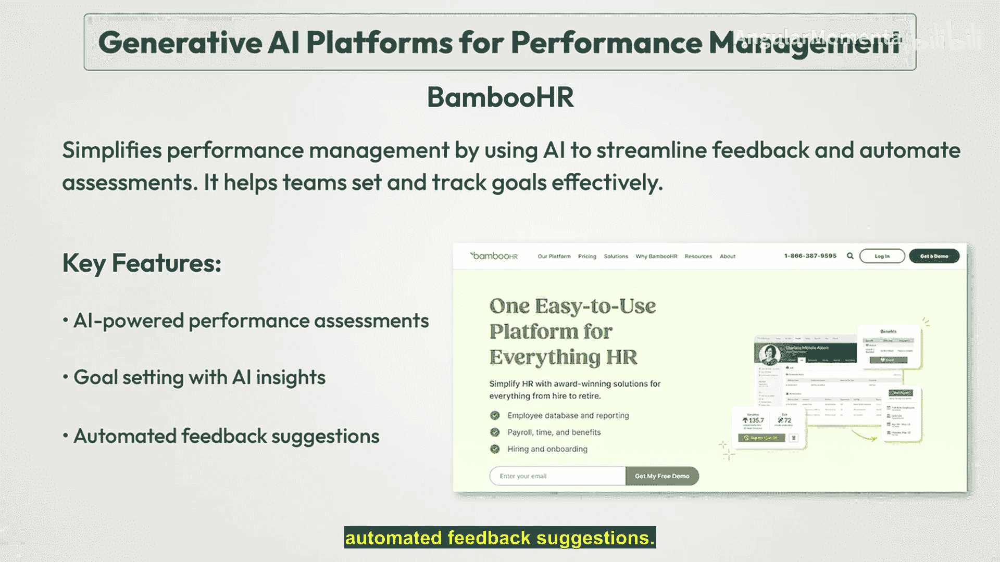

---

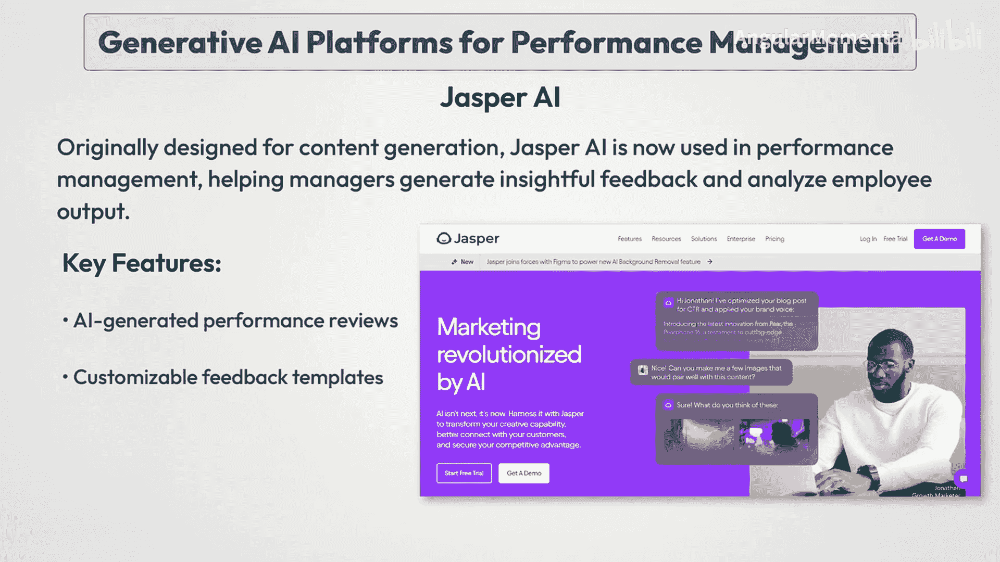

### **总结**

本节课中，我们一起学习了人工智能在绩效管理中的七大未来趋势，包括高度个性化、预测分析、持续反馈、伦理考量、技术整合、员工福祉以及多元包容。随后，我们概览了十余种利用生成式AI优化绩效管理的具体平台及其核心功能。

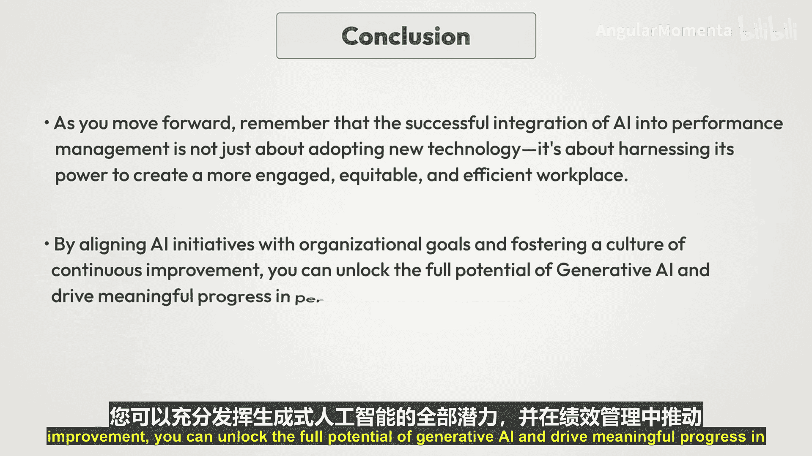

正如我们在课程结尾所探讨的，生成式AI融入绩效管理系统预示着一场范式转变，开启了一个以更高准确性、个性化发展和主动管理为特征的新时代。其自动化流程、定制计划与预测潜能，正在彻底改变组织的人才管理方式。然而，成功整合AI的关键不仅在于采用新技术，更在于利用其力量创建一个更敬业、更公平、更高效的工作场所。通过将AI计划与组织目标对齐，并培养持续改进的文化，我们才能充分释放生成式AI的潜力，在绩效管理领域驱动有意义的进步。