# 009：困惑度AI在研究与写作中的应用导论 🧠

## 概述

在本节课中，我们将要学习困惑度AI（Perplexity AI）如何应用于研究与写作领域。我们将了解它如何改变传统的信息检索方式，提升研究效率，并探讨其核心功能、使用方法以及未来的发展潜力。

---

## 研究与写作的重要性

在我们的日常生活中，研究与写作在各个领域都扮演着关键角色，从学术界到新闻业，从商业提案到创意写作。这些活动是知识创造的基石，使我们能够分析信息、阐述观点并进行有效沟通。

然而，传统的研究和写作方法通常耗时且需要筛选大量数据。这正是人工智能介入的地方，它改变了我们处理这些关键任务的方式。

---

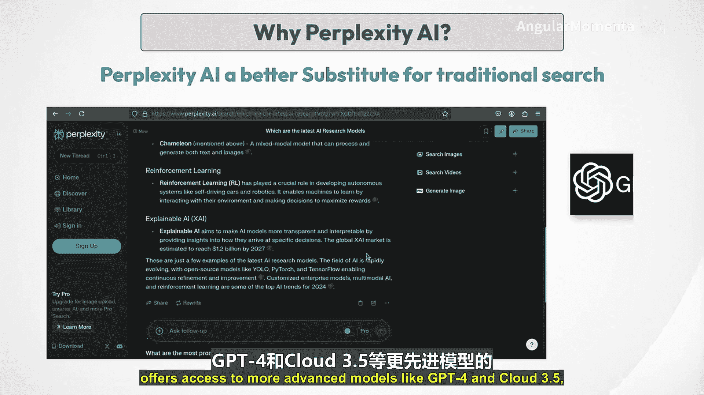

## 人工智能如何改变研究与写作

人工智能通过自动化常规任务、提高准确性并提供探索和组织信息的新方法，彻底改变了研究与写作。这些AI工具帮助用户在庞大的数据集中导航，使他们能够专注于更深层次的分析和创造性表达。

上一节我们介绍了人工智能对研究写作的变革，本节中我们来看看一个具体的工具——困惑度AI。

---

## 什么是困惑度AI？🤔

困惑度AI是一个在研究和写作社区中引起轰动的工具。与传统搜索引擎不同，困惑度AI提供了一种对话式的方法，可以根据您的具体需求定制回答。它拥有像Copilot这样的功能，通过提出澄清性问题来指导您完成研究过程。困惑度AI确保您不仅能获得快速答案，还能获得与您的查询直接相关的深刻见解。

这就像拥有一位知道确切查找位置和如何呈现您所需信息的研究助理。无论您是在进行文献综述、探索新理论，还是仅仅寻找可靠来源，困惑度AI都能简化您的研究过程，使其更快、更高效。在一个信息丰富但时间有限的世界里，像困惑度AI这样的工具正在改变研究与写作，使其不仅更高效，而且更具洞察力。

---

## 为什么选择困惑度AI？🆚

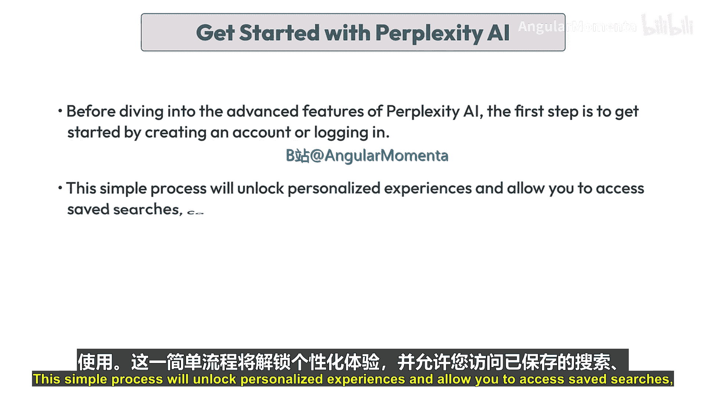

困惑度AI是一个先进的、由AI驱动的研究和对话式搜索引擎，从根本上改变了用户获取信息的方式。与传统搜索引擎返回链接列表不同，困惑度AI直接提供全面、直接的答案，并汇总来自各种来源的相关信息。这种方法不仅节省时间，还通过提供简洁、可操作的见解来增强用户体验。

该平台采用免费增值模式，基础版本免费使用独立的大型语言模型（LLM），而付费版本“困惑度专业版”（Perplexity Pro）则提供对GPT-4和Claude 3.5等更先进模型的访问，进一步增强了其能力。

以下是困惑度AI与ChatGPT和Gemini的主要区别：

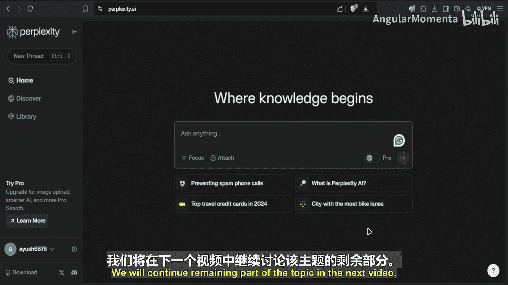

*   **实时信息**：困惑度AI基于OpenAI的GPT-3.5模型和具有自然语言处理能力的独立LLM。它与ChatGPT和Gemini的主要区别在于它提供实时生成的信息。ChatGPT和Gemini通过预训练模型生成结果，这可能导致答案过时，具体取决于其模型最后一次更新的时间。尽管GPT-4o模型和Gemini确实使用实时网络搜索，但这些工具首先使用预训练模型的知识，然后才访问实时网络搜索，或者仅在用户明确要求时才这样做。
*   **可验证性**：困惑度AI强调提供带有内联引用的实时、可验证信息，使其对学术和专业研究非常有用。
*   **独特功能**：其独特功能，如用于优化查询的Copilot，以及允许用户将搜索范围限定在学术或创意写作等特定领域的“聚焦模式”，使其与竞争对手区分开来。此外，困惑度AI总结内容和提供引用的能力增强了其对需要可靠来源的研究人员的实用性。

**举例说明**：当用户查询气候变化研究的最新进展时，困惑度AI不仅检索最新的研究，还总结关键发现，并提供来自可信学术来源的引用。这种能力使研究人员能够快速掌握基本信息，而无需筛选大量文章，从而使研究过程更加高效和有效。另一方面，如果在谷歌上搜索相同的查询，我们必须点击每个链接，阅读每个主题以找到相关信息，并获取完整的理解。

总而言之，以下是困惑度AI的关键特性：

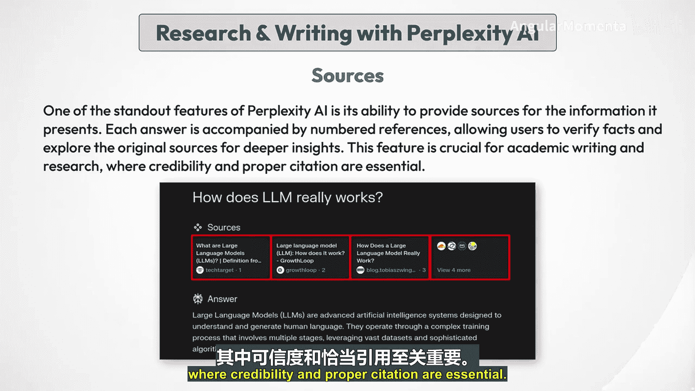

*   **实时信息**：困惑度AI即时从互联网提取数据，确保用户获得最新的可用信息。
*   **可靠来源**：每个答案都附有来自可信来源的引用，增强了所提供信息的可信度。
*   **用户友好界面**：该平台设计易于使用，允许用户像进行对话一样与之互动，使信息检索变得直观。

---

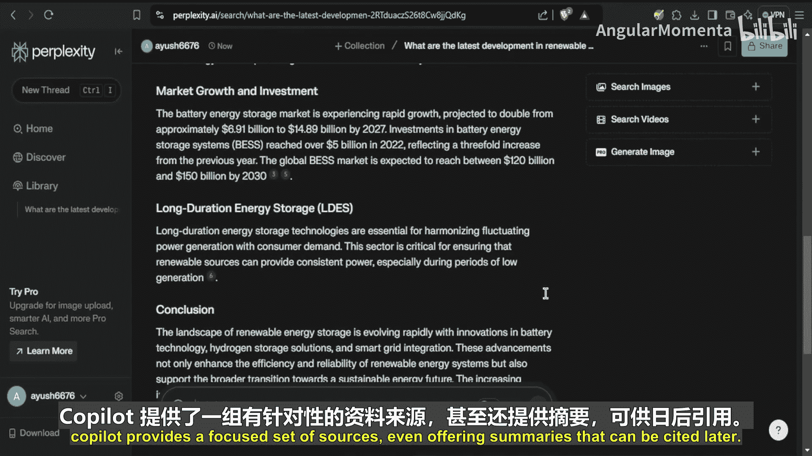

## 如何开始使用困惑度AI 🚀

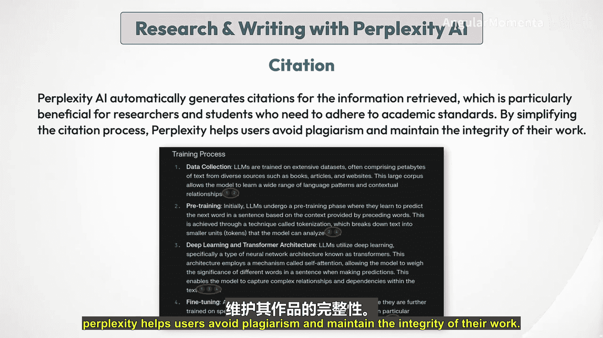

在深入了解困惑度AI的高级功能之前，第一步是通过创建账户或登录来开始使用。这个简单的过程将解锁个性化体验，并允许您访问保存的搜索、收藏等功能。

以下是开始步骤：

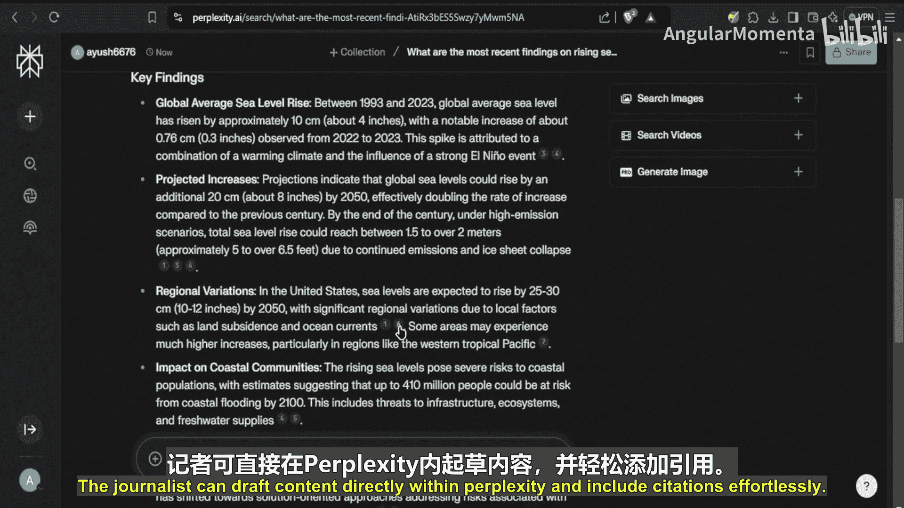

1.  首先，访问困惑度AI网站，您将看到聊天界面，可以在其中互动和输入提示。
2.  在左下角，您可以看到登录选项。您可以选择使用谷歌账户、苹果账户登录，或者根据您的选择简单地创建自己的困惑度账户。
3.  登录后，您将可以访问一系列功能，如个性化搜索历史、保存的收藏和聚焦研究工具。

现在您已登录，可以开始探索困惑度AI为支持您的研究和写作工作所提供的丰富资源。

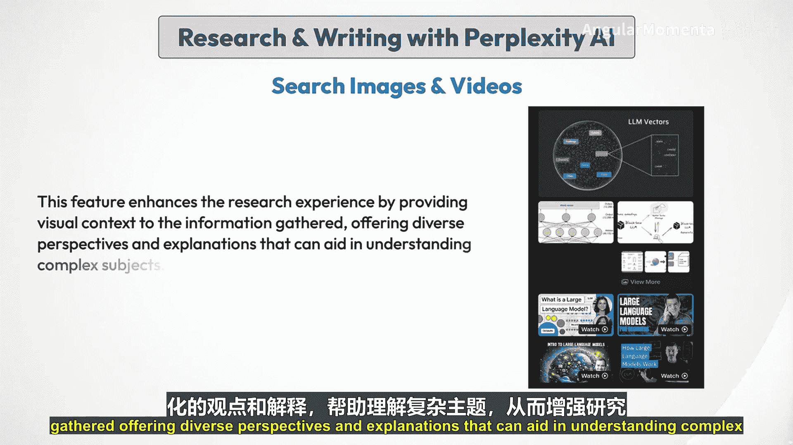

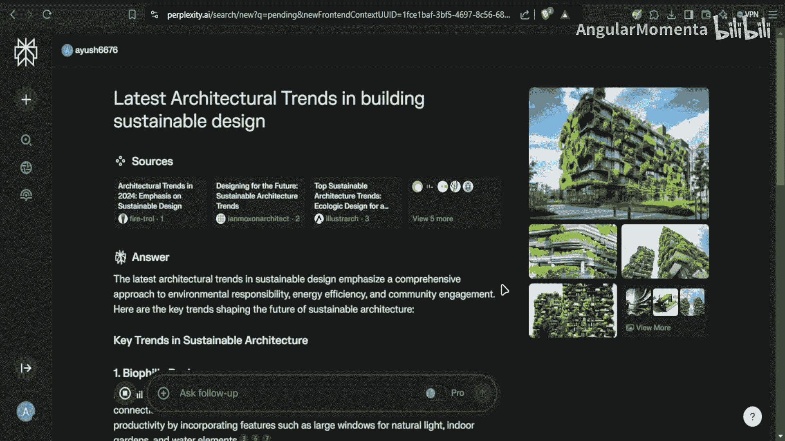

---

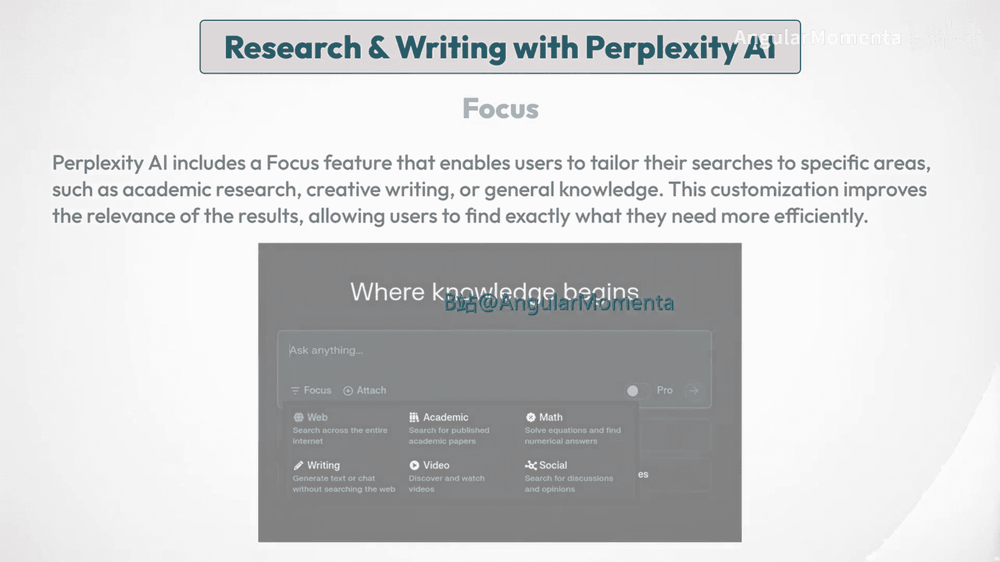

## 使用困惑度AI进行研究和写作 📝

困惑度AI作为一个交互式搜索引擎运行，利用先进的算法实时分析和综合来自多个来源的信息。当用户输入查询时，AI处理请求，检索相关数据，并以连贯的格式呈现。这个过程涉及理解上下文、生成类人响应，并确保信息准确且最新。

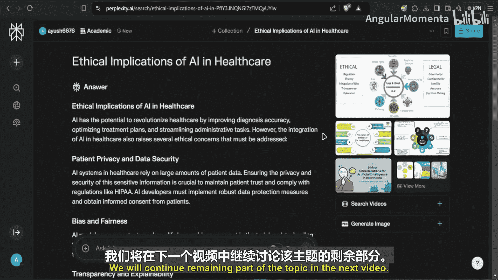

让我们考虑一个具体的例子：我们想了解“LLM如何工作”。

*   **初始查询**：用户首先在困惑度AI搜索栏中输入查询“LLM究竟如何工作？”。
*   **实时信息检索**：提交查询后，困惑度AI处理请求，并从广泛的来源（包括学术论文、文章和报告）中检索相关信息。它将信息综合成一个简洁的摘要，突出显示与查询相关的关键发现。
*   **来源引用**：困惑度AI的一个突出特点是能够为其呈现的信息提供来源。每个答案都附有编号引用，允许用户验证事实并探索原始来源以获得更深入的见解。这个功能对于学术写作和研究至关重要，因为可信度和正确引用是必不可少的。

**场景一：研究人员撰写论文文献综述**
*   **困惑度AI如何帮助**：使用困惑度AI的Copilot功能，研究人员可以输入广泛的问题，并收到各种学术论文的提炼、简洁的摘要。Copilot提供一组集中的来源，甚至提供可以稍后引用的摘要，而不是手动搜索和阅读数十篇文章。

**场景二：记者撰写关于气候变化的新闻文章并提供可信引用**
*   **困惑度AI如何帮助**：引用功能确保写作中使用的每个事实或引用都自动得到合法来源的支持。记者可以直接在困惑度AI内起草内容，并毫不费力地包含引用。

**搜索图像和视频**：困惑度AI令人印象深刻的部分超越了文本结果。它还提供相关的图像和视频。这个功能通过为收集的信息提供视觉上下文，提供多样化的视角和解释，有助于理解复杂主题，从而增强了研究体验。

**场景三：设计师撰写关于建筑趋势的研究论文**
*   **困惑度AI如何帮助**：通过利用图像搜索功能，设计师可以直接从困惑度AI的过滤结果中收集相关视觉资料，加快获取高质量图像的过程。

**聚焦功能**：困惑度AI包含一个聚焦功能，使用户能够将搜索范围限定在特定领域，如学术研究、创意写作或常识。这种定制提高了结果的相关性，使用户能够更高效地找到他们需要的内容。

**场景四：学生撰写关于AI伦理影响的论文**
*   **困惑度AI如何帮助**：通过聚焦功能，学生可以将搜索限制在特定的学术来源，如论文或期刊文章。这确保了所有信息都是学术性的且相关的。

---

## 进阶工具：困惑度专业版（Perplexity Pro）✨

现在我们已经介绍了困惑度AI的核心功能，让我们通过困惑度专业版将事情提升到一个新的水平。对于那些认真希望将研究和写作提升到新水平的人来说，困惑度专业版提供了可以显著改善您工作流程和结果的增强工具。

困惑度专业版不仅仅是一个升级版本，它就像有一位专业的研究助理在您身边。想象一下，您正在处理一个复杂的研究项目。标准的困惑度AI在提供答案和指导研究方面做得很好，但有了困惑度专业版，您将获得更深入的见解、更多上下文驱动的搜索，以及根据您的特定需求定制的增强响应。

关键区别在于专业版在深入搜索之前澄清您查询的能力。困惑度专业版通过提出后续问题来帮助优化您的查询，而不是让您尝试在初始问题中思考每一个细节。这确保它完全理解您的需求，并为您提供更量身定制、更高质量的响应。

以下是困惑度专业版的一些独特功能：

*   **无限专业搜索**：专业搜索改变了困惑度处理查询的方式。与免费版本可能限制答案深度不同，专业搜索扩展了范围，允许每次查询都能获得全面、精细的结果。这就像拥有一位专门的研究助理，通过提出后续问题来深入了解您的需求。
*   **升级的AI模型**：困惑度专业版的一个重要优势是能够在升级的AI模型之间进行选择。虽然免费版本主要使用标准模型，但专业版提供以下尖端选项：
    *   **GPT-4o**：以其深度推理能力而闻名，帮助将复杂主题分解为更简单、易于理解的信息。
    *   **Claude 3.5 Sonnet**：该模型专为高级语言任务设计，可以提供听起来更自然的响应。
    *   **Sonar**：非常适合数据密集型研究，能快速处理大量信息，对分析复杂数据集很有用。
    *   **Llama 3.1 405B**：以创造性输出而闻名，生成的文本感觉像对话，非常适合创意作家。
*   **无限文件上传**：困惑度专业版的一个突出特点是无限文件上传。这对于处理大量数据集或文档的研究人员至关重要。您可以上传PDF、研究论文，甚至代码文件进行分析。上传后，困惑度会保持上下文，确保后续查询与您正在处理的数据直接相关。
*   **API积分**：使用专业版，您每月可获得5美元的API积分，允许您将困惑度集成到自己的应用程序或项目中。
*   **图像生成**：困惑度专业版还引入了图像生成功能。该功能允许用户根据文本提示创建AI生成的视觉效果，使其成为需要工作视觉辅助的设计师、营销人员和研究人员的强大工具。专业版提供以下模型：
    *   Playground V3（困惑度最新的图像生成模型）
    *   DALL-E 3（OpenAI创建的流行图像生成模型）
    *   Stable Diffusion XL（多功能、快速的图像生成模型）
    *   FLUX.1（Black Forest Labs创建的最新图像生成模型，用于生成更高质量的图像）

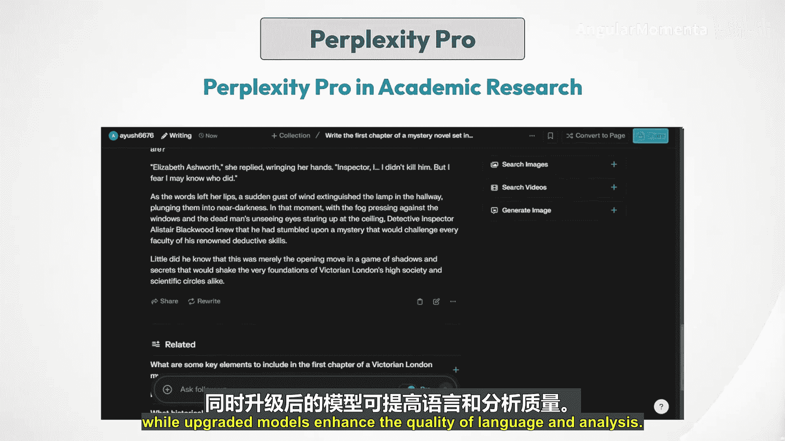

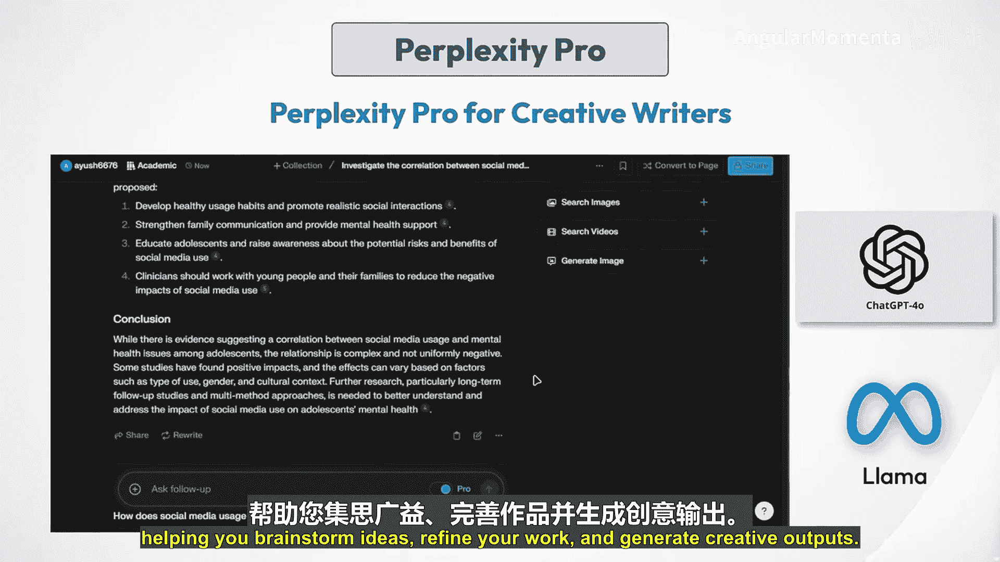

**困惑度专业版与研究**：对于研究人员来说，困惑度专业版是一个改变游戏规则的工具。上传学术论文、总结复杂文本并就这些文本提出详细问题的能力，使其成为论文工作、期刊文章和研究项目不可或缺的工具。专业搜索确保更准确的数据支持响应，而升级的模型则提高了语言和分析的质量。

**困惑度专业版与创意写作**：创意作家也能从困惑度专业版中受益匪浅。通过能够在GPT-4o和Llama等模型之间切换，作家可以探索不同的语调、声音和风格。无论是创作小说、剧本还是营销文案，困惑度专业版都能适应您的需求，帮助您集思广益、完善作品并生成创造性输出。

---

## 其他实用工具 🧰

困惑度AI不仅限于此，它还提供了一套额外的工具，旨在优化您的工作流程和管理您的研究。

*   **发现（Discover）**：此功能展示热门话题和最新研究，非常适合让您在自己的领域保持最新状态。无论是AI、文学、科学还是任何其他最近添加到页面上的主题，您都可以根据兴趣在发现页面上探索以下主题。
*   **库（Library）**：一个用于组织您的对话线程、文档和收藏的强大工具。它是困惑度AI管理每个对话线程和搜索的支柱。在库部分，我们有：
    *   **线程（Threads）**：存储并可以重新访问您正在进行的对话和研究问题。
    *   **页面（Pages）**：库下的一个有趣工具。它基本上可以根据您的需要，在特定主题上生成整个博客页面，然后可以发布在社交媒体平台上，甚至可以发布在发现页面上，以便其他人可以看到您的博客文章。
    *   **收藏（Collections）**：用户可以将他们的发现组织成收藏，从而更轻松地管理研究项目并与他人协作。这个功能对于小组工作或正在进行的研究工作特别有用，因为它允许更好地组织和检索信息。

---

## 困惑度AI在研究与写作中的局限性 ⚠️

虽然困惑度AI为研究和写作提供了许多优势，但在学术研究方面也存在一些局限性。

*   **依赖在线来源**：困惑度AI主要从网站、博客和开放网络上的一些学术论文等在线来源提取信息。然而，它无法直接访问许多学术期刊、数据库和付费学术资源，而这些对于许多领域的深入研究至关重要。
*   **缺乏同行评审内容**：困惑度AI提供的信息，即使在引用学术来源时，也可能未经同行评审或发表在声誉良好的学术期刊上。同行评审是学术研究的关键质量检查，困惑度的结果可能并不总是满足高级研究项目所需的标准。
*   **对复杂主题的深度有限**：虽然困惑度AI可以提供学术主题的概述和摘要，但分析的深度可能有限，特别是对于高度专业化或复杂的主题。研究人员可能需要查阅困惑度提供范围之外的主要来源和专家文献。
*   **引用格式不一致**：困惑度AI提供的引用格式并不总是一致或符合APA或MLA等标准学术风格。用户可能需要手动重新格式化引用，或使用引用管理器来确保学术论文的正确格式。
*   **可能存在过时或不可靠的信息**：与任何AI系统一样，困惑度的知识基于其训练时可用的数据。存在风险，即它提供的一些信息可能已经过时、有偏见或不可靠，特别是在快速发展的主题上。研究人员应始终根据权威来源验证关键事实和发现。

---

## 困惑度AI的未来 🔮

困惑度AI在研究和写作领域的未来看起来很有希望，有可能彻底改变信息的收集、综合和呈现方式。

**高级功能和能力**：困惑度AI一直在引入创新功能，将其功能扩展到传统搜索引擎之外。
*   **困惑度专业版**：付费版本提供对GPT-4和Claude 3.5等更先进语言模型的访问，提供更复杂的分析和生成能力。
*   **页面（Pages）**：这个新功能允许用户根据提示生成可定制的网页，模糊了搜索工具和内容创作平台之间的界限。
*   **图像生成**：困惑度AI增加了使用先进AI模型从文本提示生成图像的能力，使其成为一个多媒体研究和写作助手。

**挑战**：
*   **保持质量和准确性**：随着其规模扩大，确保所提供信息的准确性和可靠性将至关重要，特别是对于可信度至关重要的学术研究。
*   **对复杂主题的深度有限**：虽然困惑度AI可以提供概述和摘要，但对于高度专业化或复杂的主题，分析的深度可能有限。研究人员可能仍然需要查阅主要来源和专家文献。

---

## 总结

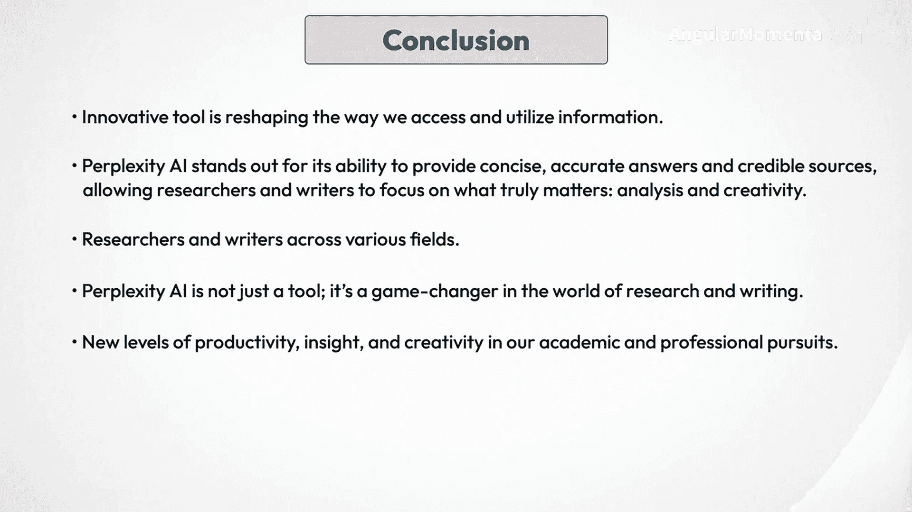

在本节课中，我们一起学习了困惑度AI如何应用于研究与写作。我们了解到，这个创新工具正在重塑我们访问和利用信息的方式。困惑度AI以其提供简洁、准确的答案和可信来源的能力而脱颖而出，使研究人员和作家能够专注于真正重要的事情：分析和创造力。随着它的不断发展，我们可以期待更多先进的功能，以满足各个领域的研究人员和作家的需求。困惑度AI不仅仅是一个工具；它是研究和写作世界的游戏规则改变者。通过拥抱它的能力，我们可以在学术和职业追求中开启生产力、洞察力和创造力的新水平。