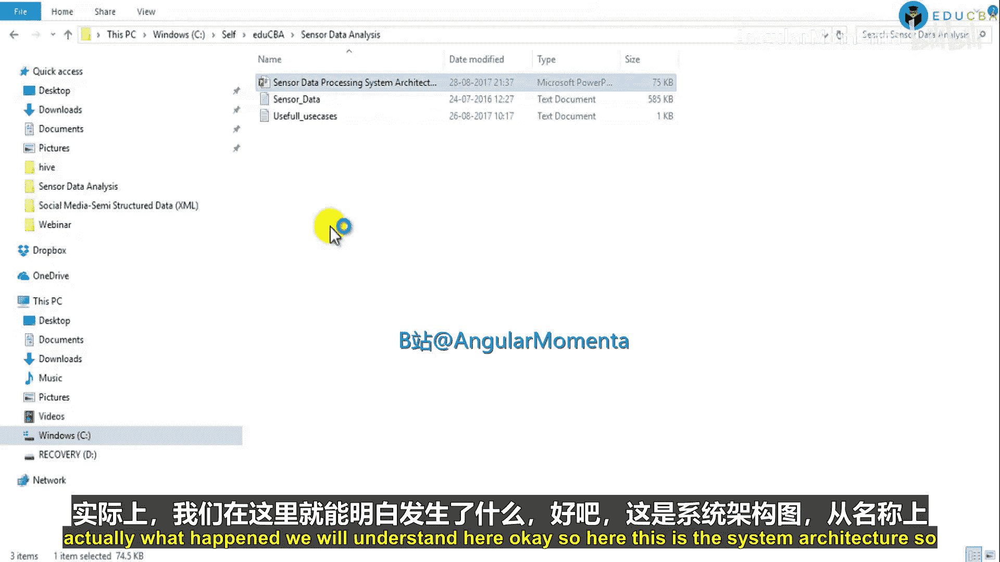
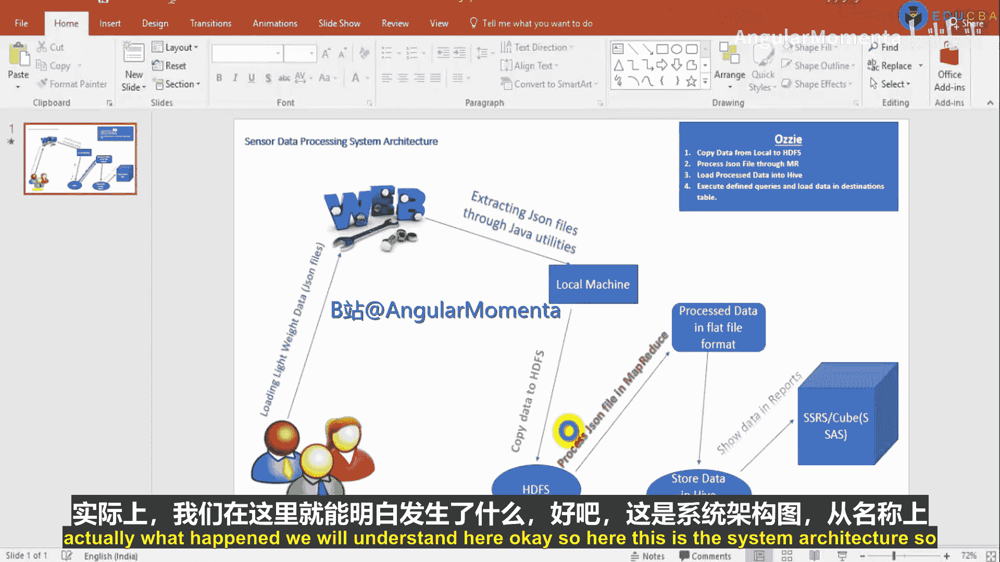
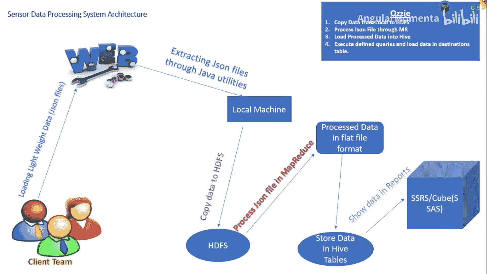
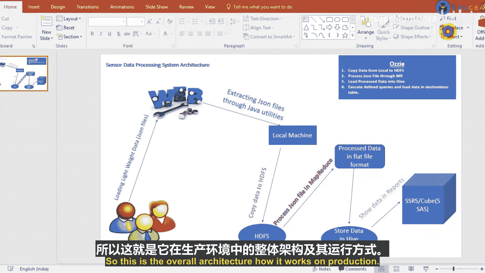
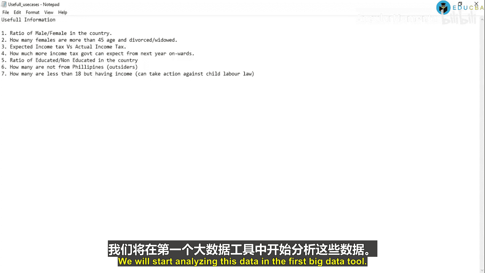

# 001：传感器数据分析导论 🚀

在本节课中，我们将学习一个名为“传感器数据分析”的新项目。我们将分析来自菲律宾的传感器数据。这个项目旨在从客户提供的输入文件中，为特定国家生成有意义的信息，以支持其制定促进国家增长与发展的战略决策。

## 项目背景与架构概述

这是一个实际生产项目的简化版本。输入文件为JSON格式，这是一种轻量级且流行的数据交换格式，便于通过网络传输。

以下是该项目的系统架构图，展示了数据从收集到呈现的完整流程。

## 数据流详解

上一节我们介绍了项目背景，本节中我们来看看数据是如何在系统中流动的。

**数据收集与获取**：
客户团队（属于菲律宾）会进行入户调查，收集信息，并按日、周或月的频率将JSON文件上传到他们的网络门户。我们使用Java工具程序，按计划（例如每天一次）从该门户下载这些文件到本地机器。

**数据加载到Hadoop**：
下载到本地机器的数据需要被复制到HDFS（Hadoop分布式文件系统）中进行处理。这个过程也是自动化的。

**数据处理**：
数据进入HDFS后，我们将使用MapReduce进行处理。MapReduce程序包含三个主要类：`Mapper`、`Reducer`和`Driver`。由于输入是JSON（本质上是文本格式），我们将使用`TextInputFormat`逐行读取。在`Mapper`中，键是偏移量（`LongWritable`类型），值是整行文本（`Text`类型）。处理完成后，输出为平面文件格式。

**数据存储与分析**：
处理后的数据可以存储到Hive表中。在实际生产中，我们使用MapReduce处理数据，然后将结果存入Hive。虽然Pig也能达到相同目的且更简洁，但本项目团队熟悉Java，因此选择了MapReduce。

**数据可视化**：
存入Hive的数据可以通过SQL Server Reporting Services（SSRS）或Analysis Services（以多维数据集形式）展示给客户。这需要通过在SQL Server中配置链接服务器来连接Hive，使得报告能查询并展示Hive中的数据。

**流程自动化**：
从下载数据到生成报告的整个流程，是通过Oozie工作流调度工具实现自动化的。一个Oozie工作流会顺序执行以下步骤：
1.  将数据从本地机器复制到HDFS。
2.  在HDFS上执行MapReduce作业处理数据。
3.  将处理后的数据加载到Hive表中。
4.  刷新报告或数据立方体以展示最新结果。

## 可生成的分析用例

理解了系统架构后，我们来看看能从这些数据中提取哪些有价值的信息。数据包含年龄、教育程度、婚姻状态、性别、纳税状态、出生国、公民身份和工作周数等字段。

以下是基于这些字段可以生成的部分分析用例：

*   **男女人口统计**：统计国内的男性和女性数量。政府可以据此评估人口性别比例是否符合预期，并制定相应政策（如中国的计划生育补贴政策）。
*   **特定女性群体关怀**：找出年龄大于45岁且处于离婚或丧偶状态的女性。这部分人群可能需要社会关怀，政府可据此建立相关福利设施或提供工作机会。
*   **税收审计**：对比预期所得税与实际征收的所得税。这有助于政府发现未依法纳税的个人并采取行动，确保税收用于国家发展。
*   **税收预测**：预测下一年度的所得税收入。可以通过分析即将年满18岁并开始工作的人群数据，将其潜在税收纳入预测模型。
*   **教育水平分析**：计算受教育与未受教育人口的比例。政府可据此分析教育普及的障碍（如经济问题），并采取措施（如兴建学校）提升教育水平。
*   **外籍人士分析**：分析非菲律宾籍但在菲居住和工作的人口数量。政府可据此调整签证配额等移民政策，以保障本国公民的就业机会。
*   **童工监测**：识别年龄小于18岁但有收入的人群。这有助于政府依据童工法，对雇佣童工的企业或个人采取行动。

## 总结

本节课中我们一起学习了“传感器数据分析”项目的整体架构与目标。我们了解了数据从客户收集、通过自动化流程进入Hadoop生态系统（HDFS、MapReduce、Hive），最终通过报表工具呈现给决策者的完整链路。同时，我们也探讨了如何从原始数据中提炼出多个有助于国家发展与治理的关键分析用例。在接下来的课程中，我们将从大数据基础开始，并最终使用MapReduce等工具实际处理这些数据。

