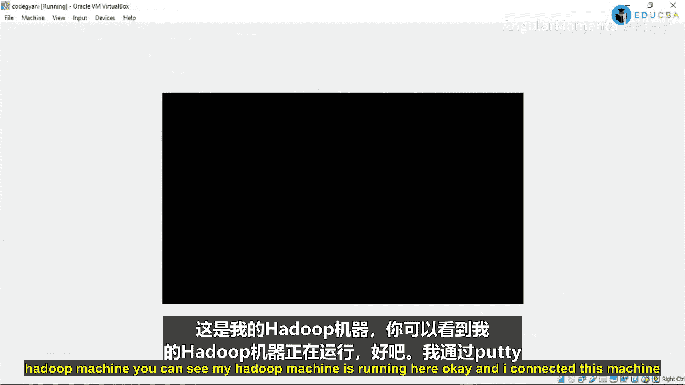
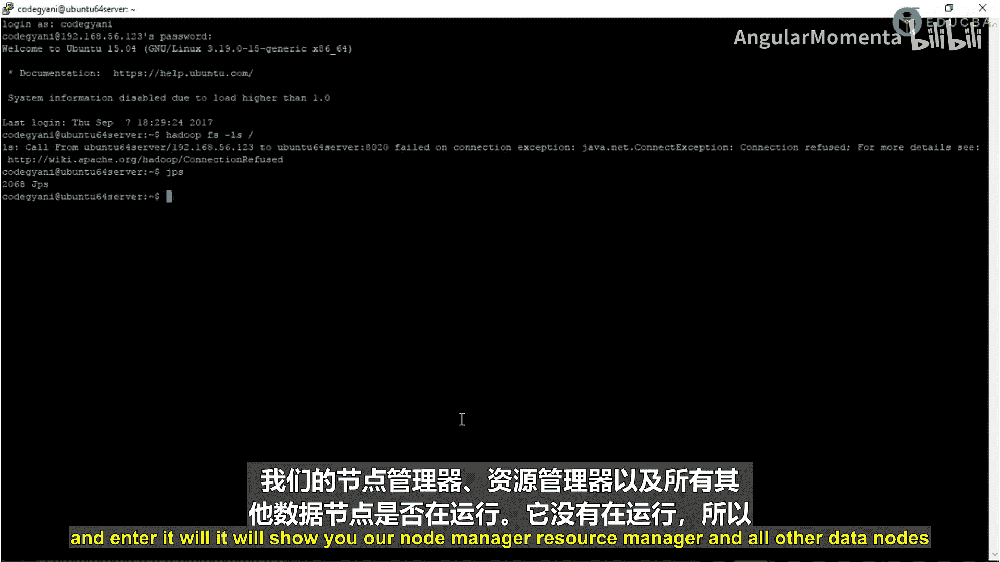
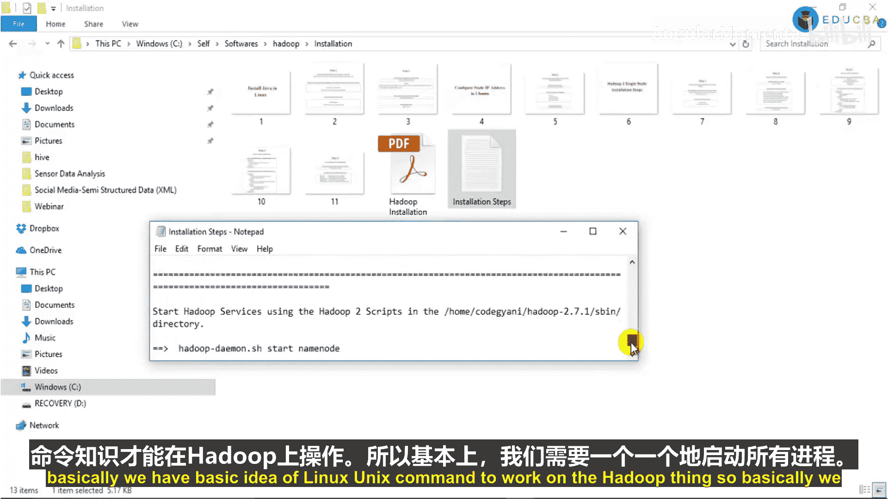
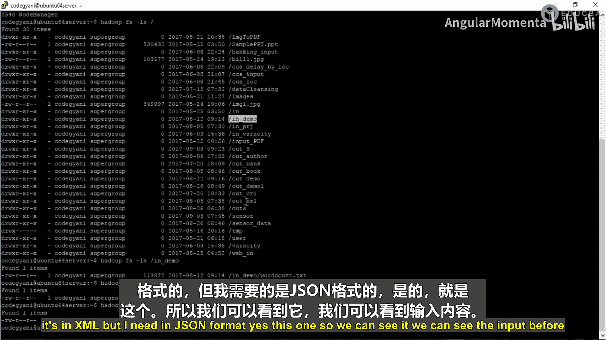
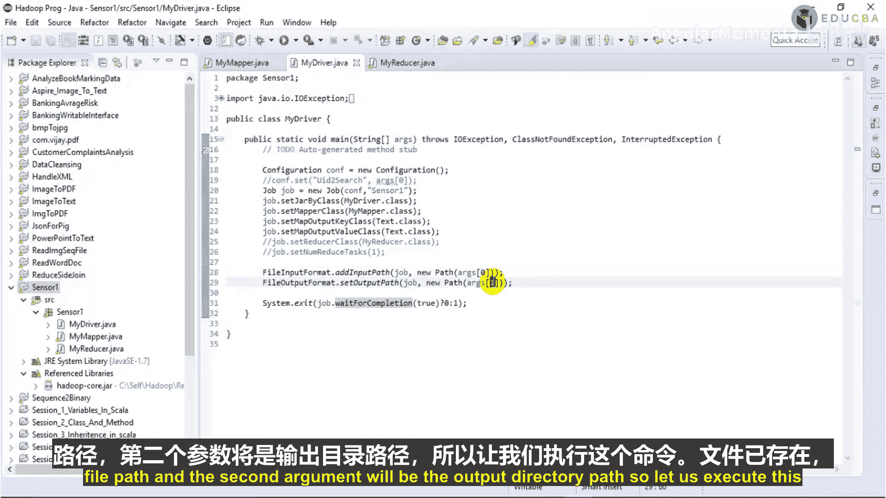
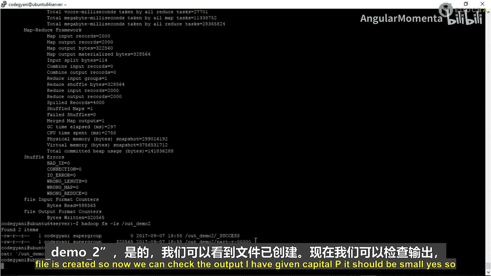
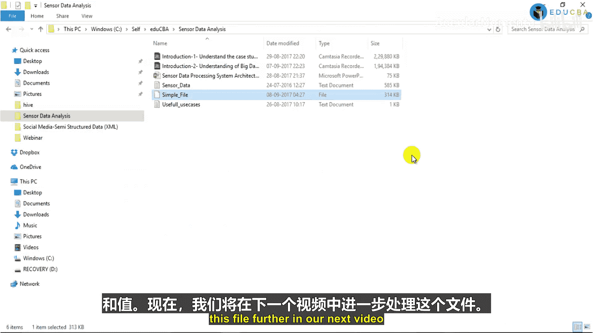

# 002：理解大数据与MapReduce基础

在本节课中，我们将要学习大数据的基本概念以及MapReduce编程模型的基础知识。我们将从理解大数据的定义和核心特性开始，然后逐步深入到MapReduce的工作原理，最后通过一个实际案例演示如何用MapReduce处理JSON格式的数据。

## 大数据基础

上一节我们介绍了项目背景和系统架构。本节中，我们来深入理解什么是大数据。

大数据不仅仅是处理海量数据。如果仅需处理大量数据，我们可以选择其他工具，如Teradata，或者通过升级硬件来实现。大数据的独特之处在于其处理数据的综合能力。

IBM给出了一个被广泛接受的定义：任何包含“4V”特征的数据都属于大数据范畴。

### 大数据的4V特性

以下是构成大数据的四个核心维度：

1.  **Volume（体量）**：指数据的规模巨大。根据国际数据公司（IDC）的预测，到2020年，全球数据总量将达到40泽字节（ZB）。大数据技术旨在高效处理这种规模的数据。
2.  **Velocity（速度）**：指数据生成和更新的速度极快。例如，数据可能每天、每小时都在快速增长。大数据框架能够通过分布式和并行处理来应对这种高速的数据流。
3.  **Variety（多样性）**：指数据类型的多样化。这是大数据的一个重要优势。我们可以处理各种格式的数据，包括日志文件、视频、音频、图像、传感器数据等。在本项目中，我们处理的就是传感器数据。
4.  **Veracity（真实性/不确定性）**：指数据的质量和可信度存在不确定性。数据的格式和内容可能无法预测，例如今天收到文本文件，明天可能收到图像。大数据技术能够灵活地处理这种不确定性。

### 大数据的应用场景

大数据技术在许多领域都有广泛应用，以下是几个典型例子：

*   **推荐系统**：例如，在电商网站（如eBay、Amazon）上，根据用户的历史浏览和购买记录，向其推荐相关商品。
*   **搜索质量提升**：利用大数据分析用户行为，优化搜索引擎的结果质量和相关性。
*   **欺诈检测**：在银行和金融领域，通过分析交易模式（如异常时间、频繁交易、异地交易）来识别和预防欺诈行为。
*   **其他领域**：电信、政府、医疗与生命科学等行业也广泛应用大数据技术。

## Hadoop架构简介

理解了大数据的概念后，我们来看看实现它的一个核心框架——Hadoop的基础架构。

Hadoop主要由两个核心层构成：

1.  **HDFS**：即Hadoop分布式文件系统，是存储层。它负责将数据分布式地存储在多台机器（数据节点）上。可以将其类比为计算机的“硬盘”。
2.  **YARN**：即资源协调者，是处理层。它负责管理集群中的计算资源，并调度应用程序。可以将其类比为计算机的“大脑”和“内存”。

在HDFS中，有一个主节点（NameNode）管理文件系统元数据，多个从节点（DataNode）存储实际数据。在YARN中，有一个主节点（ResourceManager）管理集群资源，多个从节点（NodeManager）在各自机器上执行任务。

## MapReduce基础

现在，我们进入数据处理的核心——MapReduce编程模型。MapReduce是Hadoop中用于并行处理大规模数据集的编程模型。

一个标准的MapReduce作业包含三个主要部分：

1.  **Mapper（映射器）**：负责读取输入数据，并执行初步的业务逻辑处理。它逐行处理数据，输入和输出都是键值对（Key-Value Pair）形式。例如，在过滤数据的场景中，Mapper会检查每一行数据，只将符合条件（如属于特定地区）的数据传递给下一个阶段。
    *   **输入**：`(Key: 行偏移量, Value: 行内容)`
    *   **处理**：执行过滤、转换等逻辑。
    *   **输出**：`(Key: 业务相关键, Value: 处理后的值)`
2.  **Reducer（归约器）**：接收来自Mapper的输出（同样是键值对），并对相同键的值进行聚合、汇总或计算，最终生成报告或结果。
    *   **输入**：`(Key: Mapper输出的键, Value: 该键对应的值列表)`
    *   **处理**：执行求和、计数、平均值等聚合操作。
    *   **输出**：`(Key: 结果键, Value: 聚合结果)`
3.  **Driver（驱动器）**：这是作业的主类，相当于程序的入口点（main函数）。它负责配置整个MapReduce作业的参数，例如设置Mapper和Reducer类、指定输入输出路径、定义键值类型等。

## 实践：处理JSON格式数据

在掌握了MapReduce基础后，本节我们来看一个具体案例：如何将JSON格式的输入文件转换为逗号分隔的平面文件。

我们的目标是不依赖专门的JSON解析库，而是编写自定义代码来提取JSON中的值，并输出为简单的文本格式。

### Mapper类实现

Mapper类负责读取JSON格式的每一行，并提取其中的值。

```java
public class MyMapper extends Mapper<LongWritable, Text, Text, Text> {
    @Override
    public void map(LongWritable key, Text value, Context context) throws IOException, InterruptedException {
        // 1. 将Text类型的行内容转换为String
        String jsonData = value.toString();

        // 2. 清洗数据：移除JSON的大括号和转义字符
        jsonData = jsonData.replace(“{“, “”).replace(“}“, “”).replace(“\\”, “”);

        // 3. 按逗号分割，得到 “key:value” 对的数组
        String[] keyValuePairs = jsonData.split(“,”);

        StringBuilder finalResult = new StringBuilder();

        // 4. 遍历每个 “key:value” 对
        for (String pair : keyValuePairs) {
            // 按冒号分割，分离键和值
            String[] keyValue = pair.split(“:”);
            if (keyValue.length > 1) {
                // 只取“值”的部分，并添加到结果字符串
                finalResult.append(keyValue[1].trim()).append(“,”);
            }
        }

        // 5. 输出结果：键设为null，值为拼接好的字符串
        context.write(new Text(“”), new Text(finalResult.toString()));
    }
}
```

**代码解释**：
*   输入键是行偏移量（`LongWritable`），值是整行文本（`Text`）。
*   通过字符串替换操作去除JSON的结构字符。
*   将每一行按逗号分割成多个`”key:value”`对。
*   遍历这些对，按冒号分割后，只取“值”的部分。
*   将所有值用逗号连接起来，作为输出值。本例中不需要输出键，所以设为空文本。



### Driver类配置

由于本例只是格式转换，不需要聚合操作，因此我们没有Reducer。Driver类负责配置和提交作业。





```java
public class MyDriver {
    public static void main(String[] args) throws Exception {
        Configuration conf = new Configuration();
        Job job = Job.getInstance(conf, “sensor1”); // 设置作业名称

        job.setJarByClass(MyDriver.class); // 设置主类
        job.setMapperClass(MyMapper.class); // 设置Mapper类

        // 设置输出键值类型
        job.setOutputKeyClass(Text.class);
        job.setOutputValueClass(Text.class);

        // 因为没有Reducer，将Reducer任务数设为0
        job.setNumReduceTasks(0);

        // 设置输入和输出路径（从命令行参数获取）
        FileInputFormat.addInputPath(job, new Path(args[0]));
        FileOutputFormat.setOutputPath(job, new Path(args[1]));

        // 提交作业并等待完成
        System.exit(job.waitForCompletion(true) ? 0 : 1);
    }
}
```





### 作业执行步骤

1.  **编译与打包**：将Java代码编译并打包成JAR文件（例如`sensor1.jar`）。
2.  **上传至Hadoop集群**：使用工具（如WinSCP）将JAR文件上传到Hadoop主节点。
3.  **启动Hadoop服务**：确保HDFS和YARN的相关服务（NameNode, DataNode, ResourceManager, NodeManager）都已启动。
    ```bash
    start-dfs.sh
    start-yarn.sh
    ```
4.  **执行MapReduce作业**：使用`hadoop jar`命令提交作业。
    ```bash
    hadoop jar sensor1.jar /input/sensor_data.json /output/demo2
    ```
    *   `/input/sensor_data.json`：HDFS上的输入文件路径。
    *   `/output/demo2`：HDFS上的输出目录路径。
5.  **查看结果**：作业完成后，可以查看输出目录中的结果文件，内容已是逗号分隔的纯文本格式。



## 总结



本节课中我们一起学习了大数据的基础概念和MapReduce编程模型。我们首先了解了大数据的“4V”特性（体量、速度、多样性、真实性）及其应用场景。然后，我们探讨了Hadoop的两层核心架构：HDFS（存储）和YARN（资源管理）。接着，我们深入学习了MapReduce的工作原理，包括Mapper、Reducer和Driver三个组件的职责。最后，我们通过一个实践案例，演示了如何使用MapReduce将复杂的JSON格式数据转换为易于后续处理的平面文本文件，并完成了从代码编写到集群执行的完整流程。这为后续更复杂的数据处理任务奠定了坚实的基础。