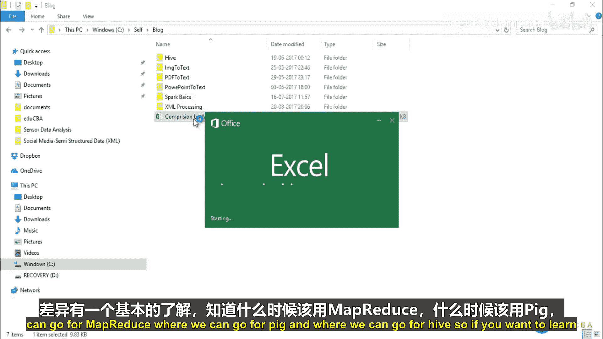
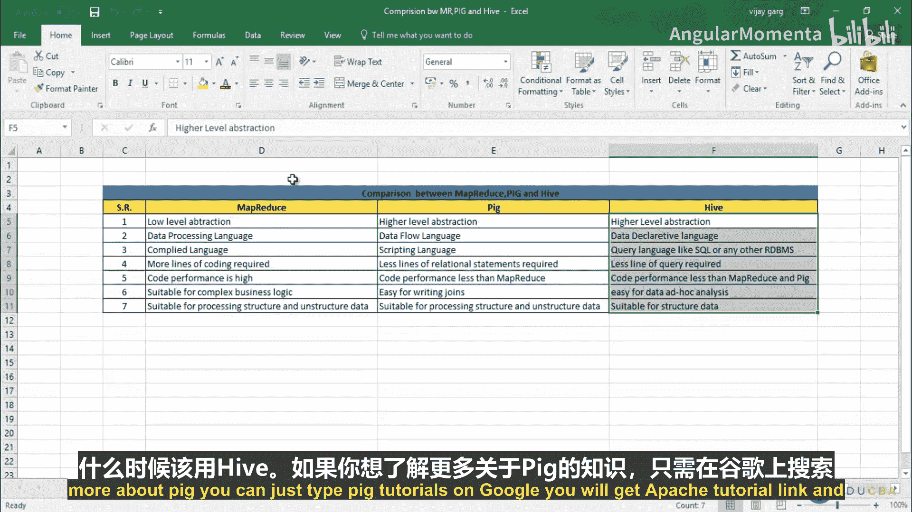
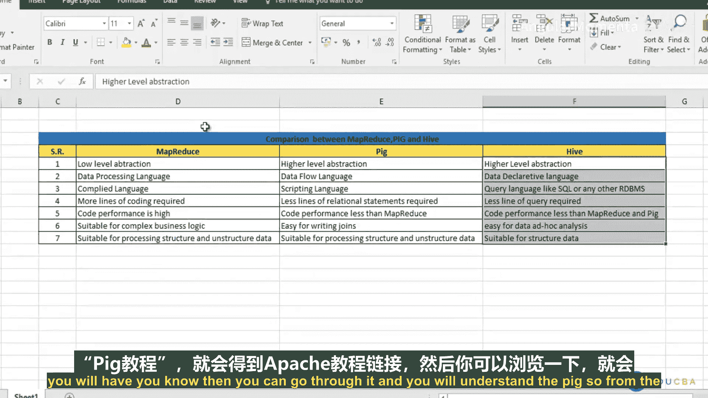
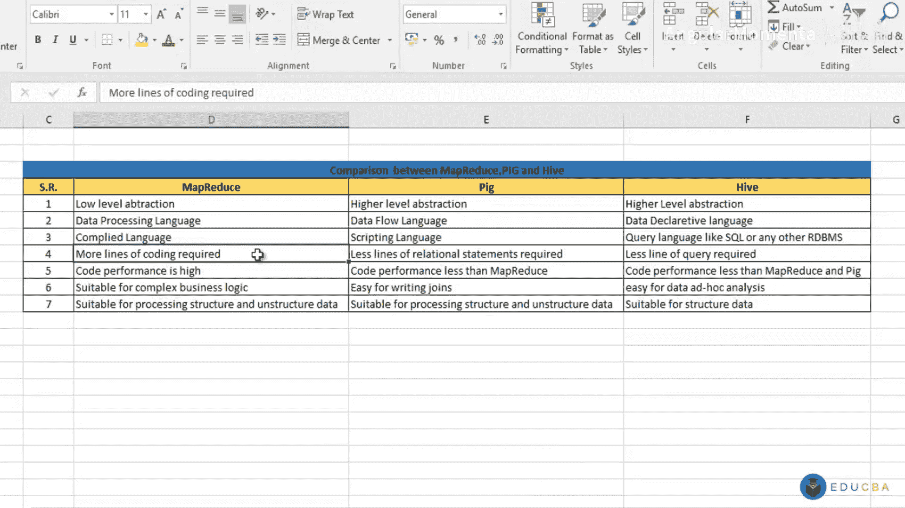
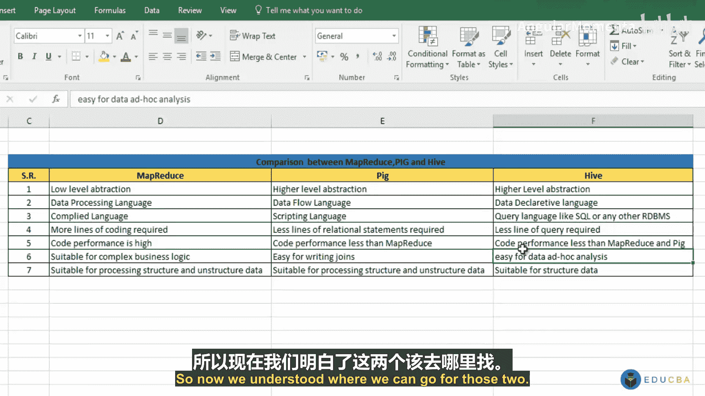
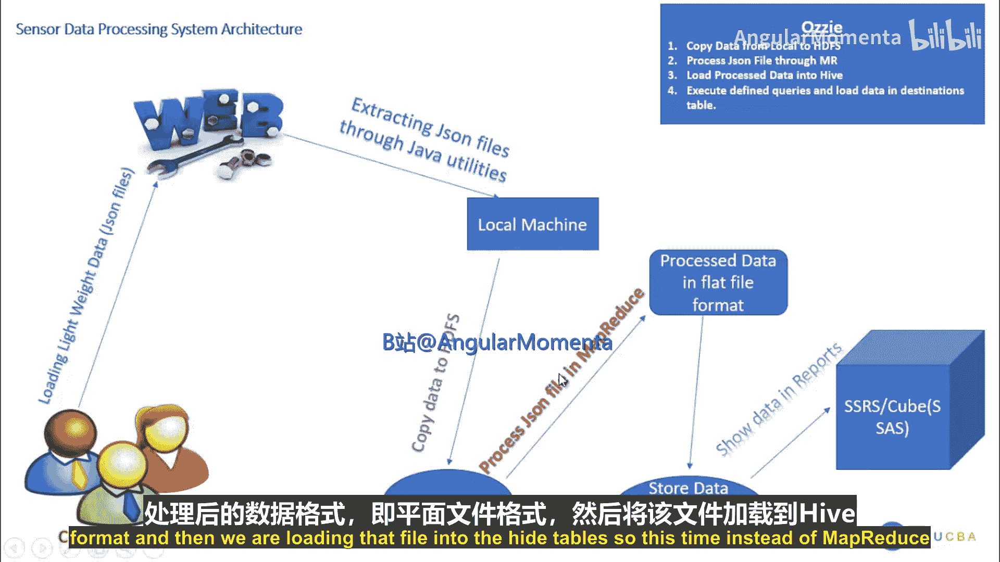
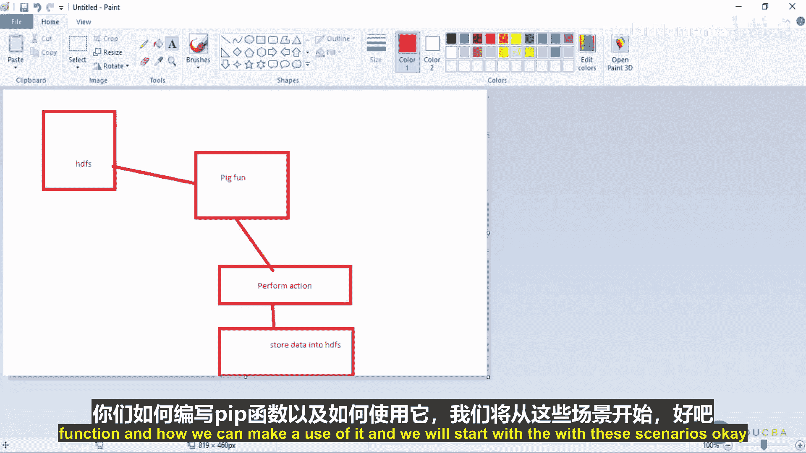
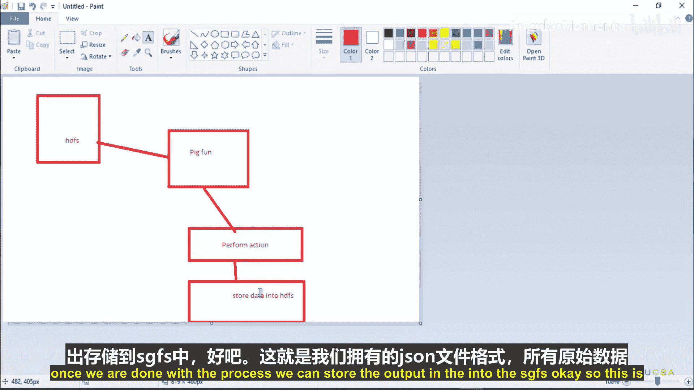
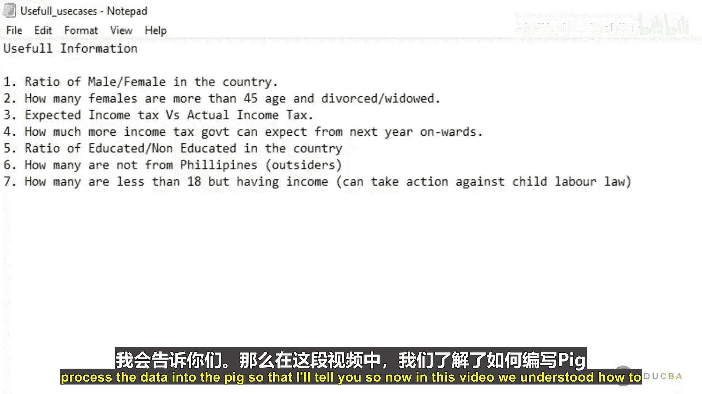
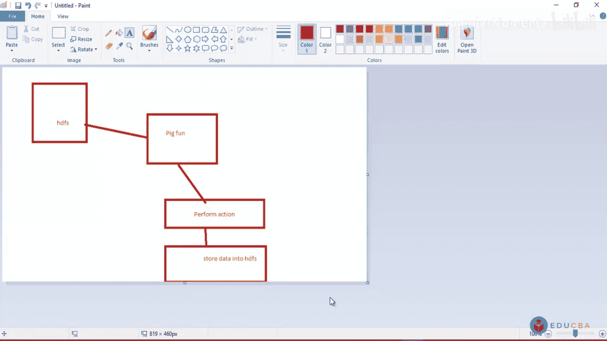

# 004：Pig、MapReduce与Hive之间的区别

## 概述
在本节课中，我们将学习Pig、MapReduce和Hive这三种Hadoop生态系统中重要的数据处理工具。我们将重点探讨它们之间的核心区别，了解各自的适用场景，并初步介绍如何在Pig中处理JSON格式的数据。

## 回顾与引入
在上一节中，我们使用MapReduce处理了JSON输入文件，完成了七个业务场景的分析，将原始数据转化为对客户有意义的战略信息。

本节中，我们来看看如何使用Pig来实现相同的分析任务。在开始之前，首先需要理解Pig是什么，以及它与我们已经熟悉的MapReduce和即将学习的Hive有何不同。

## Pig、MapReduce与Hive的核心区别
以下是这三种工具在多个维度的详细对比，了解这些差异有助于我们在实际项目中做出正确的技术选型。

**1. 抽象级别**
*   **MapReduce**：属于**低级别抽象**。开发者需要编写详细的代码（如`if`条件、`case`语句）来实现所有业务逻辑，没有隐藏底层细节。
*   **Pig**：属于**高级别抽象**。它通过Pig Latin脚本语言操作，内部自动执行MapReduce程序，将复杂的实现细节对开发者隐藏，使得开发更简单。
*   **Hive**：同样属于**高级别抽象**。它提供了一种类似SQL的查询语言（HiveQL），用户只需声明要做什么，而不必关心执行细节。

**2. 数据处理范式**
*   **MapReduce**：是一种**数据处理语言**。它专注于如何读取、转换和输出数据。
*   **Pig**：是一种**数据流语言**。开发者通过定义一系列关系（步骤，如S1, S2）来明确控制数据的流动和处理过程。
*   **Hive**：是一种**数据声明语言**。用户通过编写查询语句来描述需要什么数据，由Hive引擎决定如何执行。

**3. 语言类型**
*   **MapReduce**：使用**编译型语言**（如Java、Scala、Python）。编写完成后需要编译成JAR包才能执行。
*   **Pig**：使用**脚本语言**（Pig Latin）。开发者编写脚本，在Pig Shell中直接解释执行。
*   **Hive**：使用**类SQL语言**（HiveQL）。其语法与传统关系型数据库（如Oracle, MySQL）的SQL非常相似。

**4. 代码量与性能**
*   **MapReduce**：需要编写**大量代码**。但由于开发者对代码有完全控制权，可以通过优化获得**很高的性能**。
*   **Pig**：只需编写**少量脚本**。因为抽象层次高，开发者对底层优化控制有限，所以**性能通常低于手动优化的MapReduce程序**。
*   **Hive**：也只需编写**少量查询语句**。性能依赖于Hive引擎的优化，通常**低于MapReduce和Pig**。

**5. 适用场景**
*   **MapReduce**：最适合处理**复杂的业务逻辑**和**各种格式的数据**（如文本、图像、视频、Excel文档）。灵活性最高。
*   **Pig**：在**连接（Join）操作**上比MapReduce更简单易用（例如，一句`JOIN`语句即可），同样适合处理结构和非结构数据。
*   **Hive**：主要用于**数据分析**。它将数据加载到表中，便于进行聚合、汇总和生成分析报告，适合商业智能和决策支持。

**6. 支持的数据类型**
*   **MapReduce**：适合处理**结构化与非结构化数据**。
*   **Pig**：适合处理**结构化与非结构化数据**。
*   **Hive**：主要适合处理**结构化数据**。

## 技术选型指南
根据以上区别，我们可以得出简单的选型建议：
*   如果你精通Java等编程语言，且需要处理复杂逻辑或特殊格式数据，**选择MapReduce**。
*   如果你不熟悉底层编程，希望快速进行数据处理（尤其是连接操作），**选择Pig**。
*   如果你的主要任务是基于结构化数据进行查询、汇总和生成报表，**选择Hive**。

## 新的处理流程：使用Pig处理JSON
在MapReduce实践中，我们先将JSON文件转换为纯文本格式再处理。而在Pig方案中，我们将采用不同的方法。

我们将编写一个**Pig函数（UDF）** 来直接解析原始的JSON文件。这个函数的工作原理如下：
1.  我们将JSON文件中的每一行（一个JSON对象）和一个指定的`key`（例如“gender”）传递给该函数。
2.  函数内部解析该行JSON文本，找到对应`key`的`value`（例如“female”）并返回。
3.  在Pig脚本中，我们可以调用这个函数获取所需字段，然后进行过滤、分组、计数等操作。

这种方法的好处是无需预先转换数据格式，可以直接对原始JSON进行操作。

## Pig函数简介
Pig中有两种主要的用户自定义函数（UDF）：
*   **Filter Function（过滤函数）**：返回布尔值（`true`/`false`），通常用于`WHERE`条件中过滤数据。
*   **Eval Function（求值函数）**：返回一个字符串或其它类型的值，用于数据提取和转换。

对于我们的JSON解析需求，我们将使用**Eval Function**。该函数需要继承`org.apache.pig.EvalFunc`类，并重写`exec`方法。在该方法中，我们实现从传入的元组（Tuple，代表数据行）和`key`参数中提取对应`value`的逻辑。

## 本节总结
本节课我们一起学习了Pig、MapReduce和Hive的核心区别，包括它们的抽象级别、处理范式、语言类型、性能特点和适用场景。我们还介绍了如何使用Pig函数直接处理JSON数据的新流程，并简要了解了Pig函数的类型。

在下一节中，我们将动手实践：导出编写好的Pig函数JAR包，将其注册到Pig环境中，并开始使用Pig Latin脚本来实现第一个数据分析场景。