# 005：使用函数在Pig中处理用例 🐷

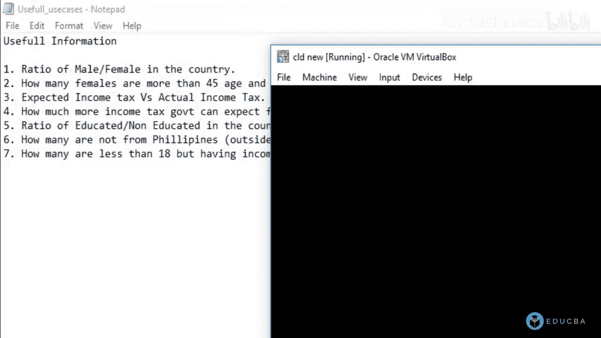

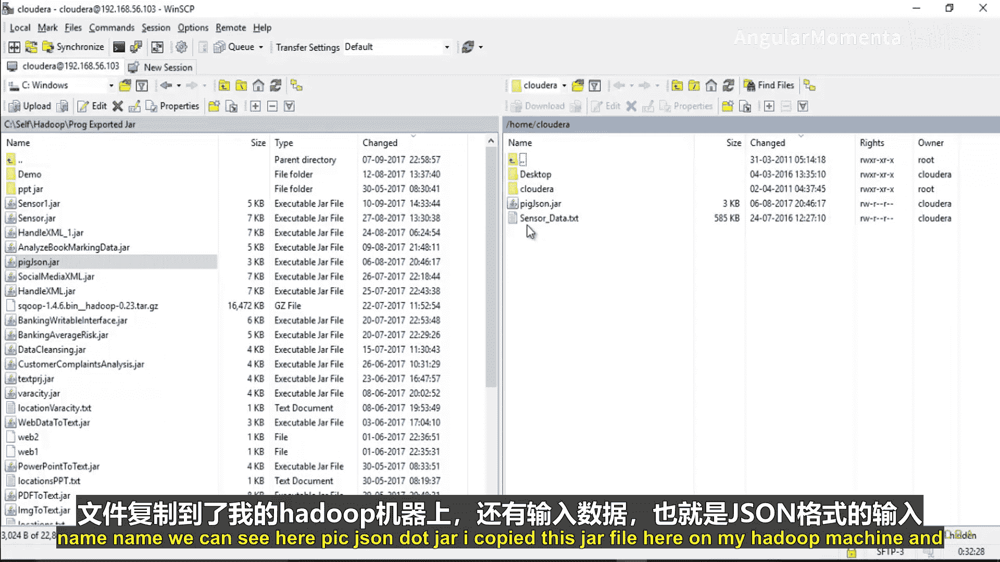

在本节课中，我们将学习如何在Apache Pig中使用用户自定义函数（UDF）来处理具体的业务用例。我们将通过一系列步骤，从加载数据、调用函数、过滤、分组到最终输出结果，完整地演示Pig的数据处理流程。

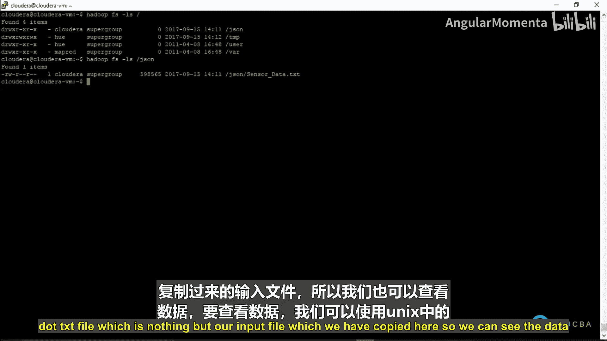

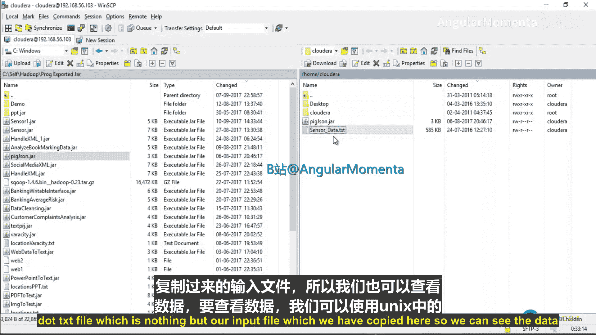

上一节我们介绍了Pig、MapReduce和Hive的基本概念与区别。本节中，我们将开始动手实践，在Pig中处理具体的业务场景。

## 环境准备与数据加载

首先，我们需要启动Pig环境并加载数据。Pig是一种数据流语言，开发者可以控制数据的处理流程。

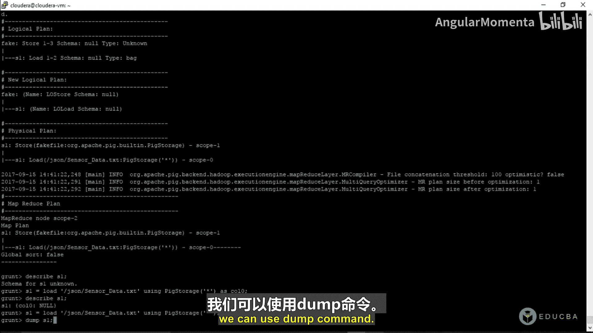

以下是在Pig Grunt Shell中执行的初始步骤：

1.  **注册UDF的JAR文件**：在使用自定义函数前，必须先注册包含该函数的JAR包。
    ```pig
    REGISTER /path/to/pigJson.jar;
    ```
2.  **加载数据文件**：我们将JSON格式的输入文件加载到Pig中。这里使用`PigStorage`加载器，并以星号`*`作为分隔符，将所有数据放入单个列中。
    ```pig
    s1 = LOAD '/json/sensor_data.txt' USING PigStorage('*');
    ```
3.  **查看数据结构**：可以使用`DESCRIBE`命令查看关系`s1`的模式。由于加载时未指定模式，其类型默认为`bytearray`。
    ```pig
    DESCRIBE s1;
    ```
4.  **查看数据内容**：使用`DUMP`命令可以查看关系`s1`中的数据内容。
    ```pig
    DUMP s1;
    ```

## 使用UDF提取特定字段

现在，我们将使用预先编写好的UDF函数从JSON数据中提取特定字段的值。该函数接收两个参数：整行数据（`$0`）和要提取的键名。

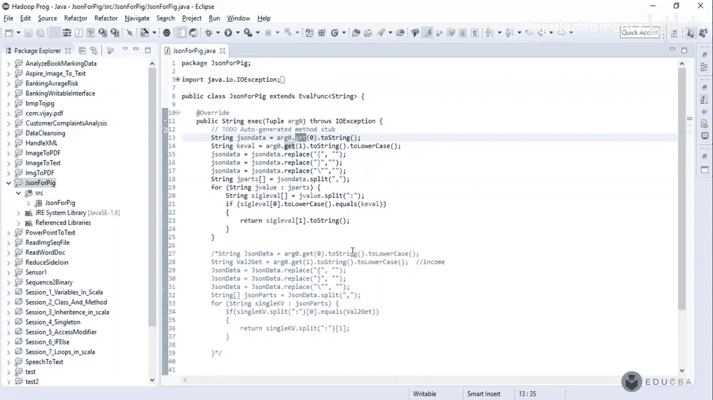

以下是提取“年龄”字段的示例：


```pig
s2 = FOREACH s1 GENERATE json.for.pig.json.for.pig($0, 'age');
DUMP s2;
```
执行此命令后，Pig会调用UDF，从`s1`的每一行数据中提取出`age`键对应的值，并在控制台输出所有年龄数据。

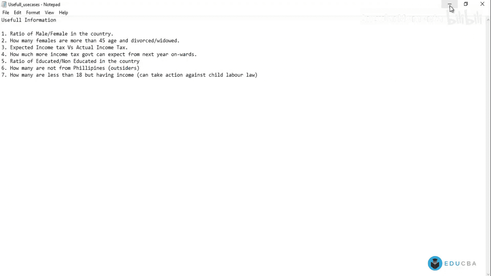

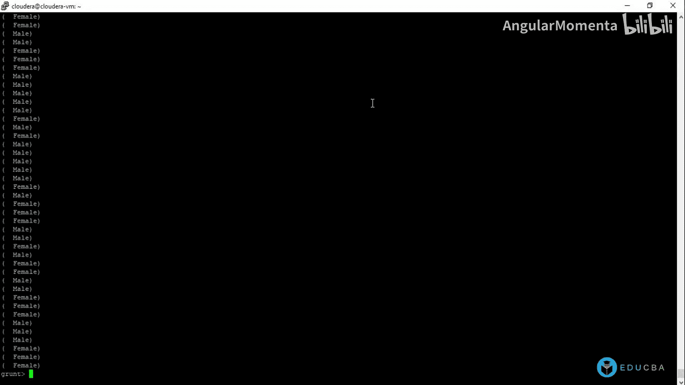

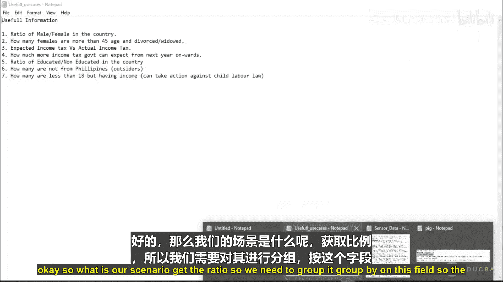

## 处理具体业务用例

掌握了基础操作后，我们来处理几个具体的业务场景。

### 用例一：计算国家内男女性别比例 👥

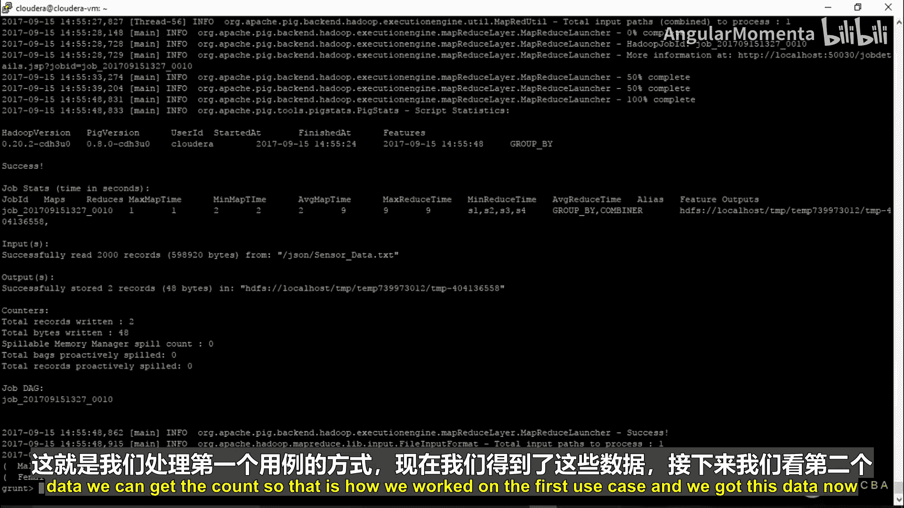

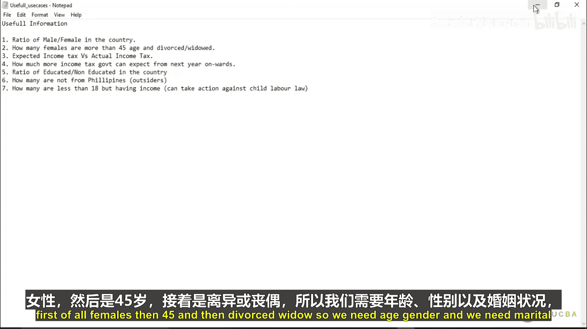

这个场景需要我们从数据中提取性别字段，然后按性别分组并计数。

以下是处理步骤：

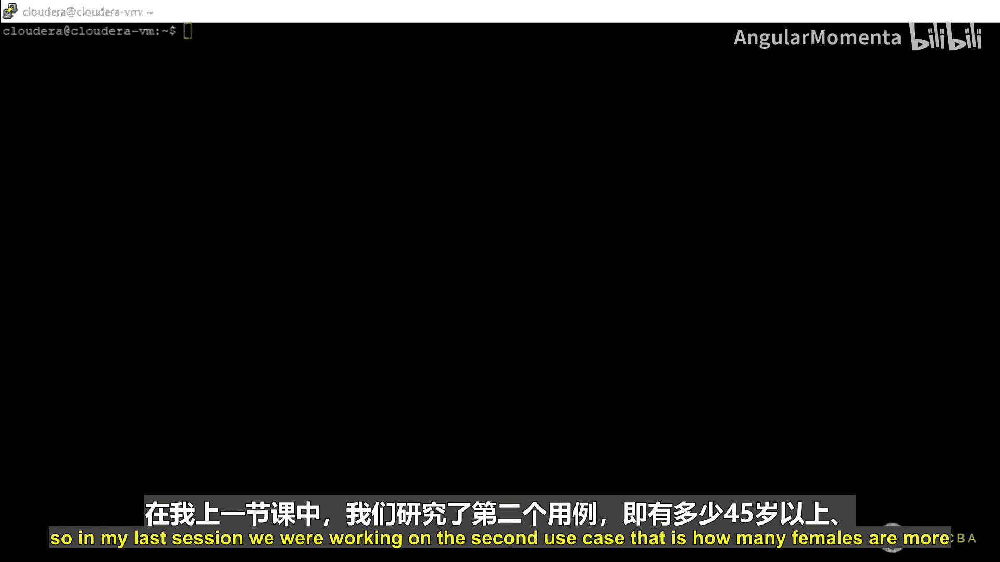

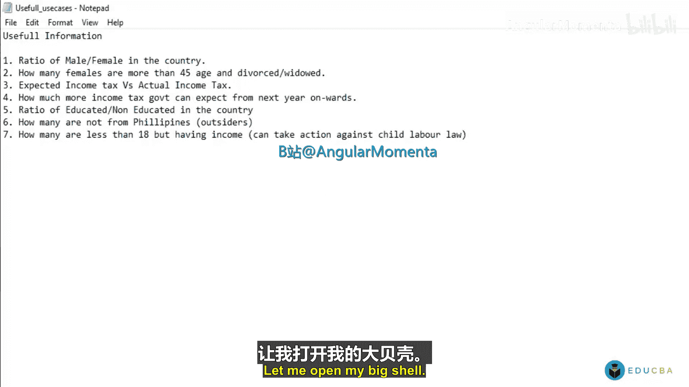

1.  **提取性别字段**：使用UDF提取`gender`字段。
    ```pig
    s2_gender = FOREACH s1 GENERATE json.for.pig.json.for.pig($0, 'gender') AS gender;
    ```
2.  **按性别分组**：对`s2_gender`关系中的`gender`字段进行分组。
    ```pig
    s3_grouped = GROUP s2_gender BY gender;
    ```
3.  **计算每组数量**：对分组后的数据计算每个性别的记录数。
    ```pig
    s4_count = FOREACH s3_grouped GENERATE group, COUNT(s2_gender);
    DUMP s4_count;
    ```
执行后，我们将得到类似`(male, 939)`和`(female, 10161)`的结果，即男性和女性的数量。

### 用例二：筛选年龄大于45岁的离婚或丧偶女性 🧓

这个场景更复杂，需要同时提取多个字段并进行复合条件过滤。

以下是处理步骤：

1.  **提取多个字段**：一次性提取`gender`、`age`和`marital_status`字段。
    ```pig
    s2_multi = FOREACH s1 GENERATE
                 json.for.pig.json.for.pig($0, 'gender') AS gender,
                 json.for.pig.json.for.pig($0, 'age') AS age,
                 json.for.pig.json.for.pig($0, 'marital_status') AS m_status;
    ```
2.  **进行数据过滤**：使用`FILTER`操作筛选出性别为女性、且婚姻状态为“离婚”或“丧偶”的记录。注意，提取出的字符串可能包含空格，使用`TRIM`函数去除。
    ```pig
    s3_filtered = FILTER s2_multi BY
                    (TRIM(gender) == 'female') AND
                    (TRIM(m_status) == 'divorced' OR TRIM(m_status) == 'widowed');
    DUMP s3_filtered;
    ```
    *注意：目前过滤条件中未包含“年龄大于45岁”，因为从UDF提取的`age`是字符串类型，需要额外的过滤函数将其转换为数值类型后才能进行大小比较。*

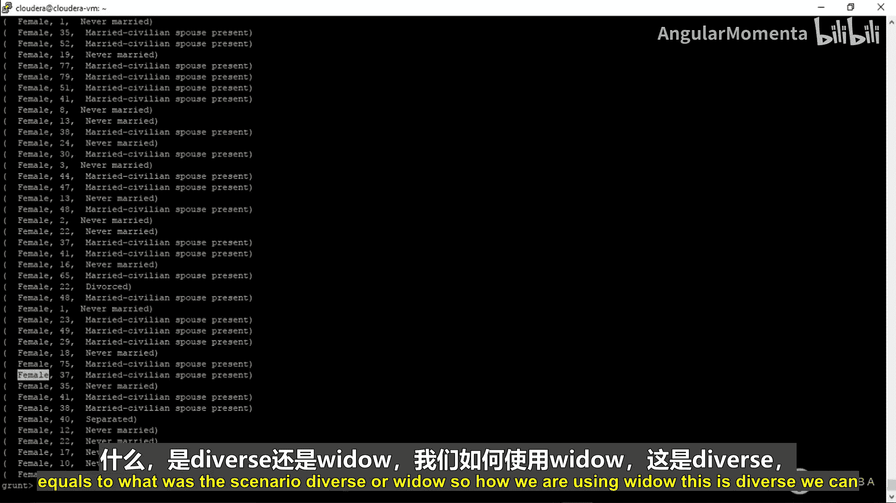

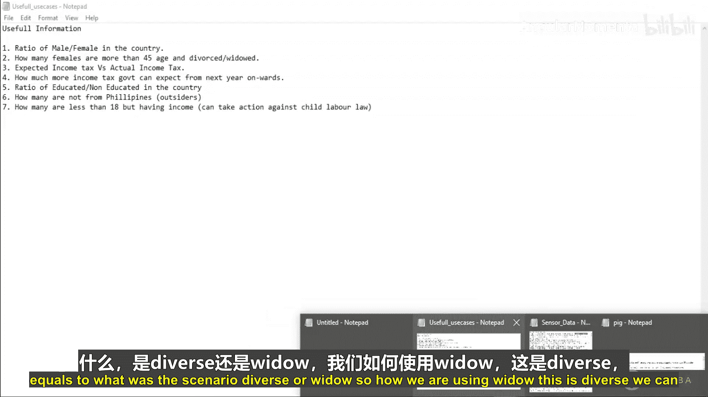

3.  **将结果存储到HDFS**：除了在控制台查看，我们还可以将结果写回HDFS。
    ```pig
    STORE s3_filtered INTO '/json/out';
    ```
    这会在HDFS的`/json`目录下创建一个`out`文件夹，并将结果文件存储其中。

### 其他用例思路 💡

对于其他用例，处理思路是相似的：

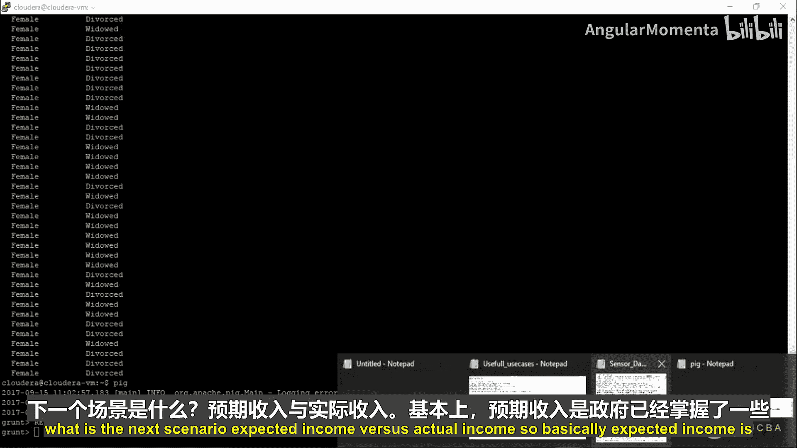


*   **预期收入与实际收入**：提取`income`字段，但需要编写过滤函数将字符串收入转换为数值（如`double`类型），然后才能进行求和（`SUM`）等聚合计算。
*   **国家受教育与未受教育人口问题**：提取`education`字段，按教育水平分组（`GROUP BY`），然后计算每组的数量（`COUNT`）。这完全可以在字符串类型上操作。
*   **来自特定国家的人数**：提取`country_of_birth`字段，过滤出特定国家（如`Philippines`），然后计数。这也适用于字符串过滤。
*   **年龄小于18岁的人数**：提取`age`字段，并**需要编写过滤函数**将其转换为整数（`int`），然后才能过滤出`age < 18`的记录并进行计数。

**核心要点**：当需要对数值进行**比较**（如大于、小于）或**算术运算**（如求和、平均）时，必须通过UDF或内置函数将字符串字段转换为合适的数值类型。对于纯粹的分类、分组和字符串匹配，则可以直接使用提取出的字符串字段。

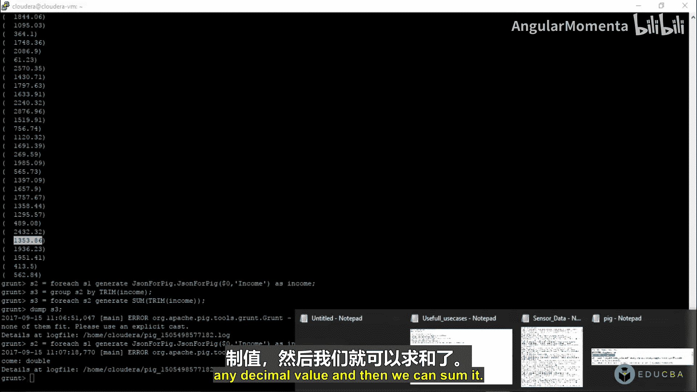

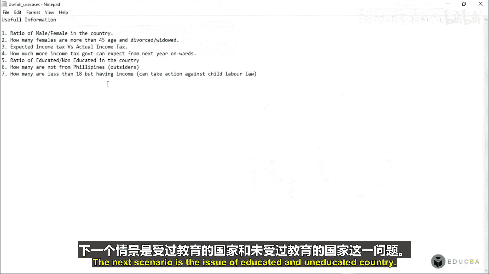

## 总结与下节预告

本节课中我们一起学习了如何在Pig中应用UDF处理实际用例。我们经历了完整的流程：注册JAR、加载数据、调用UDF提取字段、使用`FILTER`进行条件筛选、使用`GROUP BY`进行分组聚合，以及使用`STORE`将结果输出到HDFS。

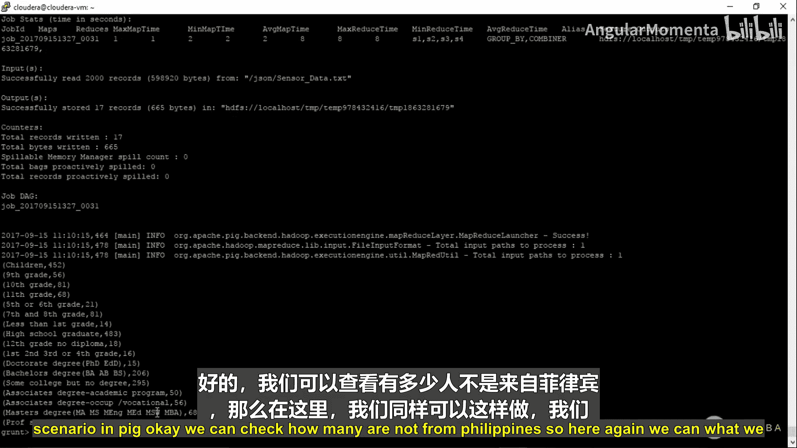

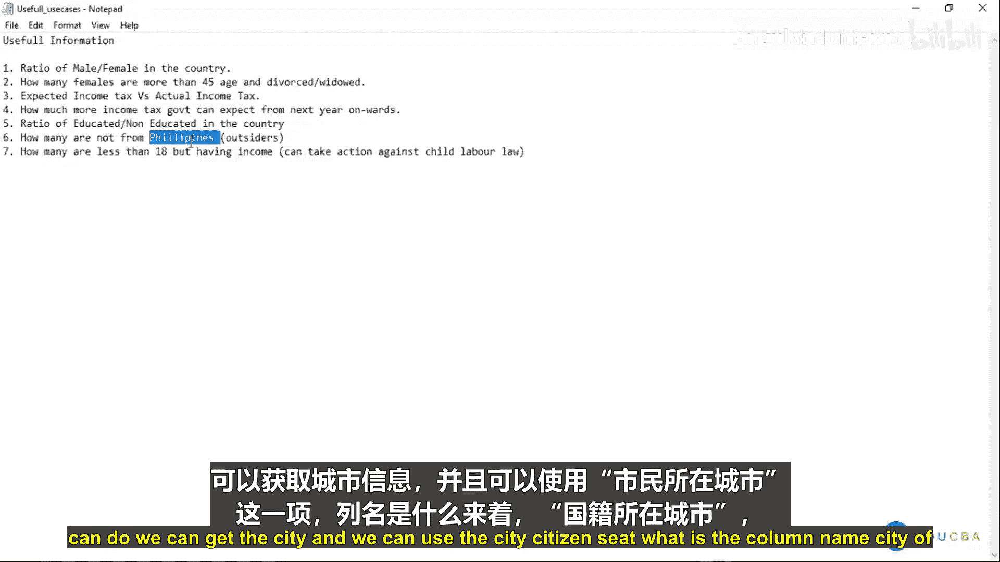

我们了解到，Pig通过高级的Pig Latin脚本，将底层MapReduce的复杂性封装起来，让开发者能够更专注于数据流逻辑本身。对于更复杂的数值比较和计算，则需要借助自定义的过滤函数。

在下一节中，我们将转向Hive。我们将在Hive中直接基于相同的JSON格式数据创建表，并编写HiveQL查询语句来实现本节中所有的业务场景，进一步比较不同工具在处理同类问题时的差异。