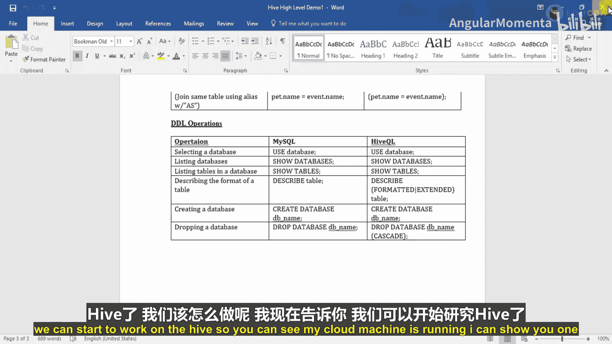
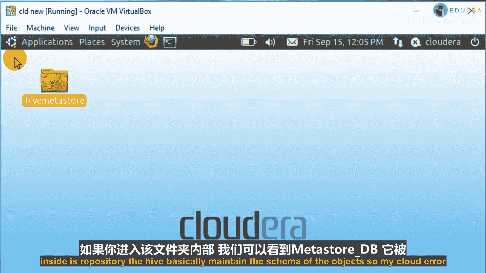

# 006：在Hive中处理JSON文件的方法流程 🗂️

在本节课中，我们将学习如何使用Hive进行数据分析，特别是如何处理JSON格式的数据。我们将了解Hive的基本概念、适用场景，并开始为后续的七个具体分析用例做准备。

## Hive概述

上一节我们介绍了MapReduce和Pig，本节中我们来看看Hive。Hive本质上是一个数据分析工具，而非数据处理工具。它最初由Facebook开发，后来成为Apache的一个顶级项目，因此被称为Apache Hive。

Facebook开发Hive的原因是，行业中有许多从业者不熟悉Java、Python、Scala等编程语言，但他们精通数据分析。这些人员通常具有数据库背景，非常熟悉数据库查询和性能优化。因此，Hive是为数据分析而生的工具，用户可以将数据加载到表中，然后根据业务逻辑生成各种报告、汇总数据或执行聚合操作。

Hive是一个数据分析工具，我们可以用它为客户或组织管理层生成报告。管理层可以查看这些报告并做出决策，以促进增长或改进组织、国家等各个层面的流程。具体分析的数据类别取决于数据本身的归属，可能是国家数据，也可能是组织数据。

在我们的案例中，我们正在分析菲律宾国家的数据。最初，我们获得原始文件后，扮演了数据科学家或数据分析师的小角色，生成了七个有用的分析场景。我们可以将这些场景的输出提供给该国，帮助他们更好地改进系统、做出决策，从而以更好的方式发展国家。

例如，我们执行了一个用例：“有多少人来自菲律宾？” 在这个用例中，我们提供了来自菲律宾的人数和外来人数的数据。如果该国获得这些数据，他们就可以对签证进行限制，因为所有国家都有配额。如果超过阈值，他们就可以限制签证，每年只允许一定数量的人入境。

我们通过MapReduce和Pig处理了数据并提供了输出。在最初的视频中，我们解释了在生产环境中它是如何工作的架构。这是我正在从事的一个实际项目的一小部分，用于演示。

如果你能回忆起我的第一个视频，我们讨论了最终报告：团队将数据上传到一个网络门户，我们下载该数据，在HDFS中处理，然后将数据加载到Hive表中。最后，客户如何能够看到所有这些分析的结果。

有多种渠道可以传递输出，例如我们可以每天将输出文件发送给客户，或者将输出文件共享在某个共享目录中，以便客户每天访问。但在这里，我们以报告的形式展示输出，即使用SQL Server Reporting Services (SSRS)。我们在办公室服务器上配置了SSRS：下载了Hive ODBC驱动程序，通过DNS域服务器安装并配置，然后在SQL Server中创建了一个链接服务器。因为SSRS可以轻松通过SQL Server连接，而SQL Server通过一个称为链接服务器的ODBC连接与Hive相连。我们在SQL Server中编写Hive查询，但这些查询在我们的Hive服务器上执行，然后数据返回到SQL Server，我们再将其展示在报告中。

采用这种方法，客户无需访问目录或查看邮件。他们可以轻松地从手机、笔记本电脑或办公室机器等任何地方登录，在我们提供的URL上查看报告。我们每天都会收到这些文件，输出每天都会变化。例如，今天该国的数据可能是60%男性和40%女性，处理完明天的数据后，计数可能会变为58%男性和52%女性。客户可以根据他们查看输出的时间和批次，在其终端执行相应的操作。

## Hive简介与工作原理

现在，从本节开始，我们将在Hive中实现那七个用例。在继续之前，我们想进一步讨论Hive。

Hive看起来像SQL（结构化查询语言），它被称为HQL（Hive查询语言）。Hive查询语言基本上是一种语言，我们可以编写与SQL类似、几乎相同的查询。Hive基本上是基于MySQL数据库的，因此大多数语法与MySQL非常相似。Hive是构建在Hadoop（即HDFS）之上的工具。

当我们将数据加载到表中时，数据不会移动到别处。数据仍然驻留在HDFS中，但是以目录的形式存在。目录名称就是我们创建的对象，例如我们创建一个名为`temp`的表，它会在Hive仓库中创建一个名为`temp`的目录，然后将我们加载到`temp`表中的数据文件存储到该目录中。它将输入文件保存在`temp`目录中，每当我们查询时，它会访问该目录、读取文件并显示数据。

在内部，它再次使用了MapReduce。但正如我们在看区别时所看到的，它同样是一种高级抽象，与Pig类似。复杂性对用户或开发者是隐藏的，因此我们可以轻松编写查询，但在内部，它执行MapReduce程序，并以表格形式向我们显示输出，就像在任何RDBMS中看到输出一样。它用于数据分析，而非数据处理。借助这个工具，我们可以通过编写智能查询，轻松根据业务需求生成报告。它非常易于使用，并且几乎基于与MySQL相同的概念。

最初由Facebook为其不熟悉Java、主要属于SQL背景的开发人员开发，后来Apache软件基金会接管并进一步将其发展为开源项目，从此被称为Apache Hive。那么，Hive之父是谁？是Facebook，但现在由Apache接管。

## 为什么需要Hive？

每个人都希望增加业务并产生更多收入。他们通过深入分析公司数据并做出重要的战略决策来实现这一目标，以促进公司增长。行业如何运作？他们启动新的流程、新的政策。他们如何做出所有这些决策，如何在公司中发起所有这些新事物？因为他们正在分析旧数据、旧记录、公司的所有数据，然后据此做出一些决策。

在Hive之前，我们是如何做的？在Hive之前，组织仍然通过使用任何RDBMS（如SQL Server、Oracle等）或任何ETL工具来运行和分析数据。ETL即提取、转换、加载。例如Informatica、SQL Server集成服务、Cognos等，市场上有许多工具。

最初，自动化使用ETL工具或任何RDBMS来处理和分析数据，但这对他们来说是一种痛苦，因为RDBMS和ETL工具只能在一定程度上轻松处理数据量。如果你们中有人在RDBMS领域工作，可以轻松理解：如果我们处理数百万条记录，没问题。但它会不断增加。我们都知道，大数据基本上取决于四个V：Volume（数据量）、Velocity（速度）。Volume指数据的当前大小，Velocity指数据持续增长的速度。

假设今天我处理100GB数据，但明天将是110GB，后天将是120GB，它会持续增加。那么有一天，这对我们来说将是一个痛苦，我们会遇到很多问题，比如性能下降、查询变慢、报告变慢等等。这就是问题所在。

早期，我们的组织使用SQL Server、Oracle或任何RDBMS或ETL工具，但这很痛苦，因为所有这些工具只能处理相对一定范围的数据量。而现在，我们的组织正在处理巨大的数据量、高速度、多样化的数据，并且这些数据日益增长。我希望你理解了。如果我们必须处理PB级或GB级的数据，那么我认为我们应该选择Hive作为最佳工具。

## Hive的特性与限制

以下是Hive的特性，但基本上这些是**我们不应使用Hive**的场景：

*   Hive不是关系型数据库，它用于数据分析。
*   如果你想在Hive中存储任何事务性数据（即数据被插入、更新，我们每天对数据执行数据操作语言DML操作），那么Hive不适合。因为我们不能在Hive中执行记录级别的更新、插入或删除操作。
*   Hive是一个大数据工具，而大数据基于“一次写入，多次读取”的范式。这不是一个哲学，而是大数据的编程范式。
*   Hive并非为实时处理数据而设计。
*   Hive不支持实时查询和行级更新。

正如我所说，我们不应在Hive中执行记录级别的更新、插入或删除。Hive是为批处理而构建的。但我从用户那里听说，在Hive的最新版本中我们可以做到这一点。不过我不确定，因为我到目前为止从未使用过。因为我们将Hive用于数据分析，而非处理。我不确定我们是否可以在Hive中执行记录级别更新。但我从一些人那里听说，在Hive的最新版本中有传言说我们可以做到，需要设置一些属性和权限。但我没有尝试过。就我所知，Hive并非用于记录级别更新。

## Hive的适用特性

基本上，我们应在以下特性场景中使用Hive：

*   它将数据以分布式方式存储在Hadoop分布式文件系统（HDFS）中，并且仅在Hive元存储中存储模式。
*   它专为OLAP（联机分析处理）而设计。
*   它提供了一种类似SQL的语言，称为HQL（Hive查询语言）。
*   它熟悉、快速、可扩展且可扩展。如果任何人曾使用过任何数据库，他们可以轻松地在Hive上工作。理解或使用它并不非常困难或复杂。

以下是一些与SQL相似的语法：

*   获取信息：`SELECT column_name FROM table`
*   所有值：使用`*`
*   某些值：需要在查询中提供列名或过滤条件。
*   多个条件：可以使用`AND`子句。
*   选择特定列：将其放入查询中。
*   唯一记录：使用`DISTINCT`。
*   排序：使用`ORDER BY`，升序或降序。
*   函数：行数`COUNT`，最大值`MAX`，最小值`MIN`等。

这些操作与MySQL相同。使用数据库：`USE database`，显示数据库：`SHOW DATABASES`，显示表：`SHOW TABLES`，描述表：`DESCRIBE table`，删除数据库：`DROP DATABASE`等等。正如我所说，Hive基本上基于MySQL，因此大多数语法与MySQL相同。

## 开始Hive实践

现在我们已经理解了什么是Hive，我认为我们已经准备好开始使用Hive了。现在，你知道，我们可以开始使用Hive了。

你可以看到我的Cloudera机器正在运行。这里你可以看到一个名为`hive-metastore`的文件夹。这是安装Hive时需要创建的文件夹。我需要将这个文件夹路径设置到`hive-site.xml`文件中。因为这将是我在创建元存储时使用的位置，它将在这里维护所有表的模式等信息。

如果我们进入里面，可以看到`metastore_db`，它是锁定的。在数据库内部，在这个存储库内部，Hive基本上维护着对象的模式。

我的Cloudera机器正在运行。我已经将这台机器连接到了我的VirtualBox。现在我们需要处理这些场景，即那七个有用的用例。

首先，我们将创建一个表。我会告诉你如何创建数据库，然后创建表。然后在该表中，我们将加载数据。然后，可能在此基础上，处理这所有七个用例。这样，在我的下一个视频中，你就可以处理这七个场景了。

这里有两个要点。我们正在处理JSON文件。有两种方法可以执行操作、处理数据：
1.  我们可以编写UDF（用户定义函数），就像我们在Pig中编写的那样。在Hive中，我们也可以编写UDF，称为Hive用户定义函数。
2.  另一种方式是，Hive提供了一些函数，我们可以直接使用这些函数来访问JSON对象。

在这里，我们将使用Hive为数据处理提供的方法和函数，而不是创建UDF（因为UDF我们已经在Pig中见过了）。首先，我创建数据库，然后创建表并加载数据，接着我们将处理那七个用例。

本节课中我们一起学习了Hive的基本概念、其在大数据生态系统中的角色（数据分析而非处理）、以及它基于“一次写入，多次读取”范式的特性。我们了解了Hive的适用场景与限制，并对比了其与传统RDBMS/ETL工具在处理海量、高速、多样化数据时的优势。最后，我们为下一节的实际操作做好了准备，明确了将通过Hive内置函数（而非UDF）来处理JSON数据，并完成七个分析用例。