# 007：基于Hive的JSON用例实践 📊

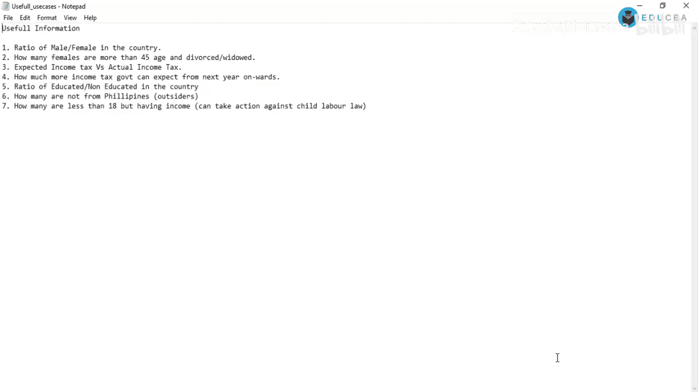

在本节课中，我们将学习如何在Hive中处理JSON格式的数据。我们将通过一系列实际用例，演示如何使用Hive的内置函数来解析JSON数据、执行查询并提取有价值的信息。课程内容将涵盖从创建数据库、加载数据到执行复杂分析查询的完整流程。

## 概述

我们将使用一个包含人口统计信息的JSON文件作为示例数据。目标是利用Hive的`get_json_object`函数，从JSON字符串中提取特定字段，并执行数据分析，例如计算性别比例、筛选特定年龄段的人群等。

## 环境准备与数据加载

首先，我们需要启动Hive并准备好数据环境。确保Hadoop集群运行正常，并且数据文件已上传到HDFS的指定目录。

上一节我们介绍了课程目标，本节中我们来看看如何准备环境和加载数据。

### 启动Hive并创建数据库

启动Hive后，我们首先创建一个新的数据库来存放我们的数据表。

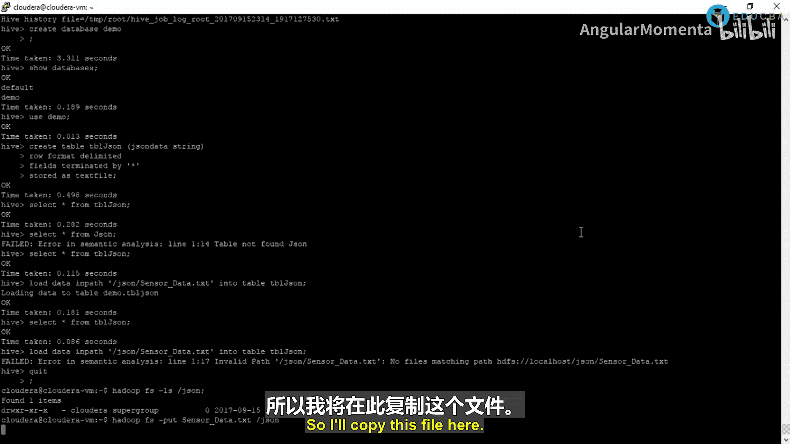

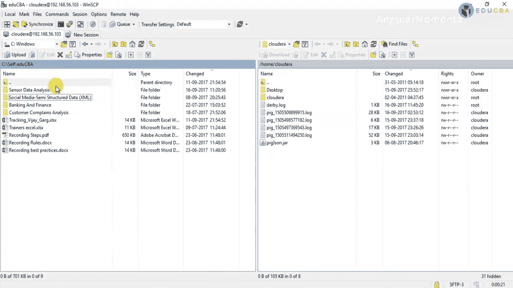

```sql
CREATE DATABASE demo;
```

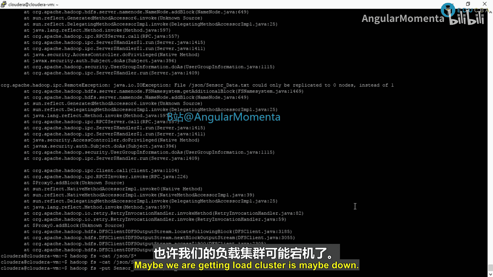

创建完成后，切换到新创建的数据库。

```sql
USE demo;
```


### 创建表结构

为了加载JSON数据，我们需要创建一个表。由于我们将整个JSON对象作为一个字符串字段加载，因此表结构非常简单。

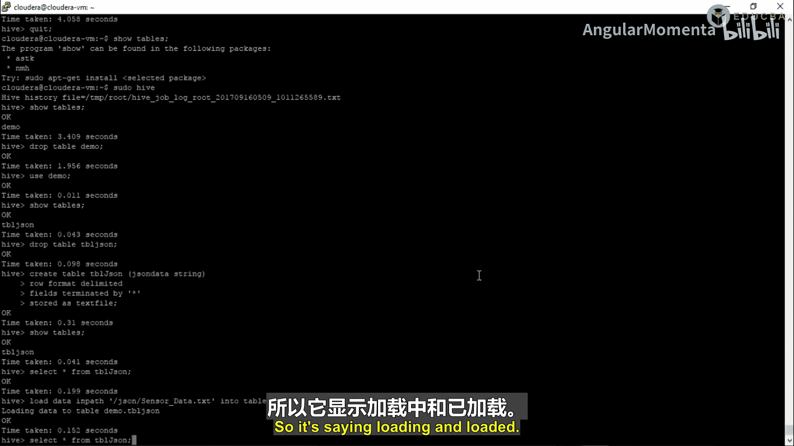

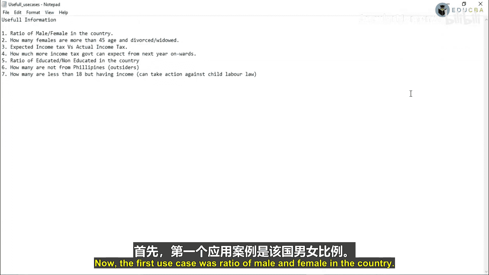

```sql
CREATE TABLE json_data (
    jdata STRING
)
ROW FORMAT DELIMITED
FIELDS TERMINATED BY ‘*‘
STORED AS TEXTFILE;
```

这里，`FIELDS TERMINATED BY ‘*‘` 指定了字段分隔符。我们使用一个在数据中不存在的字符（如星号），以确保整行JSON数据被加载到单个字符串列`jdata`中。

### 加载数据到表中

数据文件`Sensor_data.txt`已上传至HDFS路径`/user/cloudera/input/`。现在，我们将数据加载到刚创建的表中。

```sql
LOAD DATA INPATH ‘/user/cloudera/input/Sensor_data.txt‘ INTO TABLE json_data;
```

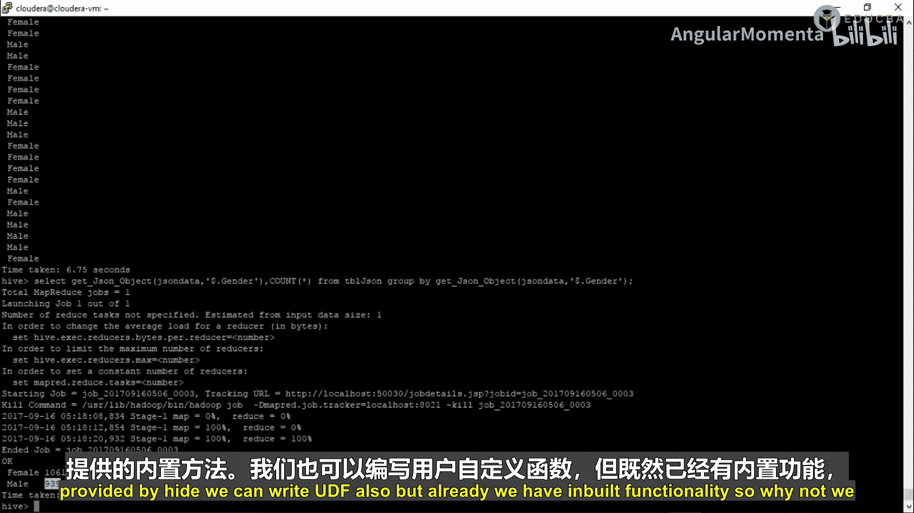

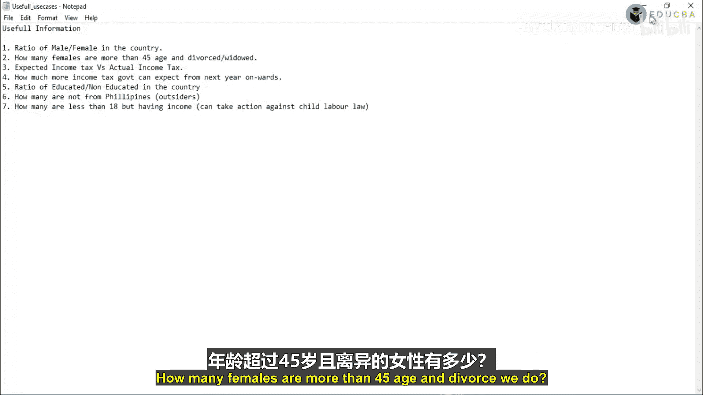

加载完成后，可以执行一个简单的查询来验证数据是否已成功加载。

```sql
SELECT * FROM json_data LIMIT 1;
```

## 使用Hive解析JSON数据

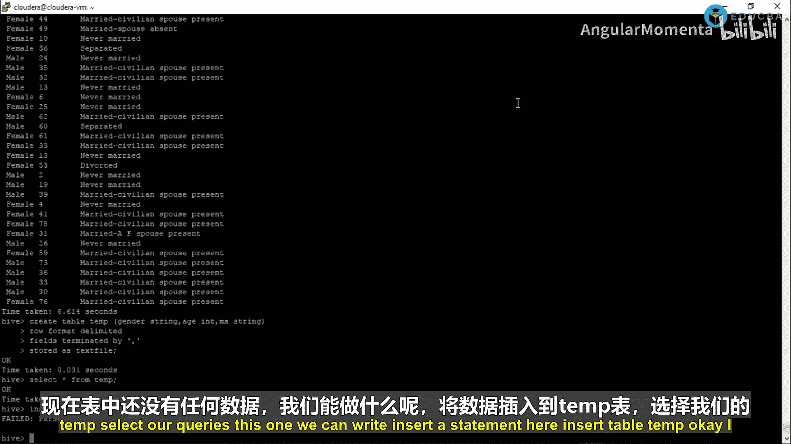

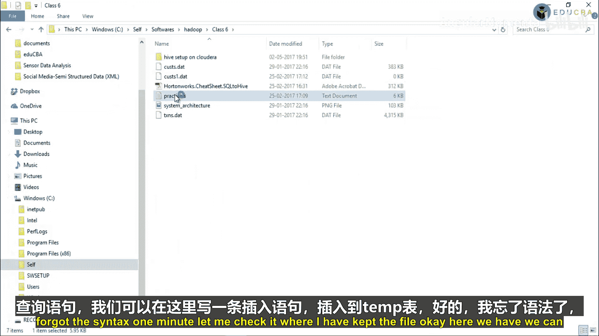

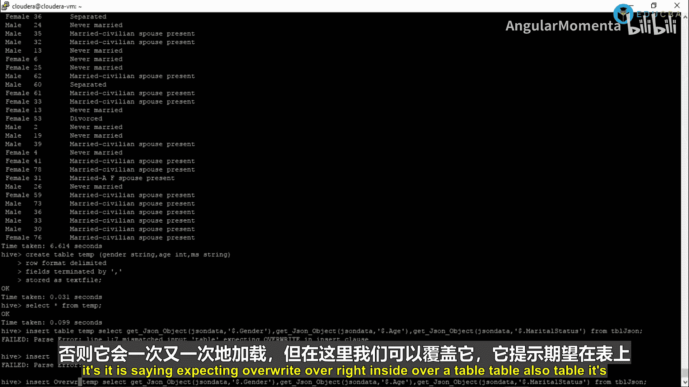

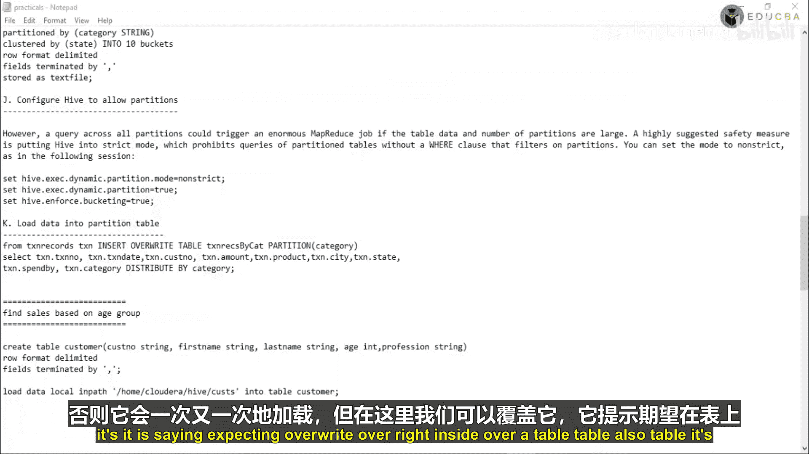

Hive提供了`get_json_object`函数，用于从JSON字符串中提取指定键的值。其基本语法如下：

```
get_json_object(json_string, ‘$.key‘)
```

*   `json_string`：包含JSON数据的字符串列。
*   `‘$.key‘`：需要提取的JSON键的路径，注意键名需与数据中的大小写保持一致。

### 用例一：计算男女人数比例 👥

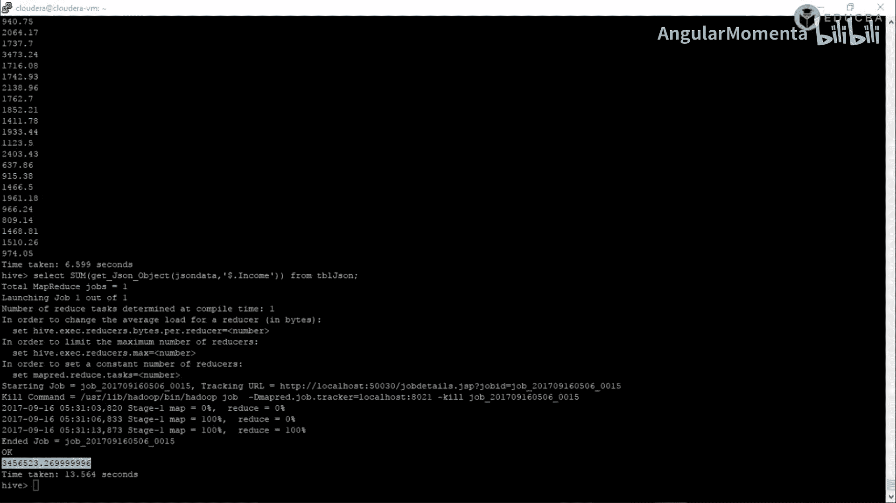

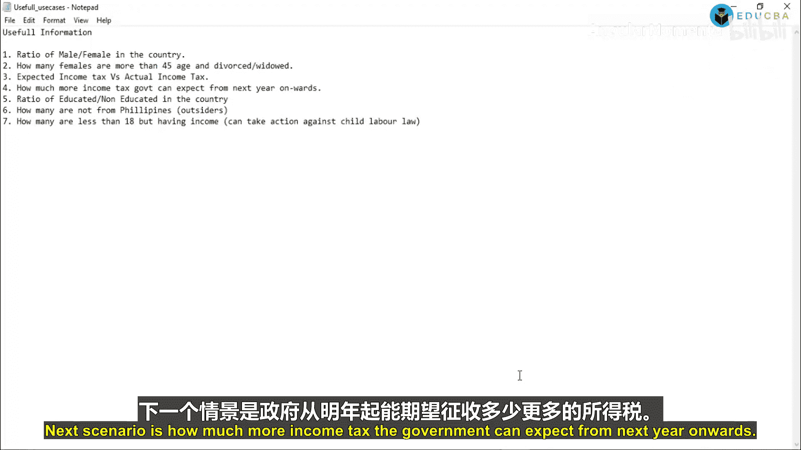

第一个用例是计算数据集中男性和女性的数量比例。

以下是执行此分析的步骤：

1.  使用`get_json_object`函数从`jdata`列中提取`gender`字段。
2.  使用`GROUP BY`对性别进行分组。
3.  使用`COUNT`函数统计每组的人数。

```sql
SELECT
    get_json_object(jdata, ‘$.gender‘) AS gender,
    COUNT(*) AS count
FROM json_data
GROUP BY get_json_object(jdata, ‘$.gender‘);
```

执行该查询后，我们将得到男性和女性各自的数量。

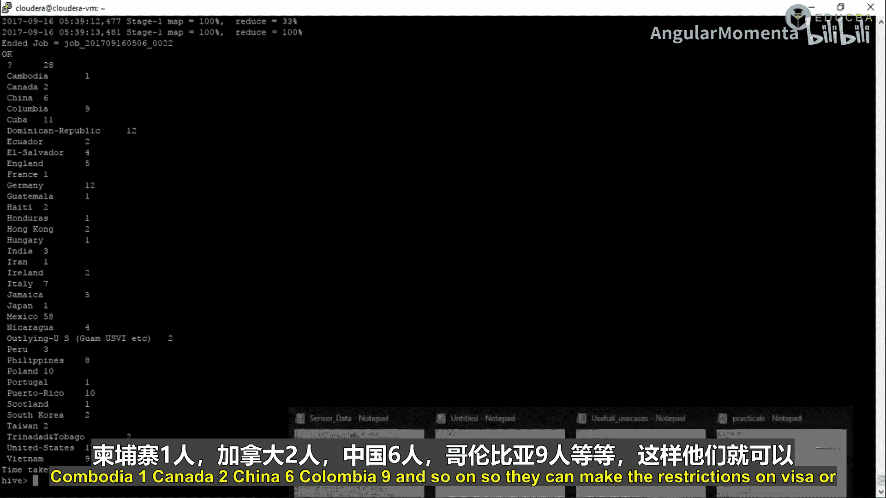

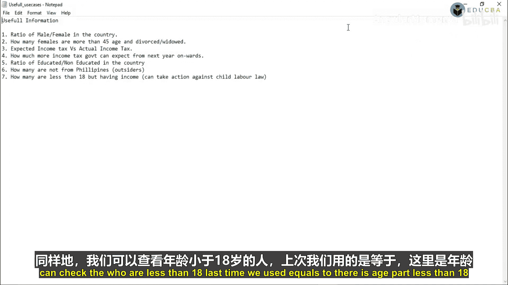

### 用例二：筛选年龄大于45岁且婚姻状况为离婚的女性 👩

第二个用例是找出所有年龄大于45岁且婚姻状况为“离婚”的女性记录。

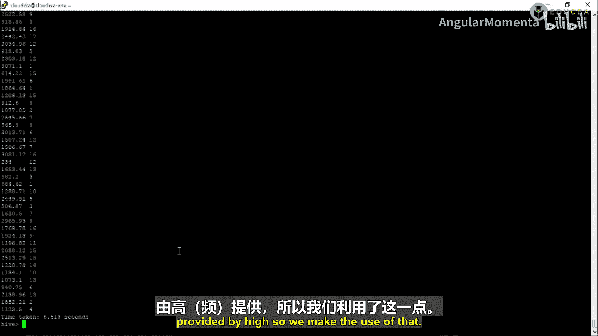

以下是执行此分析的步骤：

1.  从`jdata`列中提取`gender`、`age`和`marital_status`字段。
2.  在`WHERE`子句中设置过滤条件：性别为女性、年龄大于45、婚姻状况为离婚。

```sql
SELECT
    get_json_object(jdata, ‘$.gender‘) AS gender,
    get_json_object(jdata, ‘$.age‘) AS age,
    get_json_object(jdata, ‘$.marital_status‘) AS marital_status
FROM json_data
WHERE get_json_object(jdata, ‘$.gender‘) = ‘Female‘
  AND CAST(get_json_object(jdata, ‘$.age‘) AS INT) > 45
  AND get_json_object(jdata, ‘$.marital_status‘) = ‘Divorced‘;
```

**注意**：由于提取的年龄是字符串，在比较前需要使用`CAST`函数将其转换为整数类型。

### 其他用例示例

我们可以使用相同的模式处理更多分析需求。

以下是其他几个用例的查询示例：

*   **计算总收入**：对所有人的`income`字段进行求和。
    ```sql
    SELECT SUM(CAST(get_json_object(jdata, ‘$.income‘) AS DOUBLE)) AS total_income FROM json_data;
    ```

*   **统计各教育水平人数**：按`education`字段分组并计数。
    ```sql
    SELECT get_json_object(jdata, ‘$.education‘) AS education, COUNT(*) AS count FROM json_data GROUP BY get_json_object(jdata, ‘$.education‘);
    ```

*   **统计非菲律宾籍人数**：筛选`country_of_birth`不等于‘Philippines‘的记录并计数。
    ```sql
    SELECT COUNT(*) AS non_philippines_count FROM json_data WHERE get_json_object(jdata, ‘$.country_of_birth‘) != ‘Philippines‘;
    ```

*   **查找有收入的未成年人**：找出年龄小于18岁但收入大于0的记录。
    ```sql
    SELECT COUNT(*) AS underage_with_income FROM json_data WHERE CAST(get_json_object(jdata, ‘$.age‘) AS INT) < 18 AND CAST(get_json_object(jdata, ‘$.income‘) AS DOUBLE) > 0;
    ```

## 总结

本节课中我们一起学习了在Hive中处理JSON数据的完整流程。

我们首先创建了数据库和表，然后将JSON数据加载到Hive表中。核心部分是使用Hive内置的`get_json_object`函数来解析JSON字符串，提取出所需的字段值。通过多个实际用例，我们演示了如何利用这个函数进行数据筛选、分组聚合和统计分析，从而从原始的JSON数据中提取出有意义的业务洞察。

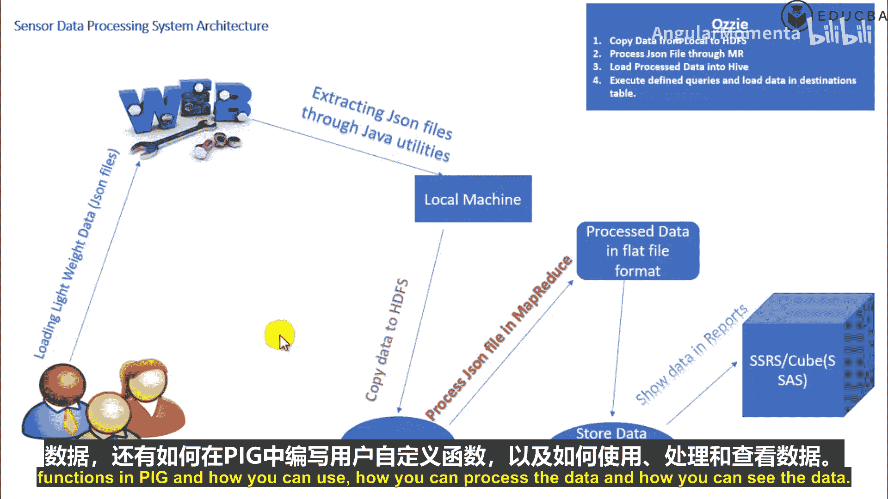

Hive的这种方法使得处理半结构化数据变得相对简单，无需编写复杂的MapReduce程序或UDF即可完成常见的数据查询任务。