# 001：Hive简介 🐝

在本节课中，我们将要学习Apache Hive的基础知识。我们将探讨Hive是什么、它的特性、架构、工作原理、支持的数据类型以及其数据模型。通过本教程，你将能够理解Hive如何作为Hadoop之上的数据仓库工具，用于数据汇总、查询和分析。

---

## 什么是Hive？🤔

Hive是一个构建在Hadoop之上的数据仓库工具，用于提供数据汇总、查询和分析功能。在Hive中，我们可以存储数据，对数据进行汇总，然后通过查询获取所需数据并进行分析。

Hive的特性包括：
*   Hive始于2007年的Facebook。
*   Apache Hive支持对存储在Hadoop HDFS和HBase中的大型数据集进行分析。
*   它专为OLAP（在线分析处理）设计，使用户能够轻松地从不同角度提取和查看数据。
*   在Hive中，我们可以从不同来源提取数据，并将其存储在HDFS和HBase中。
*   为了分析数据，Hive提供了一种类似SQL的语言，称为HiveQL。它采用“读时模式”，并将查询透明地转换为MapReduce作业，在Hadoop集群上执行。
*   Hive能够为各种数据格式带来结构，支持文本、序列、ORC、RC文件和Apache Parquet等格式。
*   默认情况下，Hive将元数据存储在嵌入式Apache Derby数据库中，也可以替换为其他客户端-服务器数据库，如MySQL。
*   Hive不提供低延迟或实时查询。即使查询少量数据也可能需要几分钟时间。查询大量数据时，运行查询所需的时间相对较少。
*   为了支持模式和分区等功能，Hive将其元数据存储在关系数据库中。Hive打包了Derby（一个轻量级嵌入式SQL数据库），元存储可以轻松切换到其他SQL安装，如MySQL。

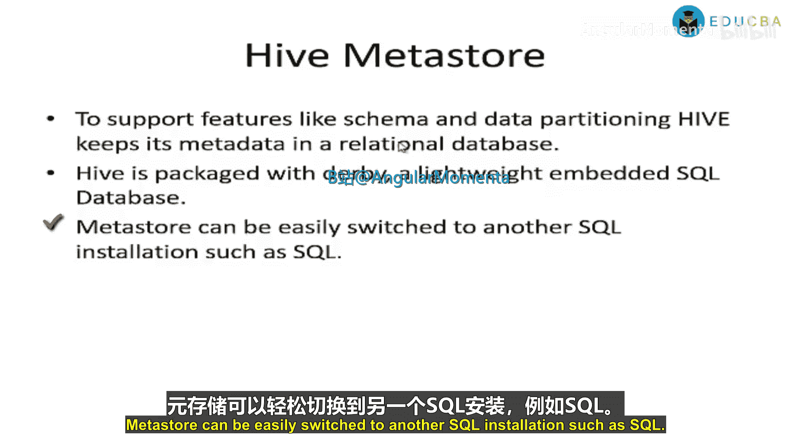

---

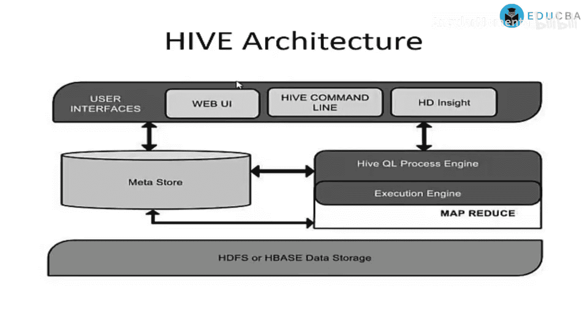

## Hive架构 🏗️

上一节我们介绍了Hive的基本概念，本节中我们来看看Hive的架构。Hive架构的组件包括用户界面、元存储、HiveQL处理引擎、执行引擎以及HDFS或HBase数据存储。

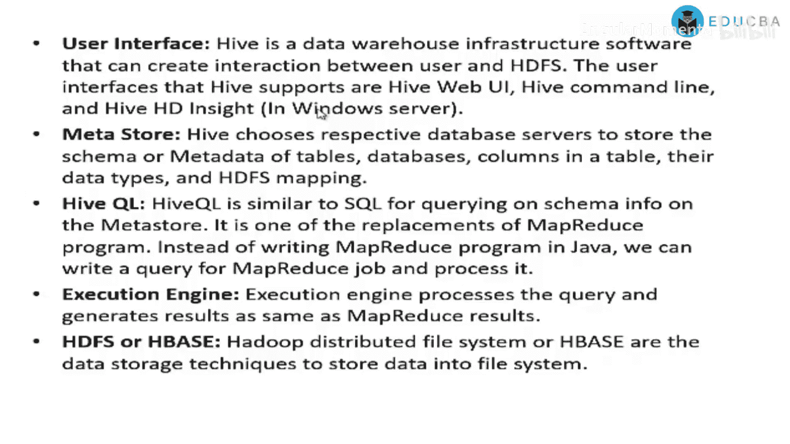

以下是Hive架构的组件：
*   **用户界面**：Hive是一个数据仓库基础设施软件，可以在用户和HDFS之间创建交互。Hive支持的用户界面包括Web UI、Hive命令行和Hive HDInsight。在这些界面上，我们可以编写查询，这些查询将在后端与Hadoop集群交互。
*   **元存储**：Hive选择相应的数据库服务器来存储模式或元数据表、数据库、表中的列、它们的数据类型以及HDFS映射。元存储存储表、数据库等的元数据，还包括桶和分区信息。
*   **HiveQL处理引擎**：HiveQL类似于SQL，用于查询元数据上的模式信息。它是MapReduce程序的替代方案之一，我们可以用HiveQL编写查询来处理MapReduce作业，而无需用Java编写冗长的MapReduce程序。
*   **执行引擎**：执行引擎处理查询并生成与MapReduce相同的结果。
*   **HDFS或HBase**：HDFS是Hadoop分布式文件系统，可以将数据存储到Hadoop系统中。

---

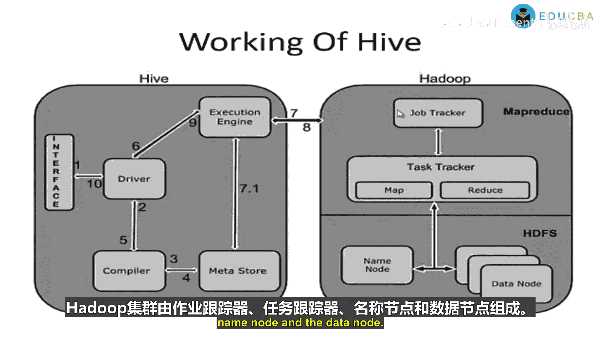

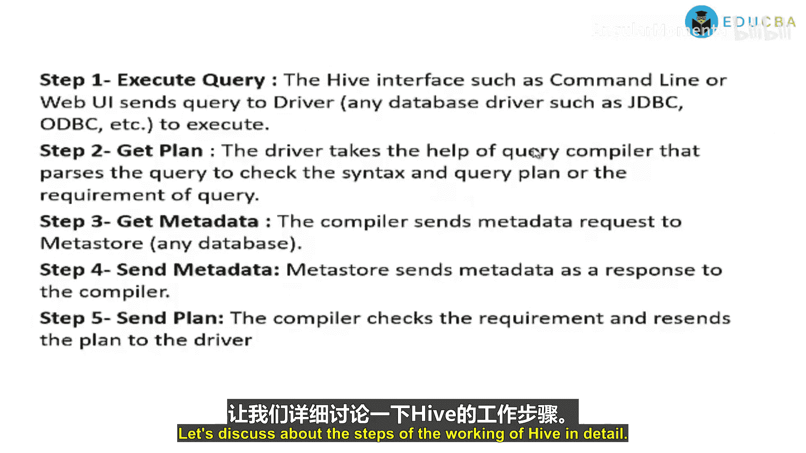

## Hive工作原理 ⚙️

了解了Hive的架构后，我们来看看它是如何工作的。Hive的组件包括接口驱动程序、执行引擎、编译器、元存储，以及后端的Hadoop集群（包括作业跟踪器、任务跟踪器、名称节点和数据节点）。

以下是Hive工作的详细步骤：
1.  **提交查询**：Hive接口（如命令行或Web UI）将查询发送给驱动程序执行。
2.  **语法检查**：驱动程序借助查询编译器来检查查询的语法和查询计划或需求。
3.  **请求元数据**：编译器向元存储发送元数据请求。
4.  **获取元数据**：元存储将元数据作为响应发送给编译器。
5.  **返回计划**：编译器检查需求后，将计划重新发送给驱动程序。
6.  **执行计划**：驱动程序将执行计划发送给执行引擎。
7.  **执行作业**：执行引擎将作业发送给作业跟踪器（名称节点），作业跟踪器将此作业分配给任务跟踪器（数据节点）。查询在此执行MapReduce作业。在执行期间，执行引擎可以与元存储执行元数据操作。
8.  **接收结果**：执行引擎从数据节点接收结果。
9.  **返回结果**：执行引擎将这些结果发送给驱动程序。
10. **显示结果**：驱动程序将结果发送到Hive界面。

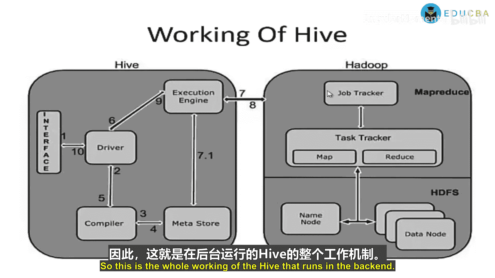

这就是Hive在后端运行的整个工作流程。

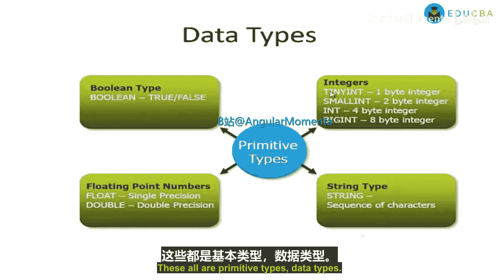

---

## Hive数据类型 📊

上一节我们介绍了Hive的工作原理，本节中我们来看看Hive支持的数据类型。Hive的数据类型包括布尔型、整数型、字符串型和浮点型等基本类型。

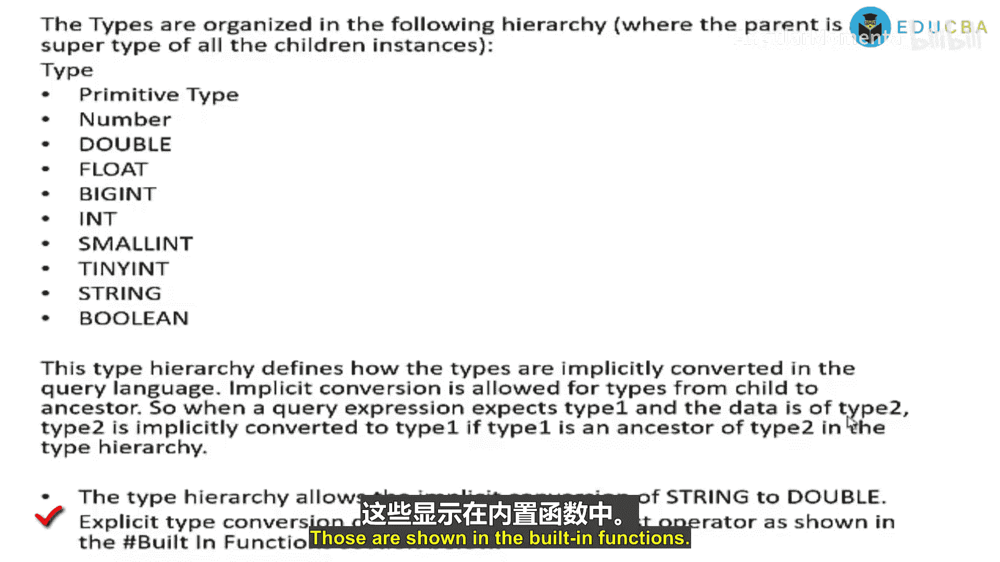

以下是Hive支持的基本数据类型，这些类型与表中的列相关联：
*   **整数类型**：
    *   `TINYINT`：1字节整数。
    *   `SMALLINT`：2字节整数。
    *   `INT`：4字节整数。
    *   `BIGINT`：8字节整数。
*   **布尔类型**：`BOOLEAN`，包含`TRUE`或`FALSE`。
*   **浮点类型**：
    *   `FLOAT`：单精度浮点数。
    *   `DOUBLE`：双精度浮点数。
*   **字符串类型**：`STRING`，指定字符集中的字符序列。

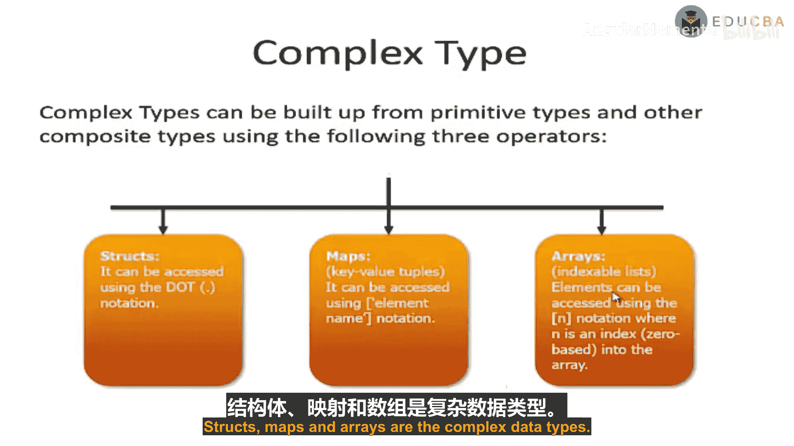

这些类型在类型层次结构中组织，层次结构为：`DOUBLE` > `FLOAT` > `BIGINT` > `INT` > `SMALLINT` > `TINYINT` > `STRING` > `BOOLEAN`。

这个类型层次结构定义了类型在查询语言中如何隐式转换。允许从子类型到祖先类型的隐式转换。因此，当查询表达式期望类型1而数据是类型2时，只有当类型1是类型2在类型层次结构中的祖先时，类型2才能隐式转换为类型1。例如，类型层次结构允许字符串隐式转换为双精度浮点数。也可以使用`CAST`操作符进行显式类型转换。

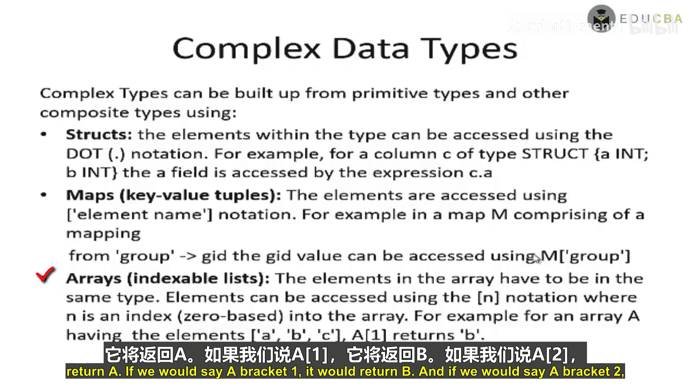

---

## Hive复杂数据类型 🧩

除了基本数据类型，Hive还支持复杂数据类型。复杂数据类型可以使用以下三种运算符从基本数据类型和其他复合类型构建。

以下是Hive支持的复杂数据类型：
*   **结构体**：`STRUCT`数据类型。结构体中的每个元素可以使用点符号访问。例如，对于一个类型为`STRUCT {a INT, b INT}`的列`c`，字段`a`可以通过表达式`c.a`访问。
*   **映射**：`MAP`包含键值对。元素使用元素名称和`[‘key’]`符号访问。例如，在一个包含从`‘group’`到`gid`映射的映射`m`中，`gid`值可以通过`m[‘group’]`访问。
*   **数组**：`ARRAY`是可索引的列表。数组中的元素必须是相同类型。元素可以使用`[n]`符号访问，其中`n`是基于0的索引。例如，我们有一个数组`a`，元素为`[‘a’, ‘b’, ‘c’]`。那么`a[0]`将返回`‘a’`，`a[1]`返回`‘b’`，`a[2]`返回`‘c’`。

---

## Hive数据模型 🗃️

最后，我们来了解Hive的数据模型。Hive数据模型包括数据库、表、分区和桶。

以下是Hive数据模型的组成部分：
*   **数据库**：数据库是命名空间，用于分隔表和其他数据单元，避免命名冲突。我们可以创建自己的数据库，并在这些特定数据库中创建表。
*   **表**：表是具有相同模式的同质数据单元。例如，一个页面浏览表，其中每行可以包含以下列：`timestamp`（`INT`类型）、`userid`（`BIGINT`类型）、`page_url`（`STRING`类型）、`referral_url`（`STRING`类型）和`ip`（`STRING`类型）。我们可以根据需求创建任何表，并指定相应的数据类型。
*   **分区**：每个表可以有一个或多个分区键，用于确定数据的存储方式。分区除了是存储单元外，还允许用户高效识别满足特定条件的行。例如，一个类型为`STRING`的日期分区和一个类型为`STRING`的国家分区。分区键的每个唯一值定义表的一个分区。例如，我们可以基于日期和国家创建分区。如果我们总是只分析美国在2009年12月23日的数据，那么查询或分析将仅在该特定分区上运行，而不会处理整个表的数据，从而减少分析数据的时间，提高查询效率。**注意**：分区列是虚拟列，它们不是数据本身的一部分，而是在加载时派生的。
*   **桶**：桶也称为簇。每个分区中的数据可以根据表中某列的哈希函数值再次划分为桶。例如，页面浏览表可以按`userid`（页面浏览表中除分区列之外的列之一）进行分桶。桶也可以用于高效地对数据进行采样。表不一定需要分区或分桶，但这些抽象允许系统在查询处理期间修剪大量数据，从而加快查询执行速度。因此，创建分区和桶有助于Hive查询的性能调优。原本需要在整个表中搜索数据的查询，现在通过搜索特定分区和桶中的数据，将花费更少的时间。

---

## 总结 📝

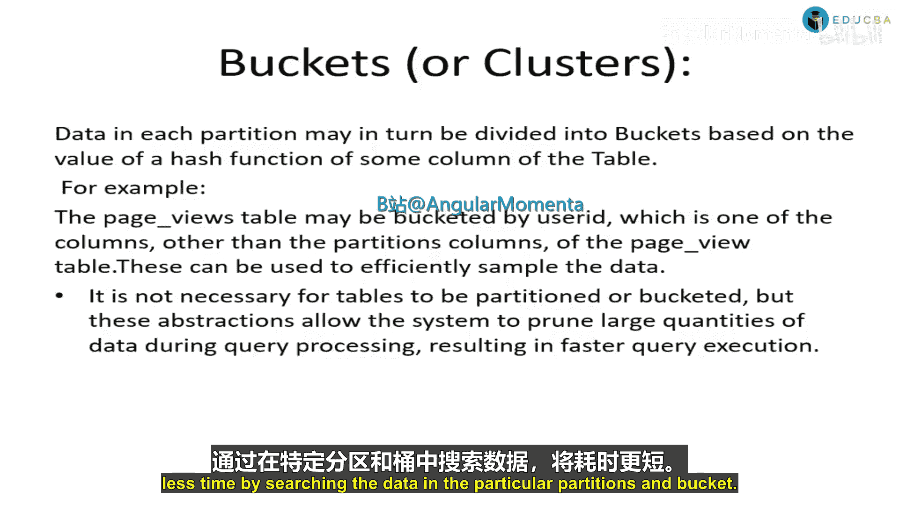

本节课中我们一起学习了Apache Hive的基础知识。我们了解了Hive是一个构建在Hadoop之上的数据仓库工具，用于数据汇总、查询和分析。我们探讨了Hive的架构、工作原理、支持的数据类型（包括基本类型和复杂类型）以及其数据模型（包括数据库、表、分区和桶）。理解这些核心概念是使用Hive进行大数据分析的第一步。