# 002：Hive中的数据库与表命令 🗄️

在本节课中，我们将学习如何在Hive中操作数据库和表。主要内容包括数据库命令和表命令。数据库命令用于创建、查看、描述、修改和删除数据库。表命令则用于创建、查看、描述、修改和删除表。我们还将学习管理表和外部表的区别。

## 数据库命令

首先，我们来学习数据库相关的命令。这些命令允许我们创建、查看和管理Hive中的数据库。

### 创建数据库

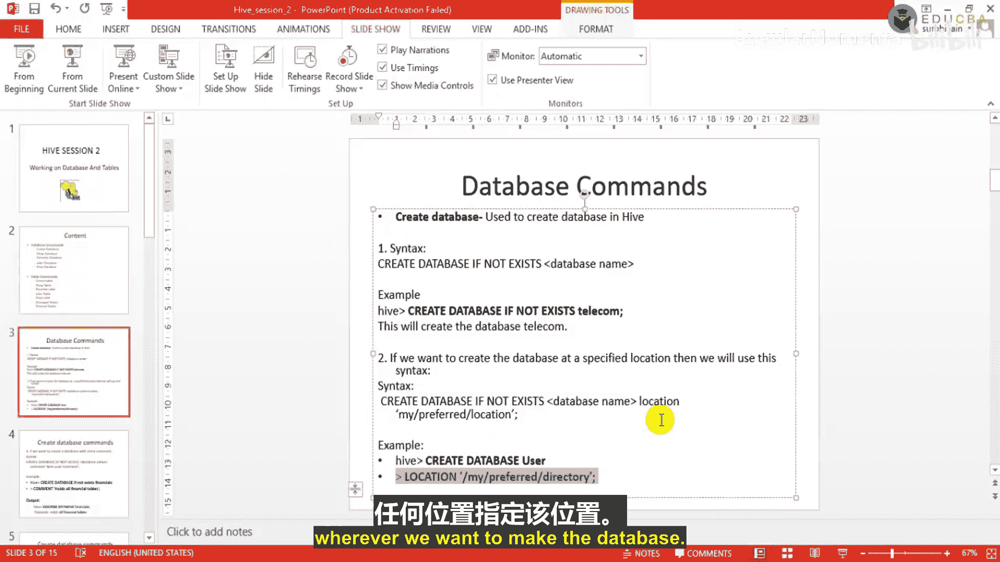

创建数据库的命令是 `CREATE DATABASE`。其基本语法如下：

```sql
CREATE DATABASE [IF NOT EXISTS] database_name
[COMMENT 'database_comment']
[LOCATION 'hdfs_path']
[WITH DBPROPERTIES ('property_name'='property_value', ...)];
```

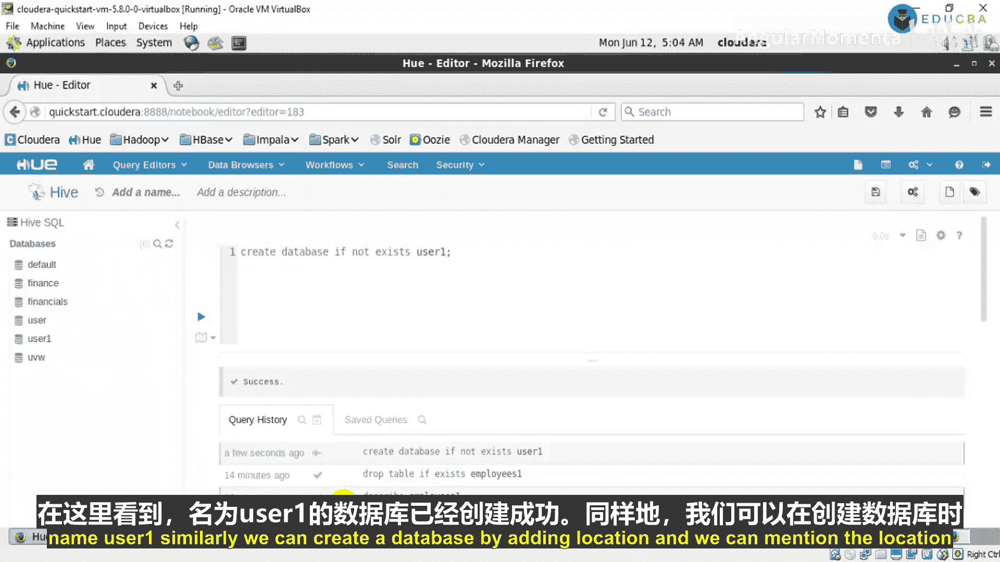

*   **`IF NOT EXISTS`**：这是一个可选关键字。如果指定，当存在同名数据库时，Hive不会报错，也不会创建新数据库。如果不存在同名数据库，则会创建它。
*   **`LOCATION`**：这是一个可选关键字。用于指定数据库在HDFS上的存储路径。如果不指定，Hive会使用默认的仓库目录。
*   **`COMMENT`** 和 **`WITH DBPROPERTIES`**：用于为数据库添加注释和自定义属性。

例如，创建一个名为 `user1` 的数据库：
```sql
CREATE DATABASE user1;
```

创建一个带有注释和自定义属性的数据库 `user2`：
```sql
CREATE DATABASE IF NOT EXISTS user2
COMMENT ‘这是一个测试数据库’
WITH DBPROPERTIES (‘creator’=‘admin’, ‘date’=‘2023-10-27’);
```

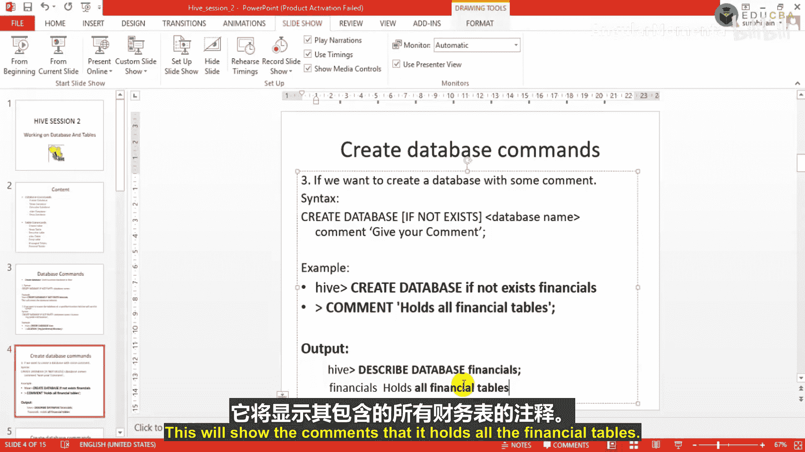

### 查看数据库

创建数据库后，我们可以使用 `SHOW DATABASES` 命令来查看所有数据库。

```sql
SHOW DATABASES;
```

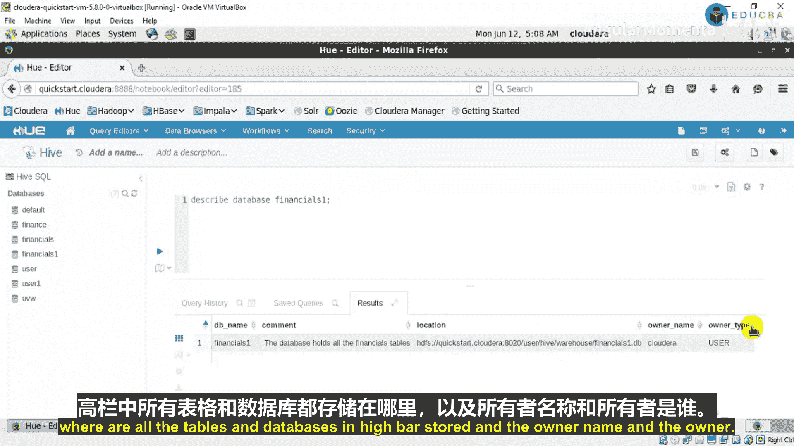

如果想查看名称符合特定模式的数据库（例如，所有以 `‘user’` 开头的数据库），可以使用 `LIKE` 关键字：

```sql
SHOW DATABASES LIKE ‘user*’;
```

### 描述数据库

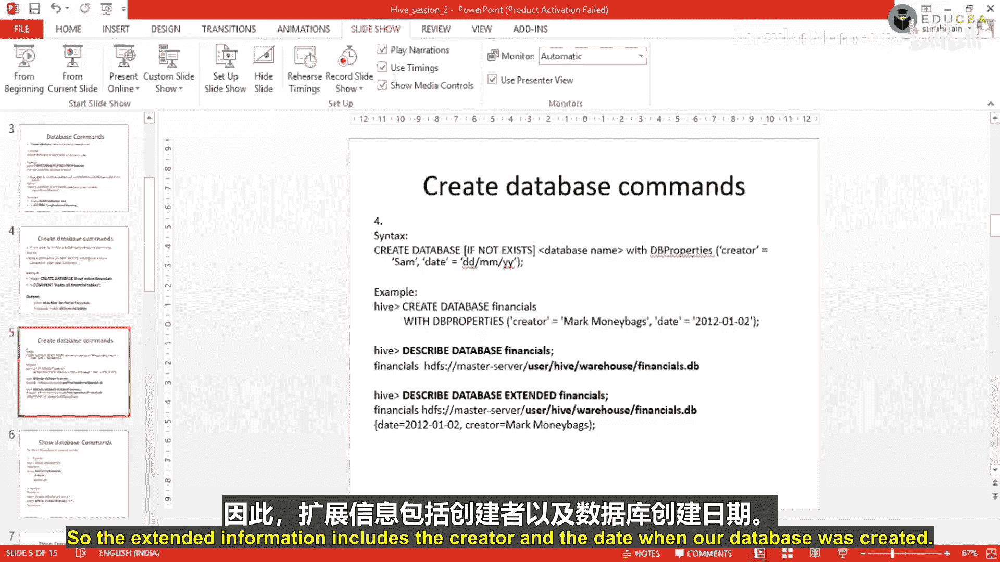

要查看某个数据库的详细信息，如位置、所有者、注释和属性，可以使用 `DESCRIBE DATABASE` 命令。

```sql
DESCRIBE DATABASE database_name;
```

例如，查看数据库 `user2` 的信息：
```sql
DESCRIBE DATABASE user2;
```

如果想查看更详细的信息，包括通过 `WITH DBPROPERTIES` 设置的属性，可以使用 `DESCRIBE DATABASE EXTENDED` 命令。

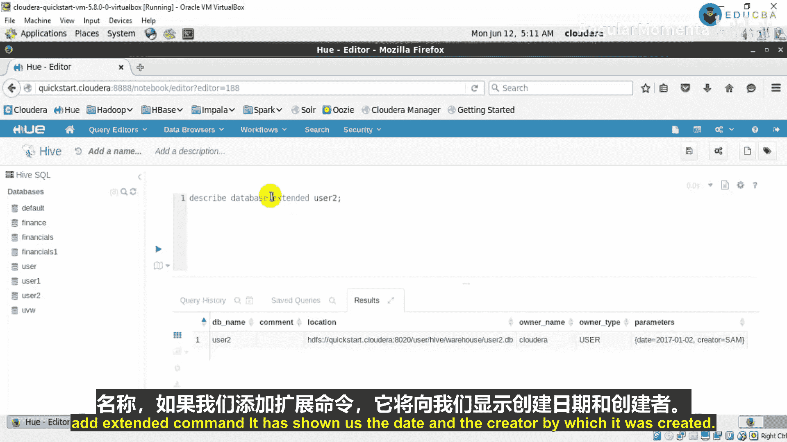

```sql
DESCRIBE DATABASE EXTENDED user2;
```

### 修改数据库

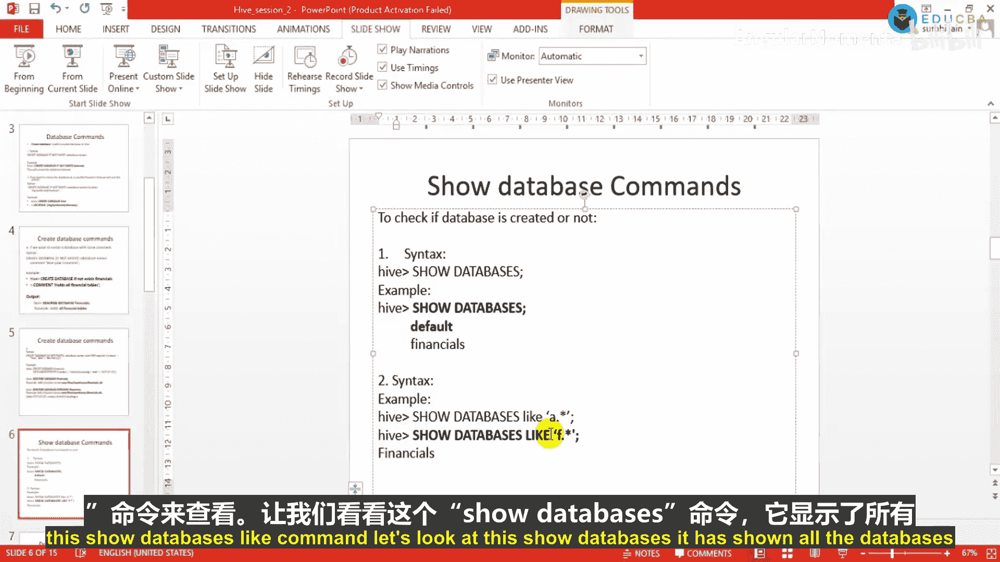

`ALTER DATABASE` 命令用于修改数据库的属性。需要注意的是，Hive目前只允许修改 `DBPROPERTIES` 中的值，不能删除或重设所有属性，也不能修改数据库名或位置。

```sql
ALTER DATABASE database_name SET DBPROPERTIES (‘property_name’=‘property_value’);
```

例如，为数据库 `user1` 添加一个 `‘edited_by’` 属性：
```sql
ALTER DATABASE user1 SET DBPROPERTIES (‘edited_by’=‘robot’);
```

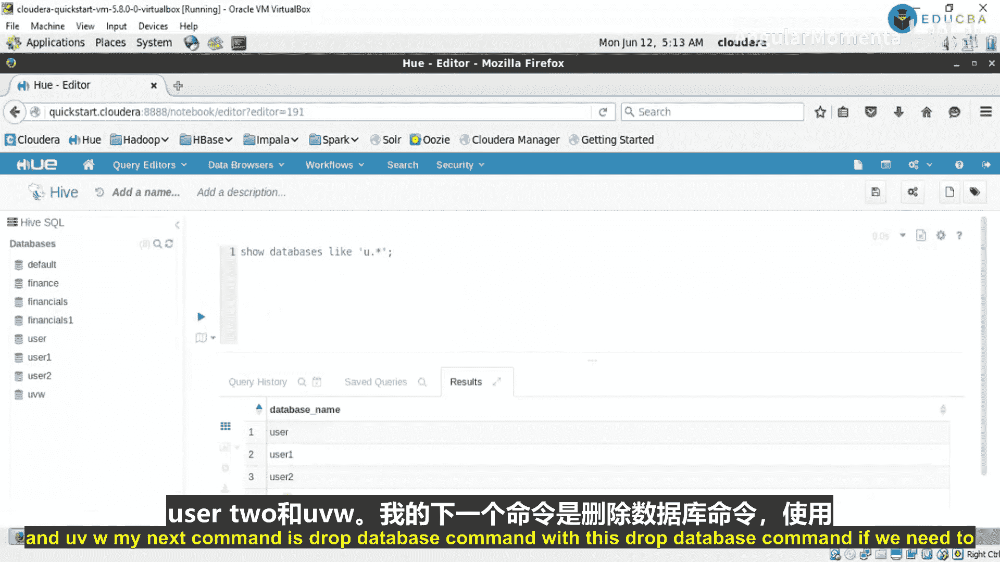

### 删除数据库

删除数据库使用 `DROP DATABASE` 命令。

```sql
DROP DATABASE [IF EXISTS] database_name [RESTRICT | CASCADE];
```

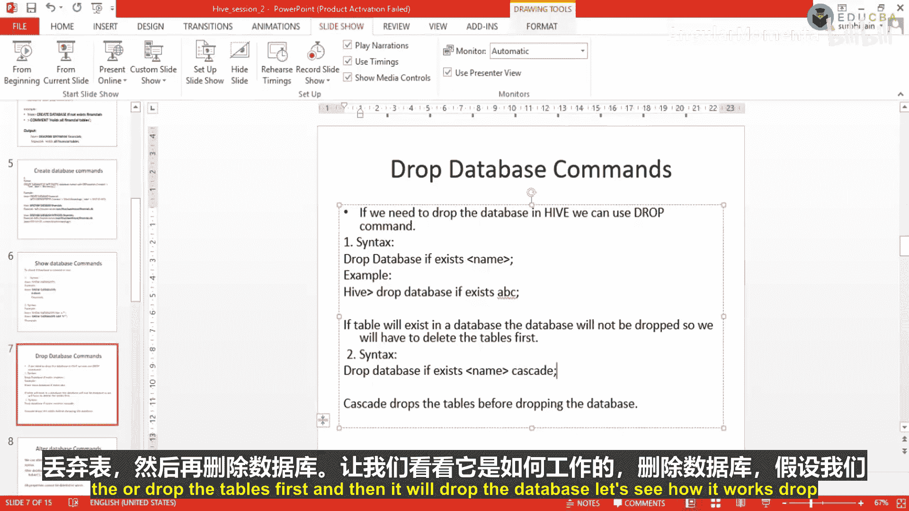

*   **`IF EXISTS`**：可选。防止删除不存在的数据库时报错。
*   **`CASCADE`**：**非常重要**。默认行为是 `RESTRICT`。如果数据库不为空（包含表），直接使用 `DROP DATABASE` 会失败。必须加上 `CASCADE` 关键字，Hive才会先删除库中的所有表，然后再删除数据库本身。

例如，删除一个空数据库 `user1`：
```sql
DROP DATABASE IF EXISTS user1;
```

删除一个非空数据库 `user_db`：
```sql
DROP DATABASE user_db CASCADE;
```

---

上一节我们详细介绍了Hive中数据库的各类操作命令。接下来，我们将目光转向表，学习如何在数据库中创建和管理表。

## 表命令

在Hive中，表是存储数据的主要结构。我们可以创建结构复杂的表来适应不同的数据模型。

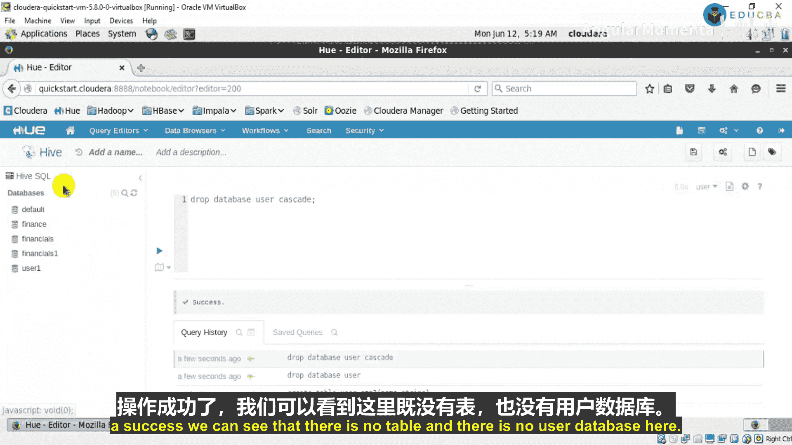

### 创建表

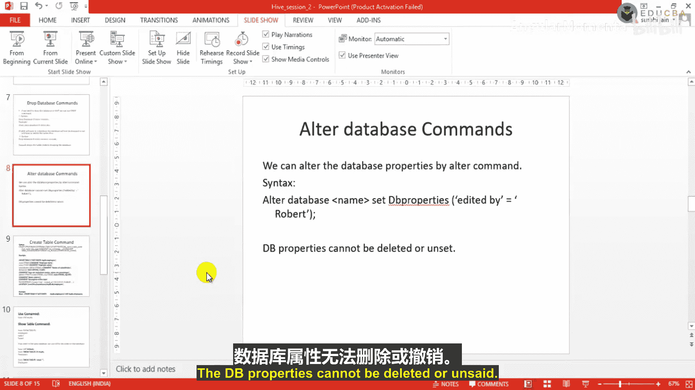

创建表的命令是 `CREATE TABLE`，其语法比创建数据库更为丰富，允许定义列、数据类型、注释、表属性及存储位置。

```sql
CREATE [EXTERNAL] TABLE [IF NOT EXISTS] [db_name.]table_name
(
  col_name data_type [COMMENT col_comment],
  col_name data_type [COMMENT col_comment],
  ...
)
[COMMENT table_comment]
[ROW FORMAT row_format]
[STORED AS file_format]
[LOCATION ‘hdfs_path’]
[TBLPROPERTIES (‘property_name’=‘property_value’, ...)];
```

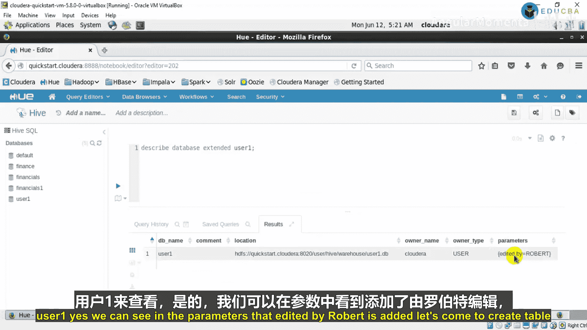

Hive支持复杂的数据类型，例如：
*   **`ARRAY<data_type>`**：数组。
*   **`MAP<primitive_type, data_type>`**：键值对映射。
*   **`STRUCT<col_name : data_type, ...>`**：结构体，可以包含多个字段。

让我们看一个创建员工表的例子，它使用了多种数据类型：

```sql
CREATE TABLE IF NOT EXISTS financials.employee (
  name STRING COMMENT ‘员工姓名’,
  salary FLOAT COMMENT ‘薪水’,
  subordinates ARRAY<STRING> COMMENT ‘下属名单’,
  deductions MAP<STRING, FLOAT> COMMENT ‘扣款项（名称，百分比）’,
  address STRUCT<street:STRING, city:STRING, state:STRING, zip:INT> COMMENT ‘家庭住址’
)
COMMENT ‘员工信息表’
TBLPROPERTIES (‘creator’=‘admin’, ‘created_date’=‘2023-10-27’);
```

此外，还可以基于现有表的结构创建一个新表（只复制结构，不复制数据）：

```sql
CREATE TABLE new_table_name LIKE existing_table_name;
```

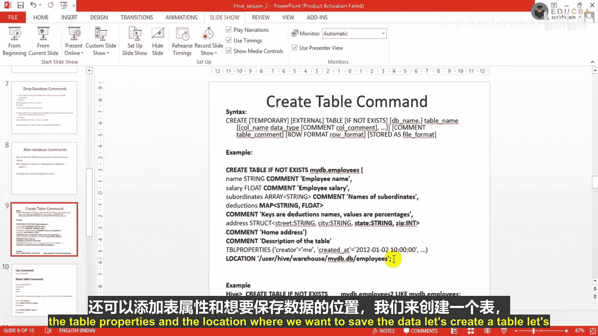

### 查看表

在某个数据库内，可以使用 `SHOW TABLES` 查看所有表。

```sql
USE database_name; -- 切换到目标数据库
SHOW TABLES;
```

或者直接指定数据库查看：
```sql
SHOW TABLES IN financials;
```

同样，可以使用 `LIKE` 进行模式过滤：
```sql
SHOW TABLES LIKE ‘emp*’;
```

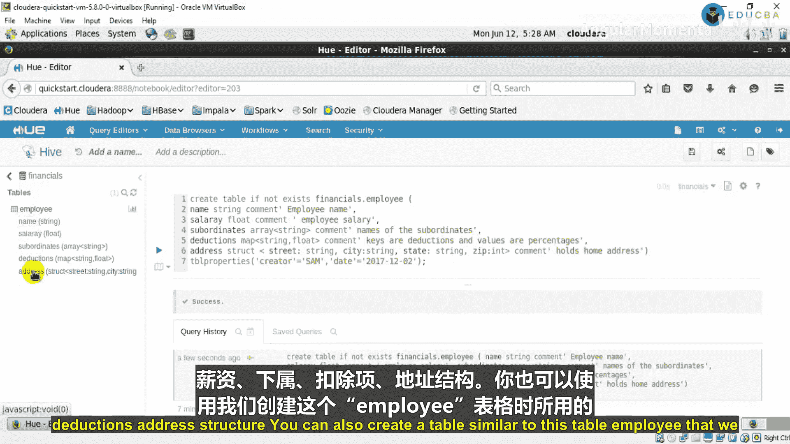

### 描述表

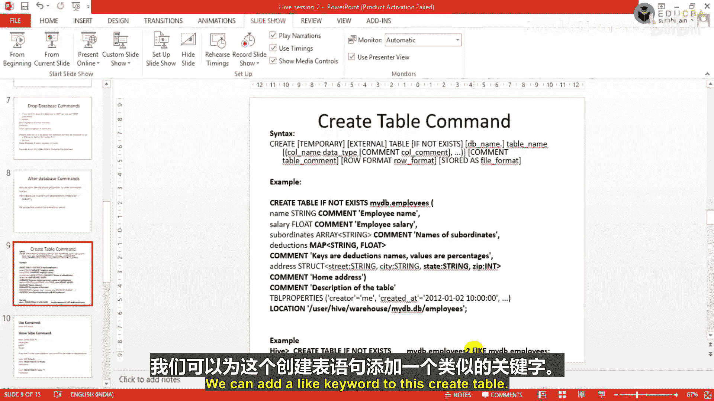

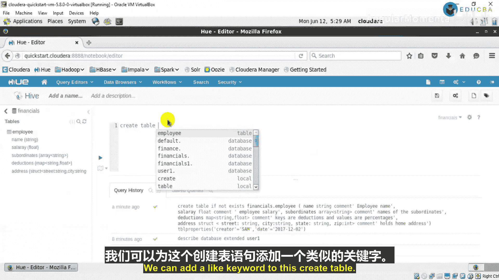

`DESCRIBE` 命令用于查看表的列信息。

```sql
DESCRIBE [EXTENDED|FORMATTED] table_name;
```

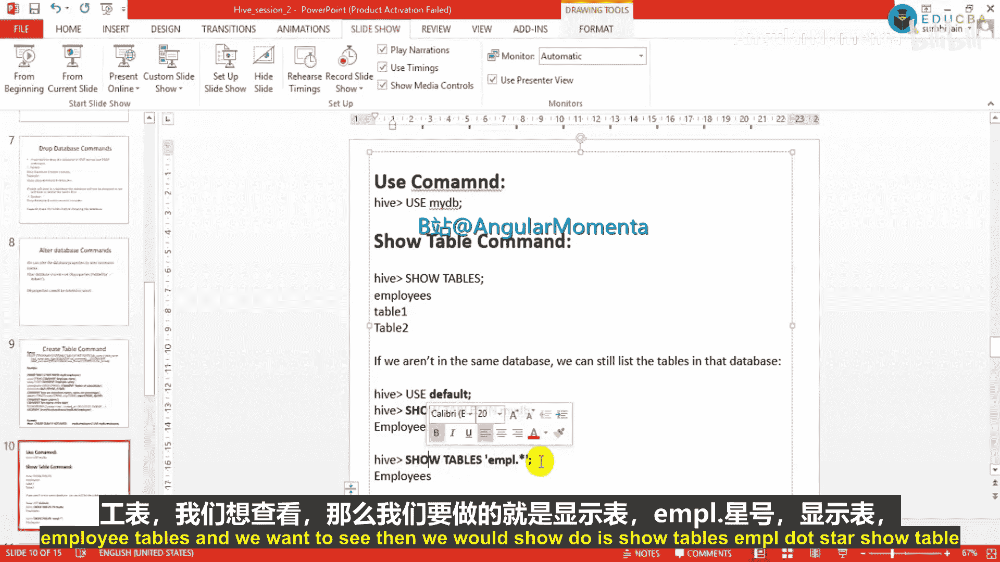

*   `DESCRIBE table_name`：显示列名、数据类型和注释。
*   `DESCRIBE EXTENDED table_name` 或 `DESCRIBE FORMATTED table_name`：显示详细信息，包括表属性、存储信息、创建时间、所有者等。

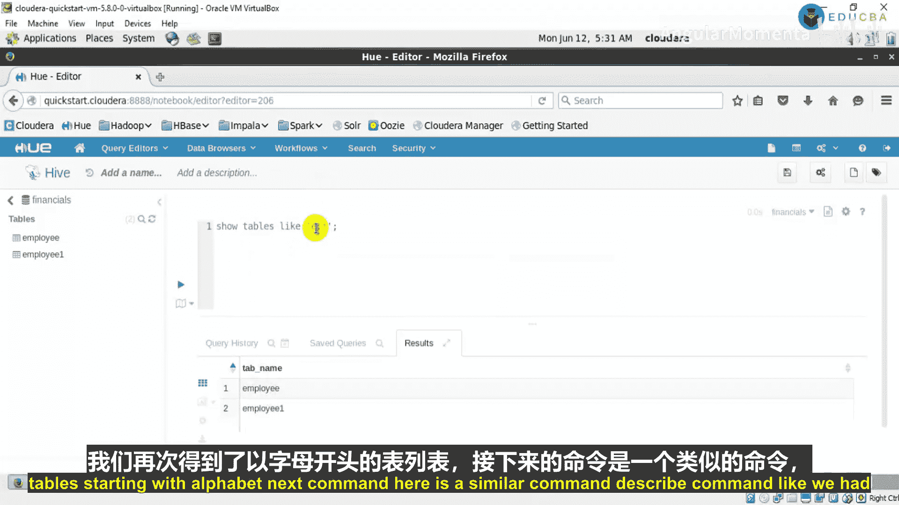

### 修改表

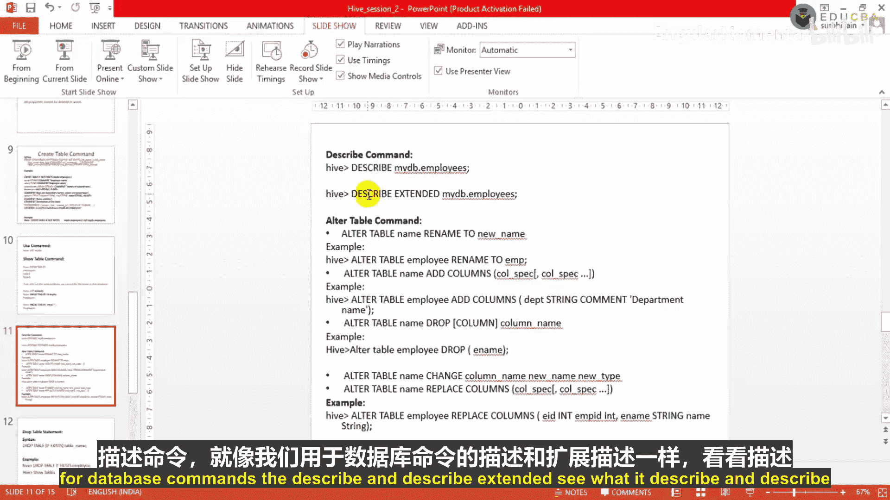

`ALTER TABLE` 命令可以修改现有表的结构，例如重命名表、添加列、修改列名或类型。

*   **重命名表**：
    ```sql
    ALTER TABLE old_table_name RENAME TO new_table_name;
    ```

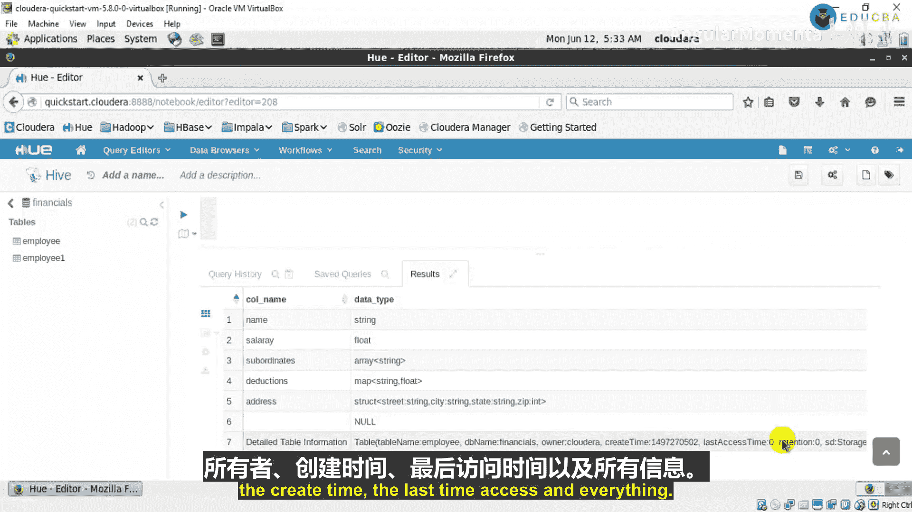

*   **添加列**：
    ```sql
    ALTER TABLE table_name ADD COLUMNS (new_col_name data_type [COMMENT col_comment], ...);
    ```

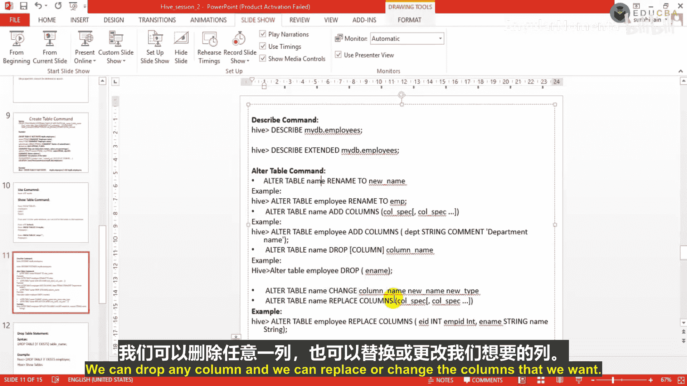

*   **修改列**（可以修改列名、数据类型、注释或位置）：
    ```sql
    ALTER TABLE table_name CHANGE COLUMN old_col_name new_col_name new_data_type [COMMENT new_comment] [FIRST|AFTER column_name];
    ```

*   **替换所有列**：
    ```sql
    ALTER TABLE table_name REPLACE COLUMNS (col_name data_type [COMMENT col_comment], ...);
    ```

### 删除表

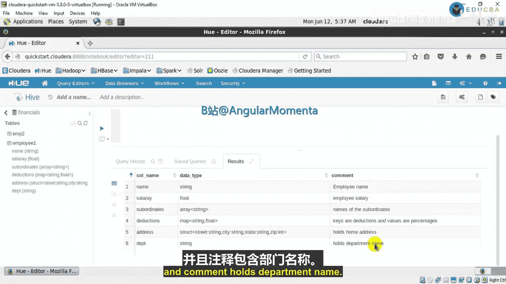

删除表使用 `DROP TABLE` 命令。对于**管理表**，删除操作会同时删除元数据和HDFS上的数据。

```sql
DROP TABLE [IF EXISTS] table_name;
```

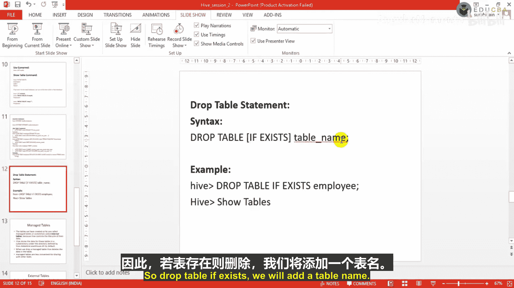

---

在学习了表的创建、查看、修改和删除等基本操作后，我们需要理解Hive中两种重要的表类型：管理表和外部表。它们的区别对于数据生命周期管理至关重要。

## 管理表 vs 外部表

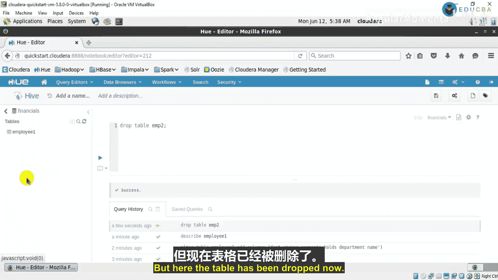

### 管理表 (Managed Table)

到目前为止我们创建的表都是**管理表**，也称为**内部表**。
*   **特点**：Hive**完全管理**这种表的数据生命周期。
*   **存储**：数据默认存储在Hive配置的仓库目录下（例如：`/user/hive/warehouse/db_name.db/table_name`）。
*   **删除后果**：使用 `DROP TABLE` 时，Hive会**同时删除元数据（表结构）和HDFS上的实际数据**。
*   **适用场景**：适用于Hive内部临时或中间数据，数据完全由Hive控制。

### 外部表 (External Table)

外部表提供了一种将Hive元数据与数据存储解耦的方式。
*   **创建**：在 `CREATE TABLE` 语句前加上 `EXTERNAL` 关键字，并通常通过 `LOCATION` 指定一个已存在数据的HDFS路径。
    ```sql
    CREATE EXTERNAL TABLE IF NOT EXISTS external_employee (
      ...
    )
    LOCATION ‘/user/admin/employee_data’;
    ```
*   **特点**：Hive**并不拥有**该位置的数据。它只是创建了一个指向该位置的元数据映射。
*   **删除后果**：使用 `DROP TABLE` 时，Hive**只删除元数据**，而**不会删除**HDFS路径下的实际数据。
*   **适用场景**：
    *   数据需要被多个工具（如Pig、Spark、Impala）共享。
    *   数据由其他流程生成或管理，Hive只用于查询。
    *   希望避免误删除操作导致数据丢失。

选择管理表还是外部表，取决于数据的所有权、共享需求以及对数据安全性的要求。

---

## 总结

本节课我们一起学习了Hive中关于数据库和表的核心操作。
1.  **数据库命令**：我们掌握了如何使用 `CREATE DATABASE`、`SHOW DATABASES`、`DESCRIBE DATABASE`、`ALTER DATABASE` 和 `DROP DATABASE` 来创建、查看、描述、修改和删除数据库，并理解了 `CASCADE` 关键字在删除非空数据库时的必要性。
2.  **表命令**：我们学习了如何使用 `CREATE TABLE` 创建包含复杂数据类型的表，以及如何使用 `SHOW TABLES`、`DESCRIBE`、`ALTER TABLE` 和 `DROP TABLE` 来查看、描述、修改和删除表。
3.  **表类型**：我们重点区分了**管理表**和**外部表**。管理表的数据由Hive全权管理，删除表会删除数据；而外部表的数据存储在Hive之外，删除表仅删除元数据，不影响底层数据，更适合多框架共享数据的场景。

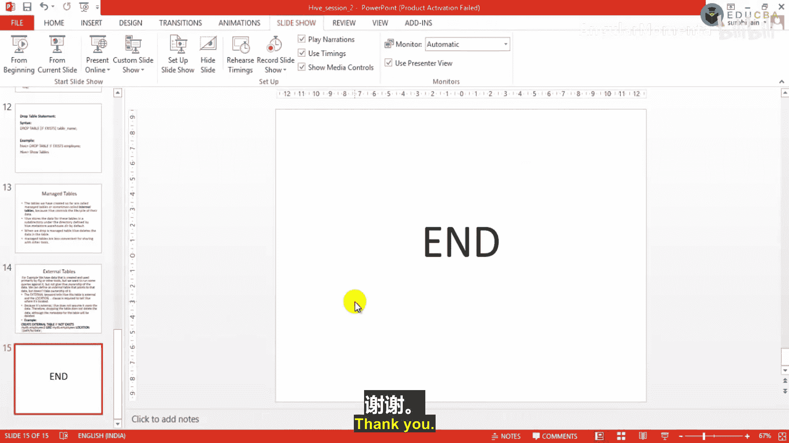

理解这些基本命令和概念，是使用Hive进行数据定义和管理的坚实基础。