# 003：外部表、分区与分桶

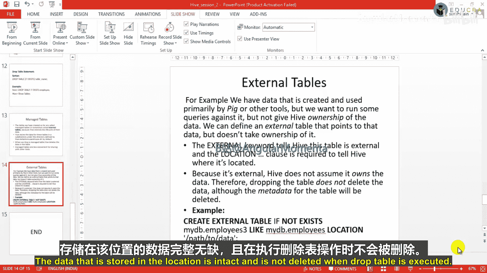

在本节课中，我们将学习Hive中外部表与托管表的核心区别，并深入探讨如何通过分区和分桶技术来优化数据组织与查询性能。

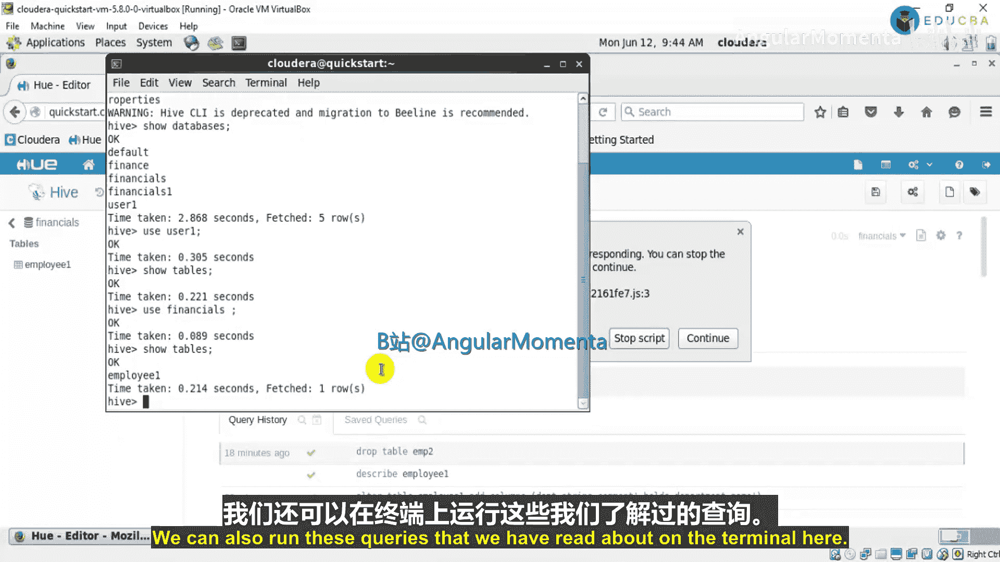

## 外部表与托管表的区别

托管表和外部表的主要区别在于，当删除托管表时，会同时删除其数据和元数据。而当删除外部表时，仅删除元数据。存储在指定位置的数据本身是完整的，在执行 `DROP TABLE` 命令时不会被删除。

我们也可以在终端上运行之前学过的查询。

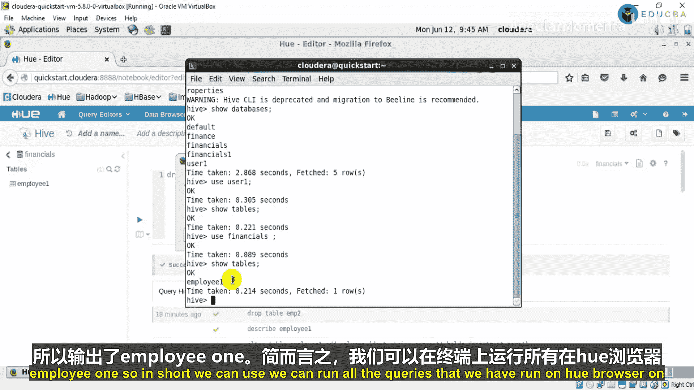

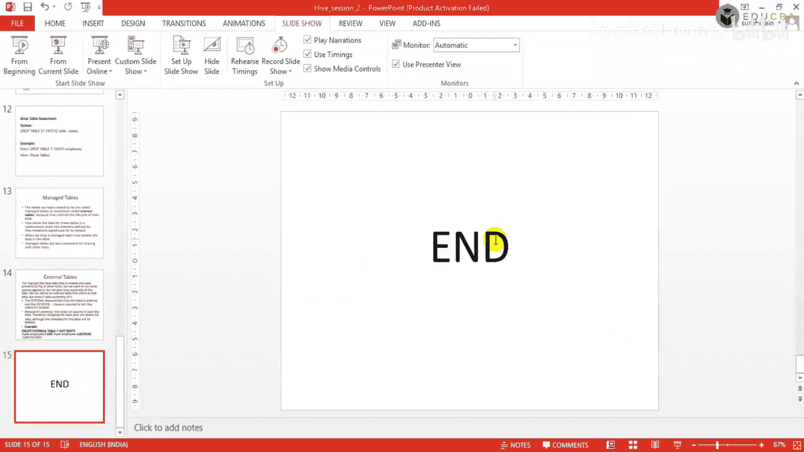

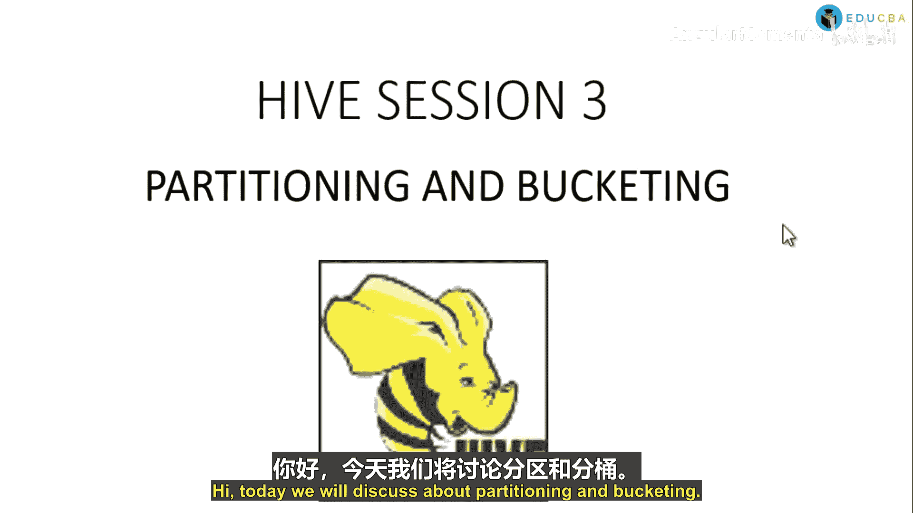

具体操作是，在终端输入 `hive` 并回车，即可进入Hive环境。在这里，我们可以运行所有在Cloudera环境的Hue浏览器中学过的查询。这些查询同样可以在终端运行。例如，我运行了查询 `USE user1` 来使用 `user1` 数据库，还使用了 `SHOW TABLES` 来显示 `user1` 数据库中的表。由于 `user1` 数据库没有表，因此没有输出任何内容。使用 `USE financials` 切换到 `financials` 数据库，它包含一些表，如 `employ1`，所以输出了 `employ1`。简而言之，我们可以在终端运行所有在Hue浏览器中运行过的查询。

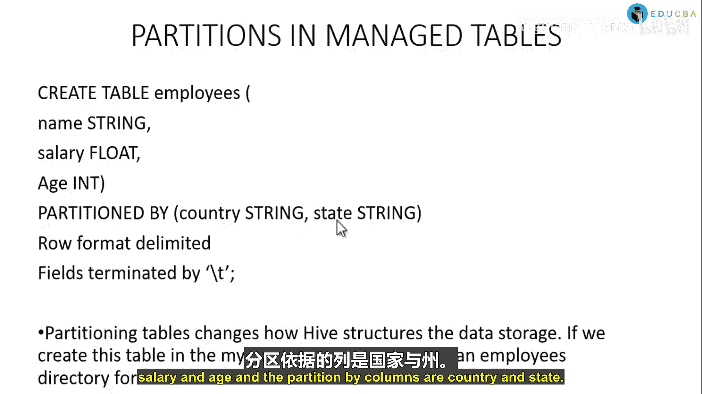

今天的课程到此结束。非常感谢。

大家好，今天我们将讨论分区和分桶。我们将学习托管表中的分区、外部表中的分区、分区命令（包括描述、添加、重命名和删除分区）、分桶，以及一个基于电信数据的案例研究。

首先，我们来看托管表中的分区。我们可以在内部表（即托管表）和外部表中创建或添加分区。本节将学习如何创建表以及如何在表中添加分区，以优化查询性能。

以下是一个简单的 `employees` 表示例，它包含 `name`、`salary` 和 `age` 列，并按 `country` 和 `state` 列进行分区。让我们运行它。

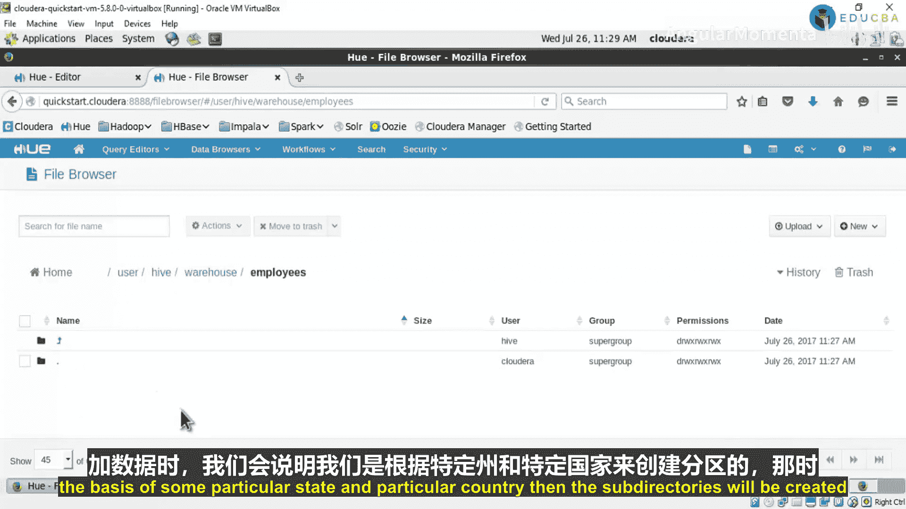

我们将在Hive查询编辑器中运行查询。创建表 `employees`，包含 `name`（字符串类型）、`salary`（浮点类型）和 `age`（小整数类型）。现在，我们将添加 `PARTITIONED BY` 子句，并指定分区列及其数据类型。这里按 `country`（字符串类型）和 `state`（字符串类型）分区。然后，我们设置行格式为以制表符分隔的字段。我们可以根据数据文件的存储格式，指定字段以制表符、空格或其他任何字符分隔。只有这样，我们才能将数据从文件加载到特定的表中。运行这个查询。成功。刷新后，可以看到 `employees` 表已创建。我们添加了 `name`、`salary` 和 `age` 的数据类型，但没有为分区列指定数据类型，而是将 `country` 和 `state` 添加为分区列。这意味着分区已经创建。我们也可以检查分区是否已创建。表的默认目录创建在 `/user/hive/warehouse` 下。是的，`employees` 表目录已经创建。我们可以看到，目前还没有为所有分区创建子目录。在 `employees` 目录下，本应为分区创建 `country` 和 `state` 子目录，但它们尚未出现。这是因为我们还没有加载任何数据到表中，仅仅创建了表的结构。当我们加载数据，并指定基于特定州和特定国家创建分区时，子目录才会被创建。

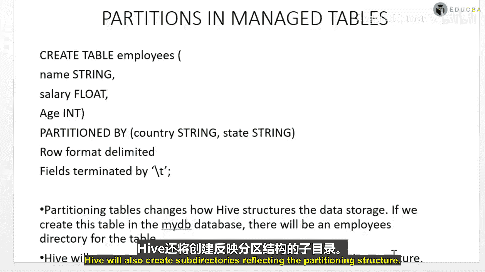

我们将在下一节学习这一点。现在，分区表改变了Hive组织数据存储的方式。如果我们在 `my_db` 数据库中创建表，将会为该表创建 `employees` 目录。正如我们在Hive仓库中看到的，`employees` 表的目录已经创建。它还将创建反映分区结构的子目录。

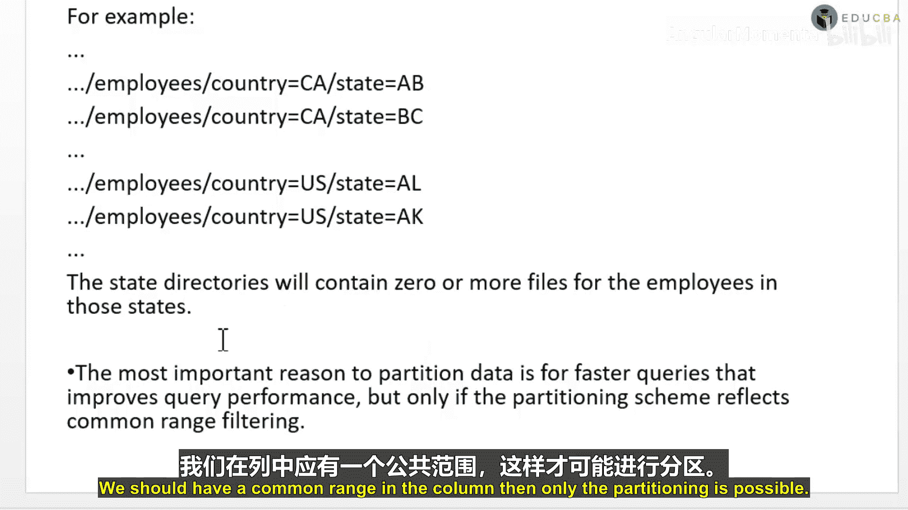

这里给出了一个 `employees` 表示例，基于国家 `CA` 和州 `AB` 进行分区。当我们添加数据时，就会创建这类分区。分区数据最主要的原因是为了实现更快的查询，从而提高查询性能。但是，只有当分区方案反映了常见的范围过滤条件时，分区才有可能。

接下来看外部表中的分区。将分区与外部表结合使用，可以在优化查询性能的同时，提供与其他工具共享数据的方式。众所周知，创建外部表是为了也能与其他工具共享数据。因此，这是一举两得的事情：我们创建的外部表可以与其他工具共享，同时也在优化表的查询性能。我们在目录结构上也拥有更大的灵活性。在之前学习创建非分区外部表时，需要 `LOCATION` 子句，但在外部分区表中则不需要。我们不需要指定任何位置，而是使用 `ALTER TABLE` 语句来分别添加每个分区。我们将在接下来的示例中学习这一点。

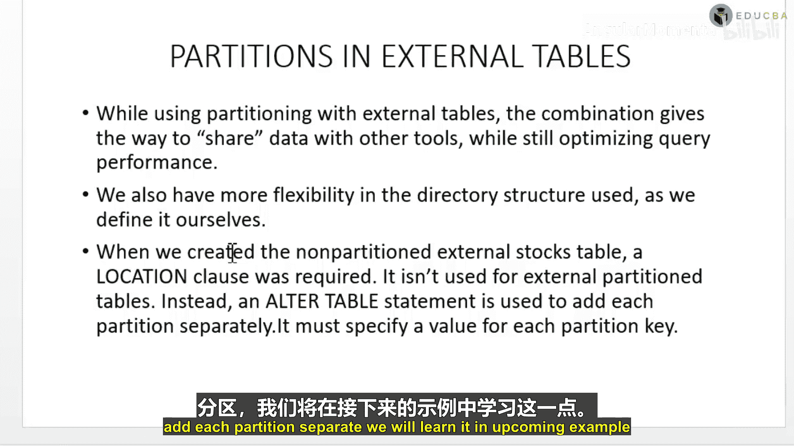

这里有一个简单的示例。创建外部表 `log_messages`，包含 `server`、`process_id` 和 `message` 列，并按 `year`、`month` 和 `day` 进行分区。同样，我们设置了行格式，字段以制表符分隔。正如在上面的幻灯片中读到的，我们将通过 `ALTER TABLE` 命令添加分区。这个命令是：`ALTER TABLE log_messages ADD PARTITION`，我们为分区指定静态值，例如 `year=2012`、`month=1`、`day=2`。除此之外，我们还要指定保存该分区数据的位置。让我们创建一个外部表。

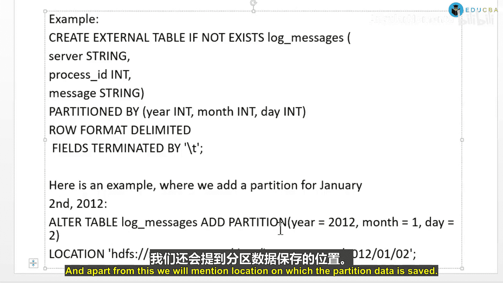

创建外部表 `log_message`（如果不存在）。字段包括 `server`（字符串类型）、`process_id`（整数类型）和 `message`（字符串类型）。然后按 `year`、`month` 和 `day` 分区。设置行格式，字段以制表符分隔。我们正在创建一个外部表，但没有指定任何位置。是的，`log_messages` 表已经创建。可以看到，`server`、`process_id`、`message` 这些列都已创建，还有 `year`、`month`、`day`。我们将在下一节学习如何向这些分区添加数据，届时将学习如何向表中加载数据。

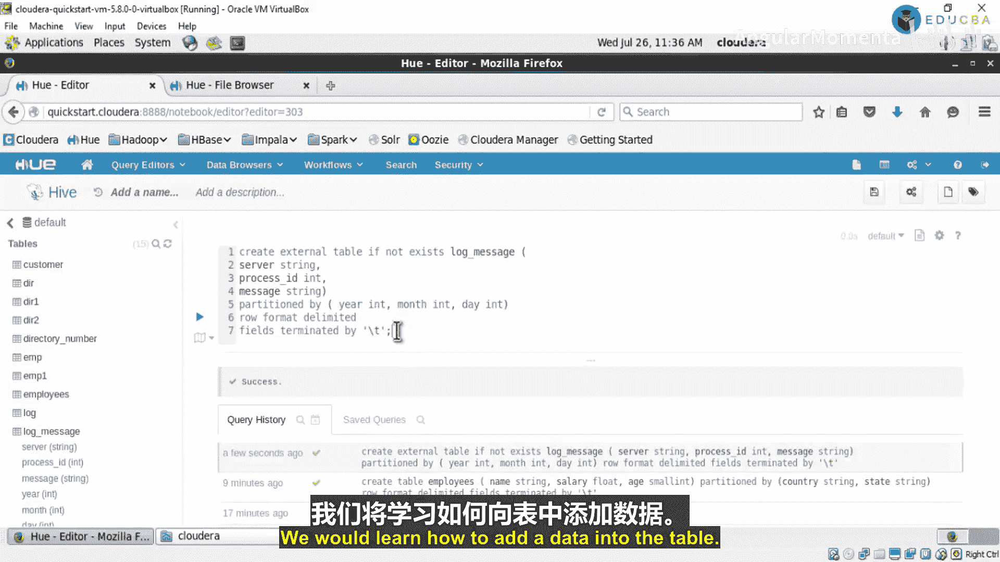

现在，让我们学习分区命令。如果我们想查看分区是否已创建，可以使用 `SHOW PARTITIONS` 命令，其语法是 `SHOW PARTITIONS table_name`。

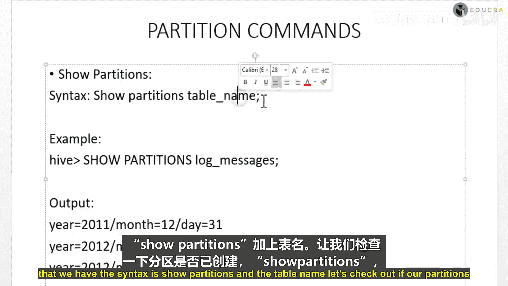

让我们检查一下分区是否已创建。`SHOW PARTITIONS employees`。可以看到，它没有显示任何分区，因为我们还没有向分区添加数据。尝试 `SHOW PARTITIONS log_messages`。这里，我们看到表未找到，因为它是外部表，正确的表名是 `log_message`。同样，我们看不到任何分区，因为我们还没有在表中创建任何分区或加载数据。我们还有另一个查询：`DESCRIBE EXTENDED log_messages`。

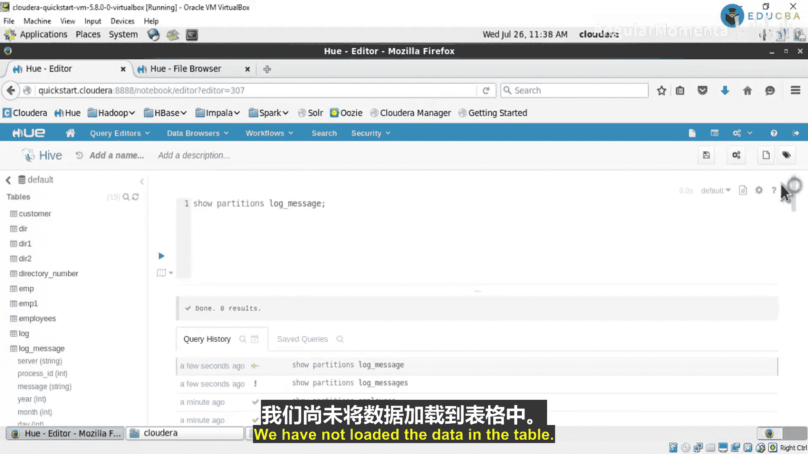

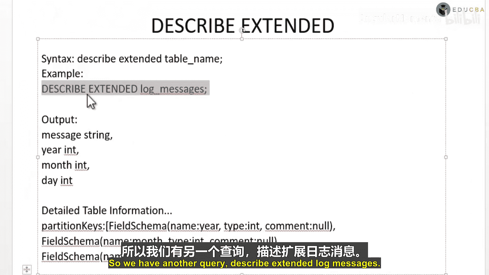

这里定义了详细信息。通过 `DESCRIBE EXTENDED` 命令，我们可以看到列名 `name`、`salary`、`age`、`country` 和 `state`，但分区信息 `country` 和 `state` 在这里以详细格式给出。也检查一下 `log_messages`。同样，你可以看到所有列，分区列是 `year`、`month` 和 `day`。

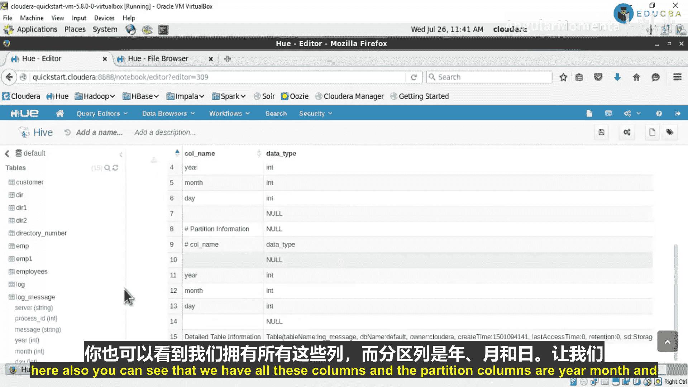

让我们学习另一个命令。关于我们创建的 `log_message` 外部表，这里缺少一些信息。它没有显示分区创建的位置。现在，它也不会显示任何位置，因为我们还没有添加数据。我们可以使用 `DESCRIBE EXTENDED log_messages PARTITION` 并指定通过 `ALTER TABLE` 命令添加的特定分区，来检查该分区的位置。

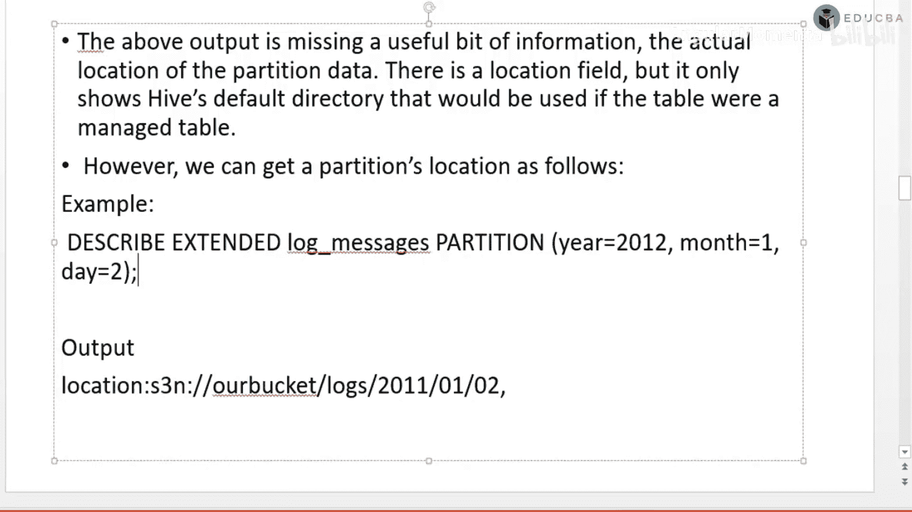

如前所述，我们可以通过 `ALTER TABLE` 命令添加分区，并为我们选择的所有分区列指定静态值，同时指定位置。我们将在下一节学习所有这些内容，届时我们将向表中添加数据，然后运行查询。

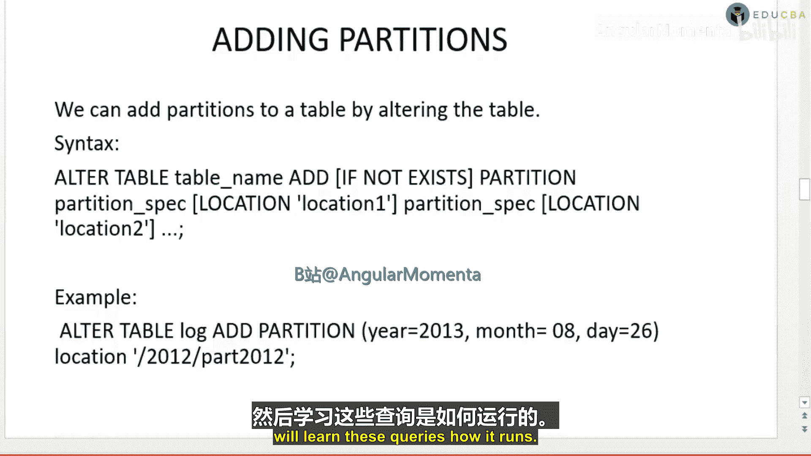

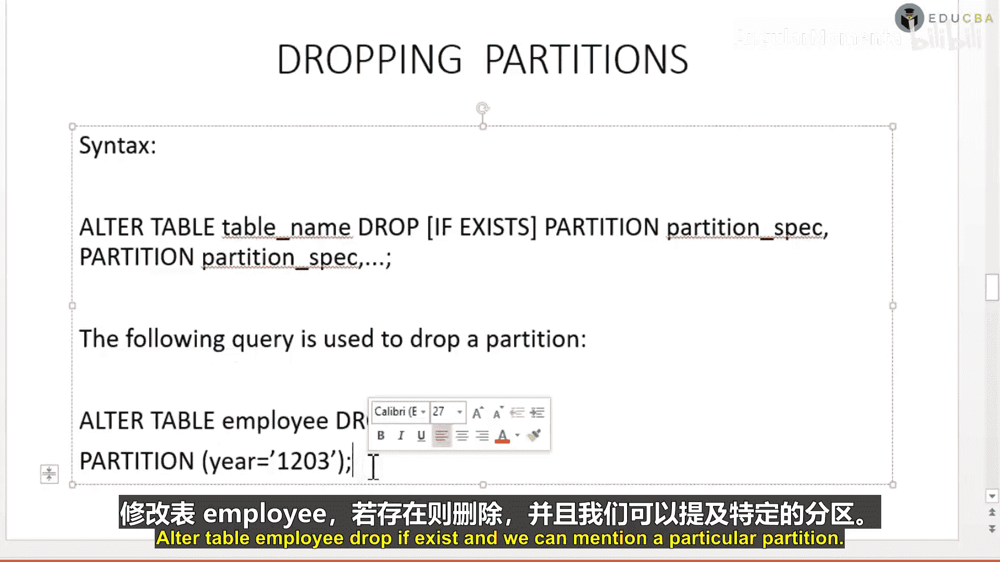

我们也可以重命名分区：`ALTER TABLE table_name PARTITION partition_spec RENAME TO PARTITION partition_spec`。例如，`ALTER TABLE log PARTITION (year=2012, month=1, day=2) RENAME TO PARTITION (year=2013, month=1, day=2)`。还可以使用 `DROP` 命令删除特定分区：`ALTER TABLE employees DROP IF EXISTS PARTITION`，然后指定特定分区。现在，让我们学习分桶。

当分区数量有限且分区划分均匀时，分区能产生有效的结果。但这并非在所有情况下都可能。因此，使用分桶。分桶是一种将表数据集分解为更易管理部分的技术。分桶的作用是创建桶，我们在创建表时指定桶的数量，数据被放入这些桶中。实际的数据段被放入这些桶中。分桶的概念基于分桶列上的哈希函数。我们使用 `CLUSTERED BY` 子句将表划分为桶。分桶表将创建数据量几乎相等的桶。以下是一个分桶示例。

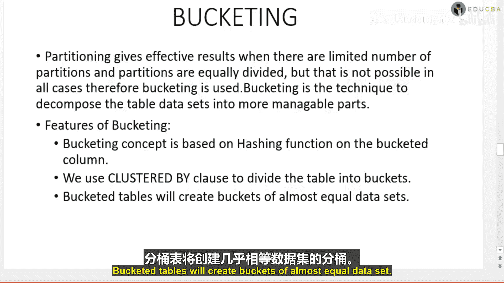

创建表 `bucketing_example`，数据列是 `name` 和 `id`，它按 `location` 分区，并使用 `CLUSTERED BY` 进行分桶，我们基于 `id` 将其分为50个桶。为了强制分桶并将数据加载到桶中，我们应该设置 `hive.enforce.bucketing=true`。让我们创建一个表。

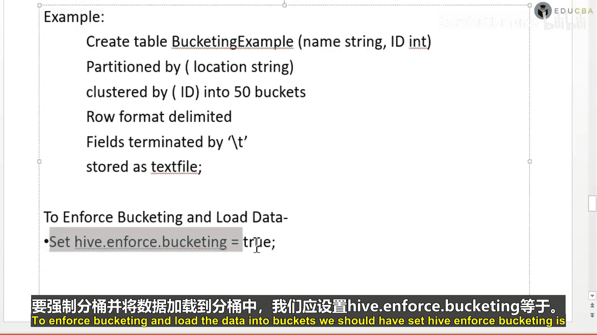

创建表 `bucketing_example`。包含 `name` 和 `id` 列，按 `location`（字符串类型）分区。我们使用了 `CLUSTERED BY id INTO 50 BUCKETS`。根据数据量，我们可以设置桶的大小，从而选择合适的桶数量。运行这个查询。是的，我们已经创建了 `bucketing_example` 表。字段包括 `name`、`id` 和 `location`。

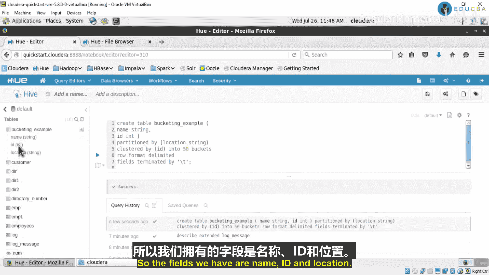

现在，让我们讨论案例研究。我们将学习电信数据的案例研究。在电信数据中，我们有客户号码。根据这些号码，电信行业收集了一些数据。我选取了几个表和几列，我们将学习如何在数据上实现Hive。首先是表 `directory_number`。数据字段包括：`DN_ID`（唯一ID）、`EL_CODE`（EL代码）、`DNUM`（客户号码）、`STATUS`（号码状态）、`DN_STATUS_MOD_DATE`（号码状态修改日期）、`DEALER_ID`（经销商ID，表示号码是预付费还是后付费）、`DN_END_DATE`（号码的激活结束日期）以及 `DN_MOD_DATE`（号码的最后修改日期）。在这个表中，我们将基于 `DEALER_ID` 和 `EL_CODE` 创建分区，并基于 `STATUS` 创建桶。让我们创建一个表。本节我们将讨论所有表，并学习如何通过表创建数据结构，即如何创建表并实现我们上面学到的分区和分桶。

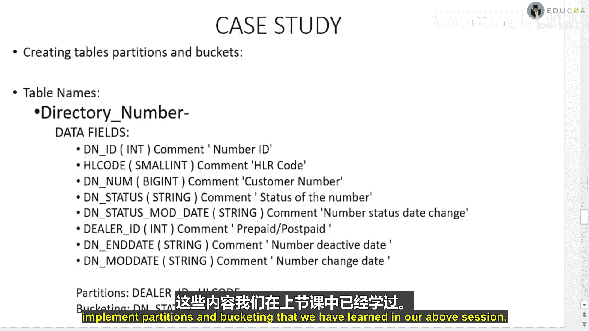

还有另一个表 `contract_services_cap`。数据字段包括：`CO_ID`（唯一的客户ID）、`SN_CODE`（在号码上实现的服务）、`SEQUENCE_NUMBER`（客户号码服务变更的序列号）、`DEALER_ID`（又是一个唯一号码）、`CS_STATUS`（号码状态）、`CS_ACTIVE_DATE`（号码激活日期）、`CS_DEACTIVE_DATE`（号码停用日期）以及 `CS_REQUEST`（对号码进行任何更改的请求号）。这里，我们将基于服务代码 `SN_CODE` 对表进行分区。

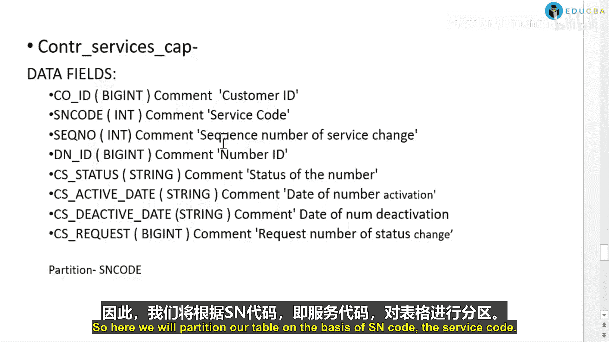

现在我们还有表 `q_services`。

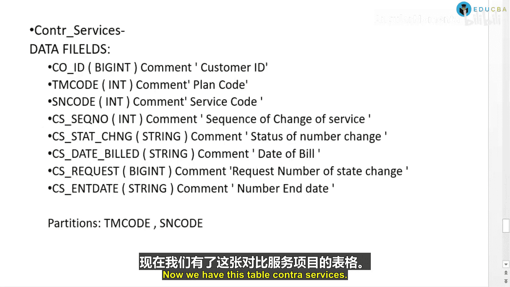

## 总结

在本节课中，我们一起学习了Hive中外部表与托管表的关键区别，理解了删除操作对数据的影响。然后，我们深入探讨了分区技术，包括如何在托管表和外部表中创建分区，以及分区如何通过优化数据存储结构来提升查询性能。我们还介绍了分桶技术，它通过哈希函数将数据均匀分布到多个桶中，适用于分区不均衡的场景。最后，我们通过一个电信数据的案例研究，初步了解了如何在实际数据表上应用分区和分桶策略来设计高效的数据结构。