# 004：Hive中的表控制服务 🗂️

在本节课中，我们将学习如何在Hive中创建和管理用于电信数据分析的核心表。我们将详细探讨三个关键表的结构，并演示如何使用HiveQL创建它们，包括定义列、添加注释以及设置分区。

---

## 表结构概述

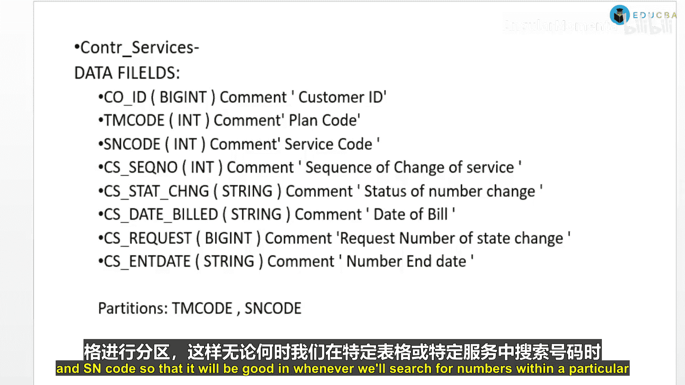

我们主要处理三个表：`directory_number`、`control_services` 和 `contract_all`。每个表都包含与客户、服务和套餐计划相关的特定字段。为了提高查询效率，我们将根据业务逻辑对表进行分区。

### 1. 控制服务表 (`control_services`)

此表存储客户服务变更的详细信息。数据字段包括：
*   **CoID**：唯一的客户ID。
*   **TM Code**：套餐计划代码，代表分配给客户的特定套餐。
*   **S Code**：在套餐内应用于客户号码的服务代码。
*   **Sequence Number**：客户服务变更的序列号。
*   **CS State Change**：状态号码的变更。
*   **C S Date Built**：账单日期。
*   **CS Request**：状态变更的请求号。
*   **CS End Date**：号码的结束日期。

为了提高查询性能，我们将根据 `TM Code` 和 `S Code` 对该表进行分区。这样，当我们在特定套餐或服务中搜索号码时，效率会更高。

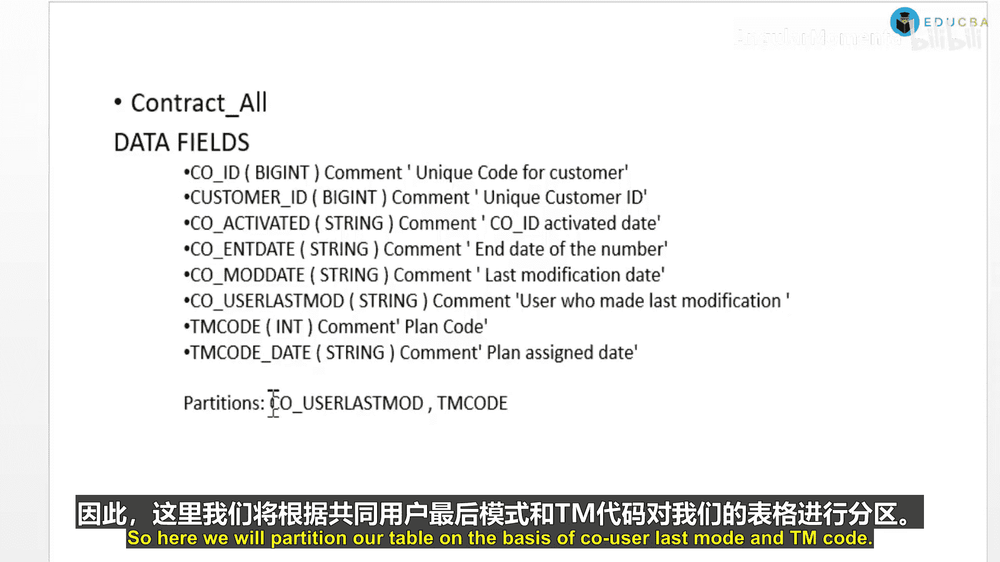

---

### 2. 合同总表 (`contract_all`)

此表记录客户合同的核心信息。字段包括：
*   **CoID**：唯一的客户代码（客户ID）。
*   **CoAct**：客户ID的激活日期。
*   **CoID End Date**：客户ID的结束日期。
*   **CoMod**：客户ID的最后修改日期。
*   **User Last Modification**：进行最后修改的用户。电信公司会跟踪所有对客户号码进行任何操作的人员。
*   **TM Code**：套餐计划代码。
*   **T Code Date**：套餐分配日期。

我们将根据 `User Last Modification` 和 `T Code` 对该表进行分区。

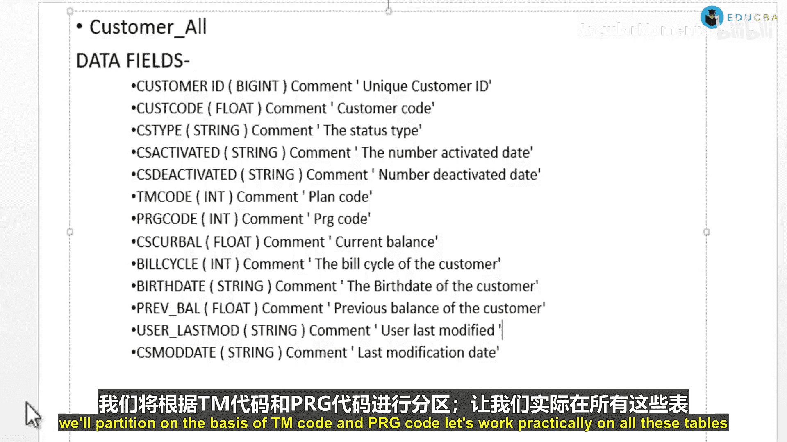

---

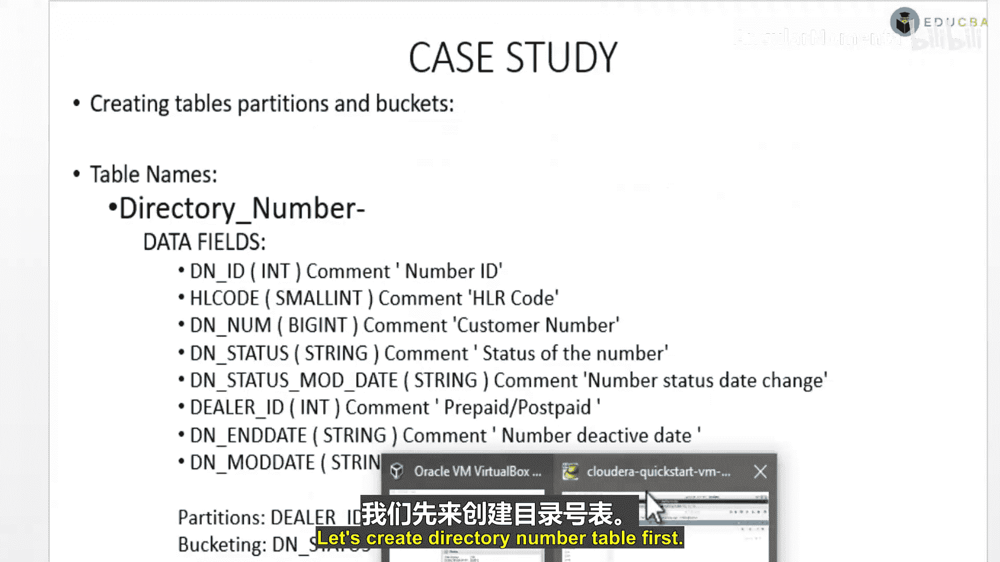

### 3. 客户总表 (`customer_all`)

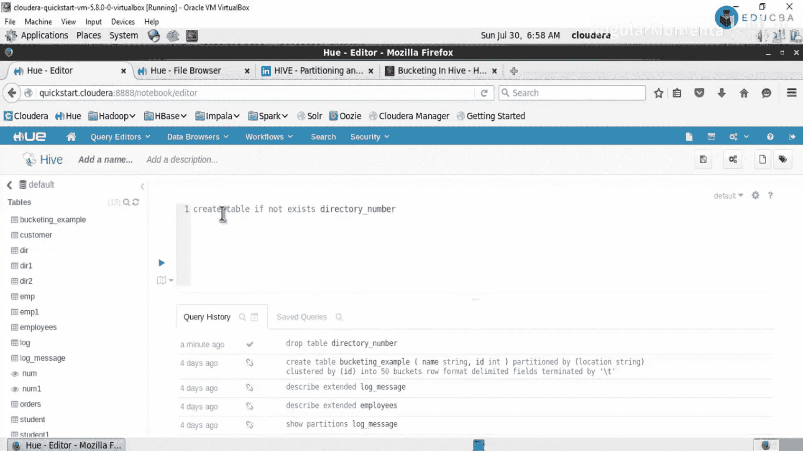

此表包含客户级别的详细信息。字段包括：
*   **Customer ID**：客户ID。
*   **Cast Code**：客户代码（同样是唯一代码）。系统会根据不同层级（如CoID和号码）生成多种唯一代码。
*   **CS Type**：状态类型。
*   **CS Activated**：号码激活日期。
*   **TM Code**：套餐计划。
*   **PRG Code**：分配给客户号码的某种代码。
*   **Cs Cur Ball**：客户的当前余额。
*   **Bill Cycle**：客户的账单周期日期。每个客户在月中都有特定的账单周期日期。
*   **Birth Date**：出生日期。
*   **Previous Balance**：任何前期余额。
*   **User Last Mode**：最后进行修改的用户。
*   **C Mode Date**：最后的修改日期。

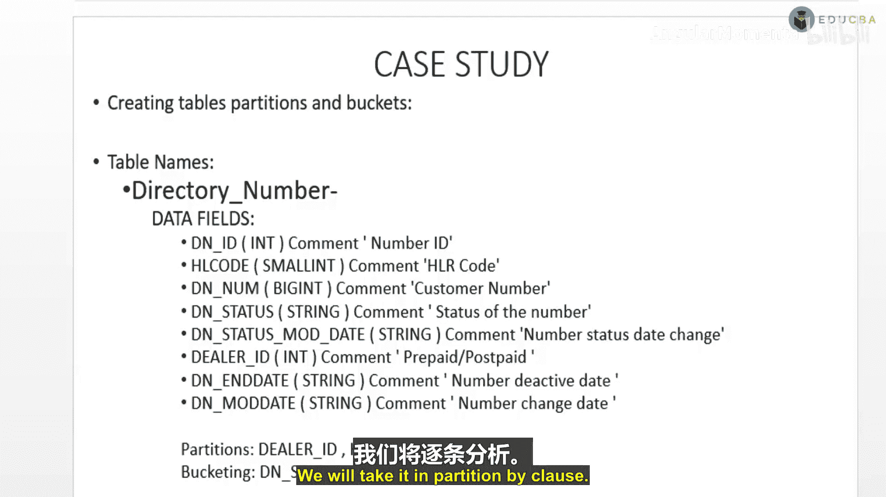

我们将根据 `TM Code` 和 `PRG Code` 对该表进行分区。

---

## 实践：在Hive中创建表

现在，让我们实际操作，看看如何在Hive中创建这些表。

### 创建目录号码表 (`directory_number`)

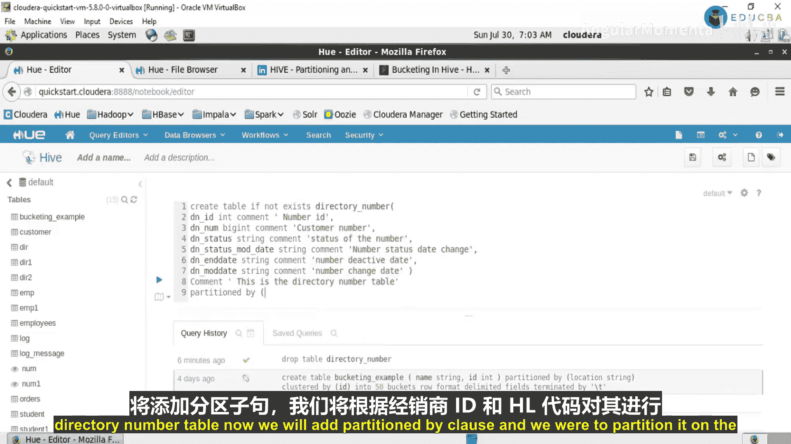

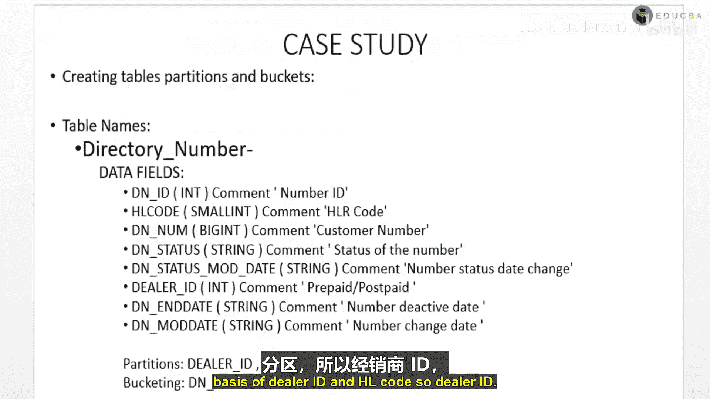

首先，如果已存在同名表，我们先删除它。

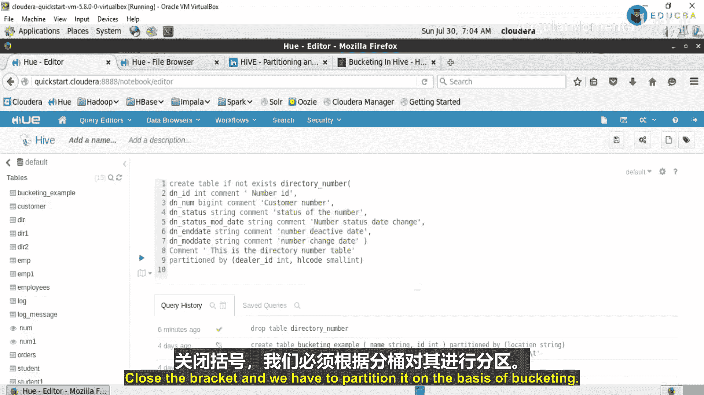

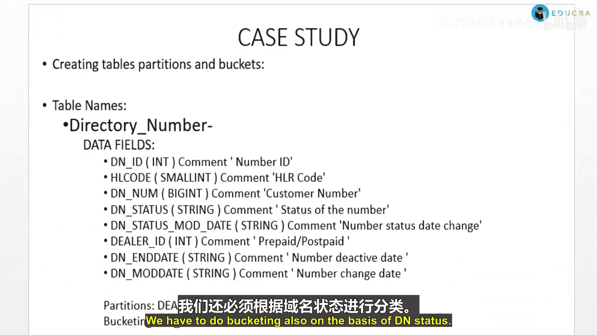

```sql
DROP TABLE IF EXISTS directory_number;
```

接下来，创建新表。我们将定义列及其数据类型，并为列和表本身添加注释，这有助于理解表结构。我们还将根据 `Dealer ID` 和 `HL Code` 进行分区，并根据 `DN Status` 进行分桶。

```sql
CREATE TABLE IF NOT EXISTS directory_number (
    DNID INT COMMENT ‘号码ID’,
    DNNum BIGINT COMMENT ‘客户号码’,
    DNStatus STRING COMMENT ‘号码状态’,
    DNStatusModDate STRING COMMENT ‘号码状态修改日期’,
    DNDate STRING COMMENT ‘号码激活日期’,
    DNModDate STRING COMMENT ‘号码修改日期’
)
COMMENT ‘这是目录号码表’
PARTITIONED BY (DealerId INT, HLCode SMALLINT)
CLUSTERED BY (DNStatus) INTO 100 BUCKETS
ROW FORMAT DELIMITED
FIELDS TERMINATED BY ‘,’
LINES TERMINATED BY ‘\n’
STORED AS TEXTFILE;
```

执行成功后，表结构将包含定义的列以及分区列 `DealerId` 和 `HLCode`。

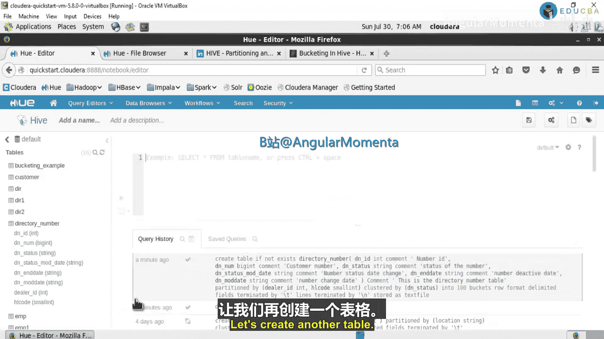

---

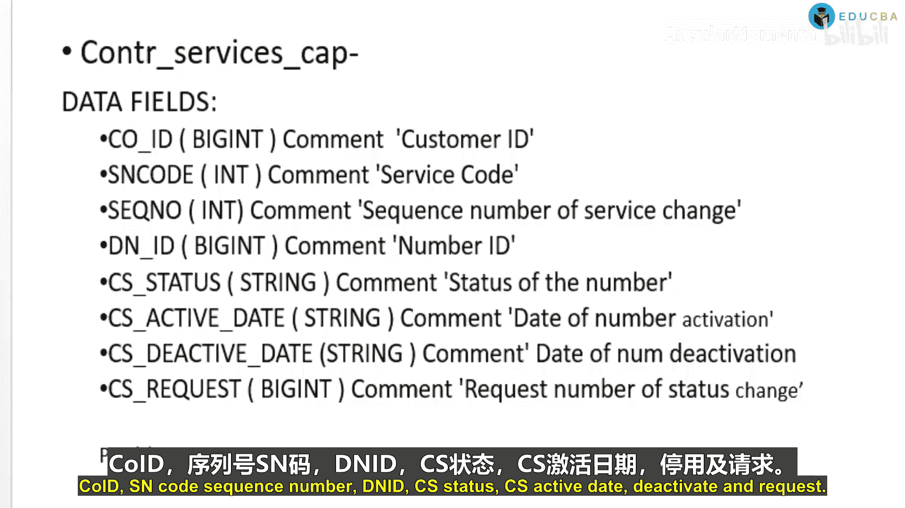

### 创建控制服务表 (`control_services`)

上一节我们创建了目录表，本节我们来创建服务控制表。以下是创建 `control_services` 表的步骤。

首先，定义表的列结构：

```sql
CREATE TABLE IF NOT EXISTS control_services (
    CoID BIGINT COMMENT ‘唯一客户ID’,
    SequenceNumber INT COMMENT ‘服务变更的序列号’,
    DNID BIGINT COMMENT ‘唯一号码ID’,
    CSStatus STRING COMMENT ‘号码状态’,
    ActiveDate STRING COMMENT ‘激活日期’,
    CSEndDate STRING COMMENT ‘结束日期’,
    CSRequest BIGINT COMMENT ‘状态变更的请求号’
)
COMMENT ‘这是控制服务表’
PARTITIONED BY (SNCode INT)
ROW FORMAT DELIMITED
FIELDS TERMINATED BY ‘,’
LINES TERMINATED BY ‘\n’
STORED AS TEXTFILE;
```

请注意，我们最初创建时遗漏了 `SNCode` 分区。如果已创建不完整的表，需要先删除再重建。

---

### 创建合同服务表 (`con_services`)

现在，让我们创建第三个表 `con_services`。希望您能理解这些电信数据表的结构。我们正在创建五个表的Hive结构，以便后续进行数据分析。

以下是创建该表的SQL语句：

```sql
CREATE TABLE IF NOT EXISTS con_services (
    CoID BIGINT COMMENT ‘唯一客户ID’,
    SequenceNumber INT COMMENT ‘服务变更序列’,
    CSStateChange STRING COMMENT ‘号码状态变更’,
    CSDateBuilt DATE COMMENT ‘账单日期’,
    CSRequest BIGINT COMMENT ‘状态变更号’,
    CSEndDate STRING COMMENT ‘号码结束日期’
)
COMMENT ‘合同服务表’
PARTITIONED BY (TmCode INT, SCode INT)
ROW FORMAT DELIMITED
FIELDS TERMINATED BY ‘,’
LINES TERMINATED BY ‘\n’
STORED AS TEXTFILE;
```

执行后，`con_services` 表即创建成功，包含定义的列以及分区列 `TmCode` 和 `SCode`。

---

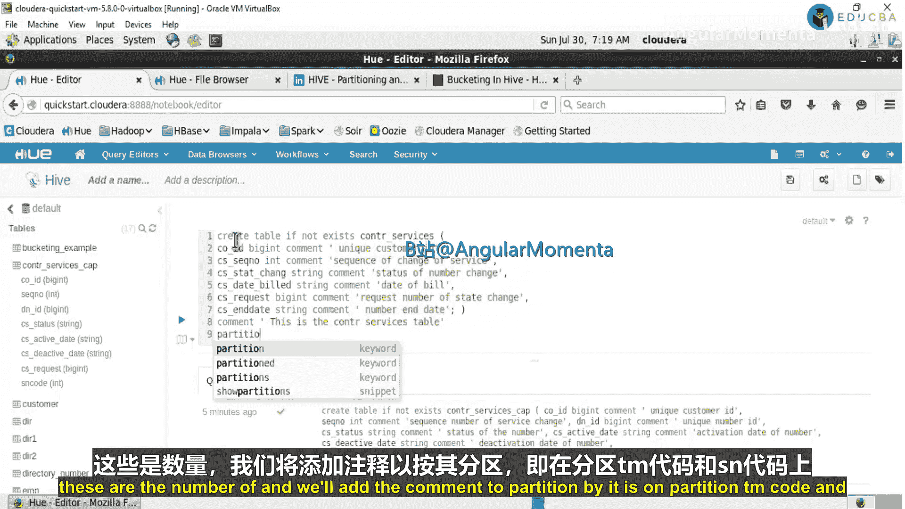

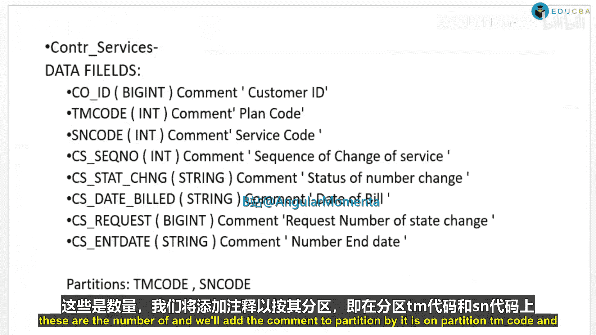

## 总结

本节课中，我们一起学习了电信数据分析中三个核心Hive表的结构与创建方法。我们详细介绍了 `control_services`、`contract_all` 和 `customer_all` 表的字段含义，并实践了如何使用HiveQL语句创建这些表，重点包括：
1.  定义列名、数据类型和添加注释。
2.  根据业务查询模式（如按套餐、服务或用户）设置分区键，以优化查询性能。
3.  指定数据存储格式和分隔符。

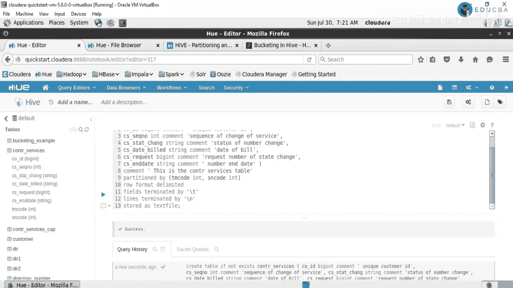

掌握这些表的创建是后续进行数据加载、查询和分析的基础。